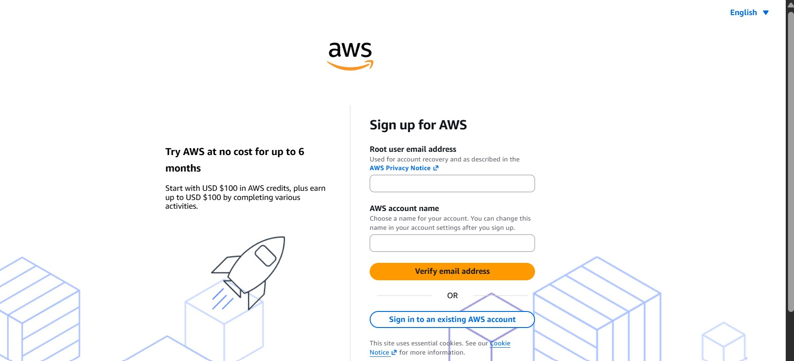
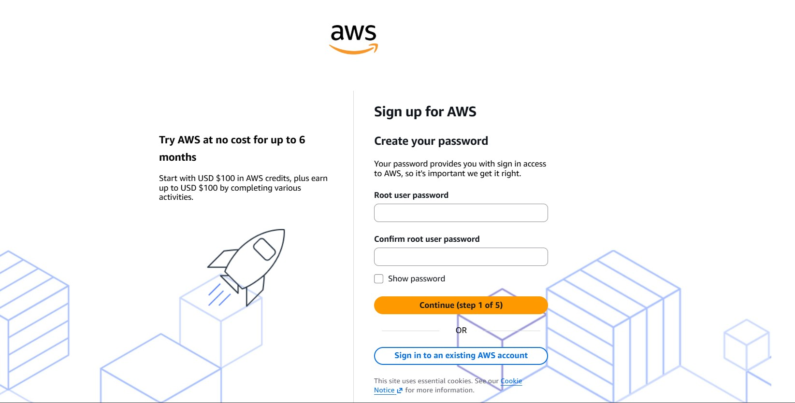
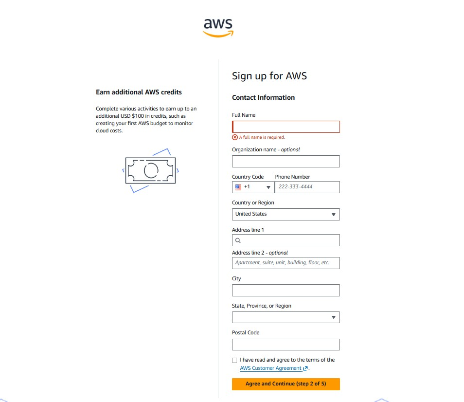
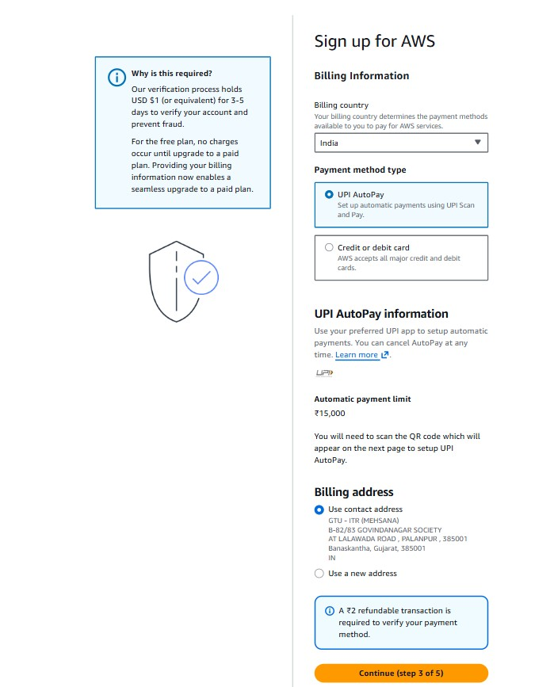
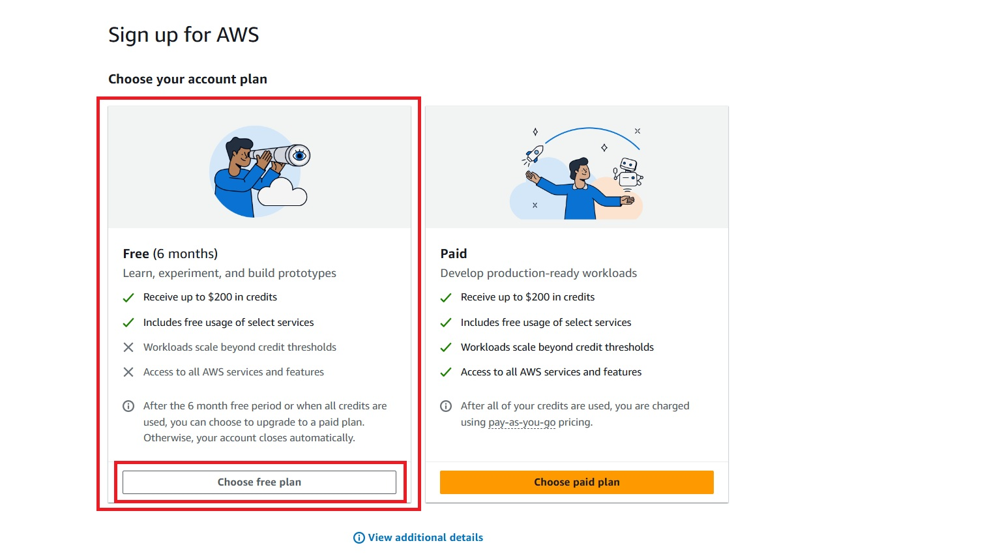

# ☁️ AWS Account Setup & Root MFA Security Lab

This repository documents the secure setup of a new AWS account and the configuration of Multi-Factor Authentication (MFA) for the root user.

---

## Objective

The goal of this lab was to:

* Create a new AWS account
* Secure the root account with MFA
* Follow AWS security best practices
* Prepare a production-ready cloud account foundation

---

## AWS Account Creation

### Step 1 – Open AWS Signup

* Visited https://aws.amazon.com/
* Clicked **Create an AWS Account**

  

### Step 2 – Enter Account Details

* Root email address
* AWS account name

### Step 3 – Verify Email

* Received OTP on email
* Verified the account

### Step 4 – Create Root Password

A strong password was created using uppercase, lowercase, numbers, and special characters.

### Step 5 – Add Contact Information

* Personal account
* Full name
* Country and address
* Phone number

### Step 6 – Add Billing Information

* Added debit/credit card
* Completed card verification

### Step 7 – Phone Verification

* Received SMS OTP
* Verified the phone number

### Step 8 – Choose Support Plan

Selected **Basic Support (Free)**.

---

## Root MFA Configuration

### Step 1 – Open Security Credentials

AWS Console → Account → Security credentials

### Step 2 – Assign MFA Device

Opened **Multi-factor authentication (MFA)** and clicked **Assign MFA device**.

### Step 3 – Select Authenticator App

Used **Google Authenticator** (Microsoft Authenticator/Authy also supported).

### Step 4 – Scan QR Code

Scanned the QR code displayed by AWS.

### Step 5 – Enter Verification Codes

Entered two consecutive OTP codes generated by the authenticator app.

### Step 6 – Confirm MFA Status

Verified that the MFA device status changed to **Assigned**.

---

## Screenshots

| Step                   | Screenshot                                |
| ---------------------- | ----------------------------------------- |
| AWS signup page        | `screenshots/01-aws-signup-page.png`      |
| Email verification     | `screenshots/02-email-verification.png`   |
| Support plan selection | `screenshots/03-support-plan.png`         |
| AWS console login      | `screenshots/04-console-login.png`        |
| Security credentials   | `screenshots/05-security-credentials.png` |
| Assign MFA             | `screenshots/06-assign-mfa.png`           |
| QR code screen         | `screenshots/07-qr-code.png`              |
| MFA enabled            | `screenshots/08-mfa-enabled.png`          |

---

## Security Best Practices Implemented

* Root MFA enabled
* Strong root password
* Phone verification completed
* Basic support plan selected
* Root account reserved for account-level tasks only

---

## Next Steps

* Create an IAM Admin user
* Enable billing alerts
* Configure AWS Budgets
* Explore AWS Global Infrastructure
* Launch the first EC2 instance

---

## Learning Outcome

After completing this lab, I can:

* Create and activate a new AWS account
* Secure the root account using MFA
* Navigate AWS Security Credentials
* Understand the importance of identity protection in AWS

---

## Author

**Hardik Darji**

* GitHub: https://github.com/yourusername
* LinkedIn: https://linkedin.com/in/yourprofile
