# 💰 AWS Billing Alarm Setup with Amazon CloudWatch

> Learn how to configure an AWS Billing Alarm using Amazon CloudWatch and Amazon SNS to receive email notifications when your AWS estimated charges exceed a specified threshold.


---

# 📖 Overview

AWS Billing Alarm helps you monitor your AWS spending by sending email notifications whenever your estimated charges exceed a predefined threshold.

It is one of the first security and cost management best practices after creating an AWS account.

---

# 🎯 Objective

By completing this hands-on lab, you will learn how to:

- Enable CloudWatch Billing Metrics
- Create an Amazon SNS Topic
- Subscribe your email to SNS
- Create a CloudWatch Billing Alarm
- Receive email notifications when estimated charges exceed your configured threshold

---

# 🏗️ Architecture

```text
                  AWS Services
                       │
                       ▼
             Estimated AWS Charges
                       │
                       ▼
            Amazon CloudWatch Metric
                       │
                       ▼
              CloudWatch Billing Alarm
                       │
                       ▼
               Amazon SNS Topic
                       │
                       ▼
              Email Notification
```

---

# 🛠️ Prerequisites

- AWS Account
- Root User or IAM User with Billing permissions
- Verified Email Address
- Internet Connection

---

# Step 1 – Sign in to AWS Console

Log in to your AWS Account.

Search for:

```
Billing
```

Open:

```
Billing and Cost Management
```

---

# Step 2 – Enable CloudWatch Billing Alerts

From the left navigation panel:

```
Billing Preferences
```

Enable:

```
Receive CloudWatch Billing Alerts
```
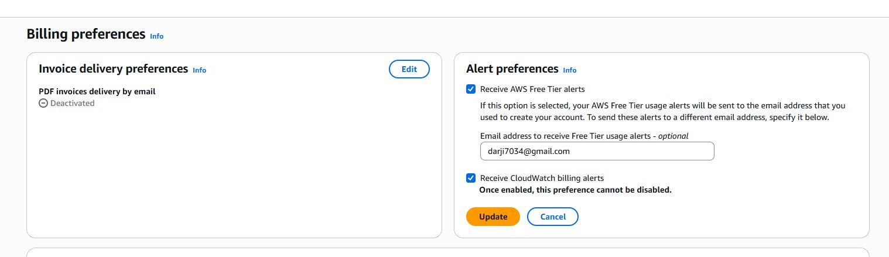

Click:

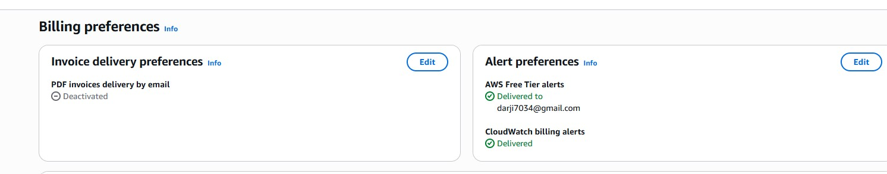

```
Save Preferences
```

> **Note:** This option only needs to be enabled once per AWS account.

---

# Step 3 – Open Amazon CloudWatch

Search:

```
CloudWatch
```

Navigate to:

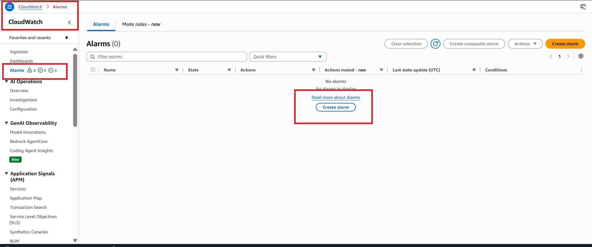
```
CloudWatch
→ Alarms
→ Create Alarm
```

---

# Step 4 – Select Billing Metric

Click:

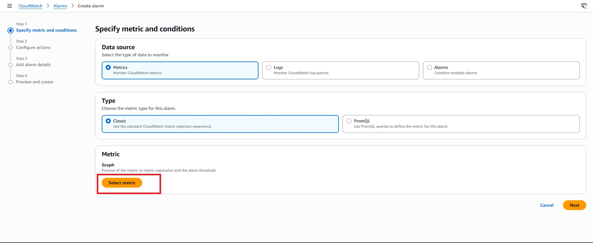

```
Select Metric
```

Select:
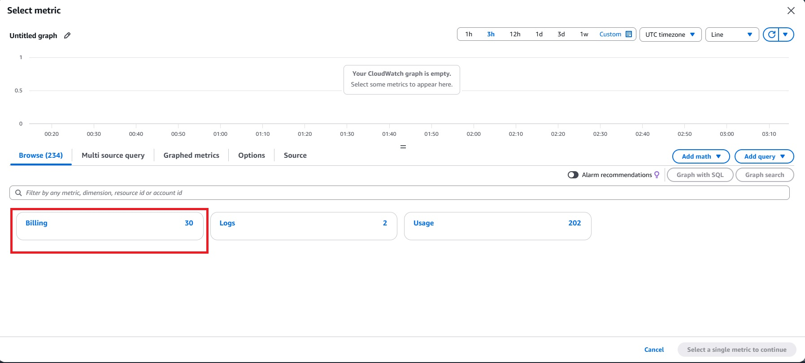
```
Billing
```

Choose:
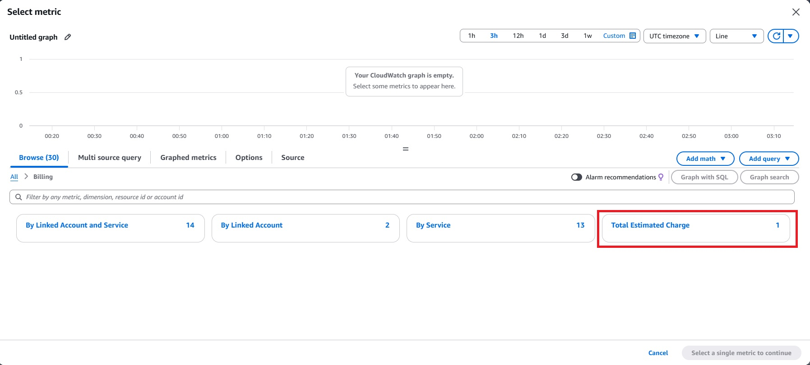

```
Total Estimated Charge
```

Select Currency:

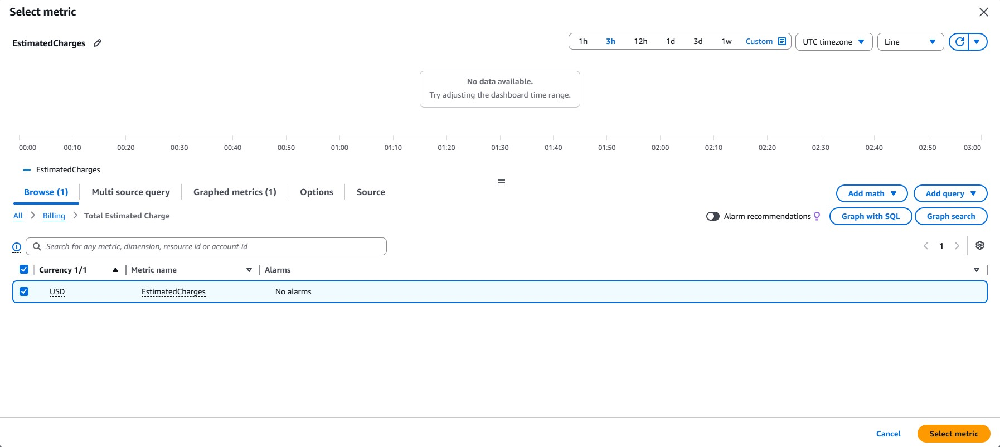

```
USD
```

Click:

```
Select Metric
```

---

# Step 5 – Configure Metric

Use the default settings:

| Setting | Value |
|----------|-------|
| Statistic | Maximum |
| Period | 6 Hours |

Click:

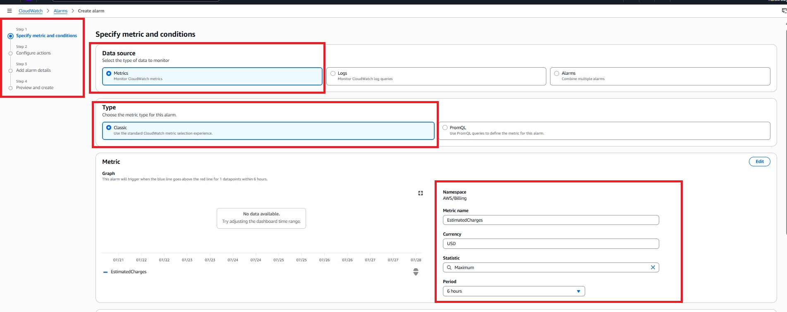

```
Next
```

---

# Step 6 – Configure Threshold

Choose:

```
Static
```

Condition:

```
Greater than
```

Threshold:

```
10
```

Meaning:

```
Estimated Charges > $10
```

Click:

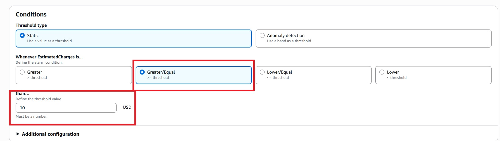

```
Next
```

---

# Step 7 – Create SNS Notification

Select:

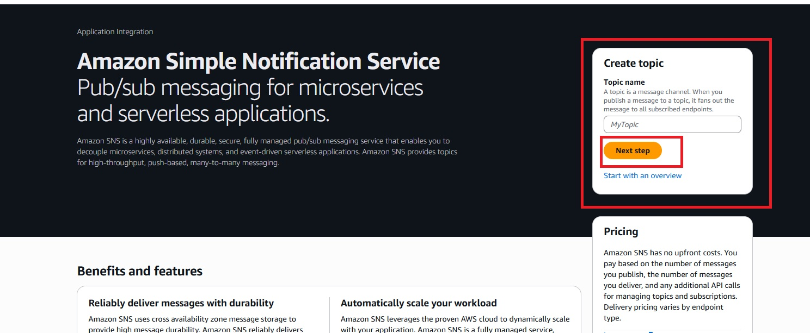

```
Create New Topic
```

Topic Name:


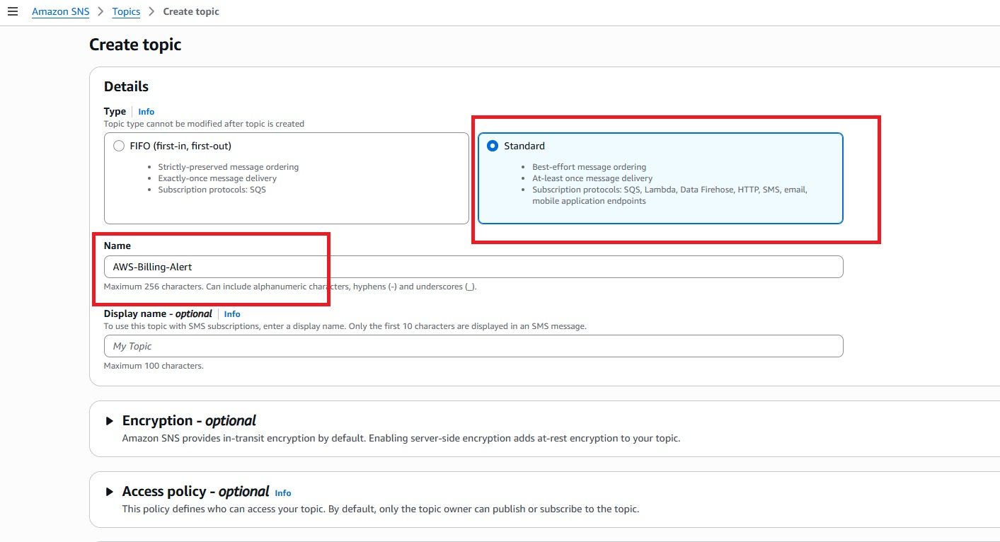

Create Topic :

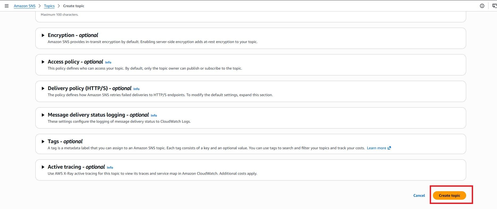

```
AWS-Billing-Alert
```

Email:

```
your-email@example.com
```

Click:


```
Create Topic
```

---

# Step 8 – Confirm Email Subscription

After creating the Amazon SNS topic, AWS sends a confirmation email to the email address you provided.

Create Subscription: 

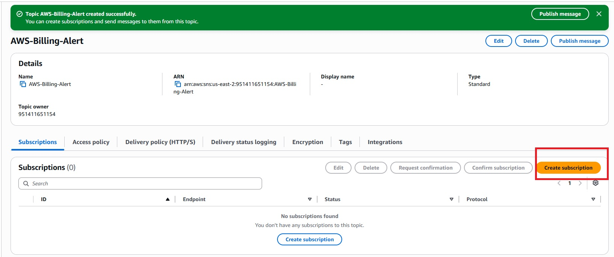

---

## 8.1 Check Subscription Status

Immediately after creating the SNS subscription, its status will be:

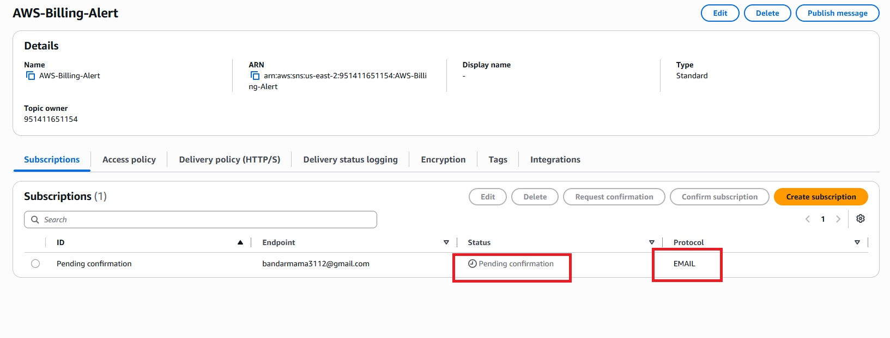
```
Pending confirmation
```

Example:

```
Amazon SNS
   │
   ▼
Subscriptions

Email: your-email@example.com

Status:
Pending confirmation
```

> **Note:** While the subscription is in **Pending confirmation**, Amazon SNS cannot send email notifications.

---

## 8.2 Open Your Email Inbox

Sign in to your email account (for example, Gmail).

Look for an email from:


```
Amazon Web Services Notifications
```

Subject (example):

```
AWS Notification - Subscription Confirmation
```

If you cannot find the email:

- Check the **Spam** or **Junk** folder.
- Wait a few minutes and refresh your inbox.

---

## 8.3 Confirm the Subscription

Open the email.

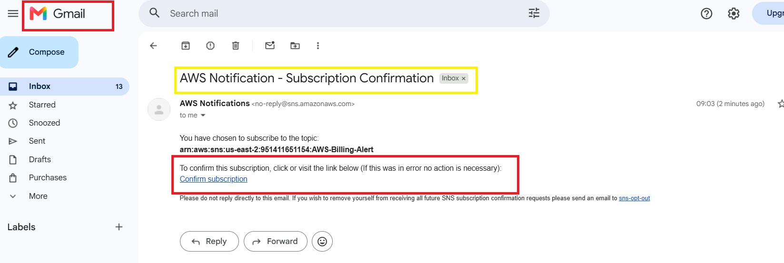

Click the button or link:

```
Confirm Subscription
```

Example:

```
Amazon SNS Email

You have chosen to subscribe to the topic:

AWS-Billing-Alert

Click below to confirm your subscription.

[ Confirm Subscription ]
```

---

## 8.4 Confirmation Successful

After clicking **Confirm Subscription**, your browser opens a confirmation page similar to:

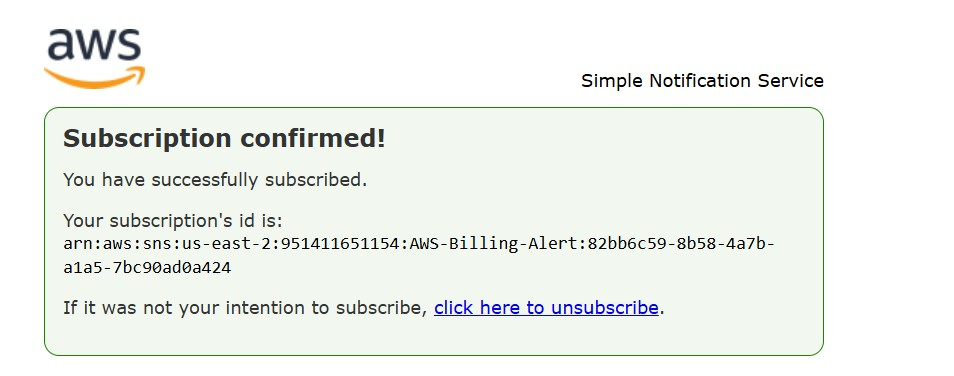

```
Subscription confirmed!

Your subscription request has been confirmed.
```

This means your email is now successfully subscribed to the Amazon SNS topic.

---

## 8.5 Verify Subscription Status

Return to the AWS Console.

Navigate to:


```
Amazon SNS
→ Subscriptions
```

Verify that the subscription status has changed from:

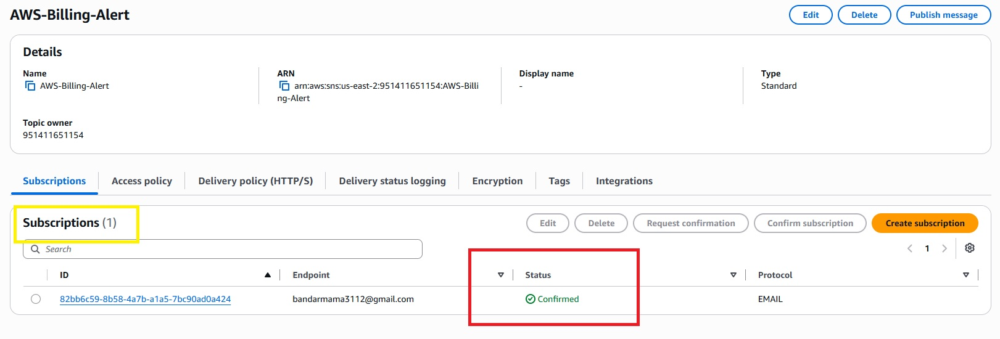

```
Pending confirmation
```

to

```
Confirmed
```

Example:

| Email | Status |
|--------|---------|
| your-email@example.com | Confirmed ✅ |

---

## ✅ Expected Result

Your Amazon SNS email subscription is now active.

Whenever your AWS Billing Alarm enters the **ALARM** state, Amazon SNS will automatically send an email notification to your confirmed email address.

> **Important:** If the subscription is not confirmed, you will **not receive any billing alert emails**, even if the CloudWatch alarm is triggered.
---

# Step 9 – Configure Alarm Details

Alarm Name:

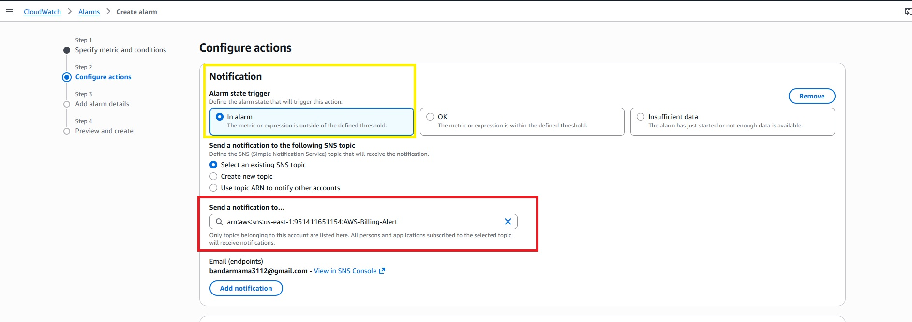

```
AWS-Billing-Alarm
```

Description:

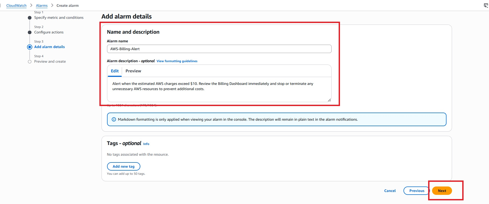

```
Alert when the estimated AWS charges exceed $10. Review the Billing Dashboard immediately and stop or terminate any unnecessary AWS resources to prevent additional costs.
```

Click:

```
Next
```

---

# Step 10 – Review and Create Alarm

Verify:

- Billing Metric
- Threshold
- SNS Topic
- Email Address
- Alarm Name

Click:
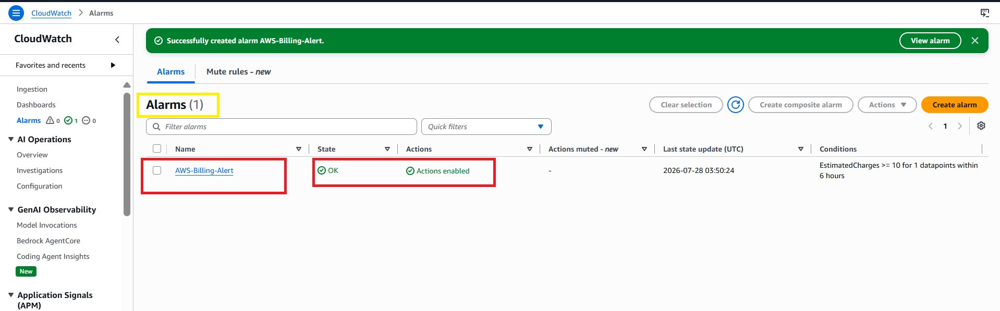
```
Create Alarm
```

---

# ✅ Expected Result

When your estimated AWS charges exceed **$10**, CloudWatch changes the alarm state to **ALARM** and Amazon SNS sends an email notification.

Example:

```
Subject:
AWS Billing Alert: Estimated Charges Exceeded $10

Message:

Your estimated AWS charges have exceeded the configured threshold of $10.

Recommended Actions

• Review your Billing Dashboard.
• Check running EC2 instances.
• Delete unused EBS volumes.
• Remove unused Elastic IPs.
• Delete idle Load Balancers.
• Delete unused NAT Gateways.
• Stop unnecessary RDS instances.

This notification is generated automatically by Amazon CloudWatch.
```

---

# 📊 Workflow

```text
AWS Resources Running
        │
        ▼
Estimated Charges Increase
        │
        ▼
CloudWatch Billing Metric
        │
        ▼
Billing Alarm Triggered
        │
        ▼
Amazon SNS
        │
        ▼
Email Notification
```

---

# 🔍 Verification

Go to:

```
CloudWatch
→ Alarms
```

Verify that your alarm status changes to:

- OK
- ALARM (when threshold is exceeded)

---

# 🛡️ Best Practices

- Enable billing alerts immediately after creating an AWS account.
- Use a low billing threshold (for example, $5 or $10).
- Confirm your SNS email subscription.
- Regularly monitor AWS Cost Explorer.
- Remove unused resources promptly.
- Enable AWS Budgets for monthly spending control.
- Review your Billing Dashboard frequently.

---

# ❗ Troubleshooting

## Billing metric is not visible

- Enable **Receive CloudWatch Billing Alerts**.
- Wait a few hours for billing metrics to become available.
- Ensure you are using the AWS Management (payer) account if your account is part of AWS Organizations.

---

## No email received

- Confirm your SNS subscription.
- Verify the email address.
- Check your Spam or Junk folder.

---

## Alarm stays in "Insufficient Data"

Billing metrics are updated periodically, not in real time.

Wait for AWS to publish the latest billing data.

---

# 📚 AWS Services Used

- AWS Billing and Cost Management
- Amazon CloudWatch
- Amazon Simple Notification Service (SNS)

---

# 💡 Key Learnings

- AWS Billing Metrics
- CloudWatch Alarms
- Amazon SNS Notifications
- Cost Monitoring
- Billing Best Practices
- Cloud Cost Optimisation

---

---

# 🧹 Cleanup

To avoid unnecessary resources:

1. Delete the EC2 instance.
2. Delete the VPC.
 
---

# 🎉 Conclusion

You have successfully configured an **AWS Billing Alarm** using **Amazon CloudWatch** and **Amazon SNS**. This setup helps you monitor AWS costs proactively by sending email notifications whenever your estimated charges exceed your configured threshold, allowing you to take immediate action and avoid unexpected expenses.

---

👨‍💻 Author

Hardik

DevOps Engineer| AWS Learner

## ⭐ If you found this project helpful, consider giving the repository a star!
