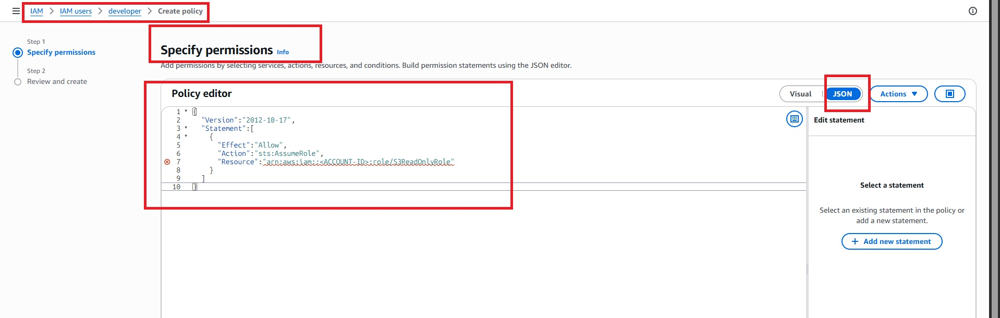
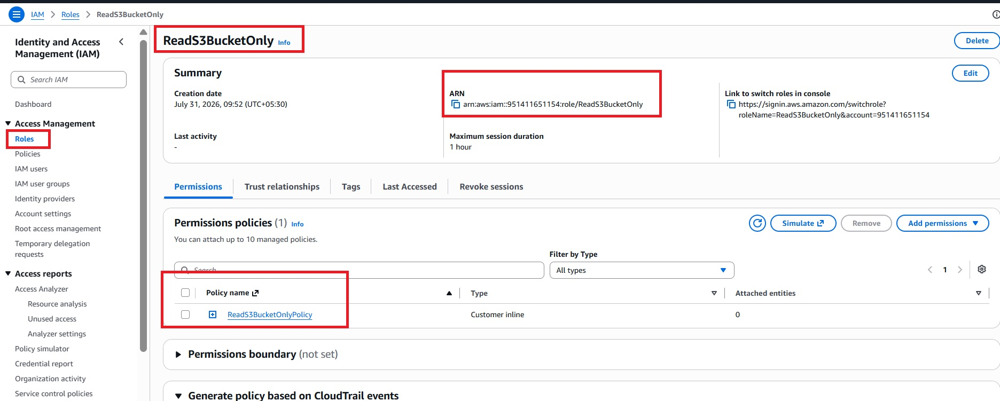
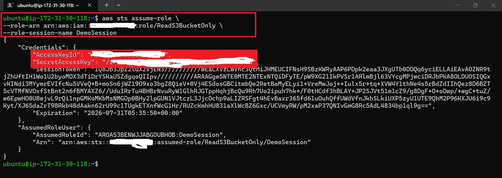
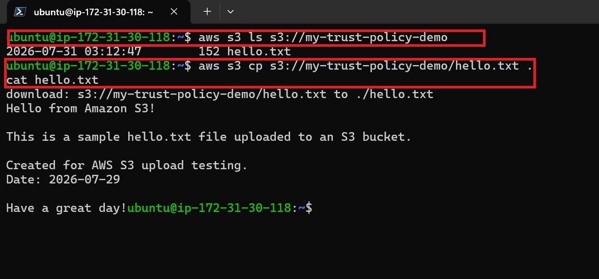
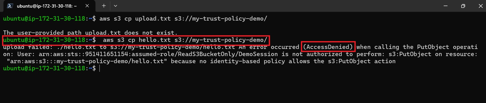

# 🔐 AWS IAM Trust Policy & Permission Policy with STS AssumeRole
Learn the difference between IAM Trust Policy and Permission Policy by performing a complete hands-on lab using AWS Security Token Service (STS) AssumeRole.

This lab demonstrates how an IAM User can securely assume an IAM Role to obtain temporary credentials and access AWS resources following the Principle of Least Privilege (PoLP).
---

# 🎯 Lab Objectives

After completing this lab, you will be able to:

- Create and manage IAM Users and IAM Roles.
- Configure IAM Trust Policies to control who can assume a role.
- Configure IAM Permission Policies to define what actions a role can perform.
- Generate temporary security credentials using AWS Security Token Service (STS).
- Assume an IAM Role using the `sts:AssumeRole` API.
- Access Amazon S3 resources using temporary STS credentials.
- Verify the Principle of Least Privilege (PoLP) through role-based access.
- Understand the complete AWS STS AssumeRole authentication and authorization workflow.
- Differentiate between Trust Policies and Permission Policies with practical examples.
- Gain hands-on experience implementing secure, role-based access control in AWS.
---

# 📌 Introduction

AWS Identity and Access Management (IAM) provides secure access to AWS resources.

One of the most important concepts in IAM is understanding the difference between:

Trust Policy
Permission Policy

These two policies work together when an IAM Role is assumed using AWS Security Token Service (STS).

In this hands-on lab, you'll configure both policies from scratch and use temporary credentials to securely access an Amazon S3 bucket.

---
# 🏗️ Architecture


---
# Hands-on Implementation

# Step 1 — Create an Amazon S3 Bucket

Navigate to :

AWS Console

↓

Amazon S3

↓

Create Bucket


Bucket Name :


Bucket Generated :


Upload File to Bucket :


File Inserting to Bucket :


File Uploading Pending to Bucket :


File Uploaded Successfully in the Bucket :


---

# Step 2 — Create IAM User

Navigate to :
---
IAM

↓

Users

↓

Create User
---

IAM Dashboard :


Create User :


IAM User Name :


Created IAM user :


--- 
 Do not attach any S3 permissions.
---
---

# Step 3 — Generate Access Keys

Open :

IAM

↓

developer

↓

Security Credentials

↓

Create Access Key


Create Access Key :


Access Key : 


# Best practice don't show access key . But I have hide my Secret key so no problem .

---
# Step 4 — Launch EC2 instance 

launch Instance :


Successfully Launch Instance :


EC2 connect to local via SSH :


Successfully SSH to local :


---

# Step 5 — Configure AWS CLI

AWS CLI Download :


# Verify 

aws sts get-caller-identity :


---
# Step 6 — Verify User Has No S3 Access

Run -- aws s3 ls  


# Expected  -- AccessDenied
This confirms that the IAM User has no direct S3 permissions.

---

# Step 7 — Create IAM Role

Navigate to :

IAM

↓

Roles

↓

Create Role

IAM Dashboard :


Create Role :


---
## Step 8 – Configure the Trust Policy

The **Trust Policy** defines **who is allowed to assume the IAM Role**.

Replace the default trust policy with the following JSON:

# Trust Policy :


### Example

```json
{
  "Version": "2012-10-17",
  "Statement": [
    {
      "Effect": "Allow",
      "Principal": {
        "AWS": "arn:aws:iam::<ACCOUNT-ID>:user/developer"
      },
      "Action": "sts:AssumeRole"
    }
  ]
}
```

> **Replace** `<ACCOUNT-ID>` with your AWS Account ID.

---
# Step 9 — Attach Permission Policy

The **Permission Policy** defines **what actions the IAM Role is allowed to perform** after it has been assumed.

Attach the following inline policy to the IAM Role.

## Permission Policy


### Example

```json
{
  "Version": "2012-10-17",
  "Statement": [
    {
      "Effect": "Allow",
      "Action": "s3:ListBucket",
      "Resource": "arn:aws:s3:::my-demo-bucket-12345"
    },
    {
      "Effect": "Allow",
      "Action": "s3:GetObject",
      "Resource": "arn:aws:s3:::my-demo-bucket-12345/*"
    }
  ]
}
```
---
# Step -10 Successfully Created Role

Created Role :


---
# Step 11 — Allow IAM User to Assume Role

Attach this policy to the developer IAM User:



### Example

```json
{
  "Version":"2012-10-17",
  "Statement":[
    {
      "Effect":"Allow",
      "Action":"sts:AssumeRole",
      "Resource":"arn:aws:iam::<ACCOUNT-ID>:role/S3ReadOnlyRole"
    }
  ]
}
```
---
# Step 12 — Copy Role ARN

### Example

```bash
arn:aws:iam::123456789012:role/S3ReadOnlyRole

```


---
# Step 13 — Assume the IAM Role Using AWS STS

Run the following AWS CLI command to assume the IAM Role and obtain temporary security credentials.

```bash
aws sts assume-role \
  --role-arn arn:aws:iam::123456789012:role/S3ReadOnlyRole \
  --role-session-name DemoSession
```

> **Replace** `123456789012` with your AWS Account ID and `S3ReadOnlyRole` with your IAM Role name.

### Expected Output

```json
{
  "Credentials": {
    "AccessKeyId": "ASIA****************",
    "SecretAccessKey": "********************************",
    "SessionToken": "********************************",
    "Expiration": "2026-07-31T12:30:00Z"
  },
  "AssumedRoleUser": {
    "Arn": "arn:aws:sts::123456789012:assumed-role/S3ReadOnlyRole/DemoSession"
  }
}
```

📷 ** Assume Role STS **




```text
images/sts-assume-role-output.png
```
---
# Step 14 — Export Temporary Credentials

```bash
export AWS_ACCESS_KEY_ID=ASIA...

export AWS_SECRET_ACCESS_KEY=...

export AWS_SESSION_TOKEN=...
```
---
# Step 15 — Verify Assumed Identity

Verify 
```bash
aws sts get-caller-identity
```


Expected :
```json
{
"Arn":"arn:aws:sts::123456789012:assumed-role/S3ReadOnlyRole/DemoSession"
}
```
---
# Step 16 — Access the S3 Bucket

```bash
aws s3 ls s3://my-demo-bucket-12345
```
Expected :

```bash
hello.txt
```
---
# Step 17 — Download Object


```bash
aws s3 cp s3://my-demo-bucket-12345/hello.txt .
```

View the file

```bash
cat hello.txt
```
---

# Step 18 — Verify Least Privilege

Attempt to upload a file.

```bash
aws s3 cp upload.txt s3://my-demo-bucket-12345/
```


Expected

```text
AccessDenied
```

This confirms that the role only has read permissions.

---

# 🔄 Complete STS AssumeRole Workflow

IAM User

     |
     ▼
     
Permission to call sts:AssumeRole

     │
     ▼
     
AWS STS

     │
     ▼
     
Checks Trust Policy

     │
     ▼
     
Issues Temporary Credentials

     │
     ▼
     
Permission Policy Evaluated

     │
     ▼
     
Access Amazon S3


---

# 🚨 Troubleshooting

| Error                            | Cause                               | Solution                                          |
| -------------------------------- | ----------------------------------- | ------------------------------------------------- |
| AccessDenied while assuming role | Missing `sts:AssumeRole` permission | Attach AssumeRole policy to IAM User              |
| AccessDenied after assuming role | Missing S3 permissions              | Verify Permission Policy                          |
| InvalidClientTokenId             | Invalid or expired credentials      | Reconfigure AWS CLI or export new STS credentials |
| ExpiredToken                     | Session expired                     | Run `aws sts assume-role` again                   |
| NoSuchBucket                     | Incorrect bucket name               | Verify bucket name and Region                     |

---
# 🎯 Key Takeaways

Understood the difference between Trust Policy and Permission Policy.
Created an IAM User without direct S3 access.
Created an IAM Role with a Trust Policy.
Attached a Permission Policy to the IAM Role.
Allowed the IAM User to assume the IAM Role.
Generated temporary credentials using AWS STS.
Accessed Amazon S3 using the assumed role.
Verified the Principle of Least Privilege by confirming write operations were denied.

---

# 👨‍💻 Author

**Hardik Darji**
---

⭐ If you found this project helpful, consider giving this repository a star!


