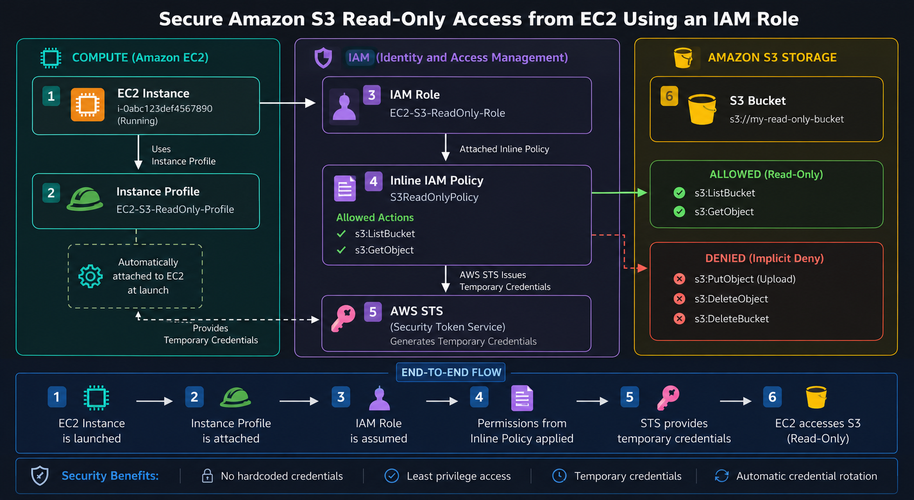

# 🔐 AWS IAM Trust Policy & Permission Policy with STS AssumeRole

Learn the difference between IAM Trust Policy and Permission Policy by performing a complete hands-on lab using AWS Security Token Service (STS) AssumeRole.
---
This lab demonstrates how an IAM User can securely assume an IAM Role to obtain temporary credentials and access AWS resources following the Principle of Least Privilege (PoLP).
---

# 🎯 Lab Objectives

After completing this lab, you will be able to:

- Create and manage IAM Users and IAM Roles.
- Configure IAM Trust Policies to control who can assume a role.
- Configure IAM Permission Policies to define what actions a role can perform.
- Generate temporary security credentials using AWS Security Token Service (STS).
- Assume an IAM Role using the `sts:AssumeRole` API.
- Access Amazon S3 resources using temporary STS credentials.
- Verify the Principle of Least Privilege (PoLP) through role-based access.
- Understand the complete AWS STS AssumeRole authentication and authorization workflow.
- Differentiate between Trust Policies and Permission Policies with practical examples.
- Gain hands-on experience implementing secure, role-based access control in AWS.
---

# 📌 Introduction

AWS Identity and Access Management (IAM) provides secure access to AWS resources.

One of the most important concepts in IAM is understanding the difference between:

Trust Policy
Permission Policy

These two policies work together when an IAM Role is assumed using AWS Security Token Service (STS).

In this hands-on lab, you'll configure both policies from scratch and use temporary credentials to securely access an Amazon S3 bucket.

---
# 🏗️ Architecture

---
# Hands-on Implementation

# Step 1 — Create an Amazon S3 Bucket

Navigate to :

AWS Console

↓

Amazon S3

↓

Create Bucket

