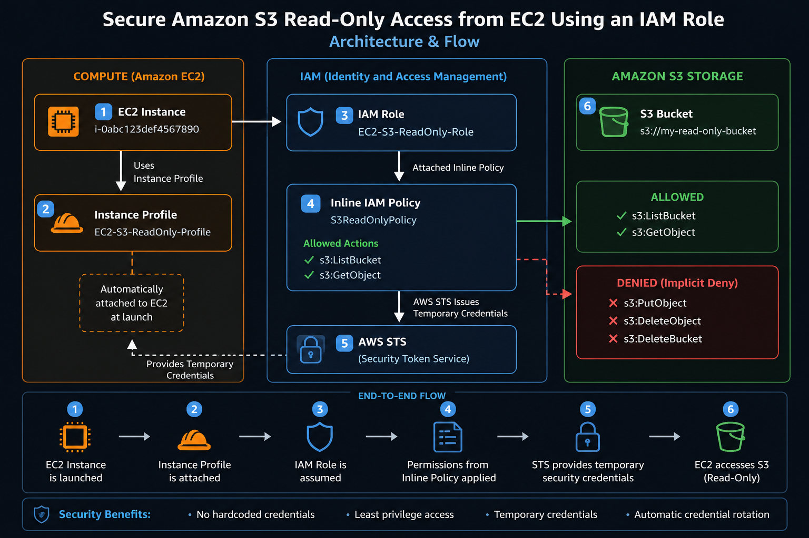

# 🔐 AWS IAM Trust Policy & Permission Policy with STS AssumeRole

Learn the difference between IAM Trust Policy and Permission Policy by performing a complete hands-on lab using AWS Security Token Service (STS) AssumeRole.
---
This lab demonstrates how an IAM User can securely assume an IAM Role to obtain temporary credentials and access AWS resources following the Principle of Least Privilege (PoLP).
---

#📖 Table of Contents

Introduction
Architecture
Prerequisites
Lab Objectives
Understanding IAM Policies
Hands-on Implementation
Step 1 – Create an S3 Bucket
Step 2 – Create an IAM User
Step 3 – Generate Access Keys
Step 4 – Configure AWS CLI
Step 5 – Verify No S3 Access
Step 6 – Create an IAM Role
Step 7 – Configure Trust Policy
Step 8 – Configure Permission Policy
Step 9 – Allow User to Assume Role
Step 10 – Copy Role ARN
Step 11 – Assume Role Using STS
Step 12 – Export Temporary Credentials
Step 13 – Verify Assumed Identity
Step 14 – Access S3 Bucket
Step 15 – Download Object
Step 16 – Test Write Permission
Trust Policy vs Permission Policy
STS Workflow
Troubleshooting
Conclusion
---

# 🎯 Lab Objectives

After completing this lab, you will understand how to:

Create IAM Users and IAM Roles
Configure Trust Policies
Configure Permission Policies
Generate temporary credentials using AWS STS
Assume an IAM Role
Access Amazon S3 using temporary credentials
Understand the complete AssumeRole workflow
---

# 📌 Introduction

AWS Identity and Access Management (IAM) provides secure access to AWS resources.

One of the most important concepts in IAM is understanding the difference between:

Trust Policy
Permission Policy

These two policies work together when an IAM Role is assumed using AWS Security Token Service (STS).

In this hands-on lab, you'll configure both policies from scratch and use temporary credentials to securely access an Amazon S3 bucket.

---
# 🏗️ Architecture

