# 🔐 AWS IAM Trust Policy & Permission Policy with STS AssumeRole
Learn the difference between IAM Trust Policy and Permission Policy by performing a complete hands-on lab using AWS Security Token Service (STS) AssumeRole.

This lab demonstrates how an IAM User can securely assume an IAM Role to obtain temporary credentials and access AWS resources following the Principle of Least Privilege (PoLP).
---

# 🎯 Lab Objectives

After completing this lab, you will be able to:

- Create and manage IAM Users and IAM Roles.
- Configure IAM Trust Policies to control who can assume a role.
- Configure IAM Permission Policies to define what actions a role can perform.
- Generate temporary security credentials using AWS Security Token Service (STS).
- Assume an IAM Role using the `sts:AssumeRole` API.
- Access Amazon S3 resources using temporary STS credentials.
- Verify the Principle of Least Privilege (PoLP) through role-based access.
- Understand the complete AWS STS AssumeRole authentication and authorization workflow.
- Differentiate between Trust Policies and Permission Policies with practical examples.
- Gain hands-on experience implementing secure, role-based access control in AWS.
---

# 📌 Introduction

AWS Identity and Access Management (IAM) provides secure access to AWS resources.

One of the most important concepts in IAM is understanding the difference between:

Trust Policy
Permission Policy

These two policies work together when an IAM Role is assumed using AWS Security Token Service (STS).

In this hands-on lab, you'll configure both policies from scratch and use temporary credentials to securely access an Amazon S3 bucket.

---
# 🏗️ Architecture


---
# Hands-on Implementation

# Step 1 — Create an Amazon S3 Bucket

Navigate to :

AWS Console

↓

Amazon S3

↓

Create Bucket

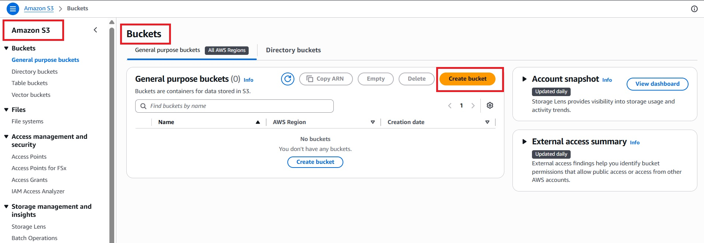

Bucket Name :

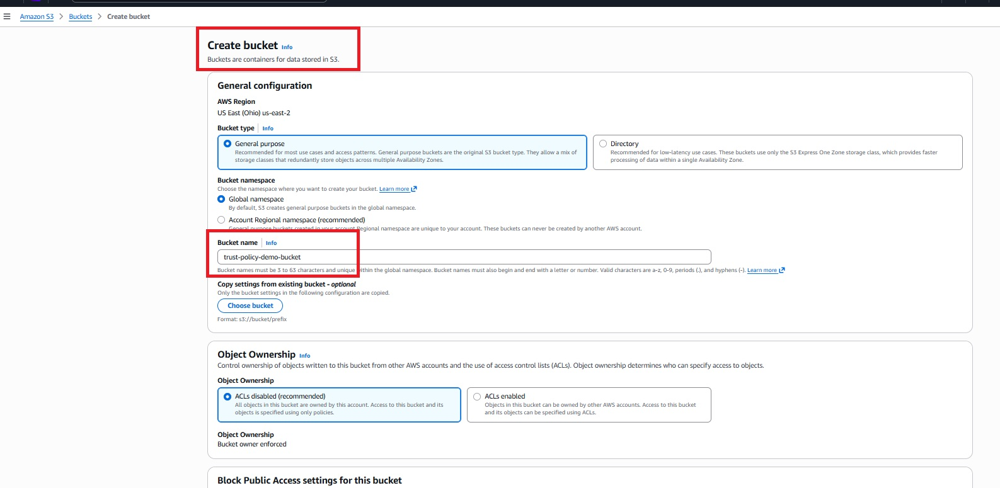

Bucket Generated :

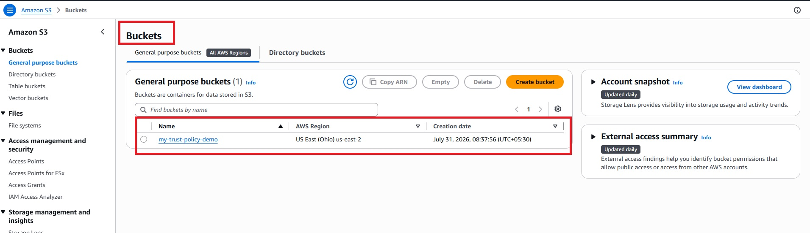

Upload File to Bucket :

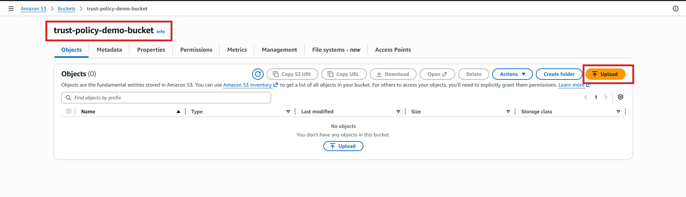

File Inserting to Bucket :

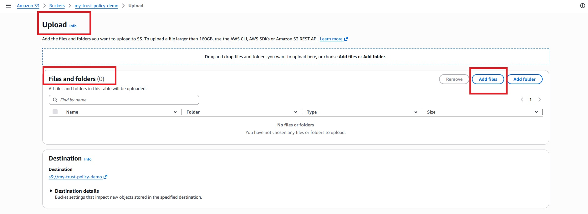

File Uploading Pending to Bucket :

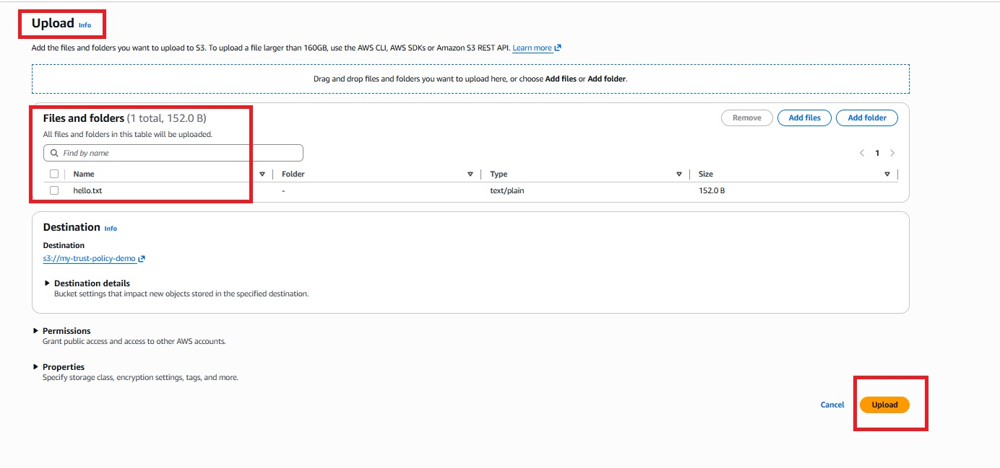

File Uploaded Successfully in the Bucket :

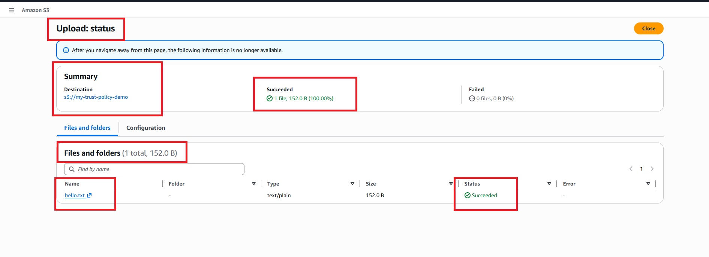

---

# Step 2 — Create IAM User

Navigate to :
---
IAM

↓

Users

↓

Create User
---

IAM Dashboard :

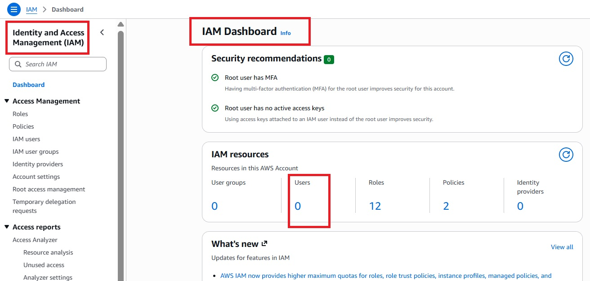

Create User :

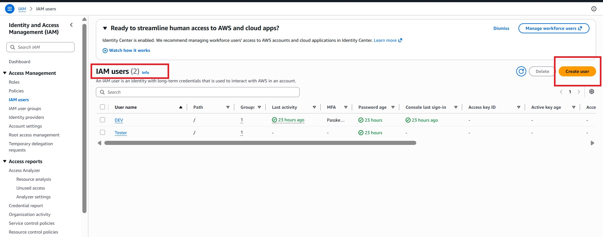

IAM User Name :

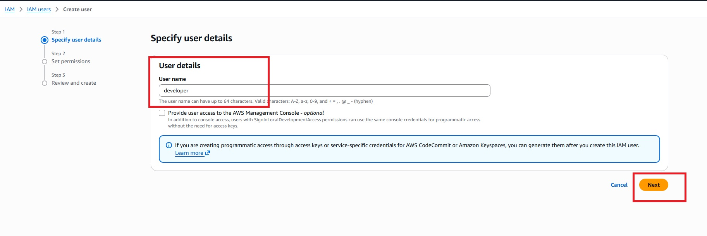

Created IAM user :

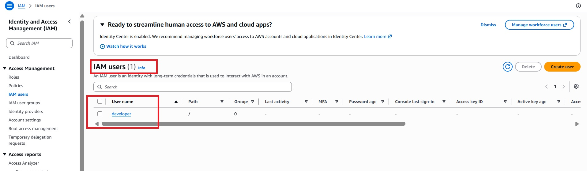

--- 
 Do not attach any S3 permissions.
---
---

# Step 3 — Generate Access Keys

Open :

IAM

↓

developer

↓

Security Credentials

↓

Create Access Key

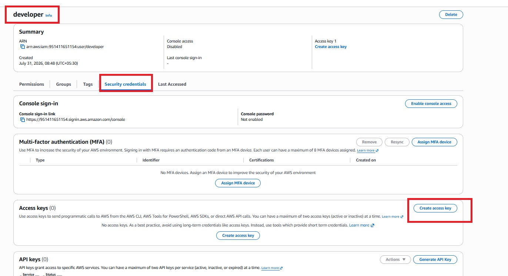

Create Access Key :

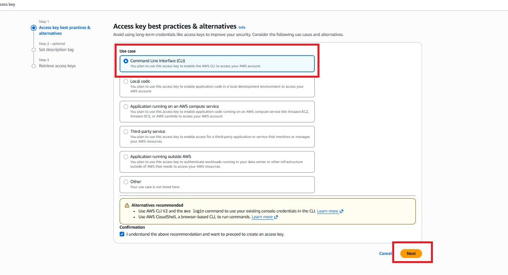

Access Key : 

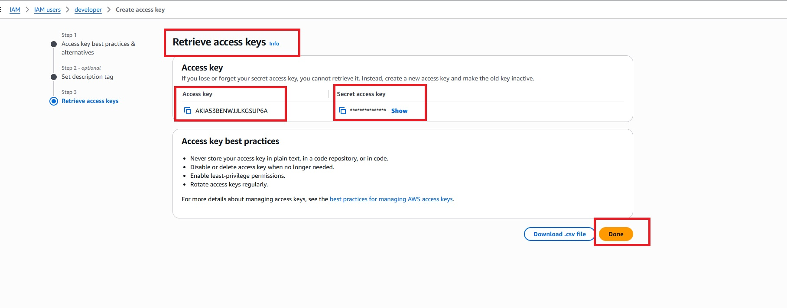

# Best practice don't show access key . But I have hide my Secret key so no problem .

---
# Step 4 — Launch EC2 instance 

launch Instance :

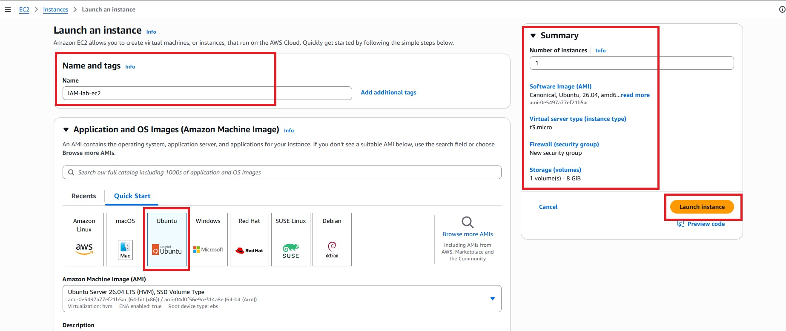

Successfully Launch Instance :

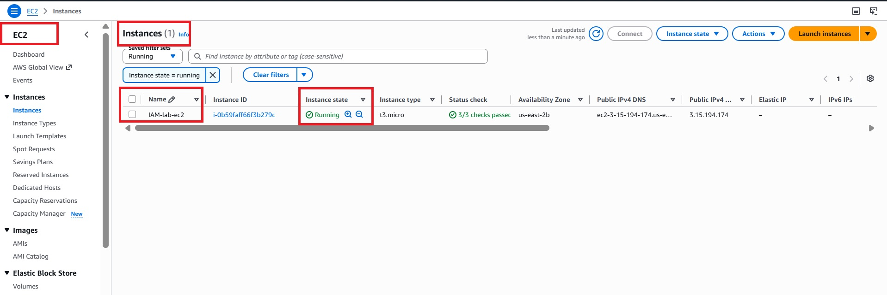

EC2 connect to local via SSH :

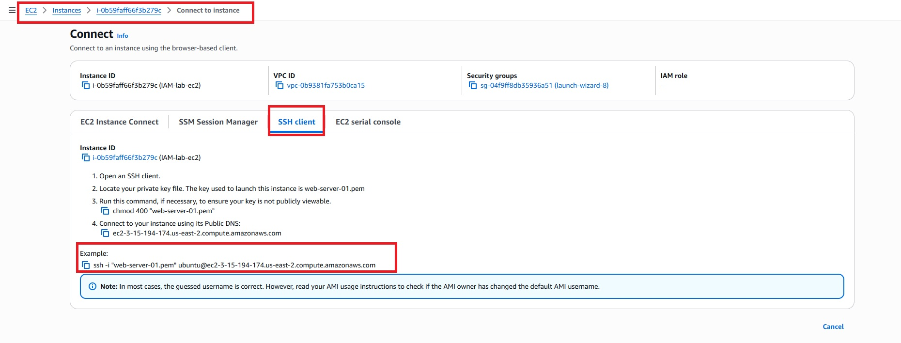

Successfully SSH to local :

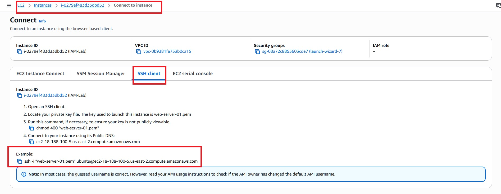

---

# Step 5 — Configure AWS CLI

AWS CLI Download :

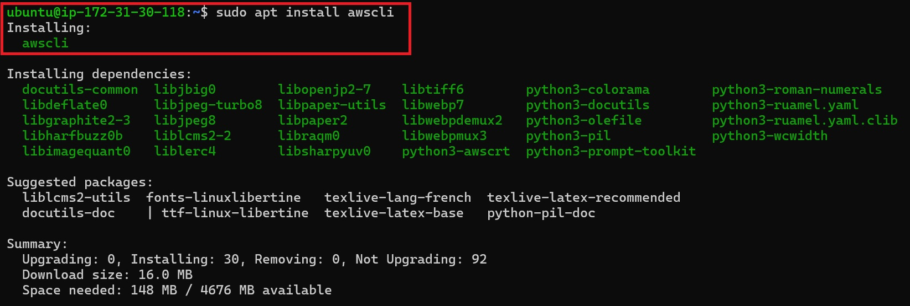

# Verify 

aws sts get-caller-identity :

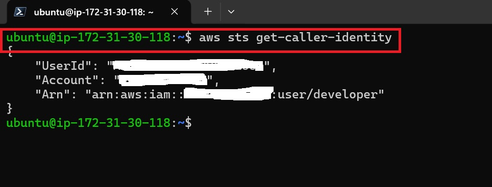

---
# Step 6 — Verify User Has No S3 Access

Run -- aws s3 ls  

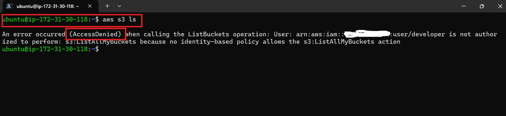

# Expected  -- AccessDenied
This confirms that the IAM User has no direct S3 permissions.

---

# Step 7 — Create IAM Role

Navigate to :

IAM

↓

Roles

↓

Create Role

IAM Dashboard :

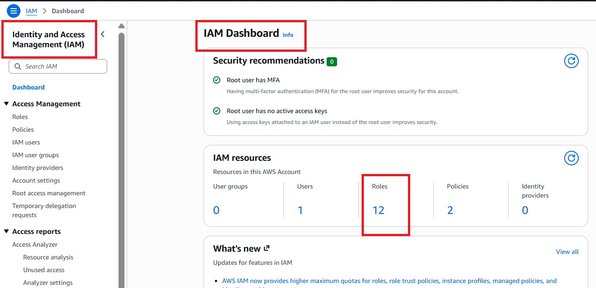

Create Role :

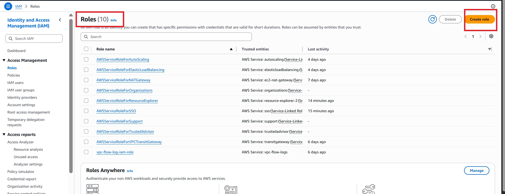

---
## Step 8 – Configure the Trust Policy

The **Trust Policy** defines **who is allowed to assume the IAM Role**.

Replace the default trust policy with the following JSON:

# Trust Policy :
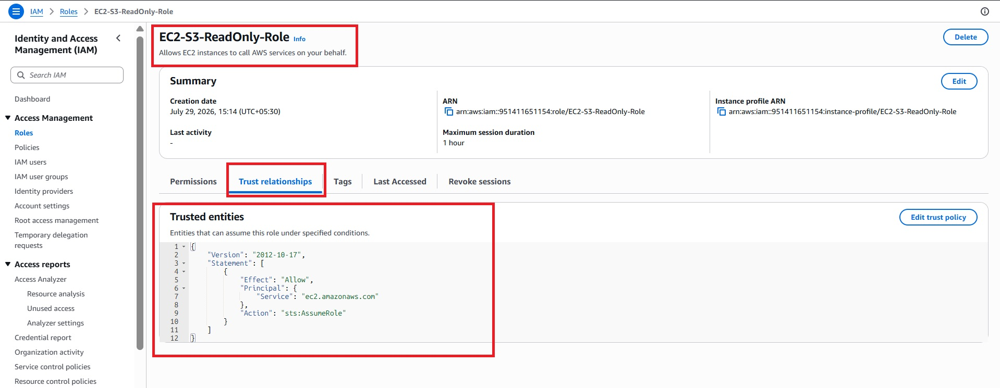

### Example

```json
{
  "Version": "2012-10-17",
  "Statement": [
    {
      "Effect": "Allow",
      "Principal": {
        "AWS": "arn:aws:iam::<ACCOUNT-ID>:user/developer"
      },
      "Action": "sts:AssumeRole"
    }
  ]
}
```

> **Replace** `<ACCOUNT-ID>` with your AWS Account ID.

---
# Step 9 — Attach Permission Policy

The **Permission Policy** defines **what actions the IAM Role is allowed to perform** after it has been assumed.

Attach the following inline policy to the IAM Role.

## Permission Policy

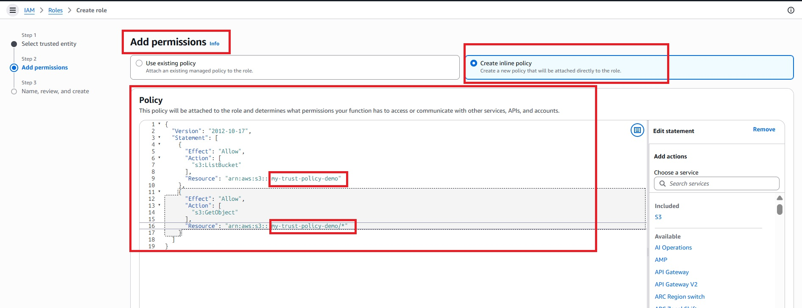

### Example

```json
{
  "Version": "2012-10-17",
  "Statement": [
    {
      "Effect": "Allow",
      "Action": "s3:ListBucket",
      "Resource": "arn:aws:s3:::my-demo-bucket-12345"
    },
    {
      "Effect": "Allow",
      "Action": "s3:GetObject",
      "Resource": "arn:aws:s3:::my-demo-bucket-12345/*"
    }
  ]
}
```
---
# step -10 Successfully Created Role

Created Role :

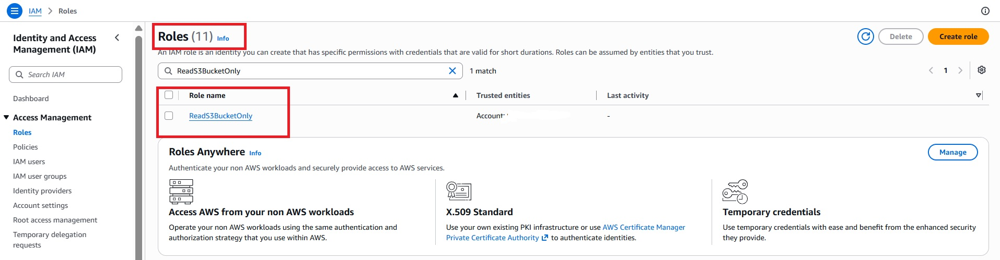


