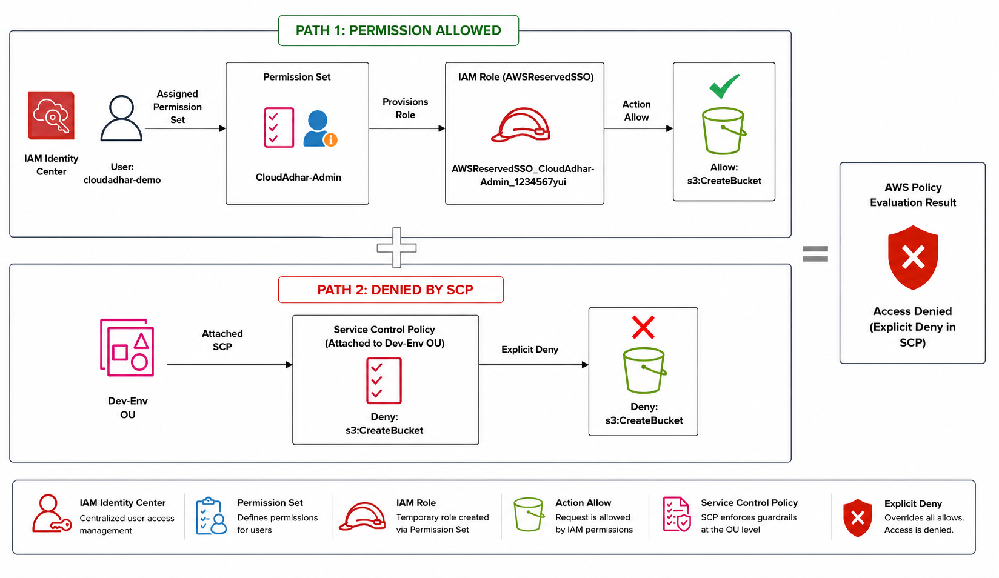

# ☁️ AWS Organizations · OUs · SCP Guardrails · IAM Identity Center · Cross-Account Access Lab

Hands-on AWS Lab demonstrating enterprise multi-account management using AWS Organizations, Organizational Units (OUs), Service Control Policies (SCPs), IAM Identity Center (AWS SSO), Cross-Account Access, and Consolidated Billing.

---

# 📖 Overview

Instead of running everything inside one AWS account, this lab shows how organizations separate workloads into different accounts while maintaining centralized governance, billing, and user access.

## 📚 Topics Covered

- 🏢 AWS Organizations
- 📂 Organizational Units (OUs)
- 🛡️ Service Control Policies (SCPs)
- 👥 AWS IAM Identity Center
- 🔐 AWS STS Temporary Credentials
- 🔄 Cross-Account Access
- 💳 Consolidated Billing
- 📊 AWS Cost Explorer
- 🚧 Security Guardrails

---

## 🎯 Learning Outcomes

After completing this lab, I gained hands-on experience with:

- Creating and managing AWS Organizations.
- Organizing multiple AWS accounts using Organizational Units (OUs).
- Implementing Service Control Policies (SCPs) to enforce security and governance.
- Configuring AWS IAM Identity Center for centralized user authentication and permission management.
- Using AWS Security Token Service (STS) to obtain temporary credentials.
- Setting up secure cross-account access using IAM roles.
- Understanding AWS Consolidated Billing for centralized cost management.
- Monitoring AWS spending and resource usage with AWS Cost Explorer.
- Applying security guardrails to maintain compliance across multiple AWS accounts.

---
## AWS Organizations  with SCP

---

## S3 Bucket Permisssion 

---
## Step 1 – Understand the Problem

Imagine everyone works inside one AWS account.

## 🏗️ Architecture

One AWS Account

Developer
Tester
DevOps
Security
Finance
Production

---
---
## Step -1 AWS Organization Structure 

Verified the AWS Organization structure, Organizational Unit, and attached Service Control Policy.

# AWS Organization Hierarchy

## Dev-OU SCP Attached Policies.

