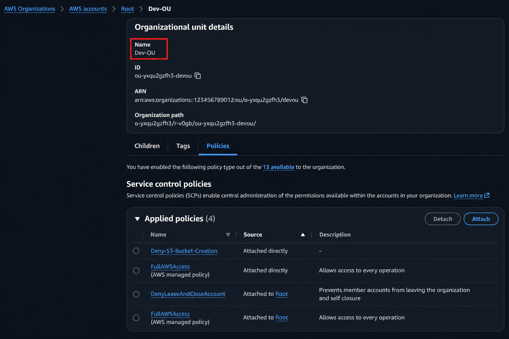

# ☁️ AWS Organizations · OUs · SCP Guardrails · IAM Identity Center · Cross-Account Access Lab

Hands-on AWS Lab demonstrating enterprise multi-account management using AWS Organizations, Organizational Units (OUs), Service Control Policies (SCPs), IAM Identity Center (AWS SSO), Cross-Account Access, and Consolidated Billing.

---

## 📚 Topics Covered

- 🏢 AWS Organizations
- 📂 Organizational Units (OUs)
- 🛡️ Service Control Policies (SCPs)
- 👥 AWS IAM Identity Center
- 🔐 AWS STS Temporary Credentials
- 🔄 Cross-Account Access
- 💳 Consolidated Billing
- 📊 AWS Cost Explorer
- 🚧 Security Guardrails

---

## 🎯 Learning Outcomes

After completing this lab, I gained hands-on experience with:

- Creating and managing AWS Organizations.
- Organizing multiple AWS accounts using Organizational Units (OUs).
- Implementing Service Control Policies (SCPs) to enforce security and governance.
- Configuring AWS IAM Identity Center for centralized user authentication and permission management.
- Using AWS Security Token Service (STS) to obtain temporary credentials.
- Setting up secure cross-account access using IAM roles.
- Understanding AWS Consolidated Billing for centralized cost management.
- Monitoring AWS spending and resource usage with AWS Cost Explorer.
- Applying security guardrails to maintain compliance across multiple AWS accounts.

---
## Step 1 – Understand the Problem

Imagine everyone works inside one AWS account.

One AWS Account :

- Developer
- Tester
- DevOps
- Security
- Finance
- Production

Problems:

- Developer accidentally deletes Production resources.
- Testing increases Production costs.
- Everyone receives Administrator permissions.
- Difficult auditing.
- Difficult billing.
- Difficult security.

This does not scale.

## 🏗️ Architecture


---
## Step 2 – Create AWS Organization

Open: 
AWS Console

↓

AWS Organizations

Click :
Create Organization


AWS creates :
Root

Hierarchy :
Root

---
## Step 3 – Create Organizational Units

Create : Dev-OU , Test-OU , Prod-OU

AWS Organization Hierarchy


----
## Step 4 – Create AWS Accounts

Inside Organizations

Create :  CloudAdhar-Dev


Move to : Dev-OU


## Dev-OU SCP Attached Policies.




## AWS Organizations  with SCP


---
## Step 5 – Understand the Management Account

The Management Account should not run workloads.


It is only used for:

- AWS Organizations
- SCP Management
- Billing
- Cost Explorer
- Identity Center
- Central Governance

Never deploy production applications here.
---

## Step 6 – Enable IAM Identity Center

Go to :
IAM Identity Center

Click :
Enable

AWS creates :
Identity Store

↓

Access Portal

↓

Permission Set Service

# AWS Access Portal


---

## Step 7 – Login  

Open :

AWS Access Portal

Choose :

CloudAdhar-Dev

Click :

Management Console

Now you're inside the Dev account.

---

## Step 8 – Verify STS Session

Open CloudShell. 

Run
```bash
aws sts get-caller-identity
```

Example :
```json
{
 "Account":"123456789012",

 "Arn":"arn:aws:sts::123456789012:assumed-role/AWSReservedSSO_CloudAdhar-Admin_xxxxx/cloudadhar-demo"
}
```


---
