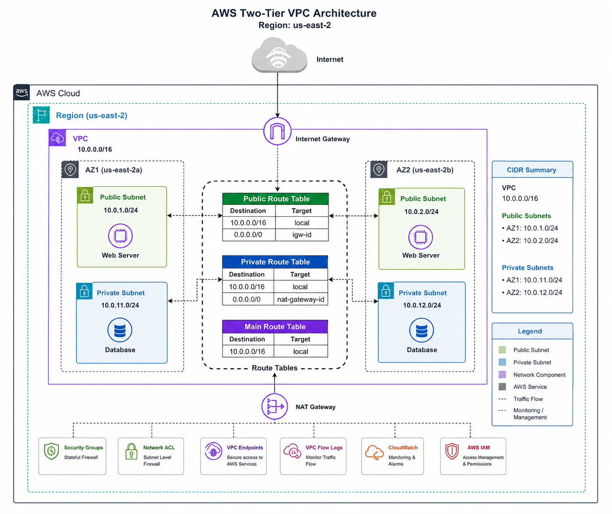
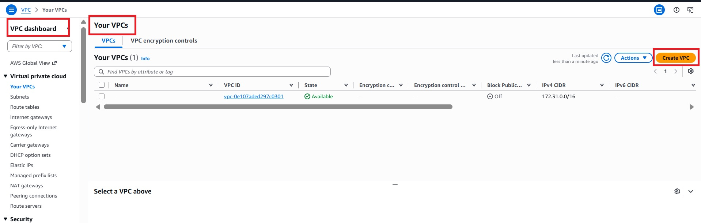

# 🌐 AWS VPC Foundation – CIDR Planning, Public & Private Subnets, Route Tables, Internet Gateway & VPC Design Flow

> A comprehensive hands-on guide to understanding the fundamental building blocks of Amazon Virtual Private Cloud (VPC). This documentation explains how to design a secure and scalable VPC architecture using CIDR planning, public/private subnets, route tables, and an Internet Gateway.

---

# 📌 Project Objective

The objective of this documentation is to learn how Amazon VPC networking works by designing a basic network architecture from scratch.

You will learn:

- CIDR Block Planning
- Public and Private Subnets
- Route Tables
- Internet Gateway (IGW)
- End-to-End VPC Design Flow
- Best Practices for Network Design

---

# 🏗️ Architecture

---
## Step 1 — Create Custom VPC

Create VPC :

