# 🌐 AWS VPC Foundation – CIDR Planning, Public & Private Subnets, Route Tables, Internet Gateway & VPC Design Flow

> A comprehensive hands-on guide to understanding the fundamental building blocks of Amazon Virtual Private Cloud (VPC). This documentation explains how to design a secure and scalable VPC architecture using CIDR planning, public/private subnets, route tables, and an Internet Gateway.

---

# 📌 Project Objective

The objective of this documentation is to learn how Amazon VPC networking works by designing a basic network architecture from scratch.

You will learn:

- CIDR Block Planning
- Public and Private Subnets
- Route Tables
- Internet Gateway (IGW)
- End-to-End VPC Design Flow
- Best Practices for Network Design

---

# 🏗️ Architecture

---
## Step 1 — Create Custom VPC

Create VPC :

VPC name & IPv4 CIDR :
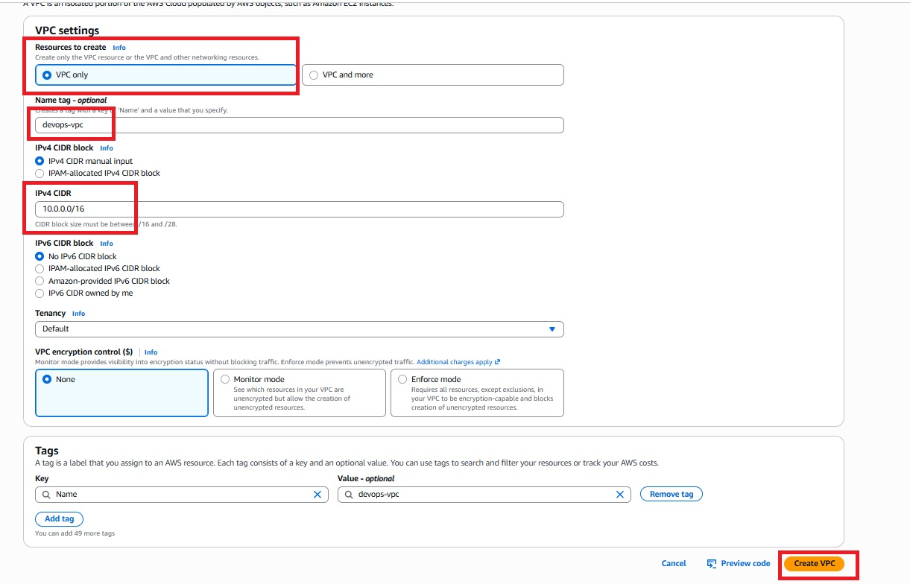

VPC Created :
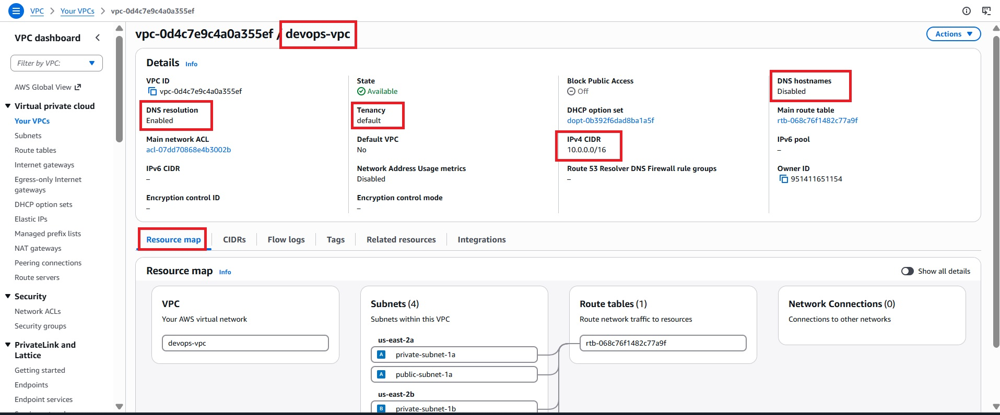

---
## Step 2 — Create Public Subnet

Public Subnet :
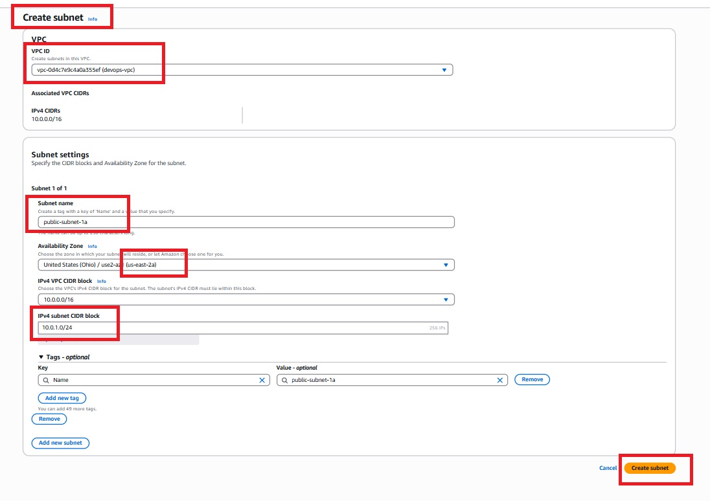

Enable Auto Assign Public IPv4 :
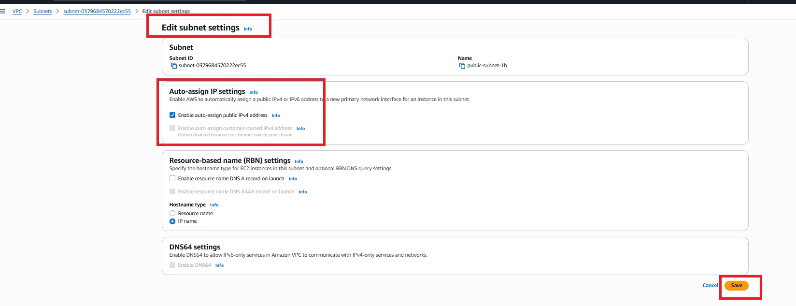

Public and Private Subnet :
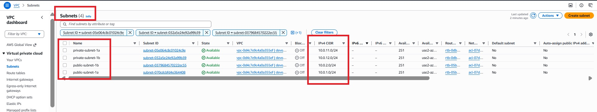

---
## Step 3 — Create Internet Gateway

Create IGW :
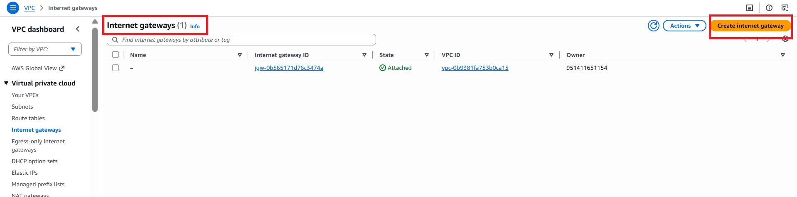

IGW  Name:
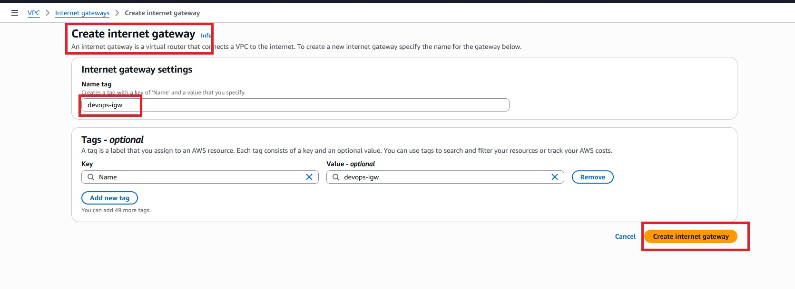

Attach Internet Gateway :
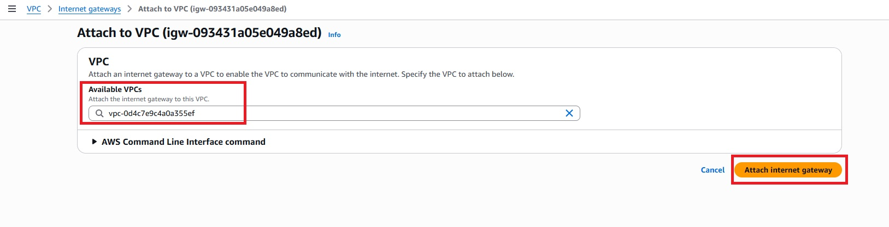

Attached IGW :
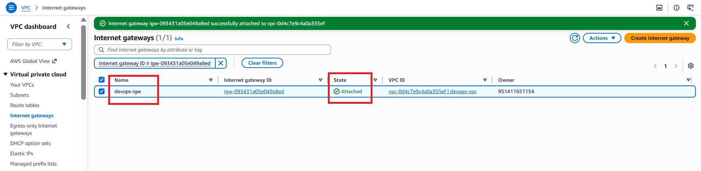

---
## Step 4 — Main Route Table

Create Main Route :
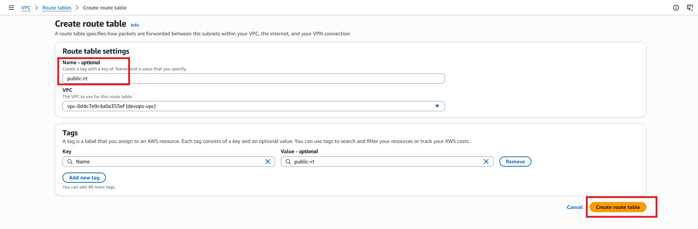

Set main route :
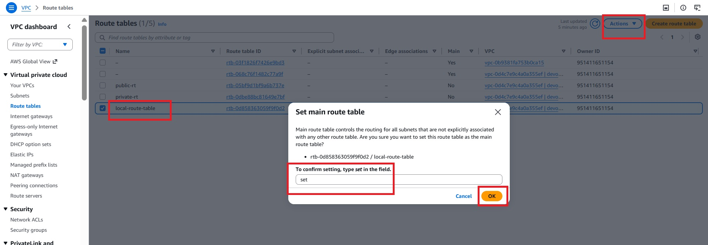

--- 
## Step 5 — Create Public Route Table

---
## Step 6 — Add Internet Route to public

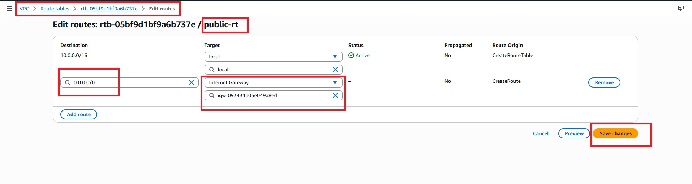

---
## Step 7 — Associate Public Subnets

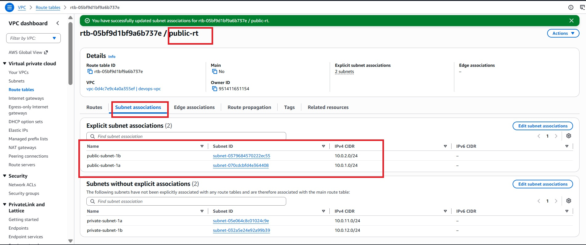

---
## Step 8  — Create Private Route Table & Keep Local Route Only

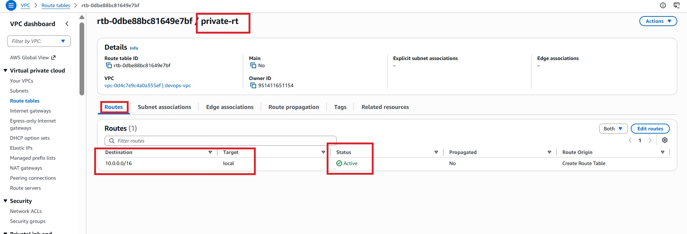

---
## Step 9 — Associate Private Subnets

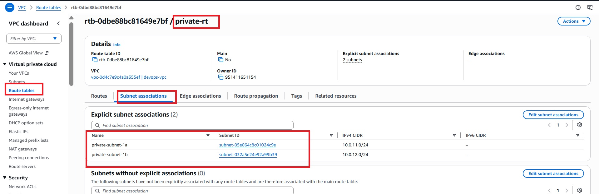

---
## 

