# 🌐 Amazon VPC Part 2 –  NAT Gateway · Security Groups vs NACLs · VPC Endpoints · Flow Logs

---
# 📖 Overview

This project demonstrates how to build a **production-style Amazon VPC** with secure networking components from scratch.

The architecture includes:

- Public & Private Subnets
- Internet Gateway
- NAT Gateway
- Public & Private Route Tables
- EC2 Instances
- Security Groups
- Network ACLs
- Amazon S3 Gateway Endpoint
- Amazon EC2 Interface Endpoint
- AWS Systems Manager Session Manager
- Amazon CloudWatch VPC Flow Logs

The objective is to provide secure internet access for private workloads while keeping all management traffic inside the AWS network.

---

# 🏗 Architecture

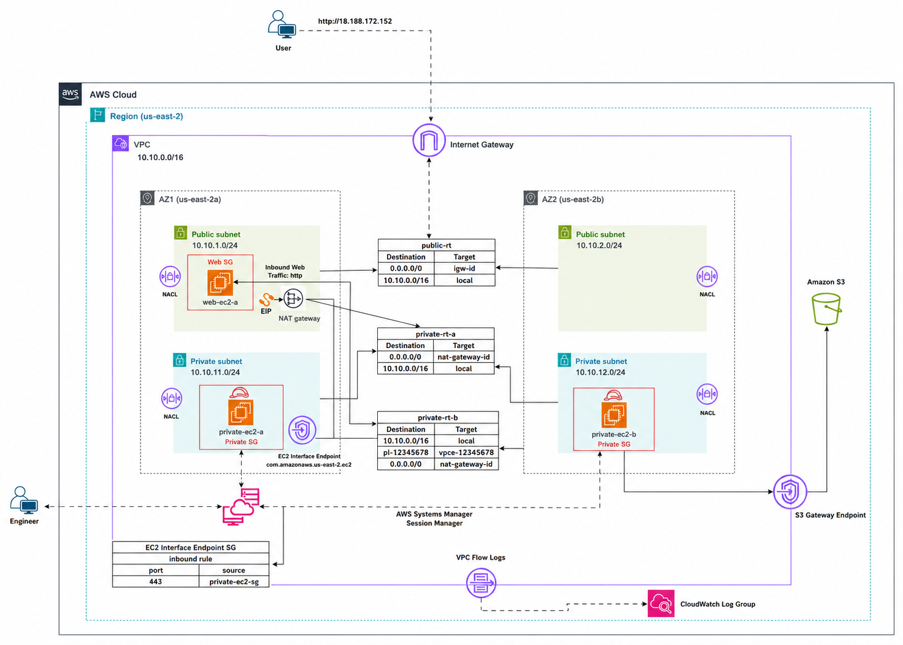

---
## Step 1 - Create VPC 

```bash
VPC

→ Create VPC

Settings
Name
devops-vpc

IPv4 CIDR
10.10.0.0/16

IPv6
None

Tenancy
Default

Click
Create VPC

```

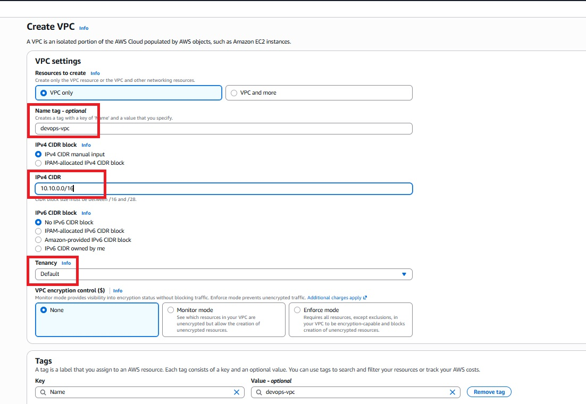

---
## Step 2 - Create Internet Gateway 

```bash
VPC

→ Internet Gateway

Create

Name
devops-igw

After creation

Attach to :
devops-vpc

```
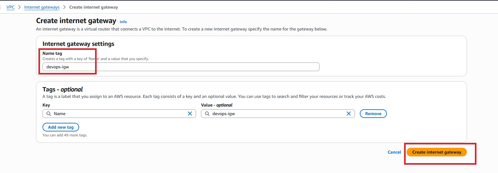 

---
## Step 3 - Create Public Subnet A

```bash

VPC

Subnets

Create

Name
public-subnet-a

AZ
us-east-2a

CIDR
10.10.1.0/24

```
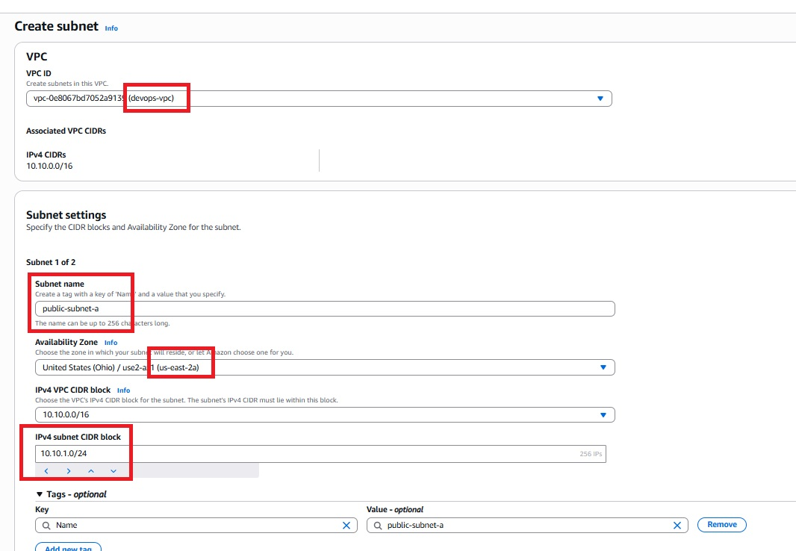 

---
## Step 4 - Create Public Subnet B

```bash
Name

public-subnet-b

AZ :
us-east-2b

CIDR :
10.10.2.0/24

```
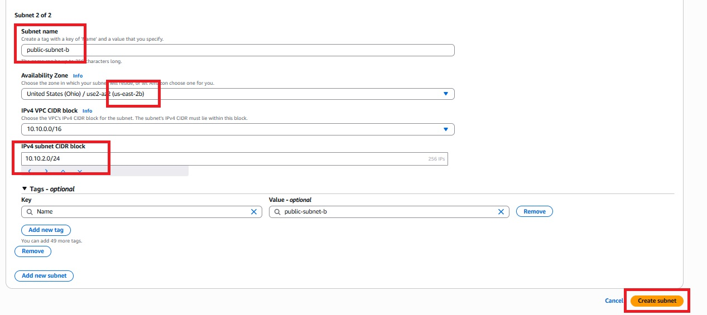 

---
## Step 5 - Create Private Subnet A

```bash
Name

private-subnet-a

AZ :
us-east-2a

CIDR :
10.10.11.0/24
```
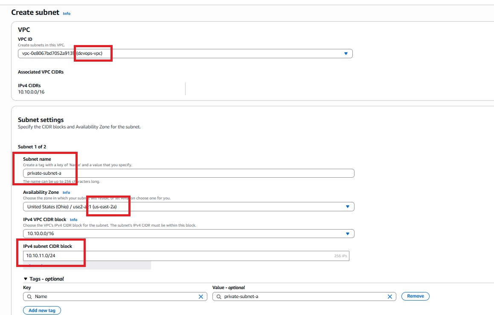

---
## Step 6 - Create Private Subnet B

```bash
Name

private-subnet-b

AZ :
us-east-2b

CIDR :
10.10.12.0/24
```
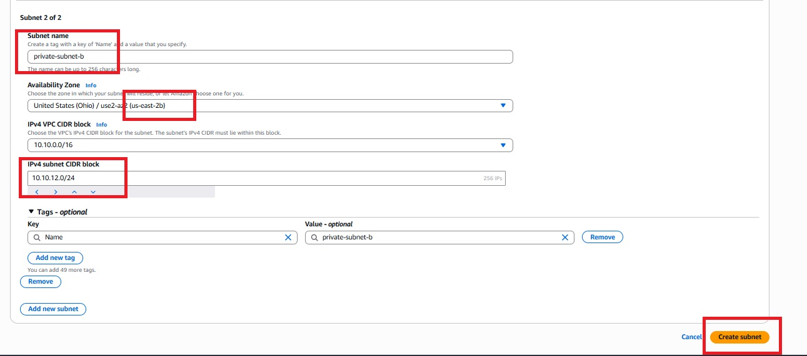

---

## Step 7 - Enable Auto Assign Public IP

```bash
Select

public-subnet-a

Edit :
Enable Auto Assign Public IPv4

Do same for

public-subnet-b
```
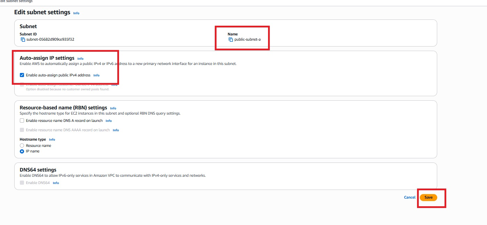

ALL Subnet :
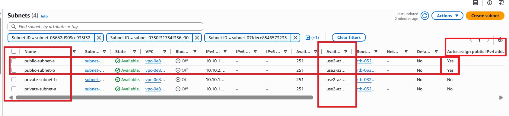

---
## Step 8 - Create Public Route Table

```bash
Route Tables

Create

Name  :
public-rt
```
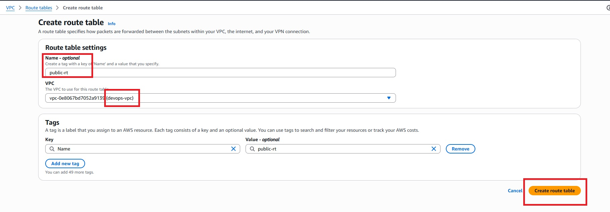

```bash
edit Route :
0.0.0.0/0

Target :
Internet Gateway

Associate :
public-subnet-a
public-subnet-b
```
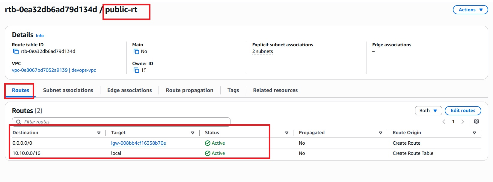

---
## Step 9 - Create Private Route Table A

```bash
Create :
private-rt-a
```
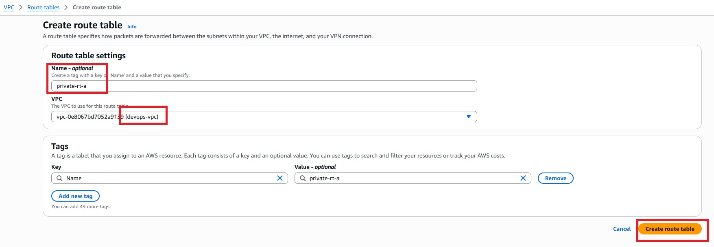

```bash
Associate :
private-subnet-a
```
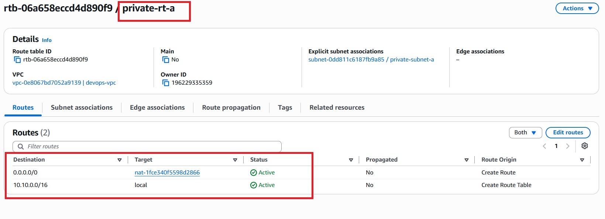

---
## Step 10 - Create Private Route Table B

```bash
Create :
private-rt-b

Associate :
private-subnet-b
```
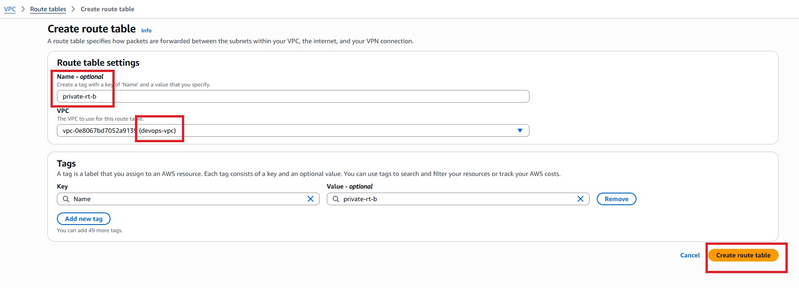

---
## Step 11 - Allocate Elastic IP

```bash
Choose : VPC

Elastic IP

Allocate

Name :
nat-eip
```
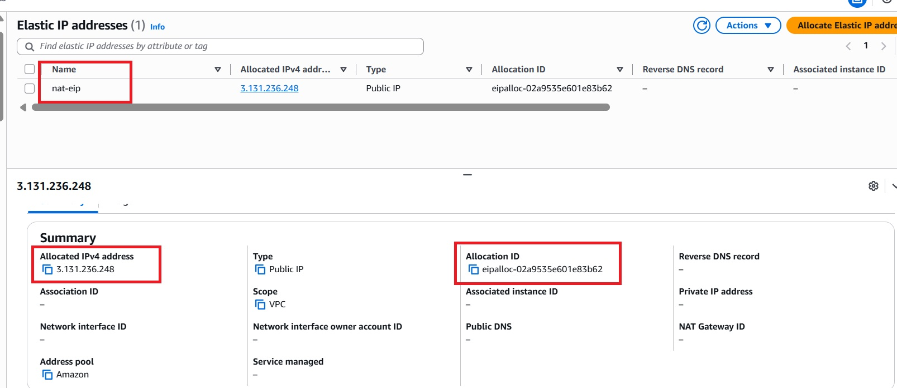

---
## Step 12 - Create NAT Gateway

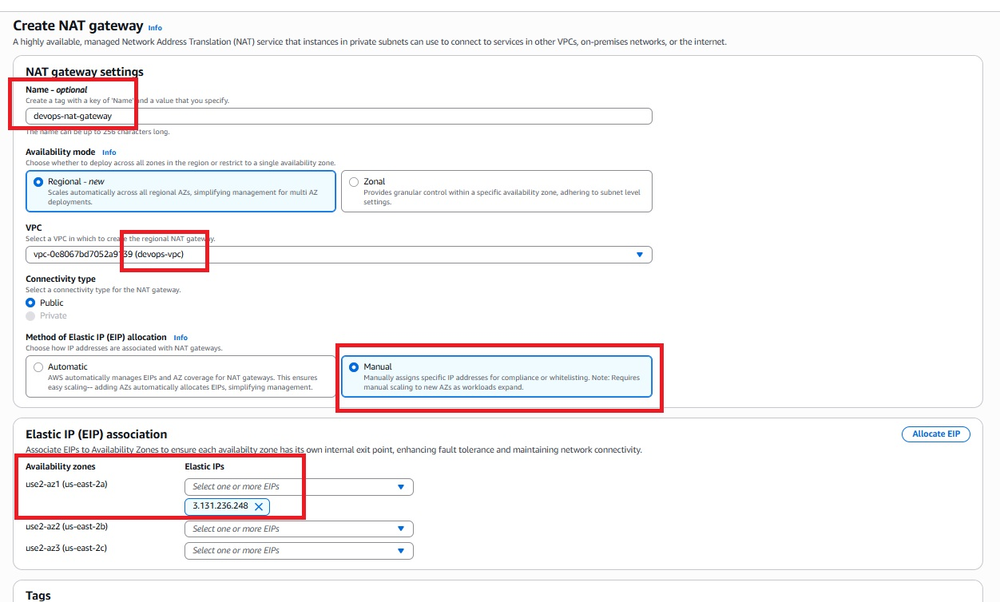

```bash
Create

Name :
devops-nat-gateway

Subnet :
public-subnet-a

Elastic IP :
nat-eip

Wait until :
Available
```
Nat Gateway :
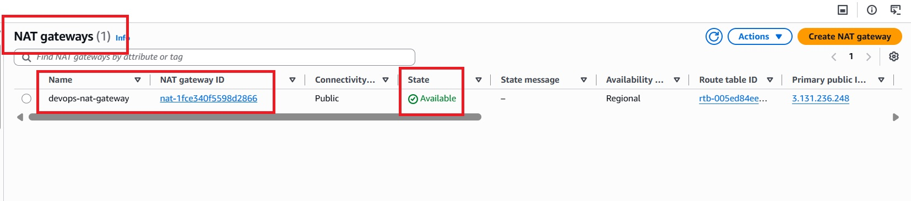

---
## Step 13 - Edit Private Route Tables

```bash
Private Route Table A

edit routes

Destination :
0.0.0.0/0

Target :
nat-a

Do same for :
private-rt-b
```
---
## Step 14 - Create Security Groups

# Web SG

```bash
Name :
Web SG

Inbound :

Type | Port	 | Source
HTTP |	80	 | Anywhere
SSH	 |  22	 | Anywhere
```
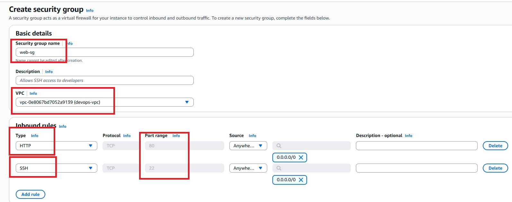

---
## Private SG

```bash
Name:
private-sg

Inbound  :

Type     |  Source
SSH	     |  Anywhere
All ICMP |	Anywhere
```
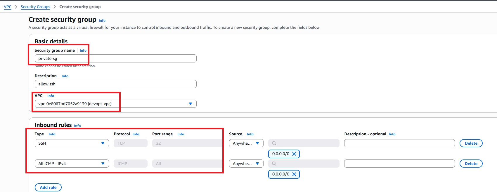

---
## Endpoint SG

```bash
Name:
endpoint-sg

Inbound :

Type	     |    Source
HTTPS 443	 |    custom 
```
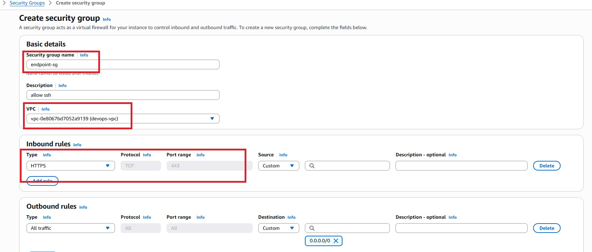

---
## Step 15 - Launch Public EC2

```bash
Ubuntu Linux 2023

Name :
web-server

Subnet :
public-subnet-a

Security Group :
web-sg

User Data :

#!/bin/bash
sudo apt update -y
sudo apt install nginx
sudo systemctl enable nginx
sudo systemctl start nginx
echo "<h1>Amazon VPC Part 2</h1>" > /var/www/html/index.html

Launch
```

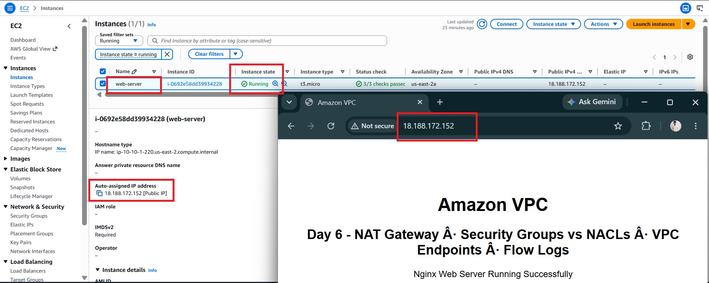

---
## Step 16 - Create IAM Role

```bash
IAM :
Roles

Create 

Trusted Entity

EC2

Attach Policy :
AmazonSSMManagedInstanceCore

Role Name :
EC2-SSM-Role
```
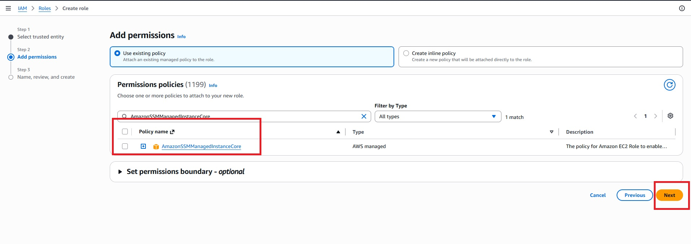


---
## Step 17 - Launch Private EC2

Purpose

- Backend Server
- No Public IP
- Managed using Session Manager


```bash
ubuntu Linux 2023

Name :
private-ec2

Subnet :
private-subnet-a

Public IP :
Disabled

Security Group :
private-sg

Launch
```

## Modify IAM Role :

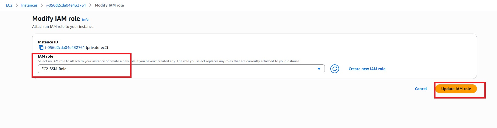

---
## Step 18 - Connect Using Session Manager

Used for secure shell access to private EC2 instances.

Benefits

- No Bastion Host
- No Public IP
- No SSH Keys
- 
```bash
EC2

Select :
private-ec2

Click

Connect :
Session Manager
```

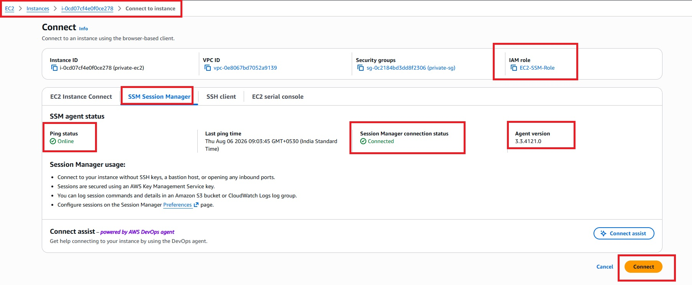

---
## Step 19 - Verify Internet

```bash
Inside Private EC2 Sessiona Manager

curl google.com

Expected :
HTML Response
```
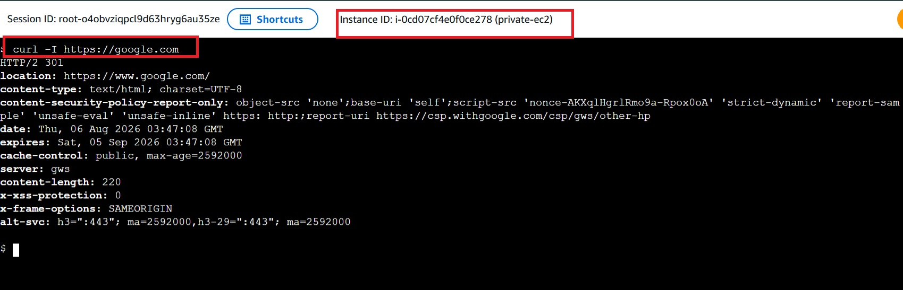

---
 ## Step 20 - Verify AWS CLI

```bash
aws sts get-caller-identity
```
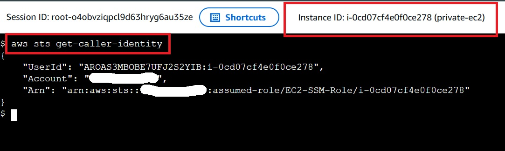

---
## Step 21 - Create Custom NACL

Custom subnet-level firewall used to demonstrate:

- HTTP Allow
- HTTP Deny
- Traffic Recovery

```bash
Create

custom-private-nacl

Associate :
private-subnet-a
```
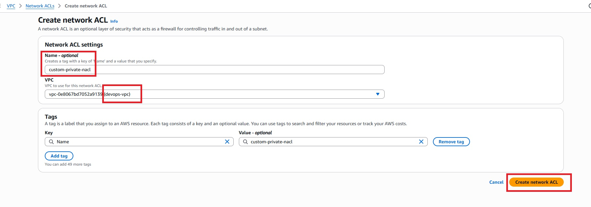

## Create inbound rule :
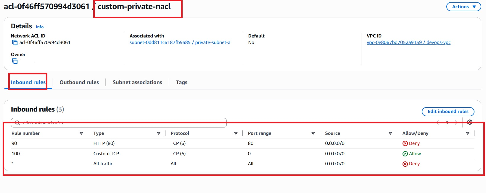

## Create outbound rule :
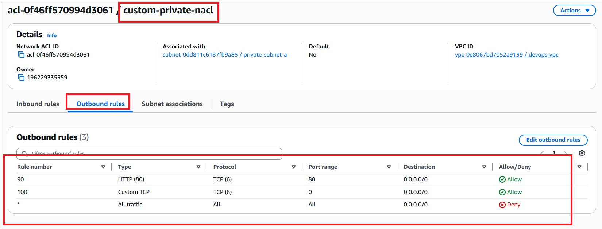

---
## Step 22 - Block HTTP

```bash
Inbound Rule

Rule : 100

TCP :
80

0.0.0.0/0

Deny

same for Outbound 
```
Verify Block  :

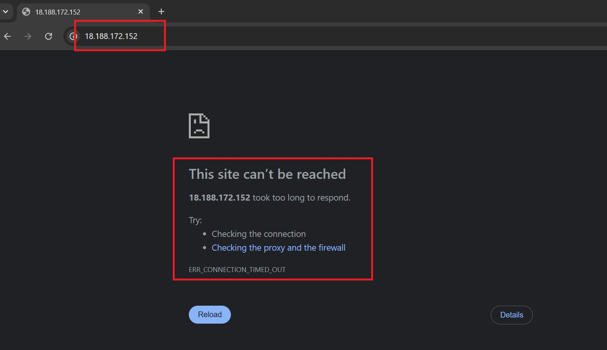

---
## Step 23 - Remove Deny Rule

Delete deny rule & test again :

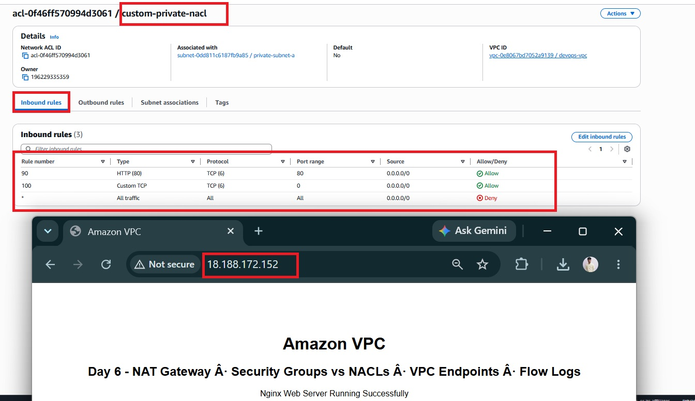

---
## Step 24 - Create S3 Gateway Endpoint

Provides private connectivity between the VPC and Amazon S3.

Benefits :

- No Internet Gateway required
- No NAT data processing charges
- Secure AWS Backbone Network

```bash
VPC :
Endpoints

Create

Service :
Amazon S3

Type :
Gateway

Select :
devops-vpc

Associate :
private-rt-a

Create
```
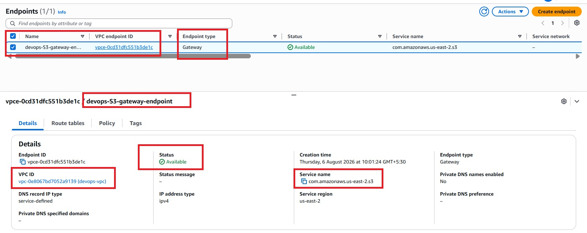

---
## Step 25 - Verify Routes :

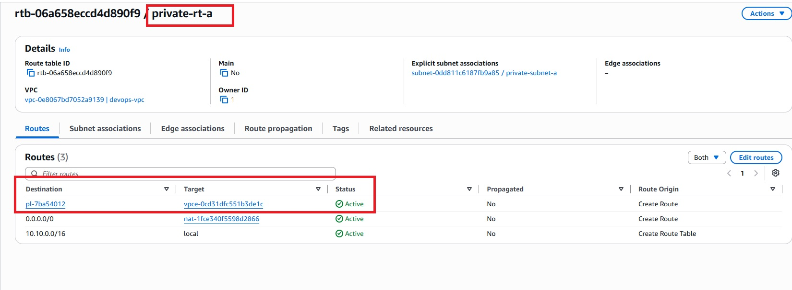

---
## Step 26 - Verify S3 Bucket :

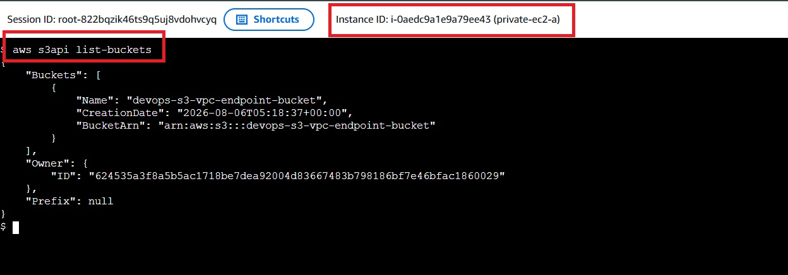

---
## Step 27 - Create EC2 Interface Endpoint

Provides private API connectivity to EC2 services.

Benefits

- Uses Private DNS
- No Internet Access Required
- Secure AWS Backbone Communication
  
```bash
Create Endpoint :

Service :
EC2

Type :
Interface

Subnets :
private-subnet-a

Security Group :
endpoint-sg

Enable :
Private DNS

Create
```
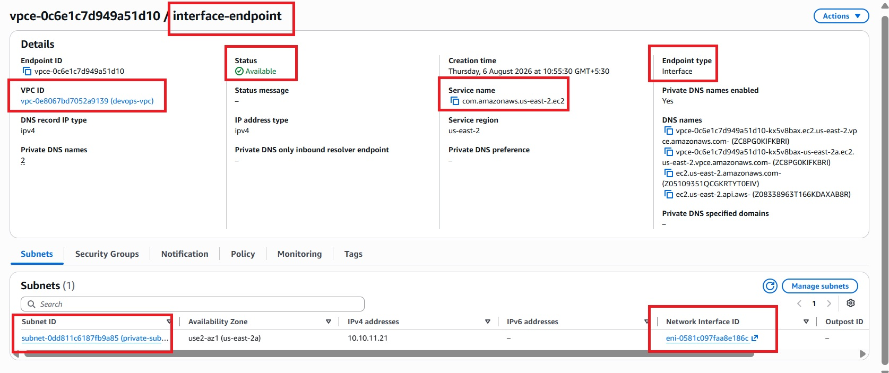

---
## Step 28 - Verify DNS

```bash
nslookup ec2.us-east-2.amazonaws.com
```
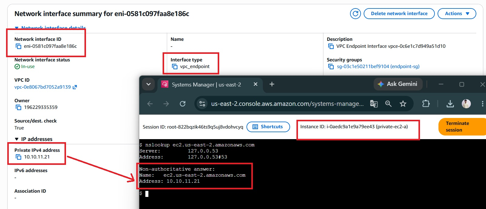

It should resolve to a private IP address.

---
## Step 29 - Enable VPC Flow Logs

Captures network traffic for auditing and troubleshooting.

```bash
Open :
VPC

Go to Your VPC :

Go to Flow Logs :

Create Flow Logs :

Destination :
CloudWatch Logs

Log Group:
vpc-flowlogs

IAM Role :
Create automatically.
```
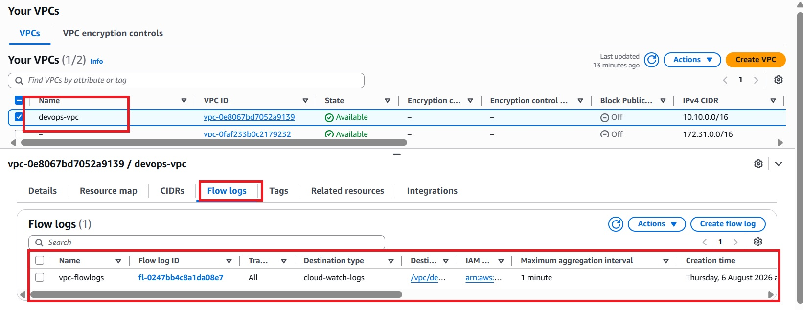

---
## Step 30 - Generate REJECT Logs

```bash
Add the temporary NACL deny rule again.

Run :
curl http://<Public-IP>

Open CloudWatch Logs and verify REJECT entries.
```
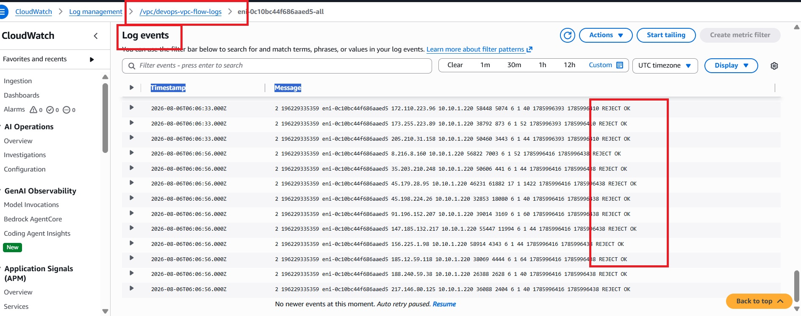

---
## Step 31 - Generate ACCEPT Logs

```bash
Remove the deny rule.

Run :
curl http://<Public-IP>

Verify ACCEPT entries in CloudWatch Logs.
```
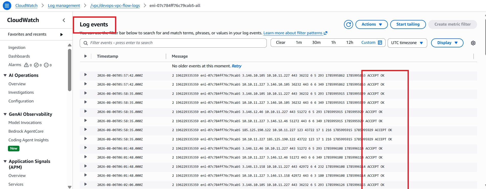

---
## Step -32 VPC Flow Resource Map :

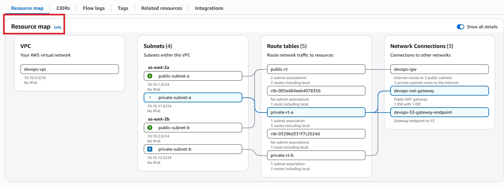

---
##💡 Key Learnings

- Designing a highly available VPC architecture
- Public vs Private subnet routing
- NAT Gateway implementation
- Security Groups vs Network ACLs
- Secure private connectivity using VPC Endpoints
- Managing EC2 without SSH using Session Manager
- Monitoring network traffic with VPC Flow Logs
- Reducing NAT Gateway costs using S3 Gateway Endpoints

---
# 📌 AWS Services Used

- Amazon VPC
- Amazon EC2
- Internet Gateway
- NAT Gateway
- Elastic IP
- Route Tables
- Security Groups
- Network ACL
- Amazon S3 Gateway Endpoint
- Amazon EC2 Interface Endpoint
- AWS Systems Manager
- IAM Role
- CloudWatch Logs
- VPC Flow Logs
  
---

##🧹 Cleanup

Delete resources in the following order:

1. Terminate EC2 Instances
2. Delete Interface Endpoint
3. Delete NAT Gateway
4. Release Elastic IP
5. Delete S3 Gateway Endpoint
6. Delete VPC Flow Logs
7. Delete CloudWatch Log Group
8. Restore Original NACL Association
9. Delete Custom NACL
10. Delete Security Groups
11. Delete Route Tables
12. Delete Internet Gateway
13. Delete Subnets
14. Delete VPC

---
## 👨‍💻 Author

**Hardik Darji**

DevOps Engineer 
---

# ⭐ Outcome

Successfully designed and deployed a secure, production-inspired AWS VPC architecture with private networking, outbound internet access via NAT Gateway, VPC Endpoints for secure AWS service connectivity, Session Manager for management access, and VPC Flow Logs for monitoring and troubleshooting.
