# 🌐 AWS Transit Gateway - Centralized Multi-VPC Connectivity

> A hands-on AWS networking project demonstrating how to use **AWS Transit Gateway (TGW)** to centrally connect multiple Amazon VPCs using a scalable **Hub-and-Spoke Architecture**.

---

## 📌 Project Overview

This project demonstrates how to build a centralized AWS network using **AWS Transit Gateway**. Instead of creating multiple VPC Peering connections, all VPCs are attached to a single Transit Gateway, allowing secure and scalable communication between VPCs.

The lab includes three VPCs:

- 🟢 Production VPC
- 🔵 Development VPC
- 🟠 Test VPC

Each VPC contains:

- Public Subnet
- Route Table
- Internet Gateway
- Public EC2 Instance

All VPCs are connected through a single AWS Transit Gateway.

---

# 🏗️ Architecture

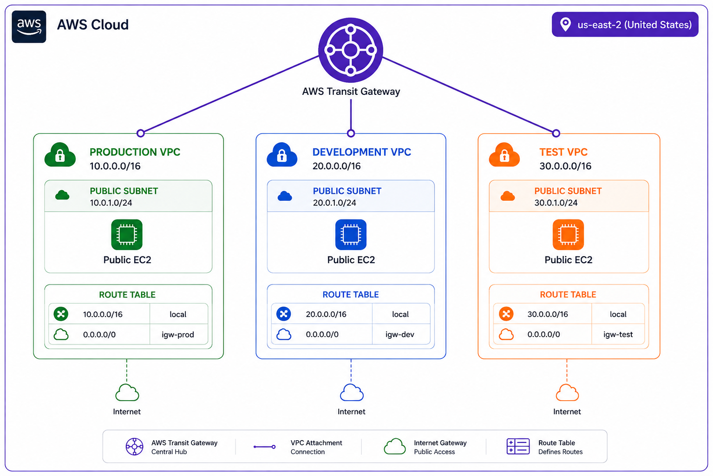


---

# 🎯 Objectives

- Understand AWS Transit Gateway
- Build a Hub-and-Spoke Network Architecture
- Connect multiple VPCs using Transit Gateway
- Configure VPC Attachments
- Configure Transit Gateway Route Tables
- Update VPC Route Tables
- Verify inter-VPC communication
- Test private connectivity between EC2 instances


---

# 🏢 Architecture Components

## Production VPC

| Property | Value |
|----------|-------|
| CIDR | 10.0.0.0/16 |
| Public Subnet | 10.0.1.0/24 |
| EC2 | production-ec2 |

---

## Development VPC

| Property | Value |
|----------|-------|
| CIDR | 20.0.0.0/16 |
| Public Subnet | 20.0.1.0/24 |
| EC2 | development-ec2 |

---

## Test VPC

| Property | Value |
|----------|-------|
| CIDR | 30.0.0.0/16 |
| Public Subnet | 30.0.1.0/24 |
| EC2 | test-ec2 |


---

# 🛠️ Implementation Steps

## Step 1 - Create Production VPC :

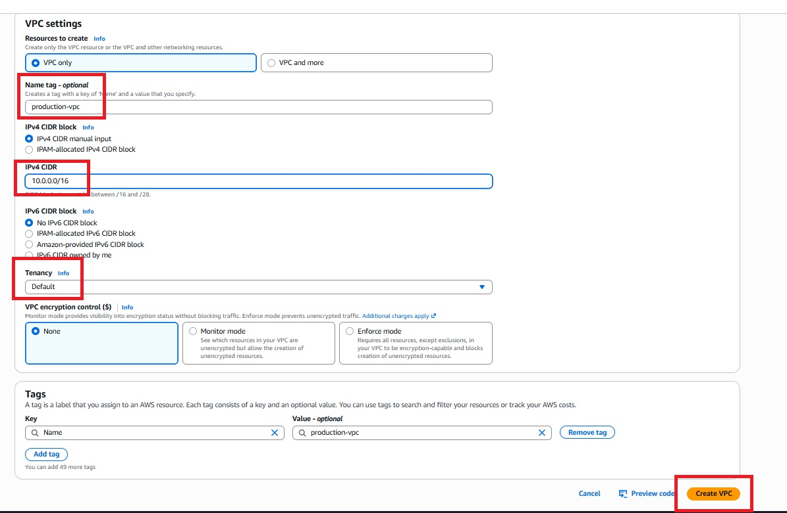

Create Internet Gateway & attach to VPC  :

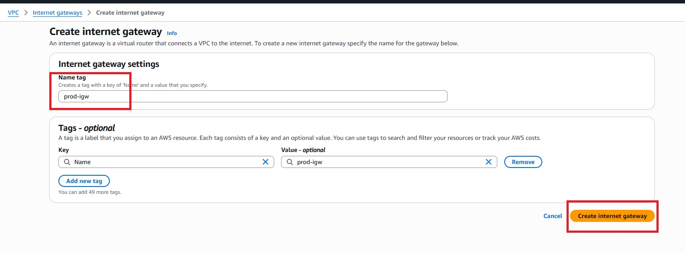

Create Public Subnet :

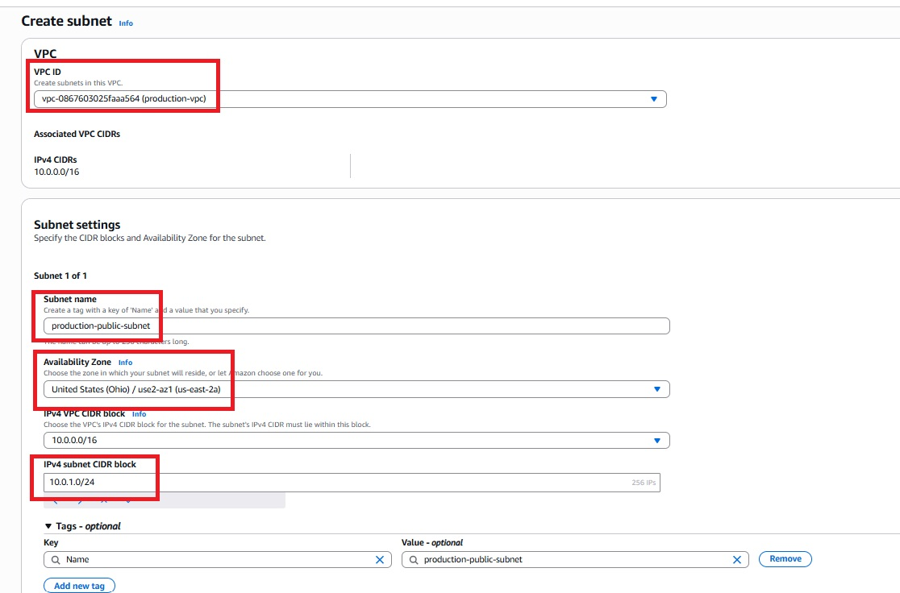

Create Route Table :

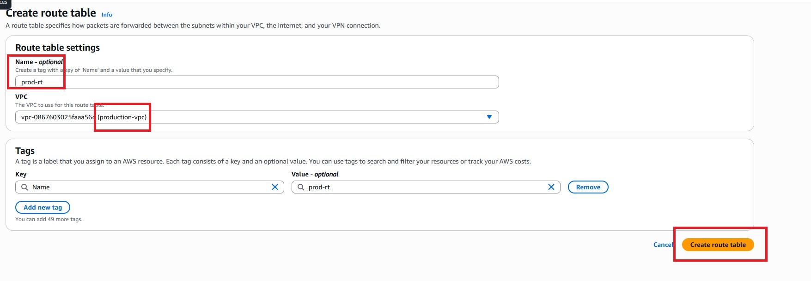

Edit route table :

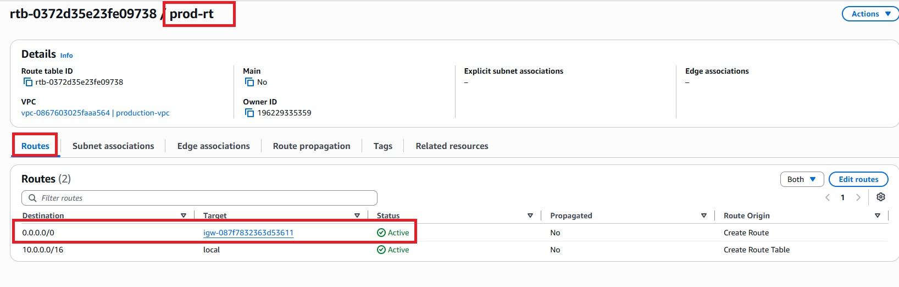

Associate route table with subnet :

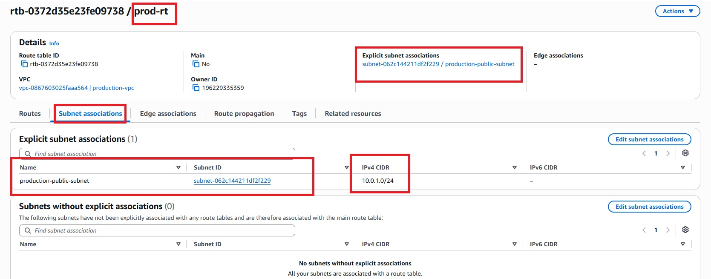

Create Public EC2

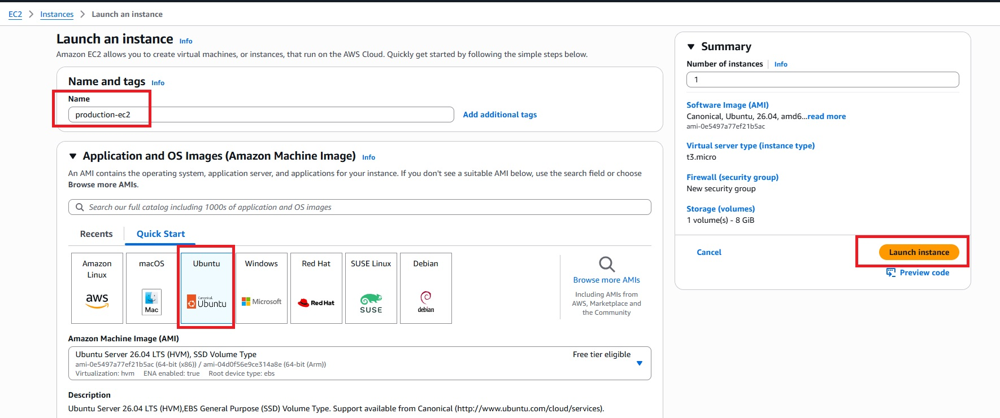

Security Group for EC2 :

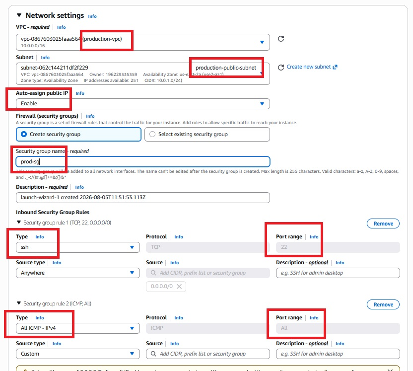


---

## Step 2 - Create Development VPC

- Create Internet Gateway & attach to VPC
- Create Public Subnet for dev 
- Create  Route Table  , Edit route and associate subnet 
- Create Public EC2

---

## Step 3 - Create Test VPC

- Create Internet Gateway & attach to VPC
- Create Public Subnet for test
- Create  Route Table , Edit route and associate subnet 
- Create Public EC2

---

## Step 4 - Create AWS Transit Gateway

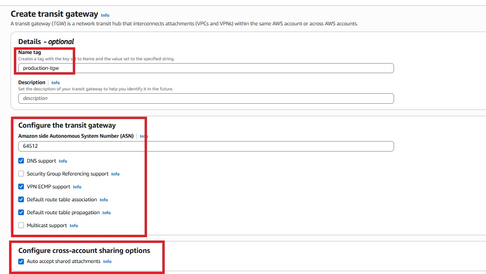

Configure

- Amazon Side ASN
- Default Association
- Default Propagation
- DNS Support

Crated Transit Gateway :
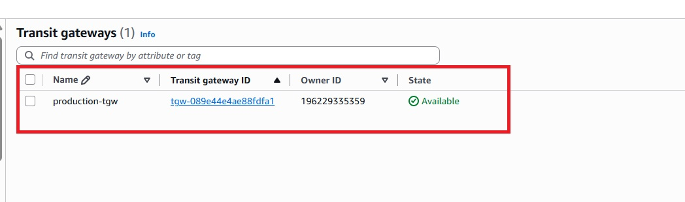

---

## Step 5 - Create Transit Gateway Attachments

Attach :

Crate Production TGW :

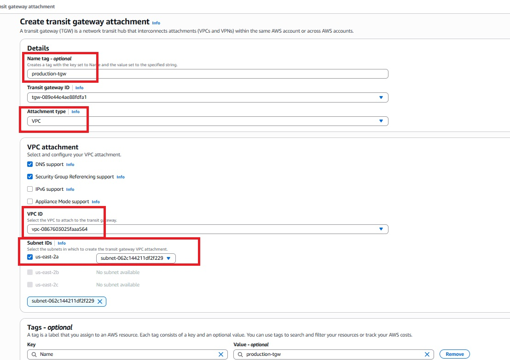

Create Development TGW :

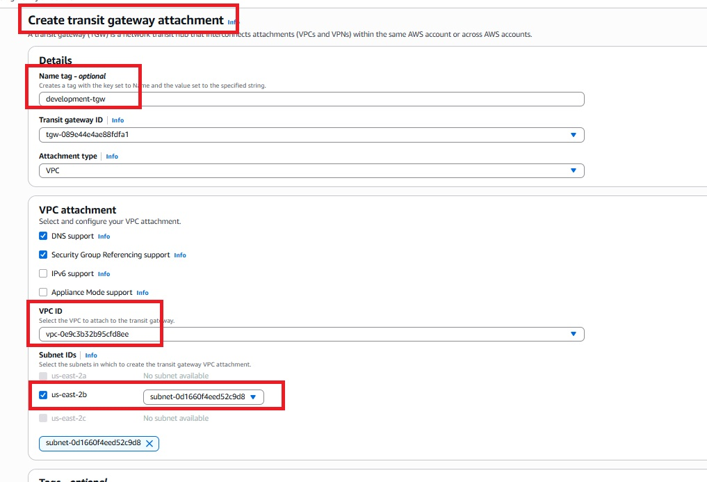

Create Test TGW :

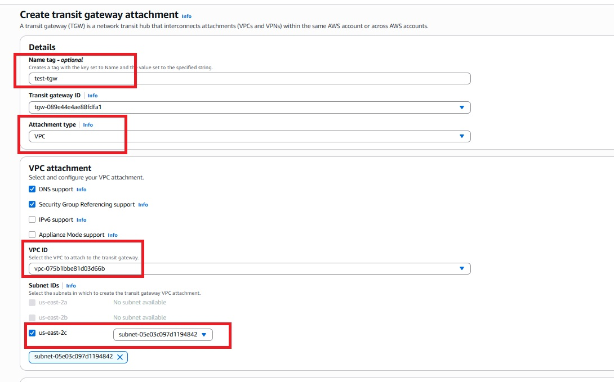


## Created Transit Gateway Attachments :

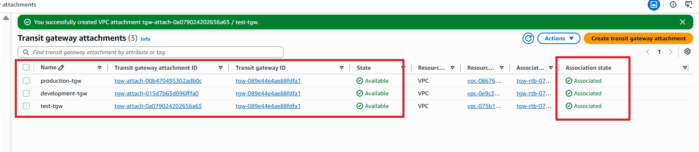

---

## Step 6 - Update Route Tables

## Production Route Table

| Destination | Target |
|------------|--------|
|10.0.0.0/16|Local|
|20.0.0.0/16|Transit Gateway|
|30.0.0.0/16|Transit Gateway|
|0.0.0.0/0|Internet Gateway|


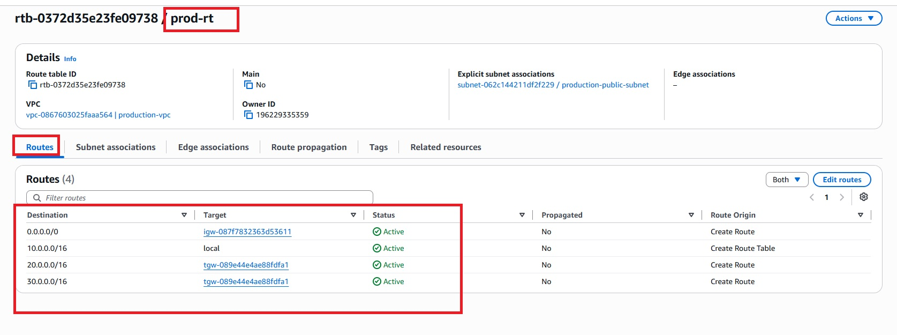

---

## Development Route Table

| Destination | Target |
|------------|--------|
|20.0.0.0/16|Local|
|10.0.0.0/16|Transit Gateway|
|30.0.0.0/16|Transit Gateway|
|0.0.0.0/0|Internet Gateway|


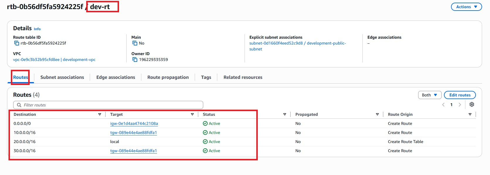

---

## Test Route Table

| Destination | Target |
|------------|--------|
|30.0.0.0/16|Local|
|10.0.0.0/16|Transit Gateway|
|20.0.0.0/16|Transit Gateway|
|0.0.0.0/0|Internet Gateway|


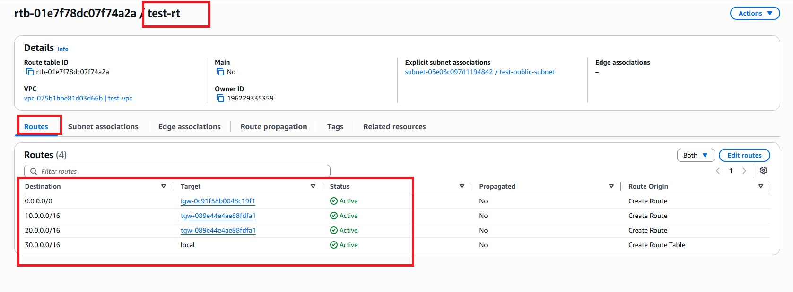

---
## Private IP :

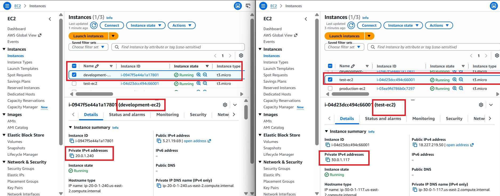

---
## Step 7 : Test Connectivity

## From Production EC2 :

```bash
ping <Development Private IP>
ping <Test Private IP>
```
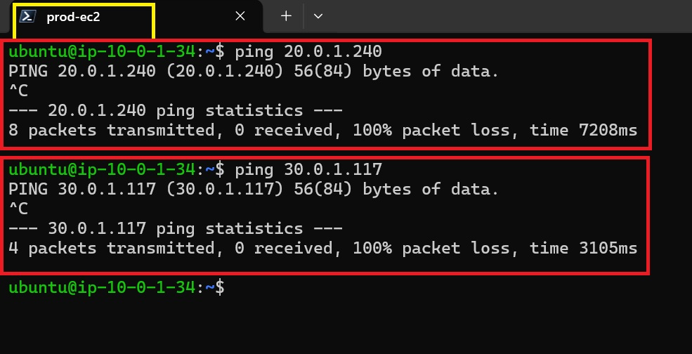

Expected Result:

```
64 bytes from ...
```

Successful replies confirm Transit Gateway routing is functioning correctly.


## From Development EC2 :

```bash
ping <Production Private IP>
ping <Test Private IP>
```
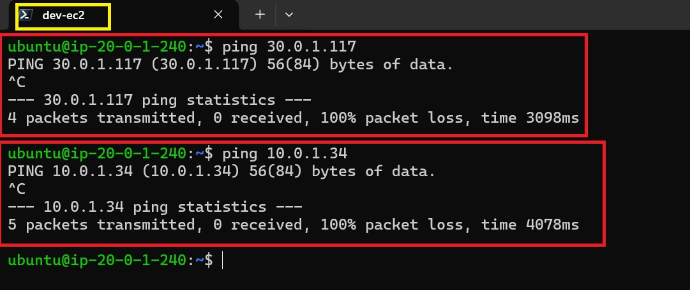

Expected Result:

```
64 bytes from ...
```

Successful replies confirm Transit Gateway routing is functioning correctly.


## From Test EC2 :

```bash
ping <Production Private IP>
ping <Development Private IP>
```
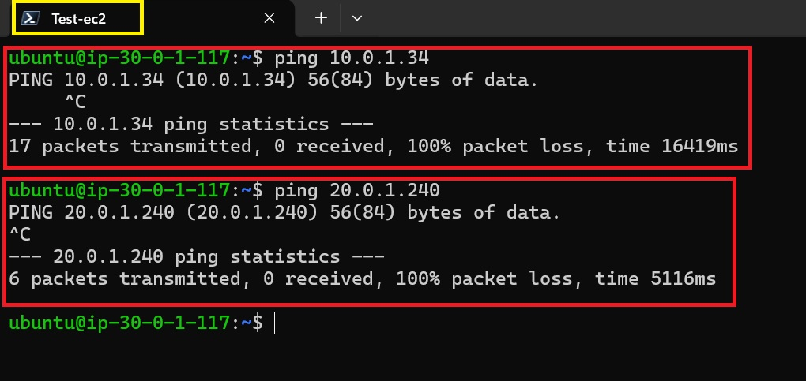

Expected Result:

```
64 bytes from ...
```

Successful replies confirm Transit Gateway routing is functioning correctly.


---

# 🔀 Traffic Flow

```
Production EC2
      │
      ▼
Production Route Table
      │
      ▼
AWS Transit Gateway
      │
      ▼
Development Route Table
      │
      ▼
Development EC2
```

The same routing path applies for communication with the Test VPC.

---

# 🔒 Security Configuration

Security Groups allow:

- SSH (22) from your public IP
- ICMP (Ping) for connectivity testing
- Intra-VPC communication through Transit Gateway

---

# 📖 Key Learning Outcomes

- Understood Hub-and-Spoke networking architecture.
- Learned how AWS Transit Gateway simplifies multi-VPC connectivity.
- Configured VPC Attachments and Transit Gateway Route Tables.
- Updated VPC Route Tables for centralized routing.
- Validated secure inter-VPC communication using private IP addresses.
- Compared Transit Gateway with traditional VPC Peering.

---

# 🚀 Benefits of AWS Transit Gateway

- Centralized network management
- Scalable multi-VPC connectivity
- Reduced routing complexity
- Simplified architecture
- Supports hybrid cloud connectivity
- Enables cross-account networking with AWS Organizations
- High availability and fault tolerance

---

# 🧹 Cleanup

Delete resources in the following order:

1. Terminate EC2 Instances
2. Delete Transit Gateway Attachments
3. Delete Transit Gateway
4. Delete Route Tables
5. Delete Internet Gateways
6. Delete Subnets
7. Delete VPCs

---

# 👨‍💻 Author

**Hardik Darji**

AWS | DevOps Engineer

---

⭐ If you found this project helpful, consider giving the repository a **Star**!
