## Day 7: Secure NGINX Golden Image Pipeline – Build, Test & Automate on AWS

---

📌 Project Overview

This project demonstrates two approaches for creating a secure and repeatable NGINX Golden AMI on AWS:

- Manual Golden AMI Creation
- Automated Golden AMI Creation using Amazon EC2 Image Builder

The manual implementation establishes the baseline configuration and security controls. The same baseline is then automated using EC2 Image Builder to provide repeatable image creation, testing, versioning, and distribution.

The project is implemented in the AWS US East (Ohio) – us-east-2 Region.

---

## 🎯 Objectives

By completing this project, the following objectives are achieved:

- Build an Amazon Linux 2023 EC2 instance as an NGINX builder.
- Install and configure NGINX.
- Enforce IMDSv2.
- Enable secure administration through AWS Systems Manager Session Manager.
- Avoid inbound SSH access.
- Create a reusable Golden AMI.
-Launch a test EC2 instance from the Golden AMI.
- Validate NGINX without using User Data on the test instance.
- Automate AMI creation using EC2 Image Builder.
- Create reusable Image Builder components.
- Implement automated image testing.
- Configure Image Builder infrastructure.
- Configure AMI distribution.
- Generate a versioned Golden AMI.
- Validate the generated AMI independently.
- Clean up AWS resources after the lab.

---
## 🏗️ Architecture

Manual Golden AMI Architecture
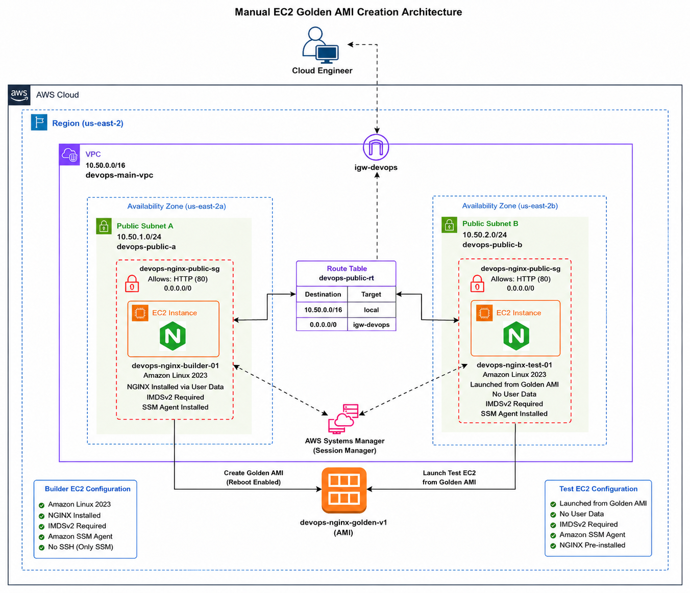

---
## Part 1 — Manual Golden AMI Creation

The manual workflow was completed using an Ubuntu-based NGINX EC2 instance as the image source. The instance was securely managed through AWS Systems Manager Session Manager with IMDSv2 enforced.

## Step 1 — Create VPC

Create:
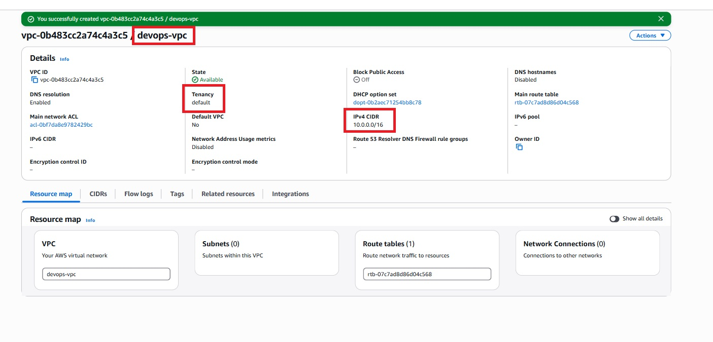

---
## Step 2 — Create Internet Gateway & Attach to VPC

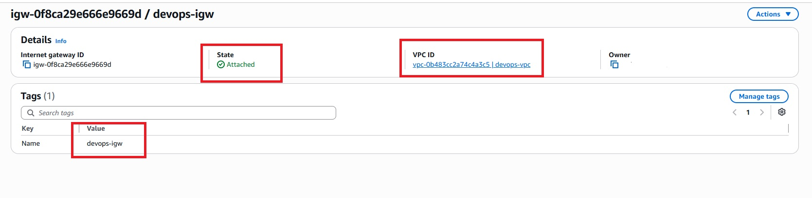

---
## Step 3 — Create Public Subnets A & B

Public Subnet A :
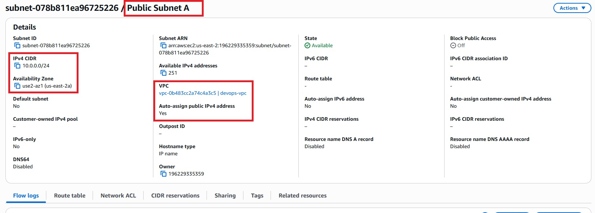

Public Subnet B :
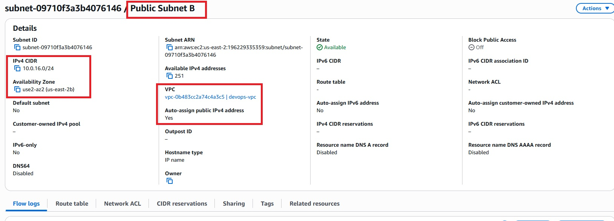

---
## Step 4 — Create Public Route Table

Navigate to:

VPC
→ Route Tables
→ Create route table

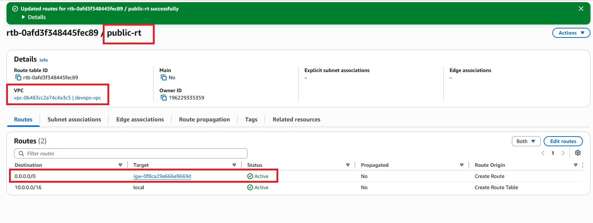

Associate Route Table
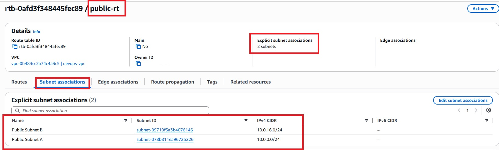

---
## Step 5 — Create Security Group

Navigate to:

EC2
→ Security Groups
→ Create security group

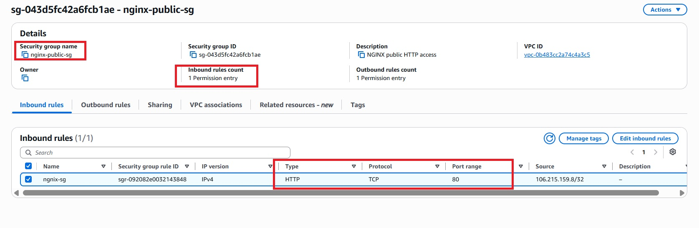

---
## Step 6 — Create EC2 IAM Role

Navigate to:

IAM
→ Roles
→ Create role

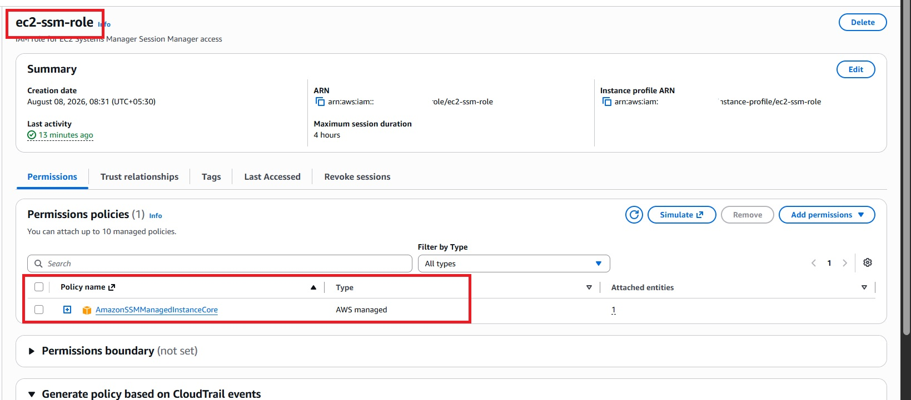

---
## Step 7 — Launch Builder EC2 - Use Security Group and IAM Role 

Navigate to:

EC2
→ Instances
→ Launch instance

Under:

Advanced details
→ User data

Add:
```bash

#!/bin/bash

sudo apt update -y

sudo apt install -y nginx curl

sudo systemctl enable nginx
sudo systemctl start nginx

echo "<h1>NGINX Golden AMI - devops-nginx-builder-01</h1>" \
> /var/www/html/index.html
```
Launch the instance.

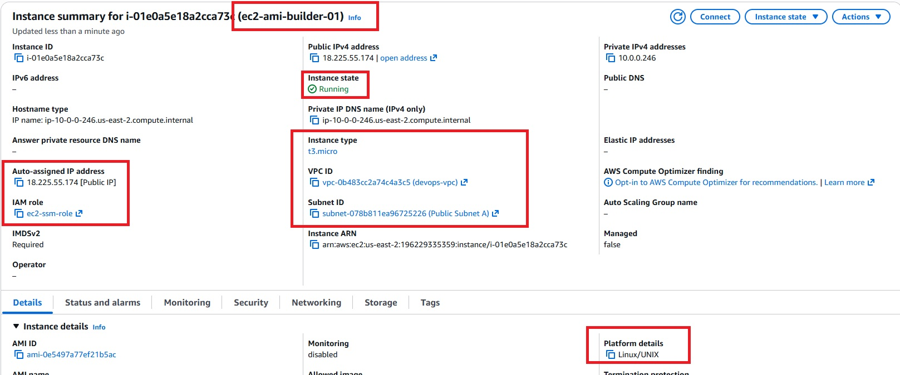

---
## Step 8 - Verify Builder EC2 

Wait until:

```bash
Instance state:
Running

Status checks:
3/3 checks passed
```

Verify through public IP address :
> hhtp://18.225.55.174

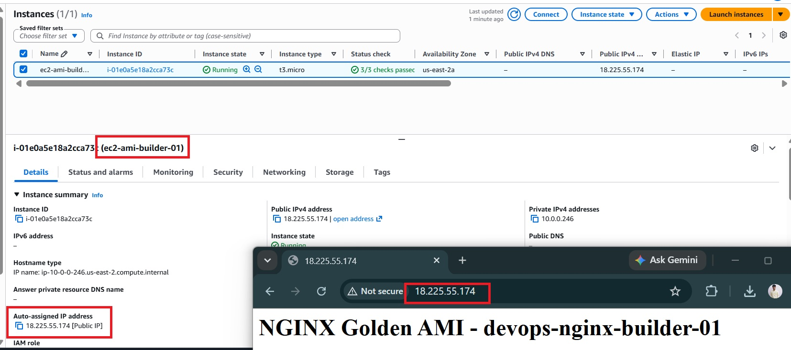

---
## Step 9 — Connect Using Session Manager

Navigate to:

EC2
→ Instances
→ ec2-ami-builder-01
→ Connect
→ Session Manager
→ Connect

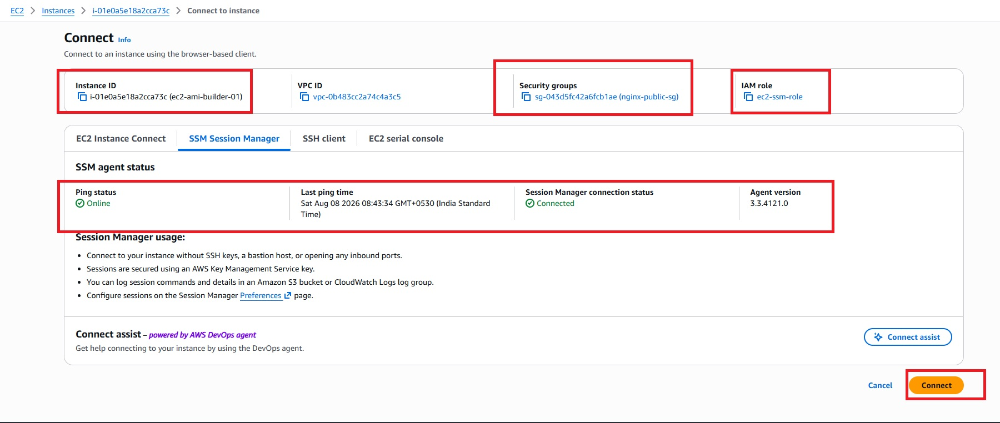

> You should receive a terminal without using SSH.

## Verify NGINX

Run:
```bash
systemctl status nginx

Expected:
Active: active (running)
```

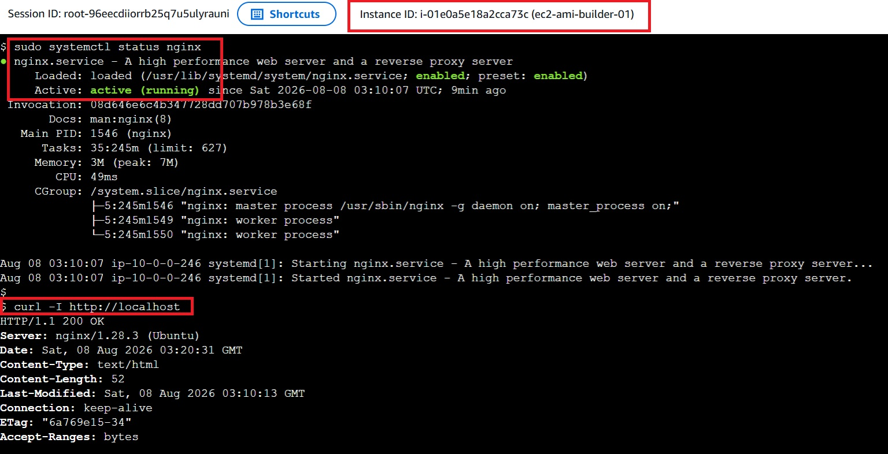

## Validate IMDSv2

Run:
```bash
curl -sS -o /dev/null \
-w 'IMDSv1 HTTP status: %{http_code}\n' \
--max-time 3 \
http://169.254.169.254/latest/meta-data/instance-id

Expected:

IMDSv1 HTTP status: 401
```

## Generate IMDSv2 Token

Run:
```bash
TOKEN=$(curl -sS -X PUT \
-H "X-aws-ec2-metadata-token-ttl-seconds: 21600" \
http://169.254.169.254/latest/api/token)
```
## Retrieve Instance ID

Run:
```bash
curl -sS \
-H "X-aws-ec2-metadata-token: $TOKEN" \
http://169.254.169.254/latest/meta-data/instance-id

Expected:
i-xxxxxxxxxxxxxxxxx
```

## Retrieve Availability Zone
Run :
```bash
curl -sS \
-H "X-aws-ec2-metadata-token: $TOKEN" \
http://169.254.169.254/latest/meta-data/placement/availability-zone

Expected:
us-east-2a
```

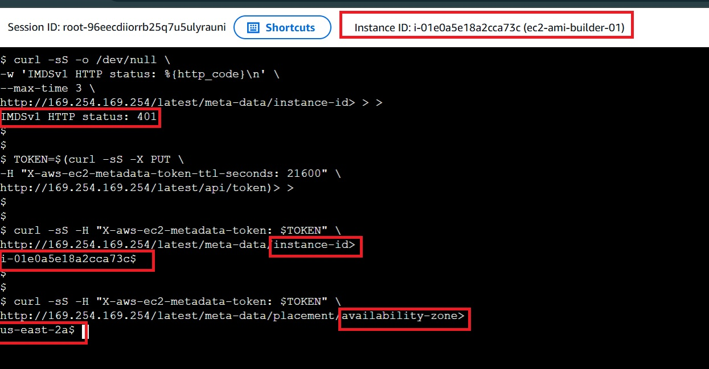

---

## Step 10 — Create Manual Golden AMI

Navigate to:

EC2
→ Instances
→ ec2-ami-builder-01

Select:

Actions
→ Image and templates
→ Create image

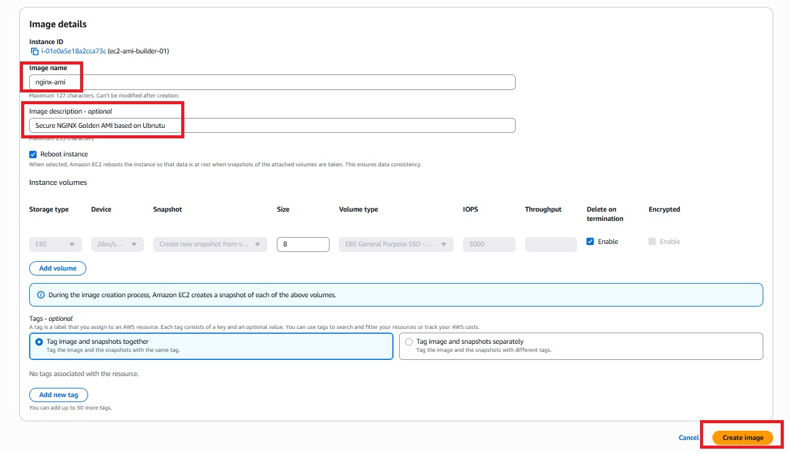

##  Verify Golden AMI

Navigate to:

EC2
→ AMIs

Find:
```bash
nginx-ami

Wait until:

Status:
Available
```

Created AMI :
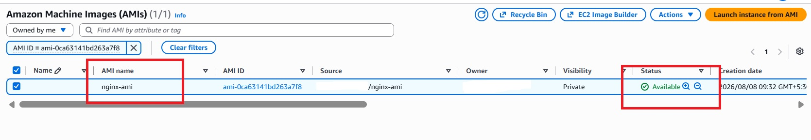

---
## Step 11 — Launch Test EC2

Select:
nginx-ami

Choose:
Launch instance from AMI

```bash
Name:
ec2-ami-test

Configure:
VPC:
devops--vpc

Subnet:
public-subnet-A

Security Group:
nginx-public-sg

IAM Role:
ec2-ssm-role

Metadata:
IMDSv2 only
```
launch instance 

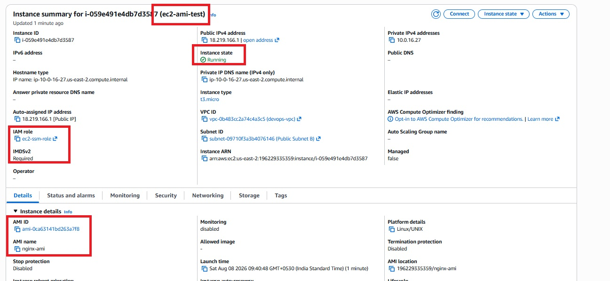

---
## Step 12 — Validate Test EC2 

Connect using:
Session Manager

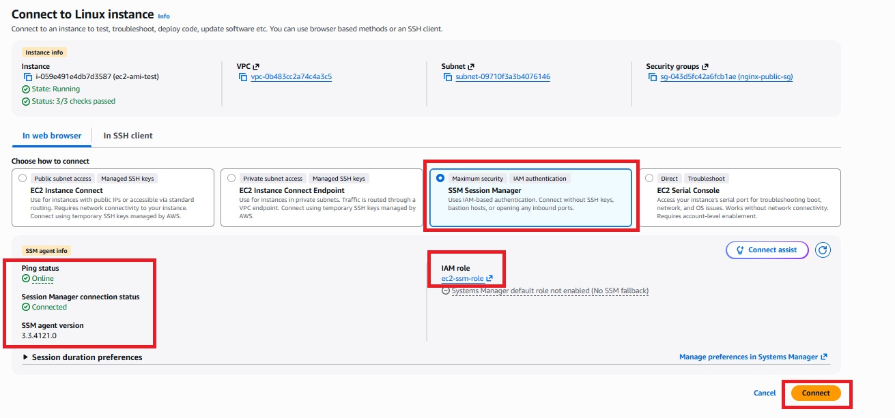

Check NGINX:
```bash
sudo systemctl status nginx

Test application:
curl -I http://localhost
```

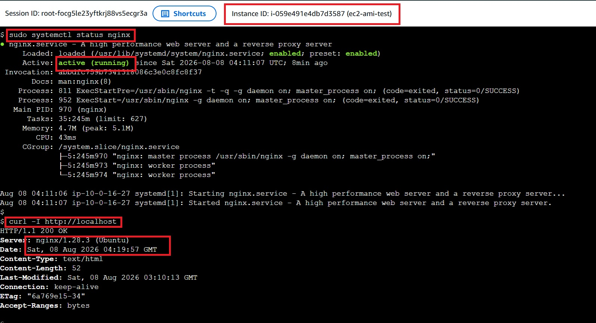

---
## Part 2 — EC2 Image Builder Automation

The second phase was implemented using Amazon EC2 Image Builder to automate the complete NGINX image lifecycle, from software installation through image validation and AMI publication.

Resources created:

- Image Builder IAM Role -> devops-imagebuilder-role
- Build Component ->  devops-nginx-build-component
- Test Component -> devops-nginx-test-component
- Image Recipe -> devops-nginx-golden-recipe
- Infrastructure Configuration -> devops-imagebuilder-infra
- Distribution Configuration -> devops-nginx-golden-distribution
- Image Pipeline -> devops-nginx-golden-pipeline

Validation: Successfully created the Ubuntu-based EC2 Image Builder components and configuration, executed the automated image pipeline, completed the build and test phases, generated a versioned NGINX Golden AMI, and validated the generated AMI by launching a test EC2 instance without User Data. NGINX, its configuration, and the required image baseline were successfully verified on the test instance.

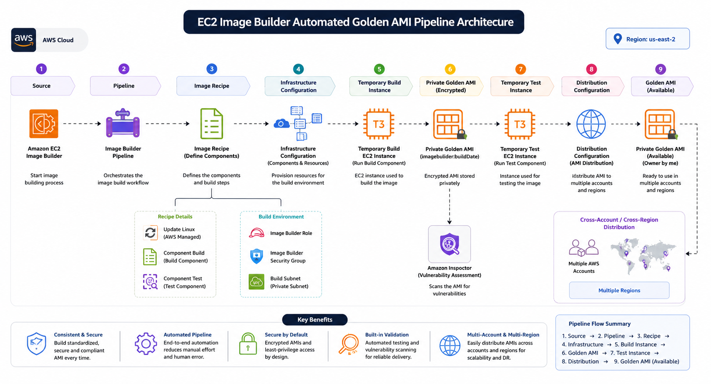

## Step 13 — Create Image Builder IAM Role

Navigate to:

IAM
→ Roles
→ Create role

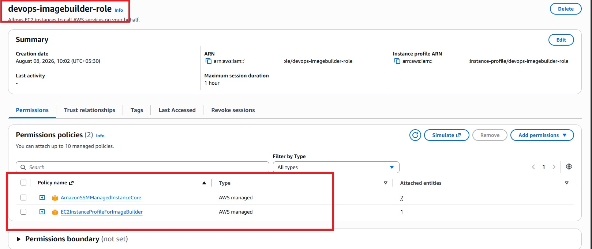

---
## Step 14 — Create Build Component

Navigate to:

EC2 Image Builder
→ Components
→ Create component

Build Component Document :

```bash
name: DevOpsNginxBuild
description: Install and configure nginx on Ubuntu.
schemaVersion: 1.0

phases:

  - name: build
    steps:

      - name: InstallAndConfigureNginx
        action: ExecuteBash
        inputs:
          commands:
            - apt-get update -y
            - apt-get install -y nginx
            - systemctl enable --now nginx
            - |
              cat > /usr/share/nginx/html/index.html <<'HTML'
              <!DOCTYPE html>
              <html>
              <head>
                  <title>Ubuntu Golden AMI</title>
              </head>
              <body>
                  <h1>Ubuntu Golden AMI</h1>
                  <h2>Ubuntu EC2 Image Builder Golden AMI</h2>
                  <p>nginx was installed by a versioned Image Builder component.</p>
              </body>
              </html>
              HTML

  - name: validate
    steps:

      - name: ValidateNginxBuild
        action: ExecuteBash
        inputs:
          commands:
            - systemctl is-enabled nginx
            - systemctl is-active nginx
            - test -f /usr/share/nginx/html/index.html
            - grep -q "Ubuntu EC2 Image Builder" /usr/share/nginx/html/index.html
```

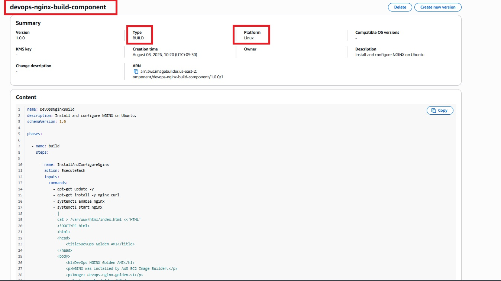

---
## Step 15 — Create Test Component

Navigate to:

EC2 Image Builder
→ Components
→ Create component

Test Component Document :

```bash
name: DevOpsNginxTest
description: Verify NGINX on the Image Builder test instance running Ubuntu.
schemaVersion: 1.0

phases:

  - name: test
    steps:

      - name: TestNginxImage
        action: ExecuteBash
        inputs:
          commands:
            - systemctl is-enabled nginx
            - systemctl start nginx
            - systemctl is-active nginx
            - nginx -t
            - test -f /var/www/html/index.html
            - curl -fsS http://localhost | grep -q "DevOps NGINX Golden AMI"
```

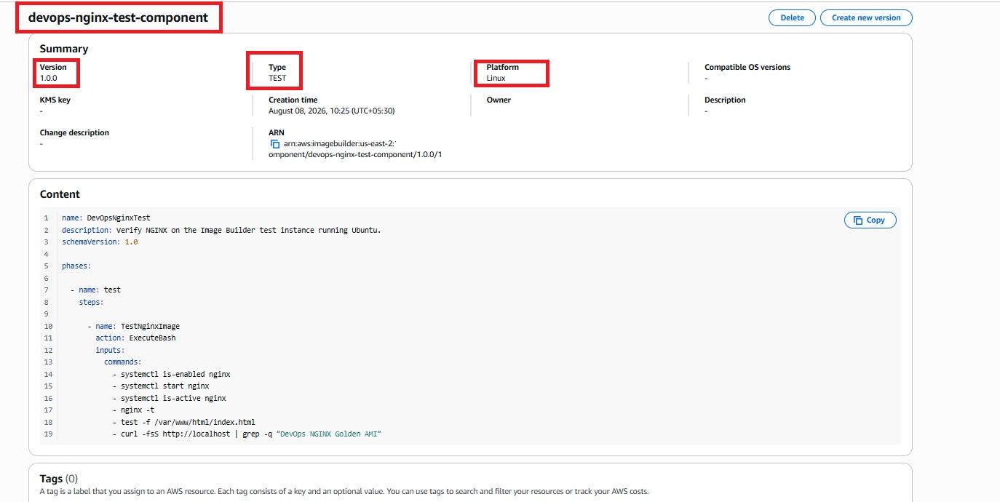

---
## Step 16 — Create Image Recipe

Navigate to:

EC2 Image Builder
→ Image recipes
→ Create image recipe

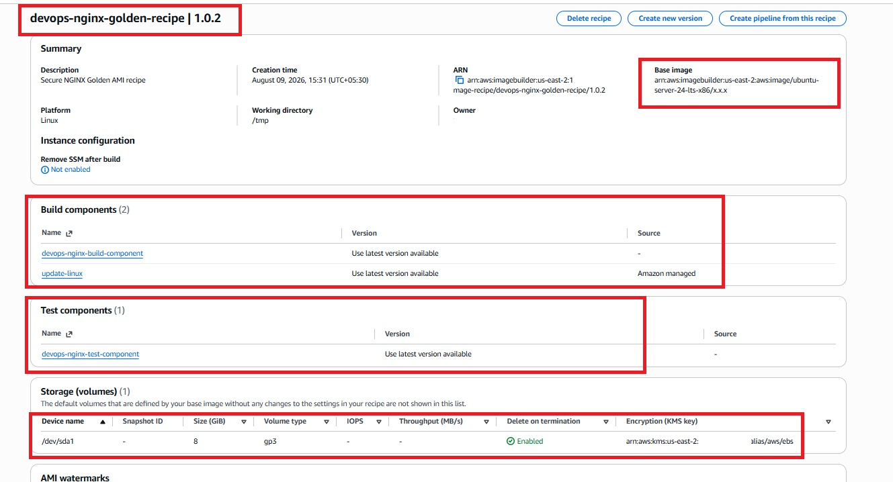

---
## Step 17 — Create Infrastructure Configuration

Navigate to:

EC2 Image Builder
→ Infrastructure configurations
→ Create

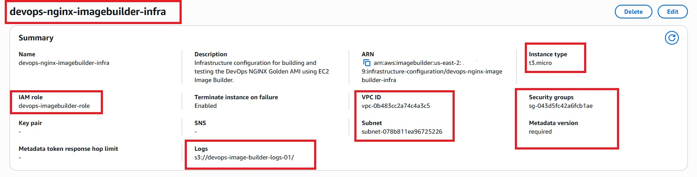

---
## Step 18 — Create Distribution Configuration

Navigate to:

EC2 Image Builder
→ Distribution settings
→ Create

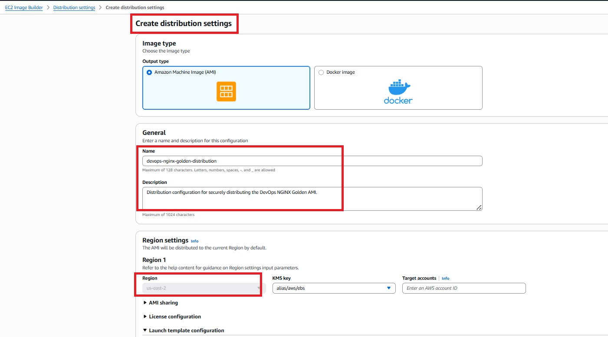

> The distribution configuration determines where the generated AMI is published.

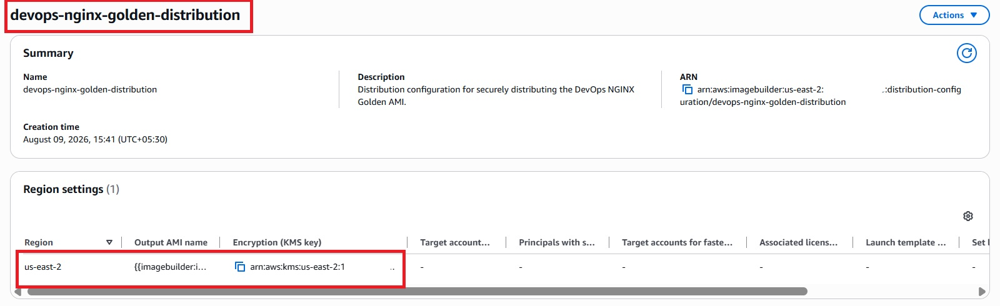

---
## Step 19 — Create Image Pipeline

Navigate to:

EC2 Image Builder
→ Image pipelines
→ Create image pipeline

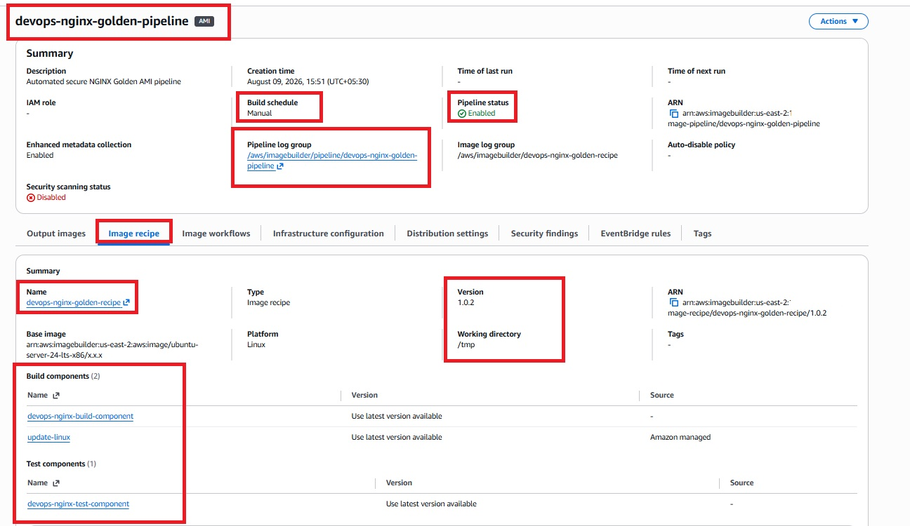

---
## Step 20 — Run Image Pipeline

Navigate to:

EC2 Image Builder
→ Image pipelines
→ devops-nginx-golden-pipeline

Choose:

Actions
→ Run pipeline

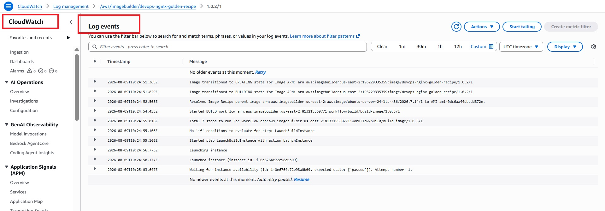

---
## Step 21 — Image Builder Workflow

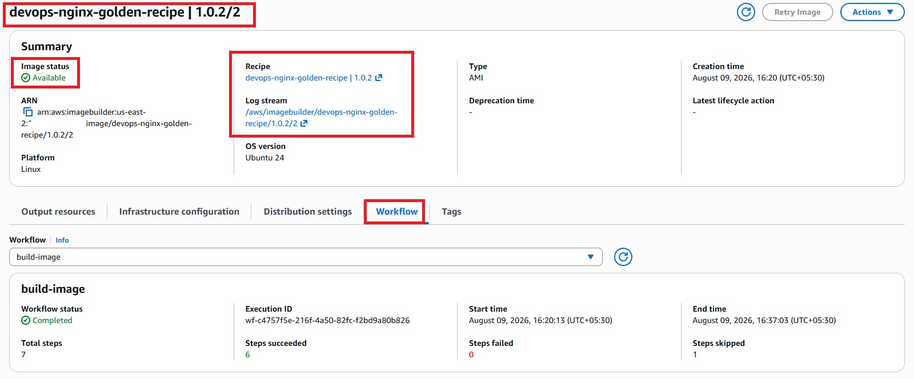

---
## Step 22 — Verify Build Completion

After successful completion, verify:

```bash
Pipeline:
devops-nginx-golden-pipeline

Status:
Succeeded

```

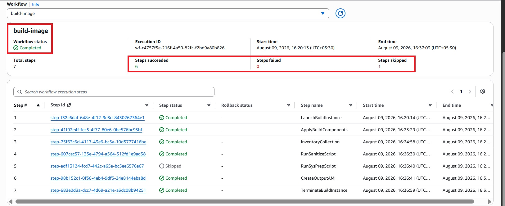


Then navigate to:

EC2 image receipe :
→ output resources
→ AMIs

Verify that a new Golden AMI has been created.

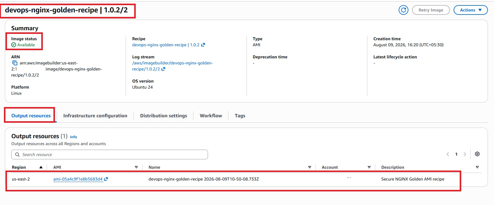


Terminate instance through pipeline :

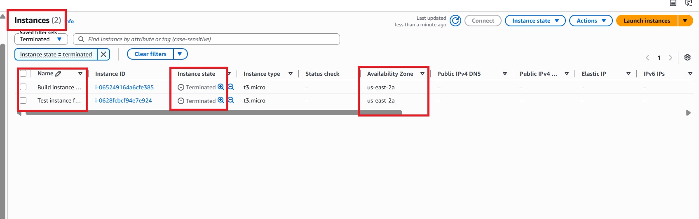

---
## Step 23 — Launch EC2 From Image Builder AMI

Select the generated AMI.

Choose:
Launch instance from AMI

```bash
Name:
devops-nginx-imagebuilder-test-01

Configure:

VPC:
devops-vpc

Subnet:
public-subnet-a

Security Group:
nginx-public-sg

IAM Role:
ec2-ssm-role

Metadata:
IMDSv2 only

Do not add User Data.
```

---
## Step 24 — Validate Image Builder AMI

Connect through:
→ Session Manager


```bash
Run:
sudo systemctl status nginx
curl -I http://localhost
```
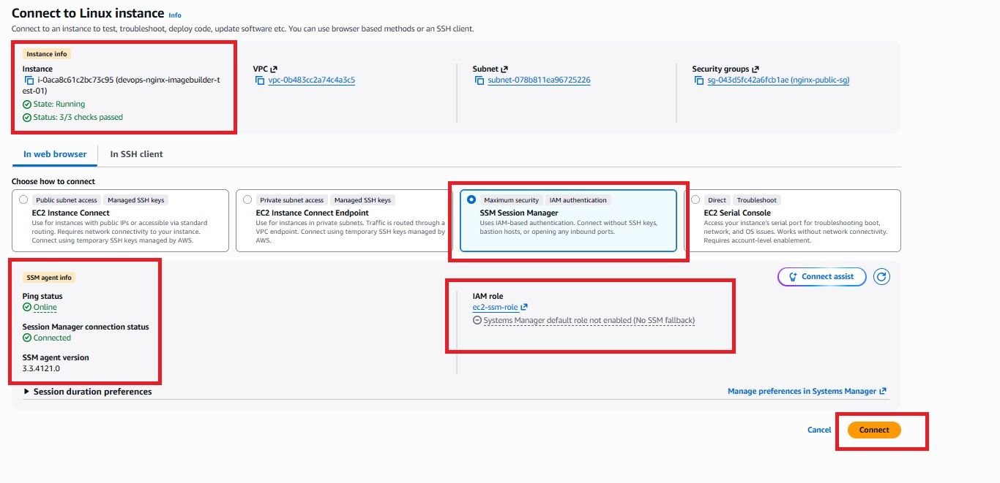

---
## 🌐 Step 25 – Browser Validation

Copy the Test EC2 public IPv4 address.

Open:
http://<TEST_EC2_PUBLIC_IP>

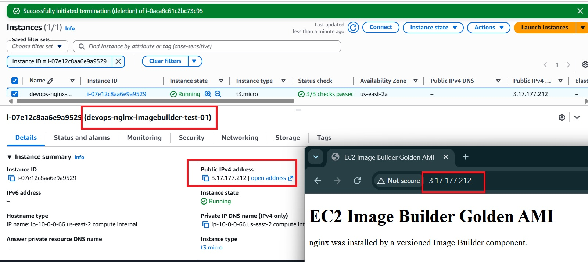

---
## 💡 Key Takeaways

- **Golden AMI:** Creates a reusable and consistent EC2 baseline.
- **IMDSv2:** Secures EC2 metadata access.
- **Session Manager:** Provides secure access without SSH.
- **IAM Roles:** Enables secure AWS service access without access keys.
- **EC2 Image Builder:** Automates AMI creation, testing, and versioning.
- **Build & Test Components:** Automate image configuration and validation.
- **Automation:** Provides consistent and repeatable EC2 deployments.
---
✅ Project Outcome

The final solution provides:

- Standardized NGINX server images
- Secure EC2 administration
- IMDSv2 enforcement
- IAM-based AWS access
- Automated image creation
- Automated image testing
- Versioned Golden AMIs
- Private AMI distribution
- Repeatable EC2 deployments
- Reduced manual configuration

This implementation establishes a foundation that can later be extended with Amazon Inspector vulnerability scanning, multi-Region AMI distribution, cross-account sharing, automated patching, CI/CD integration, and Auto Scaling Group deployments.

---
## 🧹 Cleanup

Perform cleanup only after collecting all screenshots and project evidence.

Manual AMI Cleanup
1. Terminate Test EC2
devops-nginx-test-01
2. Deregister Golden AMI
devops-nginx-golden-v1
3. Delete Associated Snapshot

Delete the snapshot created for the AMI if it is no longer required.

4. Terminate Builder EC2
devops-nginx-builder-01
5. Delete Security Group
devops-nginx-public-sg
6. Delete IAM Role
devops-ec2-ssm-role

Only delete the role if it is not used by other EC2 instances.

🤖 Image Builder Cleanup :

Delete Image Builder resources in dependency order:

Image Pipeline

      ↓
      
Distribution Configuration

      ↓
      
Infrastructure Configuration

      ↓
      
Image Recipe

      ↓
      
Test Component

      ↓
      
Build Component

      ↓
      
Generated AMI

      ↓
Associated Snapshot

      ↓
      
Image Builder IAM Role

---

## 👨‍💻 Author

**Hardik Darji**

DevOps Engineer

---
---

## ⭐ Support

If you found this project helpful, please consider giving the repository a ⭐ on GitHub.

Your support is greatly appreciated and motivates me to continue building and sharing DevOps projects! 🚀

**⭐ Star this repository if you found it useful!**
