## Day 8: AWS Storage Architecture — EBS Persistence, EFS & Disaster Recovery

---
## 📌 Lab Overview

This lab provides practical experience with AWS storage services and demonstrates how to design persistent, highly available, and recoverable storage architectures.

The lab covers:

- Amazon EBS gp3 persistent storage
- EBS encryption with AWS KMS
- UUID-based persistent mounting
- EBS volume expansion
- Amazon EBS Snapshots
- Cross-Region Snapshot Copy
- Amazon Data Lifecycle Manager (DLM)
- EBS disaster recovery
- EC2 Placement Groups
- Amazon EFS shared storage
- EFS Mount Targets
- NFS security configuration
- Fast Snapshot Restore
- io2 Multi-Attach
- EC2 Instance Store
- Storage persistence and recovery testing
- Resource cleanup


---
## 🌎 AWS Regions

This lab uses two regions.

Purpose           |	Region	      |    Region Code
Primary           |	N. California	|    us-west-1
Disaster Recovery	| Frankfurt     |	   eu-central-1

Make sure you switch AWS Console regions when performing regional operations.

---
## Part 1 – Amazon EBS Persistence

##  🏗️ Architecture

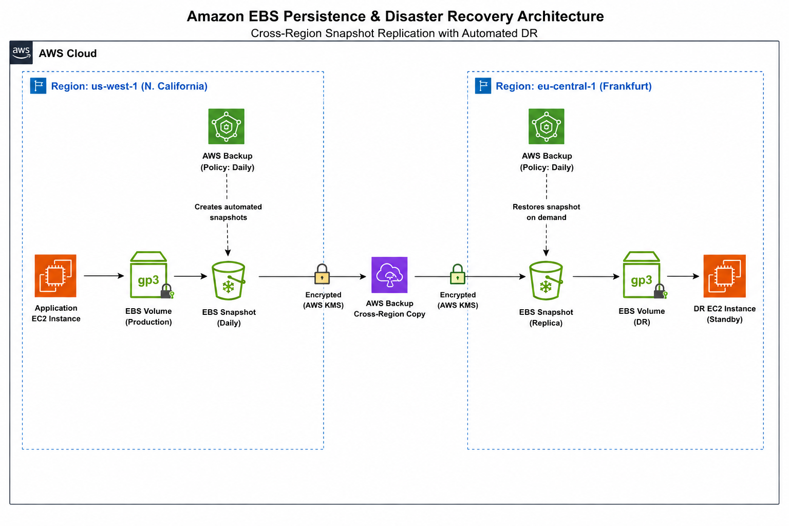

---

## Step 1: Switch to the Primary Region

Open the AWS Management Console.

Select:
US West (N. California)

Region:
us-west-1

---
## Step 2: Create a Security Group

Navigate to:

EC2
→ Security Groups
→ Create security group

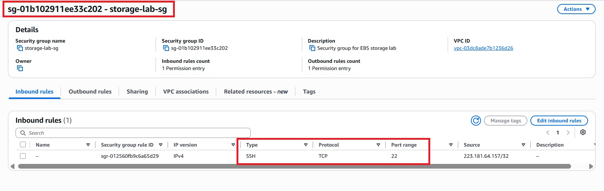

---
## Step 3: Launch the Storage EC2 Instance

Navigate to:

EC2
→ Instances
→ Launch Instance

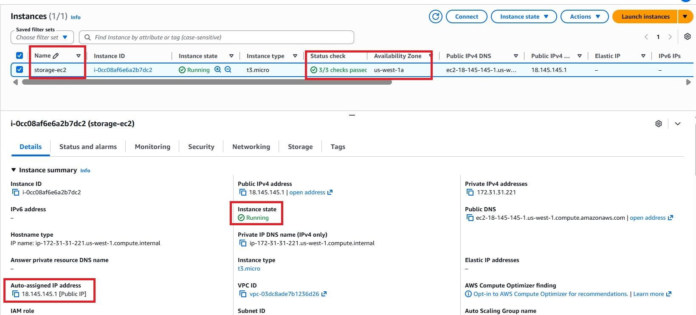

EC2 Volume:

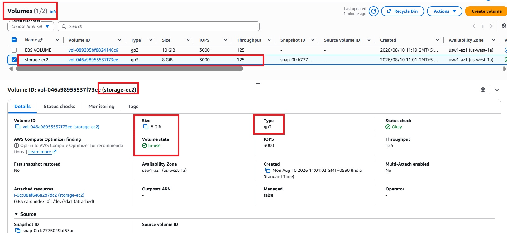

---
## Step 4: Create an EBS gp3 Volume

Navigate to:

EC2
→ Elastic Block Store
→ Volumes
→ Create volume


---
## Step 5: Attach the EBS Volume

Select the newly created volume.

Choose:

Actions
→ Attach volume

Select:
ec2-storage-lab-01

Confirm the Availability Zone matches the EC2 instance.

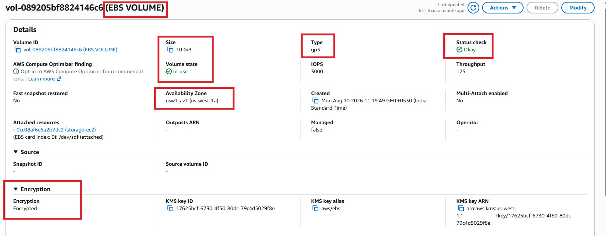

---
## Step 6: Verify the Volume

Inside EC2:

lsblk

You should see an additional block device.

Example:
nvme1n1

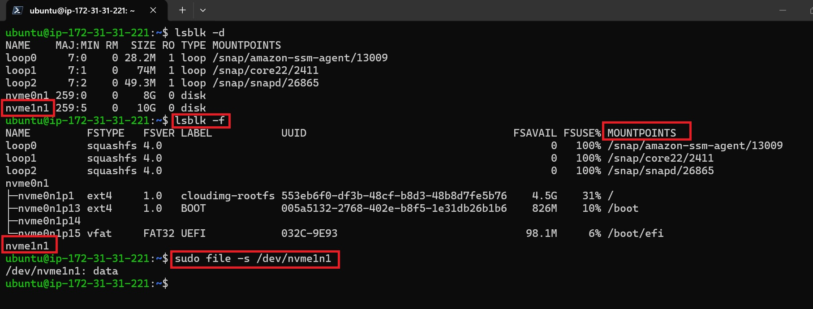

---
## Step 7: Format the Volume

For XFS:

sudo mkfs.xfs /dev/nvme1n1

Device names can differ. Always verify the correct device using lsblk.

---
## Step 8 : Create the Mount Directory

sudo mkdir -p /data

Mount the volume:  
sudo mount /dev/nvme1n1 /data

Verify:  
df -h

---
## Step 9: Get the UUID

Run:
sudo blkid /dev/nvme1n1

Example:
UUID="xxxxxxxx-xxxx-xxxx-xxxx-xxxxxxxxxxxx"


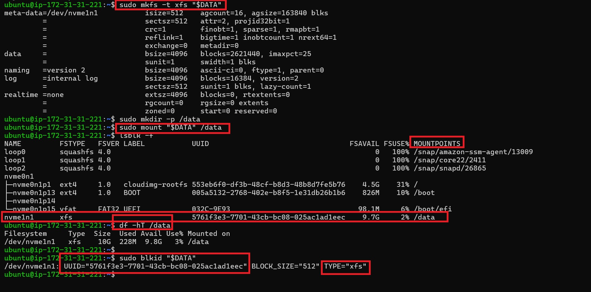

---
## Step 10: Configure Persistent Mount

```bash
sudo cp /etc/fstab  /etc/fstab.before-ebs

Add:
UUID=<YOUR-UUID> 

Verify:
df -h

```
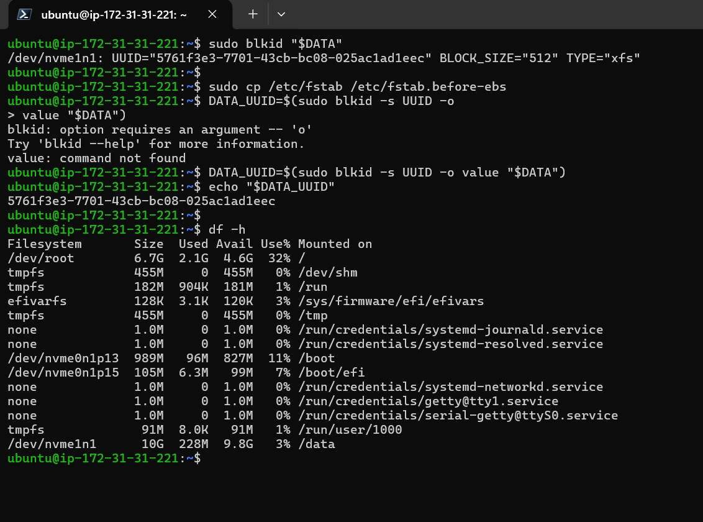

---
## Step 11: Test Data Persistence

```bash
Create a test file:
echo "EBS persistent storage test" | sudo tee /data/persistent.txt

Verify:
cat /data/persistent.txt

Expected:
EBS persistent storage test

```
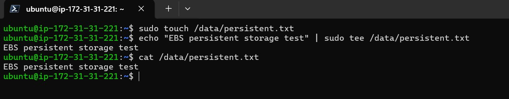

---
## Step 12: Test Persistence After Reboot


```bash
Reboot:
sudo reboot

```
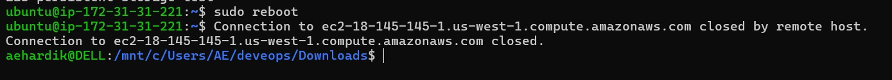

Reconnect to the EC2 instance.

```bash
Run:
df -h

Then:
cat /data/persistent.txt

Expected:
EBS persistent storage test

This confirms that the EBS data persists after reboot.

```
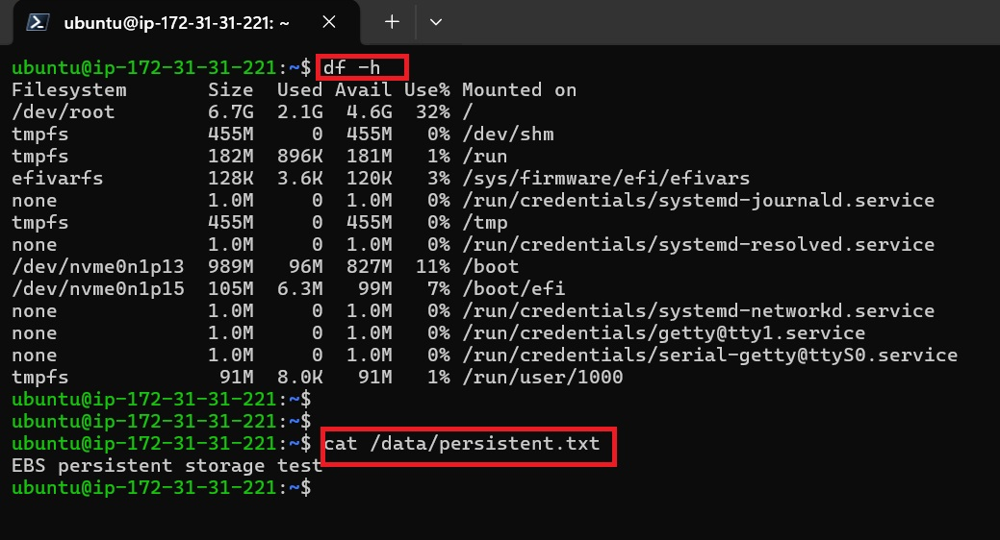

---
## Step 13: Test Persistence After Stop/Start EC2 instance

Stop the EC2 instance from the AWS Console.

```bash
Wait until:

Instance state = Stopped

Start the instance again.

Reconnect and run:
df -h

Then:
cat /data/persistent.txt

Expected:
EBS persistent storage test

```


---
## Step 14: Expand the EBS Volume

Navigate to:

EC2
→ Volumes

Select the EBS volume.

Choose:

Actions
→ Modify volume

Change:

10 GiB → 14 GiB

Apply the modification.

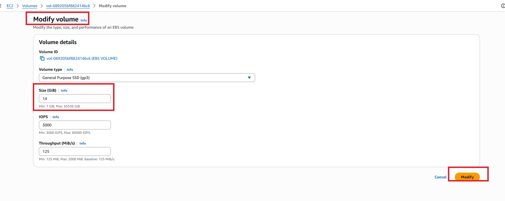

---
## Step 15: Verify Volume Size

Inside EC2:

lsblk

You should see approximately:
14G

For XFS:
sudo xfs_growfs /data

Verify:
df -h /data

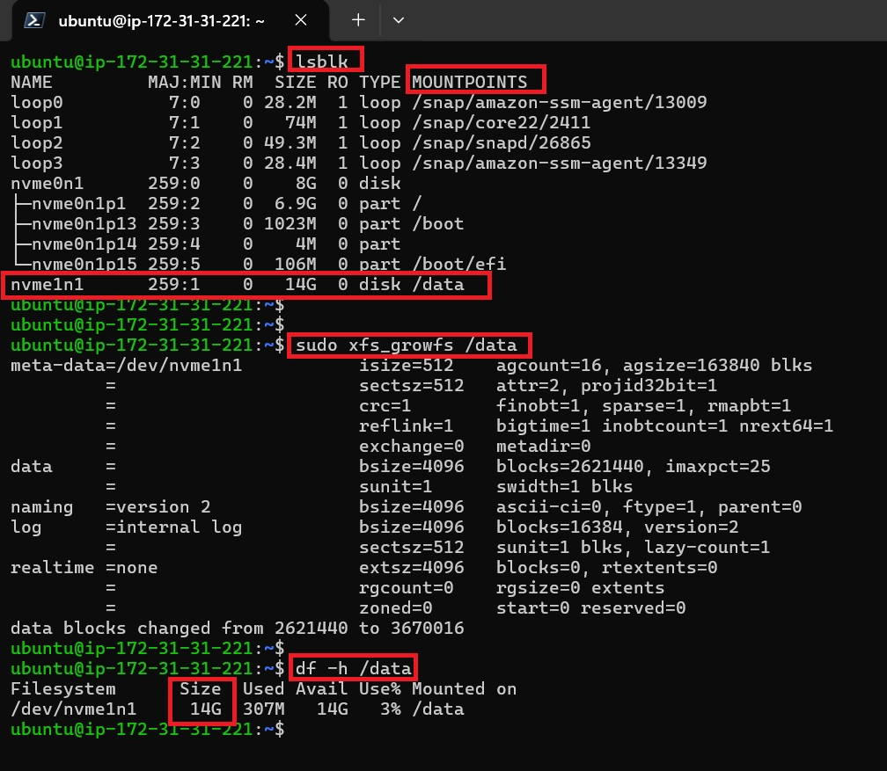

---
## Part 2 – EBS Snapshot & Disaster Recovery

---
## Step 16: Create an EBS Snapshot

Navigate to:

EC2
→ Volumes

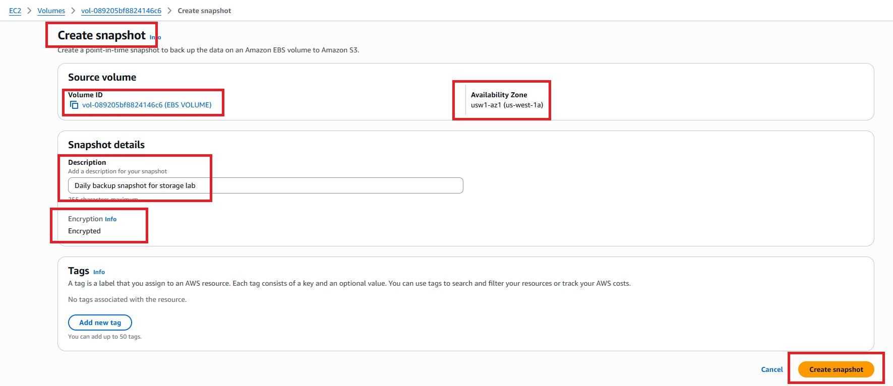

```bash
Select:
storage-gp3-data-01

Choose:

Actions → Create snapshot

Description:
Daily backup snapshot for storage lab

Tag:
Name = ebs-snapshot-daily-01

Click:
Create snapshot

EBS snapshots can later be used to create new EBS volumes and can be copied to another Region.

```

Go to:

EC2 → Snapshots

Check:

State:
Completed

Encryption:
Encrypted

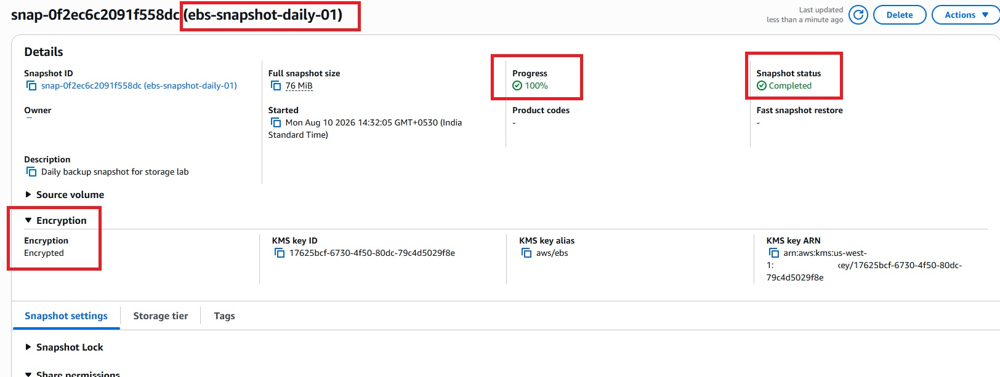

---
## Step 17: Restore a Volume from Snapshot

Select:
ebs-snapshot-daily-01

Choose:

Actions → Create volume from snapshot
```bash
Configure:

Volume type:
gp3

Size:
15 GiB

Availability Zone:
us-west-1a

Encryption:
Enabled

Name:
ebs-gp3-restored-01

Click :
Create volume
```

---
## Step 18: Attach Restored Volume

Select:
ebs-gp3-restored-01

Choose:

Actions → Attach volume

Select:
storage-ec2-01

Device:
/dev/sdg

Click:
Attach

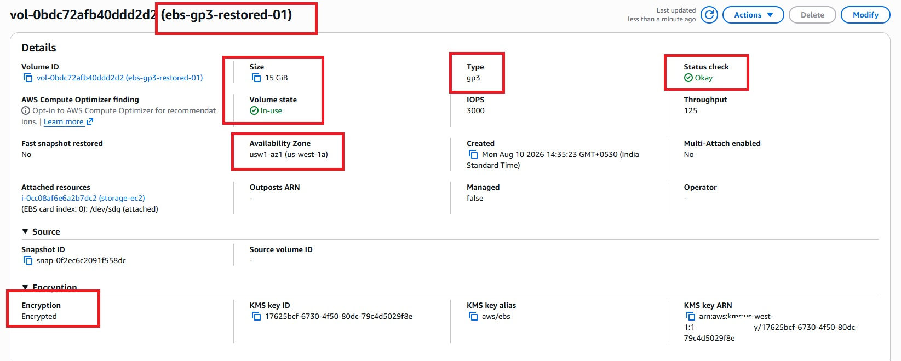

---

## Step 19: Verify Restored Data

SSH into EC2.

```bash
Run:
lsblk

Create mount directory:
sudo mkdir /restore

Check filesystem:
sudo blkid /dev/nvme2n1

Mount:
sudo mount /dev/nvme2n1 /restore

Verify:
ls -l /restore

Check:
cat /restore/persistent.txt

Expected:
EBS persistent storage test
```
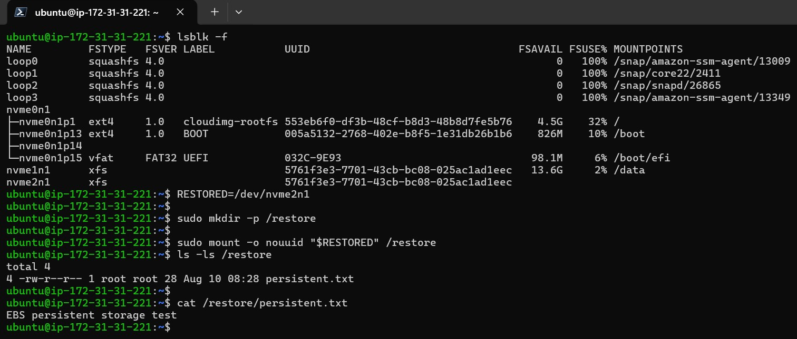

---
## Part 3: Cross-Region Disaster Recovery

Step 20: Switch to Destination Region

Change AWS Region to:

Europe (Frankfurt)
eu-central-1

---
## Step 21: Copy Snapshot to Frankfurt

Go back to:
US West (N. California) → EC2 → Snapshots

Select:
ebs-snapshot-daily-01

Choose:

Actions → Copy snapshot

```bash
Set:

Destination:
Europe (Frankfurt)

Encryption:
Encrypt

KMS Key:
Default AWS KMS key

Name/description:
DR snapshot - Frankfurt

Click:
Copy snapshot

AWS supports cross-Region EBS snapshot copies specifically for scenarios such as disaster recovery.
```

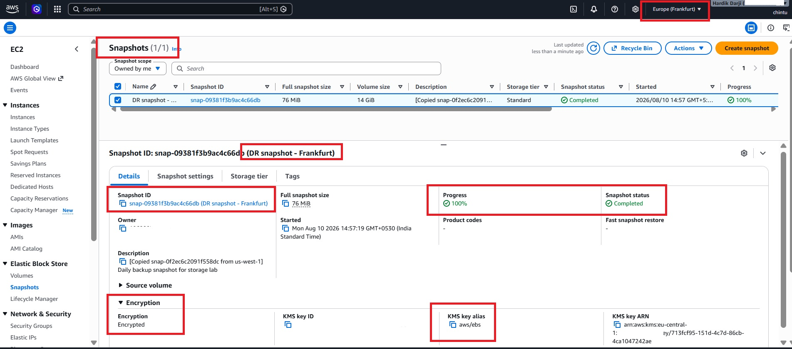

---
## Step 22: Create DR EBS Volume

Select the copied snapshot.

Choose:

Actions → Create volume from snapshot
```bash
Configure:

Volume type:
gp3

Size:
4 GiB

Availability Zone:
eu-central-1a

Name:
ebs-dr-frankfurt-01

Click:
Create volume
```

----
## Step 23: Launch Recovery EC2

Go to:

EC2 → Instances → Launch instance
```bash
Region:
eu-central-1

Name:
recovery-ec2-01

AMI:
ubuntu Linux 2023

Instance type:
t3.micro

Availability Zone:
eu-central-1a

Attach:
storage-lab-sg

Launch.
```

---
## Step 24: Attach DR Volume

Go to:

EC2 → Volumes

Select:
ebs-dr-frankfurt-01

Choose:
Actions → Attach volume

Select:
recovery-ec2-01

Device:
/dev/sdf

Attach.

---

## Step 25: Verify DR Data

SSH into:
recovery-ec2-01
```bash
Run:
lsblk

Mount the volume:
sudo mkdir /dr-data
sudo mount /dev/nvme1n1 /dr-data

Verify:
cat /dr-data/persistent.txt

Expected:
EBS persistent storage test
```

You have now demonstrated:

Production EBS

      ↓
Snapshot

      ↓
Cross-Region Copy

      ↓
DR Snapshot

      ↓
DR EBS Volume

      ↓
Recovery EC2

---
## Part 4: Data Lifecycle Manager

Amazon Data Lifecycle Manager can automate EBS snapshot creation, retention and deletion based on policies and resource tags.

Step 26: Return to Source Region

Switch back to:
us-west-1

---
## Step 30: Create DLM Policy

Go to:
EC2 → Lifecycle Manager

Choose:
Create lifecycle policy

Policy type:
EBS snapshot policy

Target resources:
Volume

Target tags:

Key:
Backup

Value:
Daily

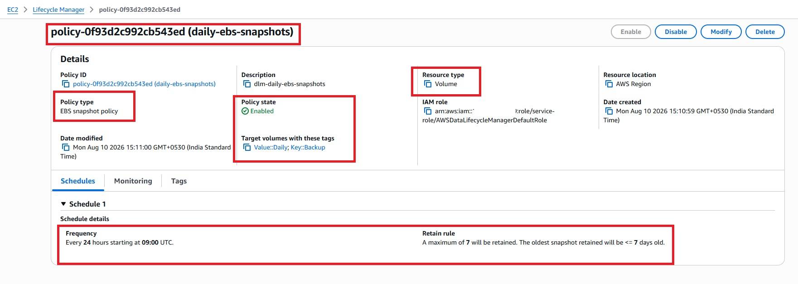

---
## Part 5: Placement Groups

## Step 31: Create Cluster Placement Group

Go to:

EC2 → Placement Groups

Click:
Create placement group

Name:
pg-cluster-demo

Strategy:
Cluster

Create.
---
## Step 32: Create Spread Placement Group

Create another:

Name:
pg-spread-demo

Strategy:
Spread

Create.

---
## Step 33: Create Partition Placement Group

Create:

Name:
pg-partition-demo

Strategy:
Partition

Create.

## Verify Placement Groups

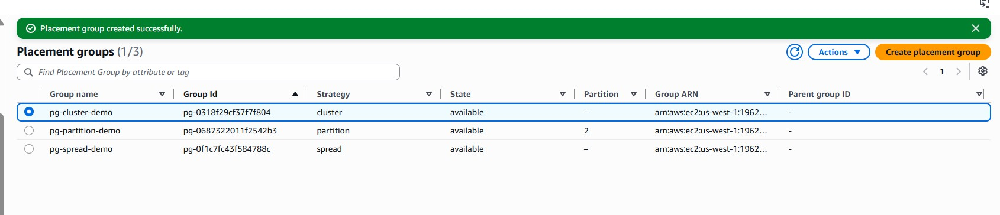

---
## Part 6: Amazon EFS Shared Storage

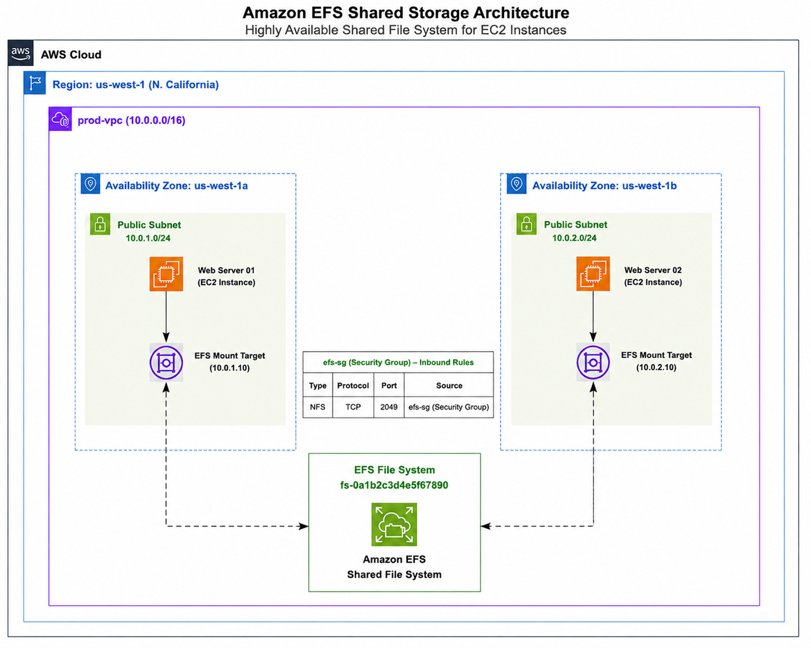

---
## Step 34: Create VPC

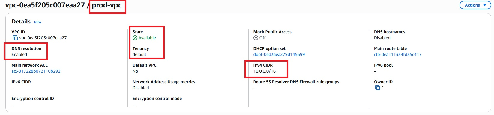

---
## Step 35: Create Subnet 1 & Subnet 2

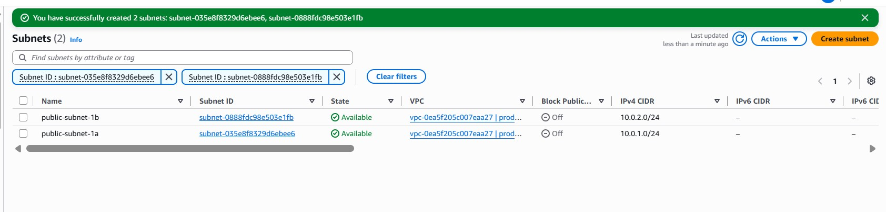

---
## Step 36: Create Internet Gateway

Go to:

VPC → Internet Gateways

Create:
prod-igw

Attach it to:
prod-vpc

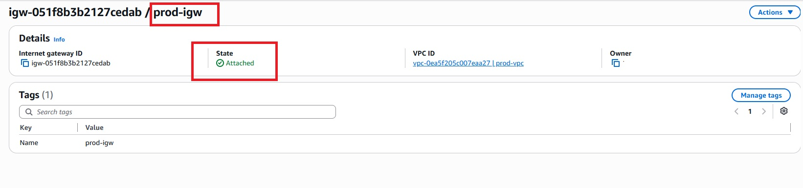

---
## Step 37: Create Route Table

Go to:

VPC → Create Route Tables

Associate the route table with:
public-subnet-1a
public-subnet-1b

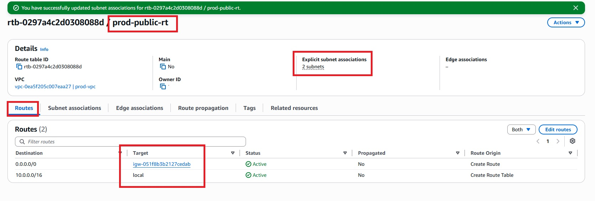

---
## Step 38: Create EC2 Security Group

Go to:
EC2 → Security Groups

Create:

Name:
ec2-efs-client-sg

Description:
EC2 security group for EFS clients

Inbound rule:

SSH
TCP
22
My IP

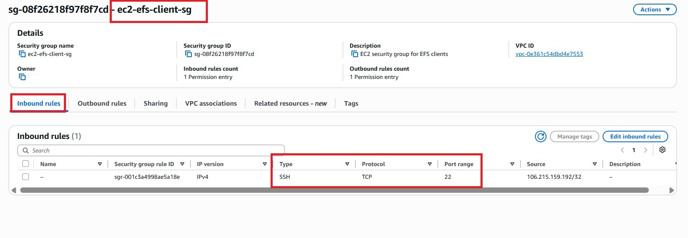

---
## Step 39: Create EFS Security Group

Create another security group:

Name:
efs-sg
Description:
Security group for EFS mount targets

Add inbound rule:

Type:
NFS

Protocol:
TCP

Port:
2049

Source:
Custom → ec2-efs-client-sg

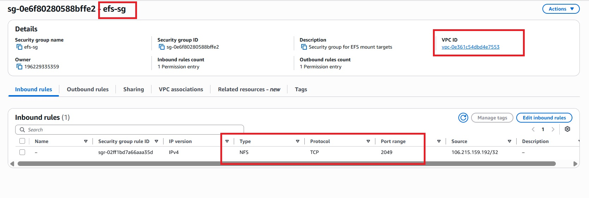

This is the recommended security-group pattern: allow NFS port 2049 on the EFS mount-target security group from the EC2 client's security group.

---
## Step 40: Create EFS File System

Go to:

Amazon EFS → File systems → Create file system

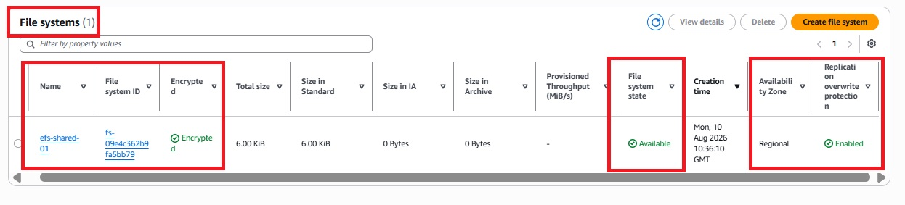

---
## Step 41: Configure EFS Mount Targets

Open your EFS file system.

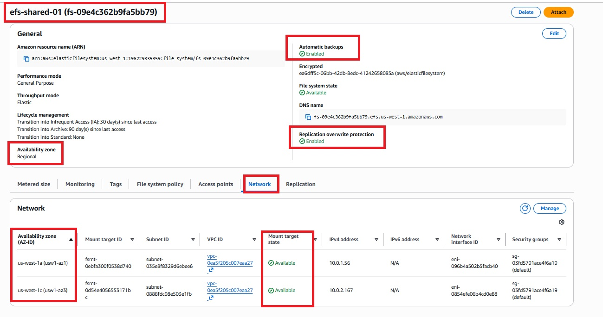

Go to:

Network → Manage

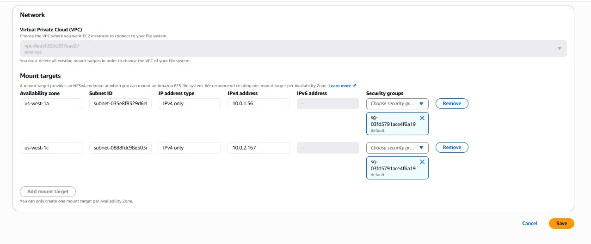

---
## Step 42: Launch EFS Client 1

Launch EC2:

Name:
efs-client-01

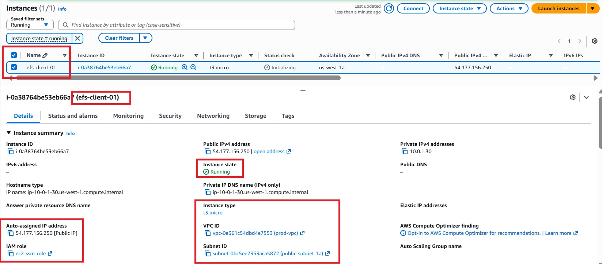

---
## Step 43: Launch EFS Client 2

Launch another EC2:

Name:
efs-client-02

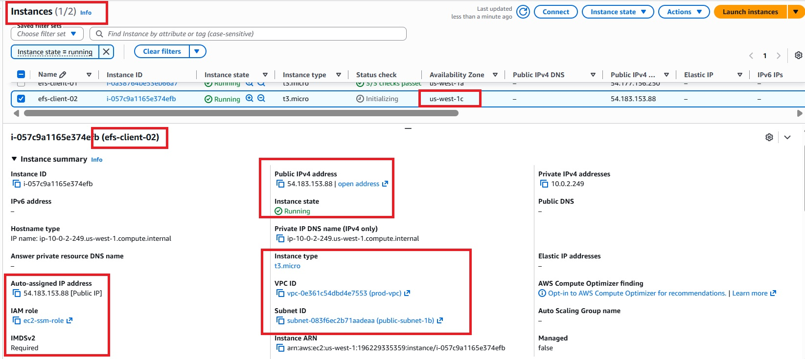

---
## Step 44: Install EFS Utilities

Connect SSM into efs-client-01.

Run:
sudo yum  install -y amazon-efs-utils

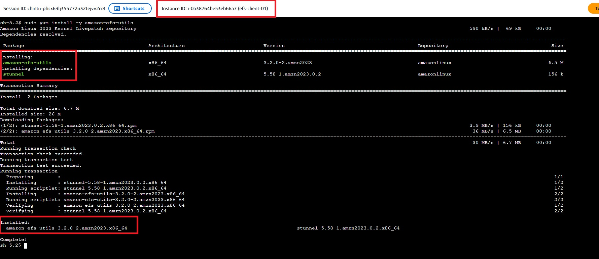

Connect SSM into efs-client-02.

Run:
sudo yum  install -y amazon-efs-utils
sudo yum install python3-pip -y

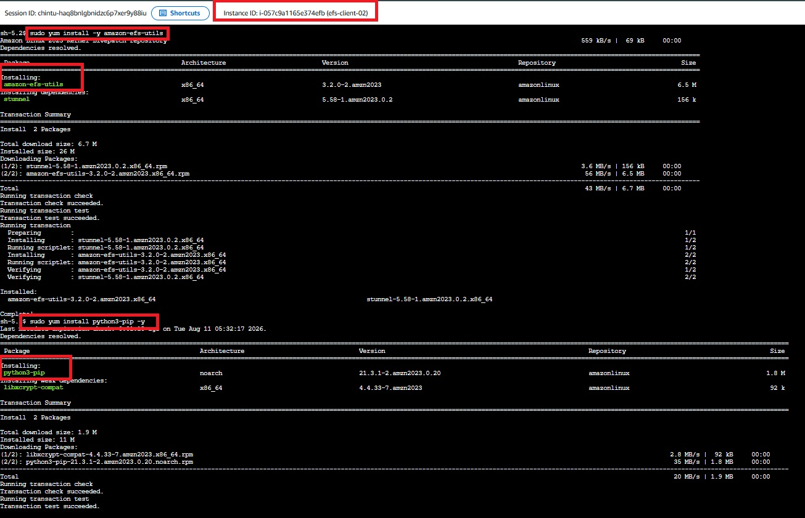

---
##  Step 45: Client -1 Validation

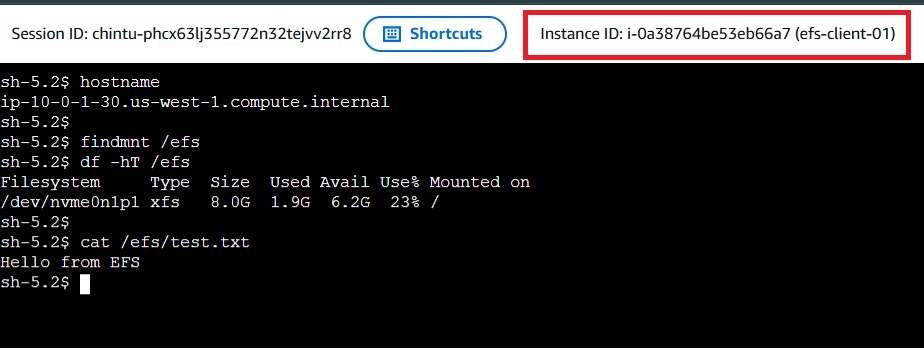

---
## Step 46: Client -2 Validation

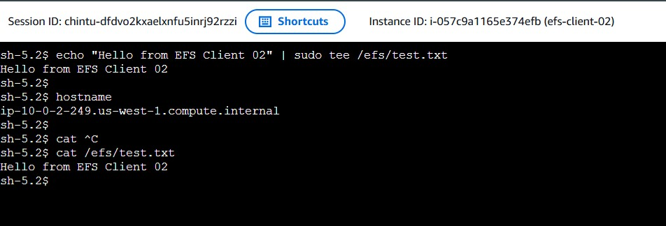

---

## Part 7: Fast Snapshot Restore

## Step 47 : Enable Fast Snapshot Restore

Navigate to:

EC2
→ Snapshots

Select:

snap-gp3-data-01

Choose:

Actions
→ Manage Fast Snapshot Restore

Select the required Availability Zone.

Enable FSR.

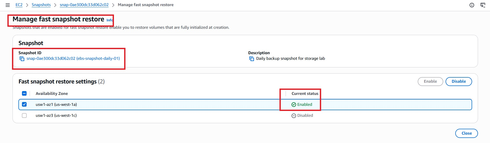

---
## Step 48: Disable Fast Snapshot Restore

After validation:

Actions
→ Manage Fast Snapshot Restore

Disable it.

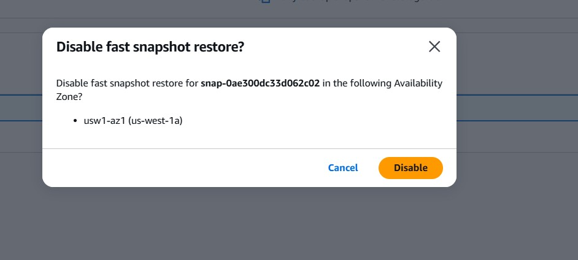

Verify:
Disabled

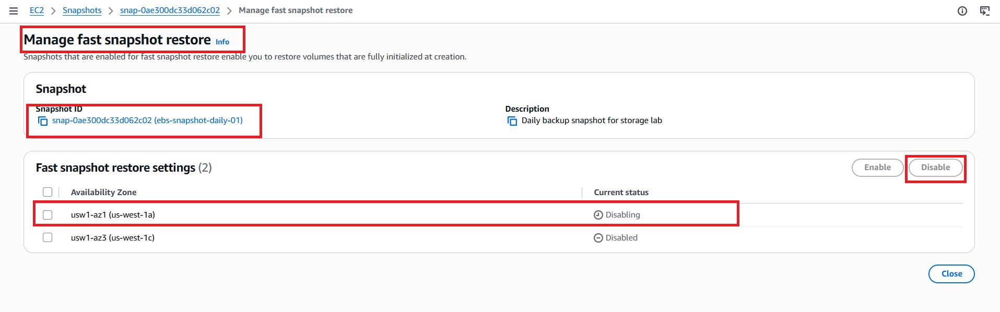

---
## ## 💡 Key Takeaways

- **Amazon EBS** is ideal for **persistent block storage** attached to Amazon EC2 instances.

- **Amazon EFS** is ideal when **multiple EC2 instances require shared file storage** with simultaneous read/write access.

- **Amazon EBS Snapshots** provide **point-in-time recovery** and can be copied across AWS Regions for backup and disaster recovery.

- **Amazon Data Lifecycle Manager (DLM)** can automate **recurring EBS snapshot creation and retention**, helping maintain consistent backup policies.

- **EC2 Instance Store** provides **high-performance temporary storage** and should not be used for critical persistent data because its data is ephemeral.

- **Cross-Region EBS Snapshot Copies** provide an important foundation for **disaster recovery**, allowing storage to be restored in another AWS Region during a regional failure.

---
## 🧹 Cleanup

AWS resources can incur charges. Delete all resources after completing the lab.

- EBS Cleanup
- Unmount restored EBS volume.
- Delete restored volume.
- Delete snapshots.
- Delete DR snapshots.
- Delete original EBS volume.
- Delete DLM policy.
- Terminate storage EC2.
- Delete unused Security Groups.
- EFS Cleanup
- Unmount EFS from both clients.
- sudo umount /mnt/efs
- Delete EFS mount targets.
- Delete EFS filesystem.
- Delete EFS Security Group.
- Terminate both EFS client instances.
- Placement Group Cleanup

Delete:

- pg-cluster-demo
- pg-spread-demo
- pg-partition-demo
- Multi-Attach Cleanup
- Detach io2 volume from both instances.
- Delete io2 volume.
- Terminate both Multi-Attach EC2 instances.
- Instance Store Cleanup

Terminate:
ec2-instance-store-01

---
## 💰 Cost Awareness

Before finishing the lab, verify that no unnecessary resources remain.

Check:

- EC2
- EBS Volumes
- EBS Snapshots
- EFS
- DLM
- KMS

Also check:

AWS Billing → Cost Explorer

Delete unused resources to avoid unexpected charges.

---
## 👨‍💻 Author

**Hardik Darji**

---

⭐ **Support the Project**

If you found this AWS lab useful, please consider **starring ⭐ the repository**.  
Your support is greatly appreciated and motivates me to continue documenting my AWS learning journey.

⭐ **Star the repository** | 🍴 **Fork it** | 📢 **Share it**

---

### 🚀 AWS Learning Journey

**Day 8: Amazon EBS Persistence, EFS & Storage Recovery**

Built with hands-on AWS practice and documented for continuous learning.
