## Day 9: ALB-Backed Auto Scaling – Highly Available and Self-Healing Web Application on AWS

---
## 🚀 Project Overview

This project demonstrates how to build a **highly available, fault-tolerant, self-healing, and automatically scalable web application architecture on AWS** using:

* Amazon VPC
* Public and Private Subnets
* Internet Gateway
* NAT Gateway
* Application Load Balancer (ALB)
* Amazon EC2
* EC2 Launch Template
* EC2 Auto Scaling Group
* Target Tracking Scaling Policy
* Amazon CloudWatch
* Amazon SNS
* AWS Systems Manager Session Manager
* NGINX

The web servers run in **private subnets**, while the internet-facing Application Load Balancer is deployed in **public subnets**.

The Auto Scaling Group automatically manages the EC2 instances based on CPU utilization and replaces unhealthy instances automatically.

---

# 🏗️ Architecture Overview

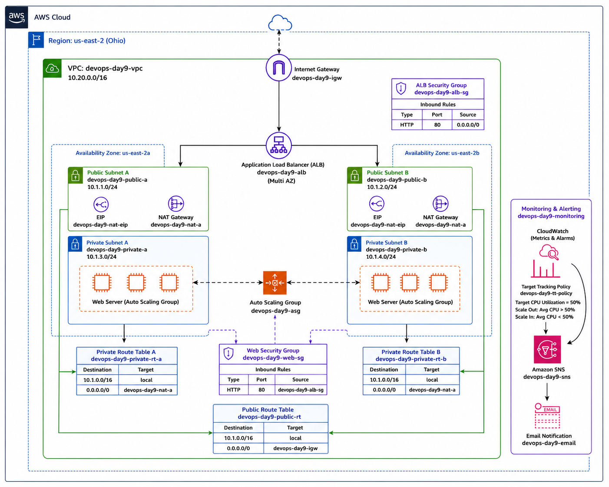

---

The architecture is deployed in the **AWS Ohio Region (****`us-east-2`****)** across two Availability Zones.

### Network Design

| Component          | Configuration                |
| ------------------ | ---------------------------- |
| AWS Region         | `us-east-2 `                 |
| VPC CIDR           | `10.20.0.0/16`               |
| Availability Zones | `us-east-w-1a`,`us-east-2b`|
| ALB Subnets        | Public                       |
| EC2 Subnets        | Private                      |
| NAT Gateway        | Public subnet                |
| Internet Gateway   | Attached to VPC              |
| Web Server         | NGINX                        |
| Load Balancer      | Application Load Balancer    |
| Auto Scaling       | Min: 1 / Desired: 1 / Max: 2 |

> **Production Architecture Note:** A production environment should use one NAT Gateway per Availability Zone for better availability. For this hands-on implementation, a single NAT Gateway was used to reduce AWS costs while demonstrating the core architecture.


---

# 🔖 Resource Naming Convention

A different naming convention was used for this implementation.

| Resource                  | Name                          |
| ------------------------- | ----------------------------- |
| VPC                       | `devops-day9-vpc`             |
| Public Subnet AZ-A        | `devops-day9-public-a`        |
| Public Subnet AZ-B        | `devops-day9-public-b`        |
| Private Subnet AZ-A       | `devops-day9-private-a`       |
| Private Subnet AZ-B       | `devops-day9-private-b`       |
| Internet Gateway          | `devops-day9-igw`             |
| NAT Gateway               | `devops-day9-nat-a`           |
| Elastic IP                | `devops-day9-nat-eip`         |
| ALB Security Group        | `devops-day9-alb-sg`          |
| Web Security Group        | `devops-day9-web-sg`          |
| Launch Template           | `devops-day9-launch-template` |
| Target Group              | `devops-day9-target-group`    |
| Application Load Balancer | `devops-day9-alb`             |
| Auto Scaling Group        | `devops-day9-asg`             |
| Scaling Policy            | `devops-day9-cpu-target-50`   |

---

# 1. Create the VPC

Navigate to:

**AWS Console → VPC → Your VPCs → Create VPC**

Select:

```text
Resources to create:
VPC only
```

Configure:

```text
Name tag: devops-day9-vpc
IPv4 CIDR: 10.20.0.0/16
IPv6 CIDR: No IPv6 CIDR block
Tenancy: Default
```

Click:

**Create VPC**

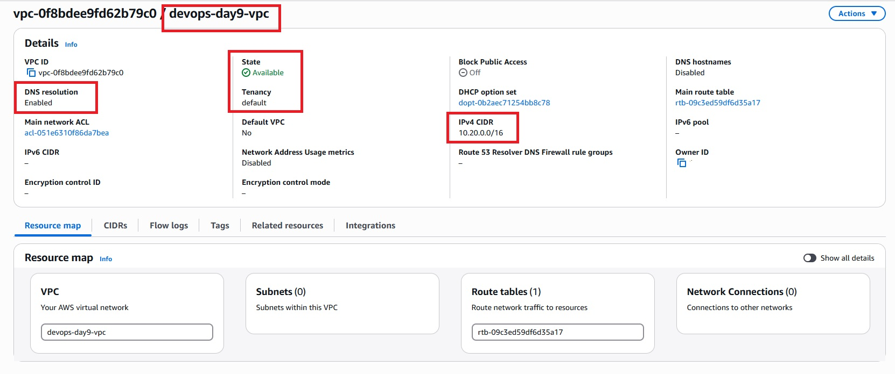

---

# 2. Create Public Subnet AZ-A

Navigate to:

**VPC → Subnets → Create subnet**

Select:

```text
VPC:
devops-day9-vpc
```

Configure:

```text
Subnet name: devops-day9-public-a
Availability Zone: us-east-2a
IPv4 CIDR: 10.20.1.0/24
```

Create the subnet.

---

# 3. Create Public Subnet AZ-B

Create another subnet:

```text
Subnet name: devops-day9-public-b
Availability Zone: us-east-2b
IPv4 CIDR: 10.20.2.0/24
```
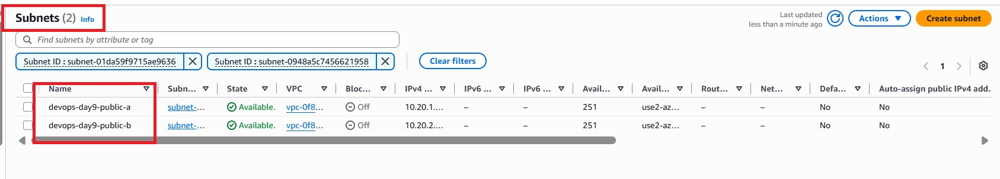

This gives the Application Load Balancer subnets in two different Availability Zones.

---

# 4. Create Private Subnet AZ-A

Create:

```text
Subnet name: devops-day9-private-a
Availability Zone:  us-east-2a
IPv4 CIDR: 10.20.11.0/24
```

This subnet will contain Auto Scaling EC2 instances.

---

# 5. Create Private Subnet AZ-B

Create:

```text
Subnet name: devops-day9-private-b
Availability Zone:  us-east-2b
IPv4 CIDR: 10.20.12.0/24
```
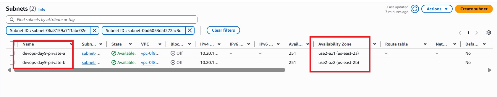

The EC2 web servers will be distributed across both private subnets.

---

# 6. Create Internet Gateway

Navigate to:

**VPC → Internet Gateways → Create Internet Gateway**

Enter:

```text
Name: devops-day9-igw
```

Click:

**Create Internet Gateway**

Then select:

**Actions → Attach to VPC**

Choose:

```text
devops-day9-vpc
```
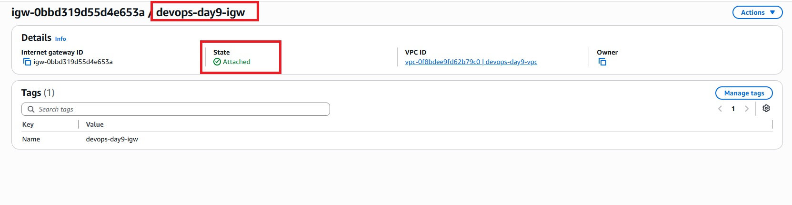

The Internet Gateway provides internet connectivity for resources in public subnets.

---

# 7. Create Public Route Table

Navigate to:

**VPC → Route Tables → Create route table**

Configure:

```text
Name: devops-day9-public-rt
VPC: devops-day9-vpc
```

Create the route table.

Add the following route:

```text
Destination: 0.0.0.0/0
Target: Internet Gateway
```

Select:

```text
devops-day9-igw
```

---

# 8. Associate Public Subnets

Associate the following subnets with the public route table:

```text
devops-day9-public-a
devops-day9-public-b
```
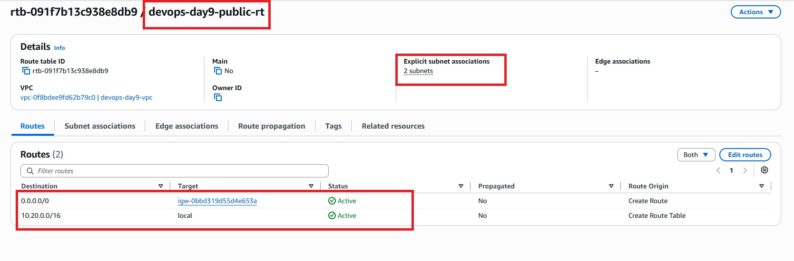

These subnets will be used by the Application Load Balancer and NAT Gateway.

---

# 9. Allocate Elastic IP

Navigate to:

**VPC → Elastic IPs → Allocate Elastic IP address**

Select:

```text
Amazon's IPv4 pool
```
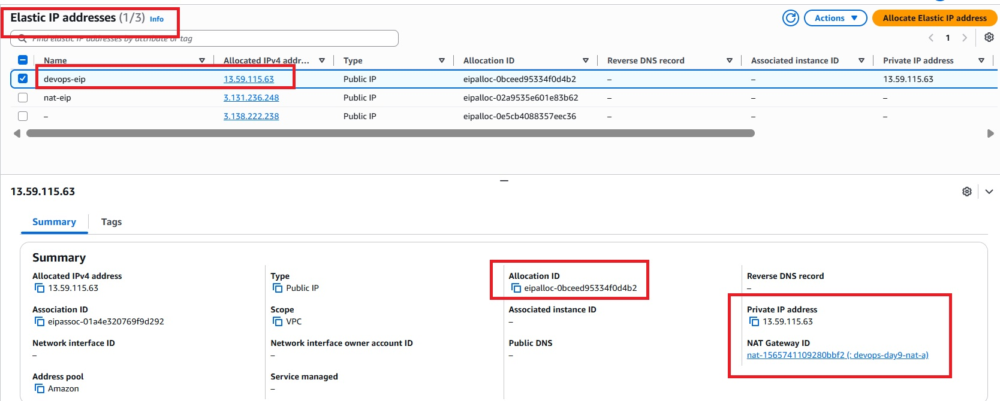

Allocate the address.

Use it for the NAT Gateway.

---

# 10. Create NAT Gateway

Navigate to:

**VPC → NAT Gateways → Create NAT Gateway**

Configure:

```text
Name: devops-day9-nat-a
Subnet: devops-day9-public-a
Connectivity type: Public
Elastic IP: devops-day9-nat-eip
```

Click:

**Create NAT Gateway**

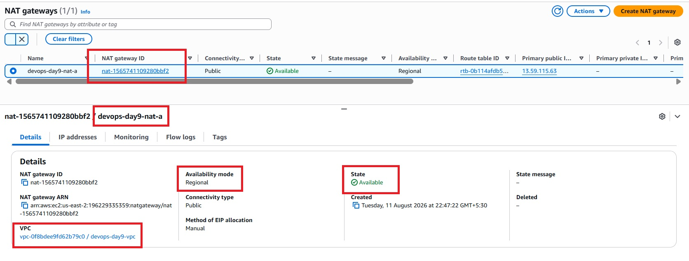

The NAT Gateway allows private EC2 instances to access the internet for tasks such as:

* Package installation
* OS updates
* Downloading dependencies
* Installing NGINX

The private instances do **not** receive public IP addresses.

---

# 11. Create Private Route Table AZ-A

Create:

```text
Name: devops-day9-private-rt-a
VPC: devops-day9-vpc
```

Add:

```text
Destination: 0.0.0.0/0
Target: NAT Gateway
```

Select:

```text
devops-day9-nat-a
```

Associate:

```text
devops-day9-private-a
```

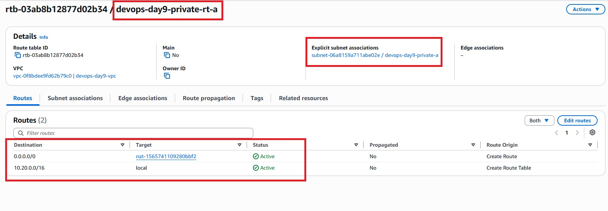

---

# 12. Create Private Route Table AZ-B

Create:

```text
Name: devops-day9-private-rt-b
VPC: devops-day9-vpc
```

For the cost-optimized implementation, route the private subnet through the same NAT Gateway:

```text
Destination: 0.0.0.0/0
Target: devops-day9-nat-a
```

Associate:

```text
devops-day9-private-b
```

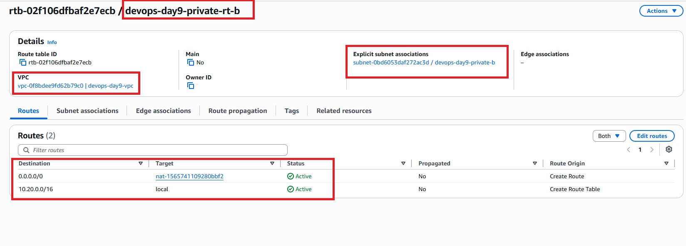

> In a production architecture, a second NAT Gateway would normally be deployed in `us-east-2b` to avoid cross-AZ dependency.

---

# 13. Create ALB Security Group

Navigate to:

**EC2 → Security Groups → Create security group**

Configure:

```text
Security Group Name:
devops-day9-alb-sg

Description:
Security group for Application Load Balancer

VPC:
devops-day9-vpc
```

### Inbound Rules

Allow:

```text
HTTP
Port: 80
Source: 0.0.0.0/0
```

For HTTPS production deployments, you would additionally allow:

```text
HTTPS
Port: 443
Source: 0.0.0.0/0
```

### Outbound

Allow:

```text
All traffic
```

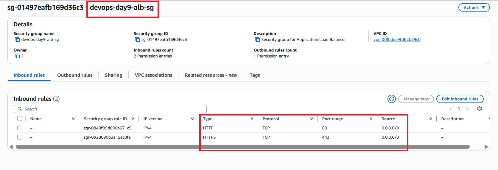

---

# 14. Create Web Server Security Group

Create:

```text
Name: devops-day9-web-sg
Description: Security group for private NGINX instances
VPC: devops-day9-vpc
```

### Inbound HTTP

Instead of allowing HTTP from the internet, allow HTTP only from the ALB Security Group.

```text
Type: HTTP
Port: 80
Source: devops-day9-alb-sg
```
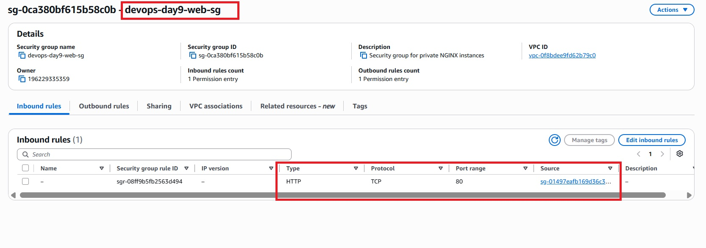

### Session Manager

No inbound SSH rule is required.

We intentionally avoid:

```text
SSH 22 → 0.0.0.0/0
```

This keeps the EC2 instances isolated from direct internet access.

---

# 15. Create IAM Role for EC2

Navigate to:

**IAM → Roles → Create role**

Trusted entity:

```text
AWS Service
```

Use case:

```text
EC2
```

Attach:

```text
AmazonSSMManagedInstanceCore
```

Create:

```text
devops-day9-ec2-ssm-role
```
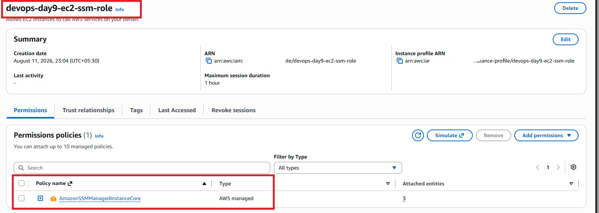

This allows EC2 instances to be managed using Systems Manager Session Manager.

---

# 16. Create Launch Template

Navigate to:

**EC2 → Launch Templates → Create launch template**

Configure:

```text
Launch Template Name:
devops-day9-launch-template
```

AMI:

```text
Ubnutu Linux 2023
```

Instance type:

```text
t3.micro
```

IAM Instance Profile:

```text
devops-day9-ec2-ssm-role
```

Security Group:

```text
devops-day9-web-sg
```

---

# 17. Configure IMDSv2

Under advanced settings, configure instance metadata:

```text
Metadata version:
IMDSv2 only
```

This prevents fallback to IMDSv1 and improves instance metadata security.

---

# 18. Configure EBS Volume

Configure the root volume:

```text
Volume Type: gp3
Size: 8 GiB
Delete on Termination: Yes
Encrypted: Yes
```

Encryption protects data stored on the EC2 root volume.

---

# 19. Enable Detailed Monitoring

Enable:

```text
Detailed CloudWatch monitoring
```

This provides more frequent monitoring data that can be useful when testing Auto Scaling behavior.

---

# 20. Configure User Data

Use User Data to automatically install and configure NGINX when an EC2 instance launches.

Example:

```bash
#!/bin/bash

# Update packages and install required tools
sudo apt-get update -y
sudo apt-get install -y nginx stress-ng curl

# Enable and start NGINX
sudo systemctl enable nginx
sudo systemctl start nginx

# Fetch AWS Instance Metadata (IMDSv2)
TOKEN=$(curl -X PUT "http://169.254.169.254/latest/api/token" -H "X-aws-ec2-metadata-token-ttl-seconds: 21600")
INSTANCE_ID=$(curl -H "X-aws-ec2-metadata-token: $TOKEN" -s http://169.254.169.254/latest/meta-data/instance-id)
AZ=$(curl -H "X-aws-ec2-metadata-token: $TOKEN" -s http://169.254.169.254/latest/meta-data/placement/availability-zone)
INSTANCE_TYPE=$(curl -H "X-aws-ec2-metadata-token: $TOKEN" -s http://169.254.169.254/latest/meta-data/instance-type)
PRIVATE_IP=$(curl -H "X-aws-ec2-metadata-token: $TOKEN" -s http://169.254.169.254/latest/meta-data/local-ipv4)
HOSTNAME=$(curl -H "X-aws-ec2-metadata-token: $TOKEN" -s http://169.254.169.254/latest/meta-data/local-hostname)
LAUNCH_TIME=$(date '+%d %b %Y, %H:%M %Z')

# Create the redesigned Dashboard HTML
cat <<EOF > /var/www/html/index.html
<!DOCTYPE html>
<html lang="en">
<head>
    <meta charset="UTF-8">
    <meta name="viewport" content="width=device-width, initial-scale=1.0">
    <title>DevOps Node Status</title>
    <link href="https://fonts.googleapis.com/css2?family=Inter:wght@400;600;800&display=swap" rel="stylesheet">
    <style>
        body {
            margin: 0;
            font-family: 'Inter', sans-serif;
            background: linear-gradient(135deg, #f6f8fb 0%, #e5ebf4 100%);
            color: #333;
            display: flex;
            justify-content: center;
            align-items: center;
            min-height: 100vh;
        }
        .dashboard {
            background: rgba(255, 255, 255, 0.85);
            backdrop-filter: blur(12px);
            border-radius: 24px;
            padding: 40px;
            box-shadow: 0 20px 40px rgba(0,0,0,0.05);
            width: 90%;
            max-width: 850px;
            border: 1px solid rgba(255,255,255,0.6);
        }
        .header {
            text-align: center;
            margin-bottom: 40px;
        }
        .header h1 {
            font-weight: 800;
            color: #4f46e5; /* Indigo */
            margin: 0;
            font-size: 2.8rem;
            letter-spacing: -1px;
        }
        .header p {
            color: #6b7280;
            font-size: 1.1rem;
            margin-top: 8px;
            font-weight: 600;
        }
        .data-grid {
            display: grid;
            grid-template-columns: repeat(auto-fit, minmax(280px, 1fr));
            gap: 20px;
        }
        .data-item {
            background: #ffffff;
            border-left: 6px solid #10b981; /* Emerald */
            padding: 24px;
            border-radius: 12px;
            box-shadow: 0 4px 6px rgba(0,0,0,0.02);
            transition: transform 0.2s ease;
        }
        .data-item:hover {
            transform: translateY(-2px);
            box-shadow: 0 10px 15px rgba(0,0,0,0.05);
        }
        .data-item:nth-child(2n) { border-left-color: #f59e0b; /* Amber */ }
        .data-item:nth-child(3n) { border-left-color: #3b82f6; /* Blue */ }
        .data-item:nth-child(4n) { border-left-color: #8b5cf6; /* Violet */ }
        .data-item:nth-child(5n) { border-left-color: #ec4899; /* Pink */ }
        
        .label {
            font-size: 0.75rem;
            text-transform: uppercase;
            letter-spacing: 1.5px;
            color: #9ca3af;
            margin-bottom: 8px;
            font-weight: 800;
        }
        .value {
            font-size: 1.25rem;
            font-weight: 600;
            color: #1f2937;
            word-break: break-all;
        }
        .footer {
            margin-top: 40px;
            text-align: center;
            padding-top: 30px;
            border-top: 2px dashed #e5e7eb;
        }
        .badges {
            display: flex;
            justify-content: center;
            gap: 10px;
            flex-wrap: wrap;
        }
        .badge {
            padding: 8px 16px;
            background: #e0e7ff;
            color: #4338ca;
            border-radius: 30px;
            font-size: 0.85rem;
            font-weight: 600;
        }
        .badge.nginx { background: #dcfce7; color: #15803d; }
        .badge.ec2 { background: #ffedd5; color: #c2410c; }
        .badge.ubuntu { background: #fce7f3; color: #be185d; }
    </style>
</head>
<body>
    <div class="dashboard">
        <div class="header">
            <h1>DevOps Target Node</h1>
            <p>Active Auto Scaling Instance</p>
        </div>
        
        <div class="data-grid">
            <div class="data-item"><div class="label">Instance ID</div><div class="value">${INSTANCE_ID}</div></div>
            <div class="data-item"><div class="label">Availability Zone</div><div class="value">${AZ}</div></div>
            <div class="data-item"><div class="label">Launch Time</div><div class="value">${LAUNCH_TIME}</div></div>
            <div class="data-item"><div class="label">Instance Type</div><div class="value">${INSTANCE_TYPE}</div></div>
            <div class="data-item"><div class="label">Private IP</div><div class="value">${PRIVATE_IP}</div></div>
            <div class="data-item"><div class="label">Hostname</div><div class="value">${HOSTNAME}</div></div>
        </div>

        <div class="footer">
            <div class="badges">
                <span class="badge ubuntu">Ubuntu Server</span>
                <span class="badge nginx">NGINX Web Server</span>
                <span class="badge ec2">Amazon EC2</span>
                <span class="badge">Application Load Balancer</span>
            </div>
        </div>
    </div>
</body>
</html>
EOF

# Create health check file for the Application Load Balancer
echo "healthy" > /var/www/html/health.html
```

The important health-check file is:

```text
/health.html
```
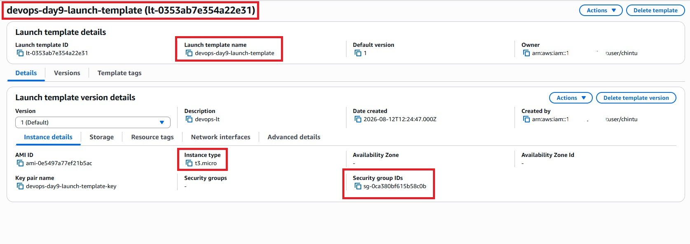

---

# 21. Create Target Group

Navigate to:

**EC2 → Target Groups → Create target group**

Select:

```text
Target type:
Instances
```

Configure:

```text
Target Group Name:
devops-day9-target-group

Protocol:
HTTP

Port:
80

VPC:
devops-day9-vpc
```

Health Check:

```text
Protocol: HTTP
Path: /health.html
Port: Traffic port
Healthy threshold: 3
Unhealthy threshold: 3
Timeout: 5 seconds
Interval: 30 seconds
```

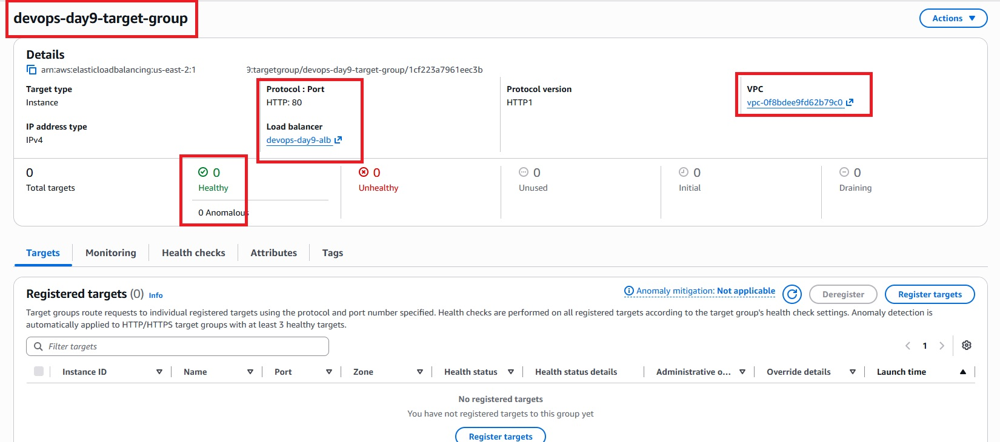

Create the Target Group.

---

# 22. Create Application Load Balancer

Navigate to:

**EC2 → Load Balancers → Create Load Balancer**

Select:

```text
Application Load Balancer
```

Configure:

```text
Name:
devops-day9-alb

Scheme:
Internet-facing

IP address type:
IPv4
```

---

# 23. Configure ALB Network Mapping

Select:

```text
VPC:
devops-day9-vpc
```

Availability Zones:

```text
us-east-2a
us-east-2b
```

Select:

```text
devops-day9-public-a
devops-day9-public-b
```

The ALB requires subnets in at least two Availability Zones for high availability.

---

# 24. Configure ALB Security Group

Attach:

```text
devops-day9-alb-sg
```

The ALB accepts HTTP requests from the internet.

---

# 25. Configure ALB Listener

Create:

```text
Protocol: HTTP
Port: 80
```

Default action:

```text
Forward to:
devops-day9-target-group
```
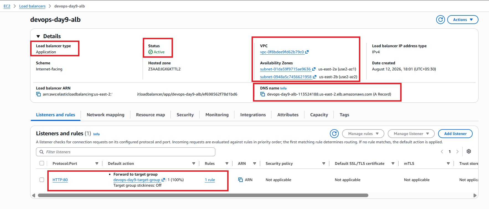

Create the Load Balancer.

---

# 26. Create Auto Scaling Group

Navigate to:

**EC2 → Auto Scaling Groups → Create Auto Scaling Group**

Configure:

```text
Name:
devops-day9-asg
```

Select Launch Template:

```text
devops-day9-launch-template
```

---

# 27. Configure Network

Select:

```text
VPC:
devops-day9-vpc
```

Select private subnets:

```text
devops-day9-private-a
devops-day9-private-b
```

This ensures that Auto Scaling instances are launched in private subnets.

---

# 28. Attach Target Group

Select:

```text
Application Load Balancer
```

Attach:

```text
devops-day9-target-group
```

Enable:

```text
Turn on Elastic Load Balancing health checks
```

This allows the Auto Scaling Group to use the ALB health status when determining instance health.

---

# 29. Configure Group Size

Set:

```text
Desired capacity: 1
Minimum capacity: 1
Maximum capacity: 2
```

This means:

```text
Minimum → 1 EC2
Normal → 1 EC2
Maximum → 2 EC2
```

---

# 30. Configure Target Tracking Policy

Select:

```text
Target tracking scaling policy
```

Metric:

```text
Average CPU utilization
```

Target value:

```text
50%
```

Policy name:

```text
devops-day9-cpu-target-50
```

The Auto Scaling Group will attempt to maintain average CPU utilization around 50%.

---

# 31. Configure Instance Health Checks

Enable:

```text
EC2 health checks
ELB health checks
```

The ELB health check is particularly important for self-healing.

If an instance is running but NGINX is unavailable, the ALB can detect the application failure.

---

# 32. Create the Auto Scaling Group

Review the configuration:

```text
Launch Template:
devops-day9-launch-template

Subnets:
private-a
private-b

Min:
1

Desired:
1

Max:
2

Target Tracking:
CPU 50%

Target Group:
devops-day9-target-group
```

Click:

**Create Auto Scaling Group**

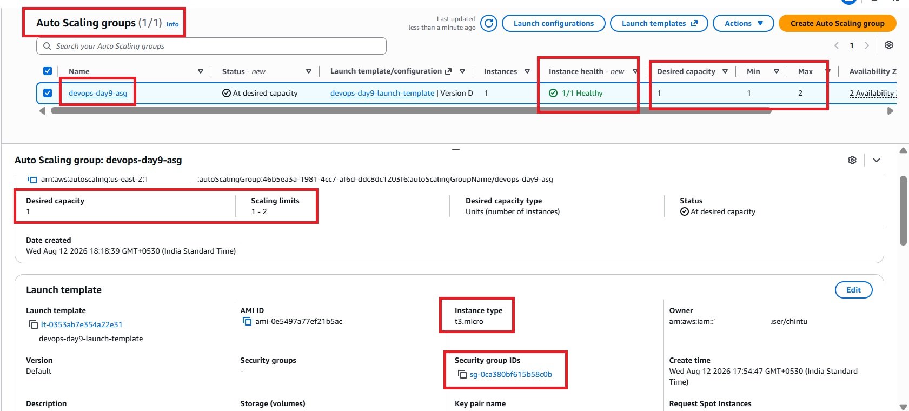

---

# 33. Verify EC2 Instance

Navigate to:

**EC2 → Instances**

You should see one EC2 instance launched automatically by the Auto Scaling Group.

Verify:

```text
Instance state: Running
Subnet: Private subnet
Public IPv4: None
Security Group: devops-day9-web-sg
```

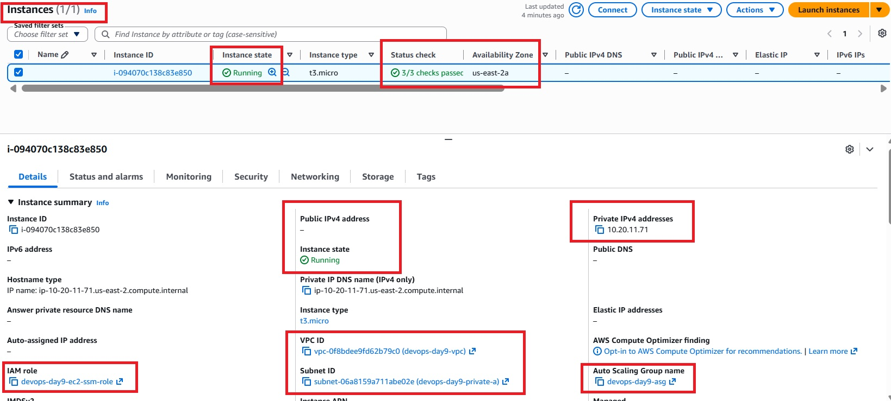

The absence of a public IP confirms that the web server is private.

---

# 34. Verify Session Manager

Navigate to:

**AWS Systems Manager → Session Manager → Start session**

Select the EC2 instance.

Connect without SSH.

Verify:

```bash
sudo systemctl status nginx
```

Expected:

```text
Active: active (running)
```

Check the health page:

```bash
curl http://localhost/health.html
```

Expected:

```text
healthy
```

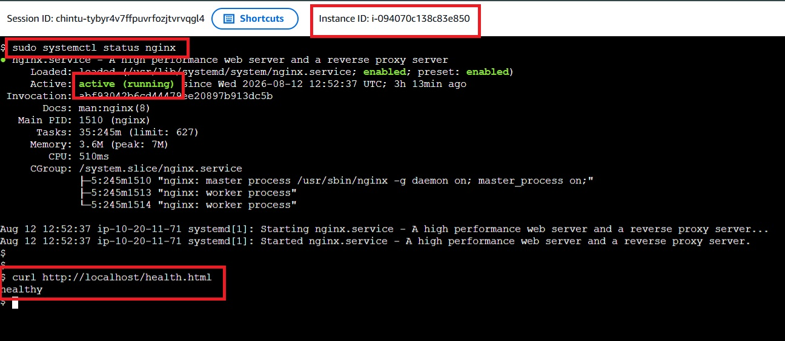

---

# 35. Verify Target Group Health

Navigate to:

**EC2 → Target Groups → devops-day9-target-group → Targets**

The instance should eventually show:

```text
Health status:
Healthy
```

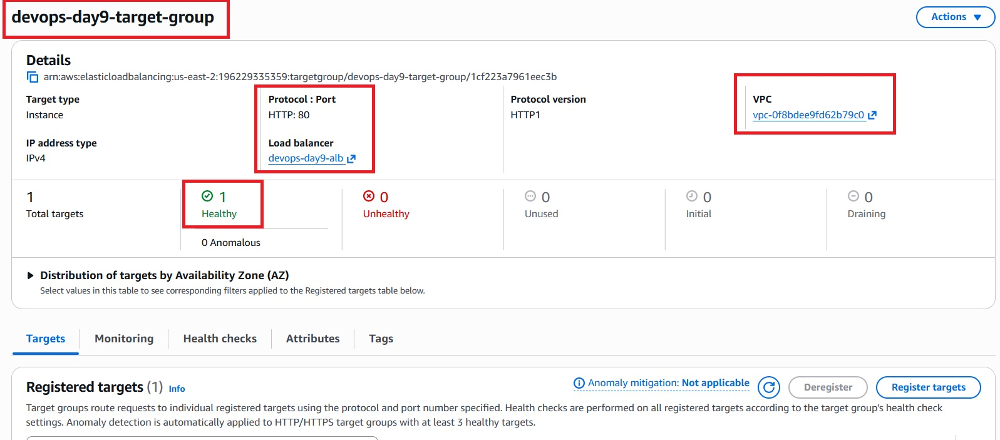

If it remains unhealthy, verify:

* NGINX is running.
* Port 80 is listening.
* `/health.html` exists.
* Web Security Group allows HTTP from ALB Security Group.
* Route tables are configured correctly.

---

# 36. Verify ALB

Navigate to:

**EC2 → Load Balancers**

Select:

```text
devops-day9-alb
```

Copy the DNS name.

Example:

```text
devops-day9-alb-xxxxxxxx.ap-south-1.elb.amazonaws.com
```

Open it in a browser.

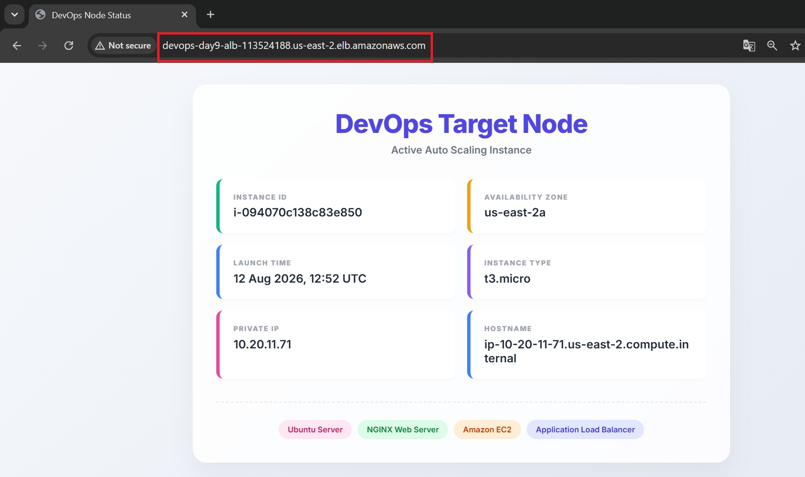

Expected:

```text
ALB-Backed Auto Scaling
NGINX server running successfully.
Instance: <hostname>
```

---

# 38. Generate High CPU Load

Connect to the EC2 instance using Session Manager.

Run:

```bash
sudo apt install -y stress-ng 
stress-ng --cpu 2 --timeout 15m
```

Monitor CPU utilization through:

**CloudWatch → Metrics → EC2**

CPU utilization should increase significantly.

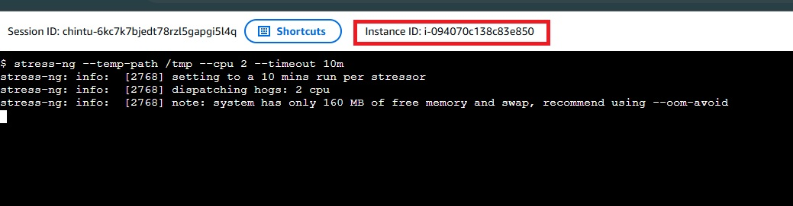

---

# 39. Verify CloudWatch Alarm

Navigate to:

**CloudWatch → Alarms**

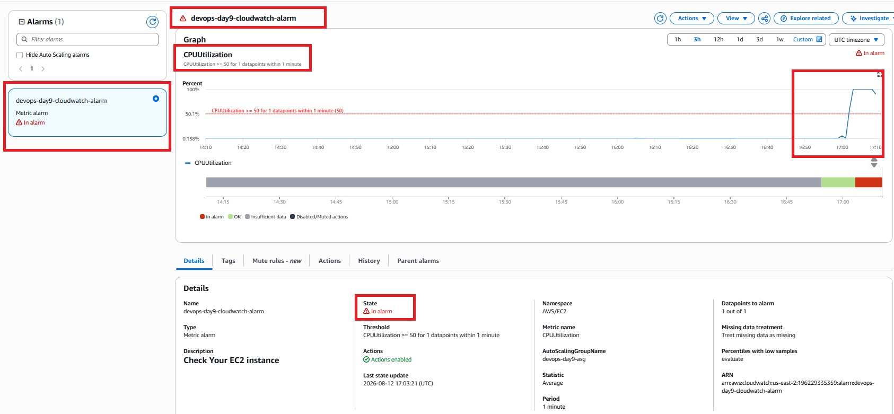

The scaling-related alarm should react to the increased CPU utilization.

The target tracking policy uses CloudWatch metrics to determine whether additional capacity is required.

---

# 40. Verify Scale-Out

The Auto Scaling Group should increase:

```text
Desired capacity:
1 → 2
```
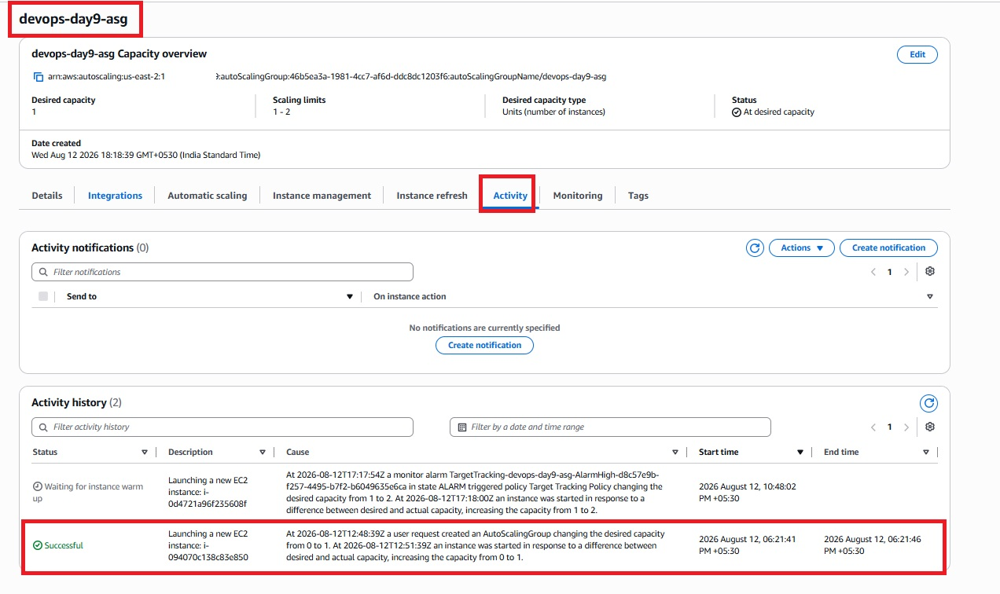

Navigate to:

**EC2 → Auto Scaling Groups → devops-day9-asg**

Verify:

```text
Desired: 2
Running: 2
```

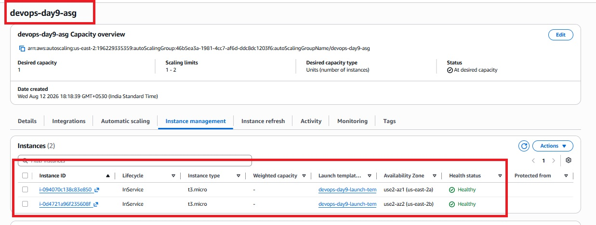

A second EC2 instance should automatically launch.

---

# 41. Verify Two Healthy Targets

Navigate to:

**Target Groups → devops-day9-target-group → Targets**

You should now see:

```text
Instance 1 → Healthy
Instance 2 → Healthy
```
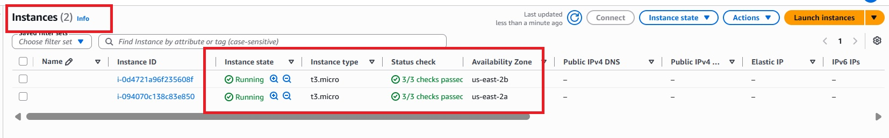

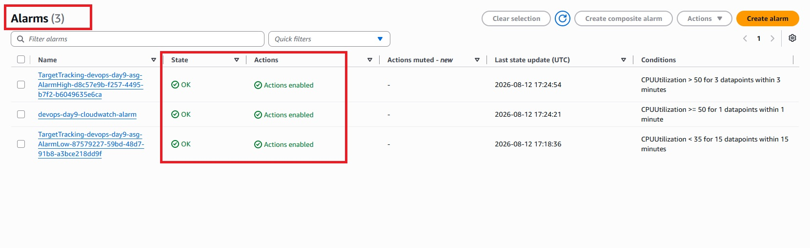

Both instances should be registered automatically by the Auto Scaling Group.

---

# 42. Verify Load Balancing Across Instances

The responses should show requests being served by different EC2 instances.

Example:

```text
Instance: ip-10-20-11-25
Instance: ip-10-20-12-41
Instance: ip-10-20-11-25
Instance: ip-10-20-12-41
```

This confirms that the ALB is distributing traffic across healthy targets.

---

# 43. Test Scale-In

Stop the CPU workload.

If `stress-ng` is running in the foreground, stop it using:

```text
Ctrl + C
```

Or terminate the process:

```bash
sudo pkill stress-ng
```

CPU utilization should gradually decrease.

After the target tracking policy detects sustained lower utilization, the ASG should scale in.

Expected:

```text
Desired capacity:
2 → 1
```

Verify under:

**EC2 → Auto Scaling Groups → devops-day9-asg**

---

# 44. Test Self-Healing

Now intentionally create an application failure.

Connect to one EC2 instance using Session Manager.

Stop NGINX:

```bash
sudo systemctl stop nginx
```

Verify:

```bash
sudo systemctl status nginx
```

Expected:

```text
inactive
```

---

# 45. Verify ALB Detects Unhealthy Instance

The ALB health check requests:

```text
/health.html
```

Because NGINX is stopped, the health check fails.

Navigate to:

**Target Groups → Targets**

The instance should transition:

```text
Healthy
      ↓
Unhealthy
```
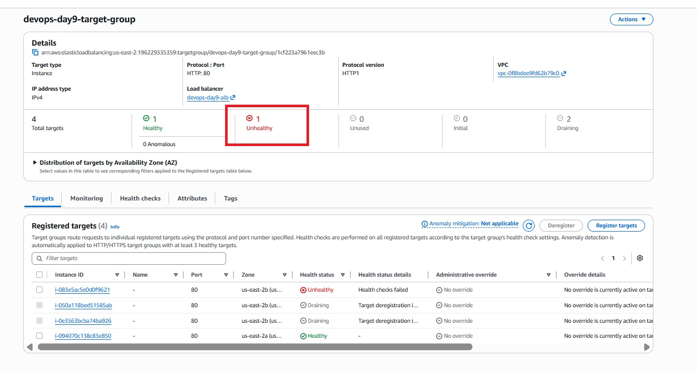

---

# 46. Verify Auto Scaling Replacement

The Auto Scaling Group detects the unhealthy instance through the configured health checks.

It should terminate the unhealthy instance and launch a replacement.

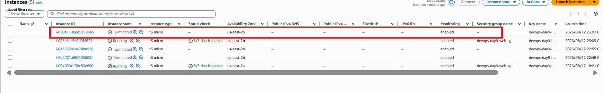


Expected:

```text
Unhealthy Instance
        ↓
Detected
        ↓
Terminated
        ↓
Replacement Launched
        ↓
NGINX Installed
        ↓
Target Registered
        ↓
Health Check Passed
```

The desired capacity remains:

```text
1
```

---

# 47. Verify Replacement Instance

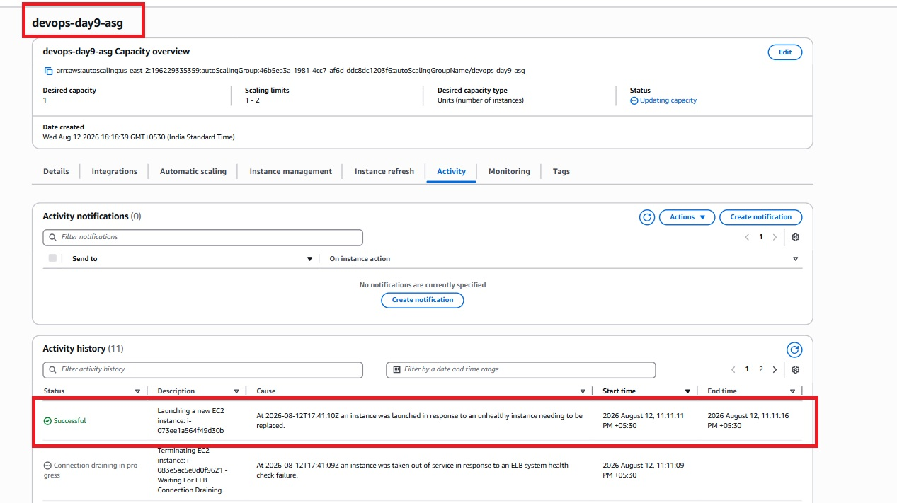

Navigate to:

**EC2 → Instances**

Confirm that a new instance has been launched.

Verify:

```text
Instance state: Running
Subnet: Private
Security Group: devops-day9-web-sg
```

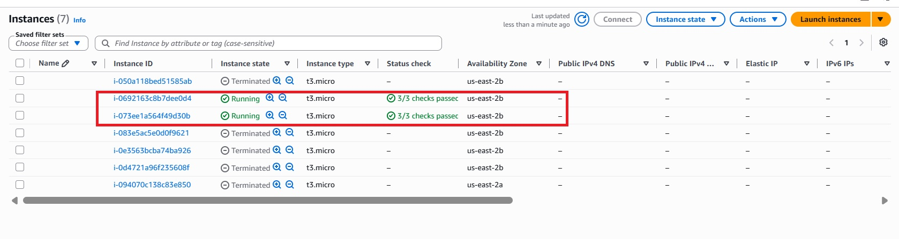

---

# 48. Verify Replacement Target Health

Navigate to:

**Target Groups → devops-day9-target-group → Targets**

The replacement instance should eventually become:

```text
Healthy
```


This confirms Auto Scaling self-healing.

---

# 49. Final Validation

The following functionality was successfully validated:

| Test              | Expected Result                 | Status |
| ----------------- | ------------------------------- | ------ |
| VPC connectivity  | Correct routing                 | ✅      |
| ALB accessibility | HTTP reachable                  | ✅      |
| Target health     | Healthy                         | ✅      |
| ALB routing       | Requests forwarded              | ✅      |
| Auto Scaling      | Instances managed automatically | ✅      |
| Scale-out         | 1 → 2 instances                 | ✅      |
| Scale-in          | 2 → 1 instance                  | ✅      |
| Load balancing    | Traffic distributed             | ✅      |
| Health check      | Failed NGINX detected           | ✅      |
| Self-healing      | Instance replaced               | ✅      |
| Session Manager   | SSH-less administration         | ✅      |
| Private EC2       | No public IP                    | ✅      |

---

## Final Architecture Characteristics

This architecture provides:

### 🔐 Security

* EC2 instances deployed in private subnets.
* No direct inbound SSH access.
* ALB is the public entry point.
* EC2 Security Group allows HTTP only from the ALB Security Group.
* IMDSv2 enforced.
* Encrypted EBS volume.
* Session Manager used for administration.

### 🌐 High Availability

* ALB deployed across two Availability Zones.
* EC2 instances distributed across private subnets.
* Auto Scaling maintains application capacity.

### Scalability

* Target Tracking Policy monitors CPU utilization.
* Scale-out occurs when demand increases.
* Scale-in occurs when demand decreases.

###  Self-Healing

Auto Scaling automatically replaces unhealthy EC2 instances.

###  Monitoring

CloudWatch monitors:

* CPU utilization
* Auto Scaling activity
* Instance health
* Scaling alarms

---

# 🧹 Cleanup

To avoid unnecessary AWS charges, clean up the resources after completing the lab.

### Step 1 — Delete Auto Scaling Group

Set:

```text
Desired capacity: 0
Minimum capacity: 0
```

Wait until all EC2 instances terminate.

Then delete:

```text
devops-day9-asg
```

---

### Step 2 — Delete Application Load Balancer

Delete:

```text
devops-day9-alb
```

---

### Step 3 — Delete Target Group

Delete:

```text
devops-day9-target-group
```

---

### Step 4 — Delete Launch Template

Delete:

```text
devops-day9-launch-template
```

---

### Step 5 — Delete CloudWatch Alarms

Delete alarms associated with:

```text
devops-day9-cpu-target-50
```

---

### Step 6 — Delete NAT Gateway

Delete:

```text
devops-day9-nat-a
```

Wait until the NAT Gateway is completely deleted.

---

### Step 7 — Release Elastic IP

Release:

```text
devops-day9-nat-eip
```

This is important because unused Elastic IP addresses can incur charges depending on AWS's current pricing rules.

---

### Step 8 — Delete Security Groups

Delete:

```text
devops-day9-alb-sg
devops-day9-web-sg
```

---

### Step 9 — Delete Route Tables

Delete project-specific:

```text
devops-day9-public-rt
devops-day9-private-rt-a
devops-day9-private-rt-b
```

Do not delete the VPC's main route table if AWS still requires it.

---

### Step 10 — Delete Subnets

Delete:

```text
devops-day9-public-a
devops-day9-public-b
devops-day9-private-a
devops-day9-private-b
```

---

### Step 11 — Detach Internet Gateway

Detach:

```text
devops-day9-igw
```

from:

```text
devops-day9-vpc
```

Then delete the Internet Gateway.

---

### Step 12 — Delete VPC

Finally delete:

```text
devops-day9-vpc
```

---

# 🧠 Key Learnings

Through this project, I gained practical experience with:

* Designing a multi-AZ AWS VPC architecture.
* Separating public and private workloads.
* Deploying an internet-facing Application Load Balancer.
* Configuring ALB Target Groups and health checks.
* Creating EC2 Launch Templates.
* Managing EC2 instances using Auto Scaling Groups.
* Implementing CPU-based Target Tracking scaling.
* Testing automatic scale-out and scale-in.
* Understanding ALB-to-EC2 Security Group relationships.
* Using NAT Gateway for private subnet internet access.
* Using Systems Manager Session Manager instead of SSH.
* Testing application-level health failures.
* Understanding Auto Scaling self-healing.
* Applying AWS Well-Architected principles to a practical architecture.

---

# 🏆 Final Result

Successfully built and validated an **ALB-backed Auto Scaling architecture** where:

```text
Internet
   ↓
Application Load Balancer
   ↓
Target Group
   ↓
Private EC2 Instances
   ↓
NGINX
```

The Auto Scaling Group dynamically manages the web tier:

```text
High CPU
   ↓
Scale Out
   ↓
2 EC2 Instances
```

and:

```text
Low CPU
   ↓
Scale In
   ↓
1 EC2 Instance
```

For application failure:

```text
NGINX Failure
     ↓
ALB Health Check Fails
     ↓
Instance Marked Unhealthy
     ↓
Auto Scaling Detects Failure
     ↓
Unhealthy Instance Replaced
     ↓
Replacement Instance Healthy
```

This demonstrates a practical AWS architecture that is **secure, highly available, scalable, fault-tolerant, and self-healing**.

---
## 👨‍💻 Author

** Hardik Darji **
DevOps Engineer

---

## ⭐ If You Found This Helpful

If this project or documentation helped you understand AWS ALB, Auto Scaling, and high-availability architecture, consider giving the repository a ⭐.
