## Day - 10 :  Enterprise Blue-Green Deployment on AWS using Application Load Balancer

Production-style AWS DevOps project implementing a highly available Blue-Green deployment architecture using Application Load Balancer, Target Groups, private EC2 instances  and  health checks.

---
## 📌 Project Overview

This project demonstrates an enterprise-style Blue-Green deployment strategy on AWS.

The architecture maintains two independent application environments:

- 🔵 Blue Environment — Current production version
- 🟢 Green Environment — New application version prepared for release

Application traffic is managed through an Application Load Balancer (ALB). This allows the new version to be validated before directing production traffic to it.

The design focuses on:

- High availability
- Zero/minimal downtime deployments
- Automated health checks
- Controlled traffic switching
- Fault tolerance across Availability Zones
- Secure private application infrastructure
- Easy rollback

---
## 🏗️ Architecture

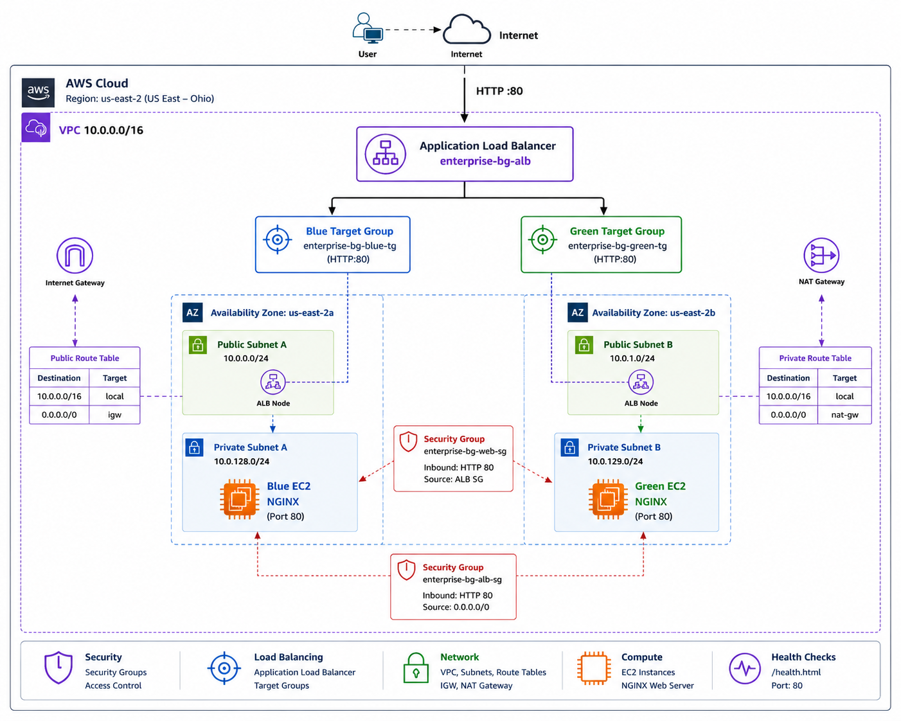

---
## 1. Create VPC

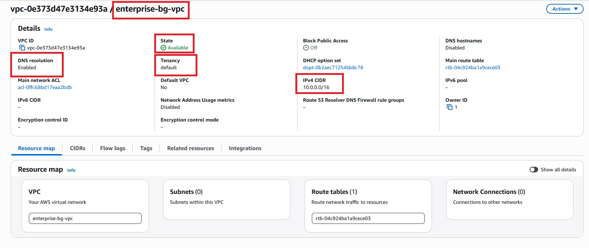

---
## 2. Create Internet Gateway and Attach to VPC

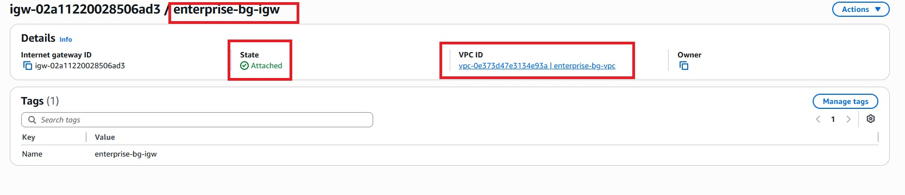

---
## 3. Create Public and Private Subnet

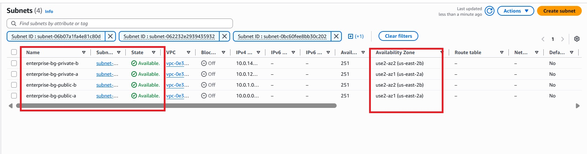

---
## 4. Configure Public Route Tables and Associate Subnet

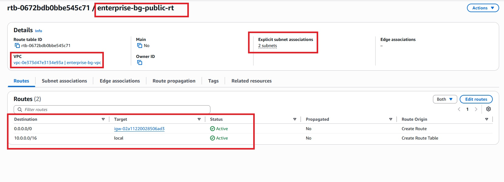

---
## 5. Configure NAT Gateway and Allocate EIP

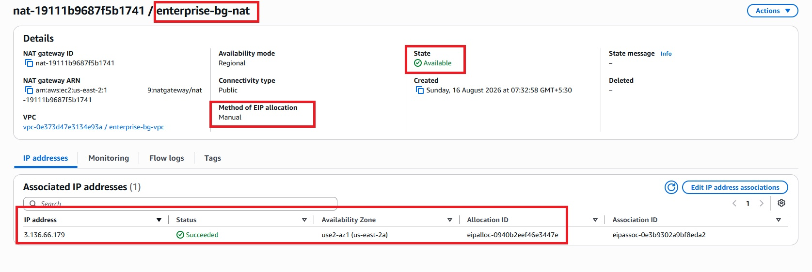

---
## 6 . Configure Private Route Tables and Associate Subnet

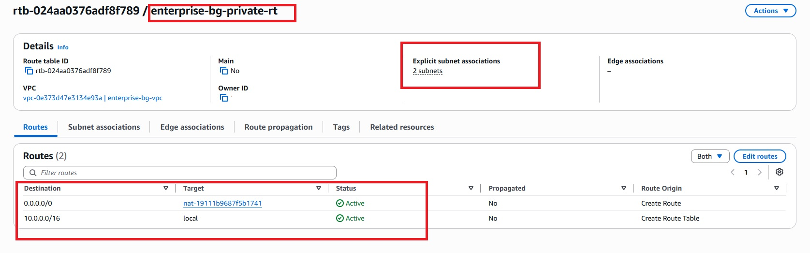

---
## 7. Create IAM Role 

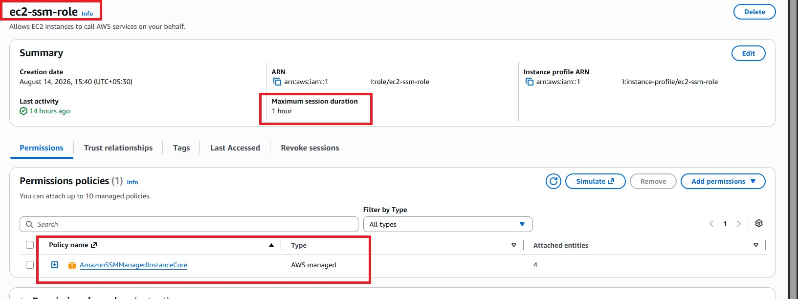

---
## 8. Create Security Groups 

For Application load balancer :

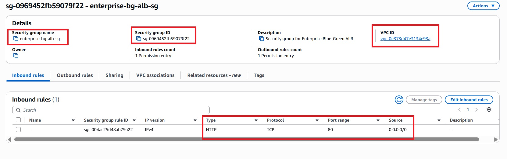

For web server :
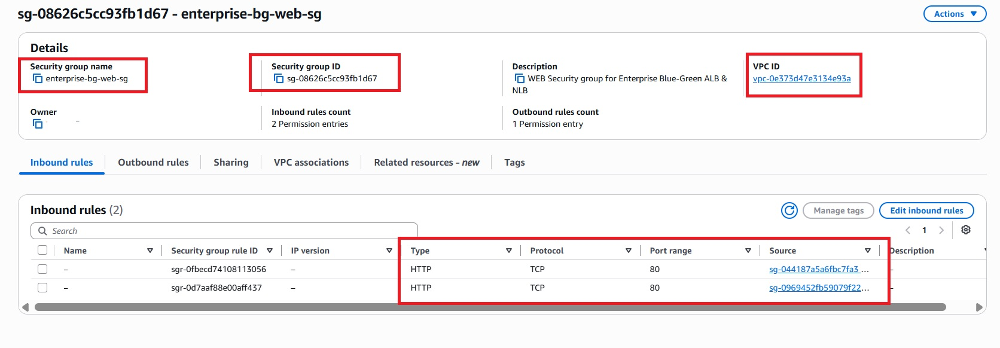

---
## 9. Launch Blue EC2 server 

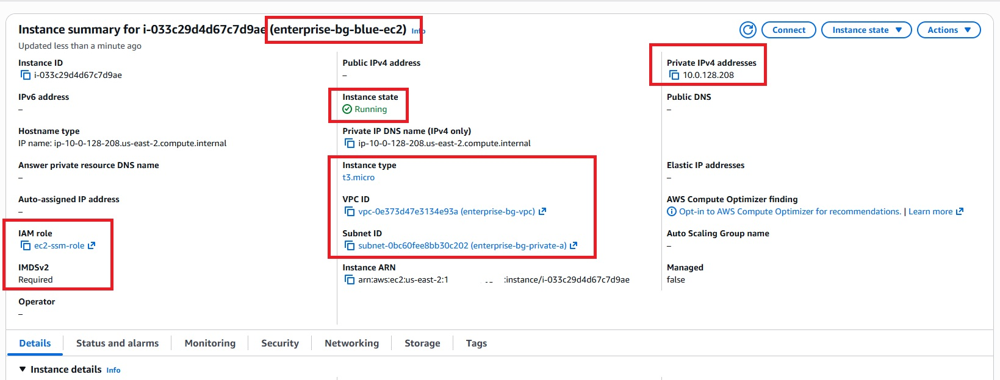

---
## 10. Launch Green EC2 server 

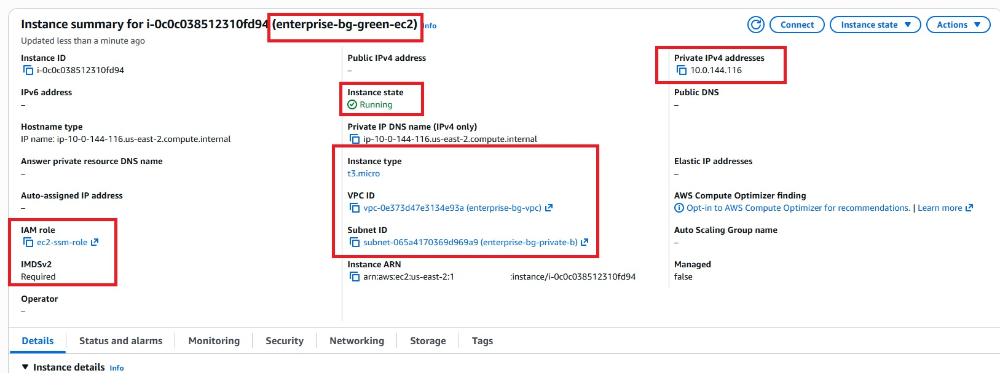

---
## 11. Connect Blue EC2 session manager

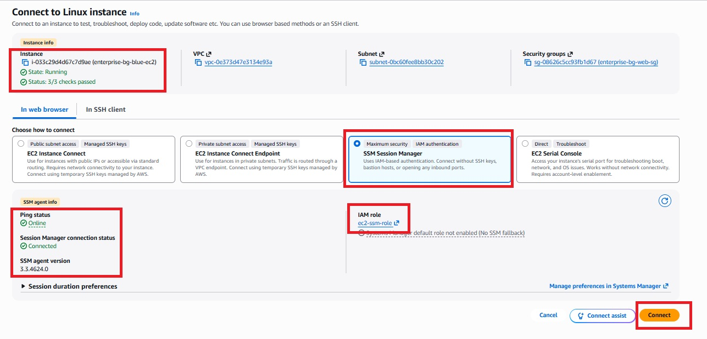

---
## 12. Check Nginx Status  For Blue EC2 server

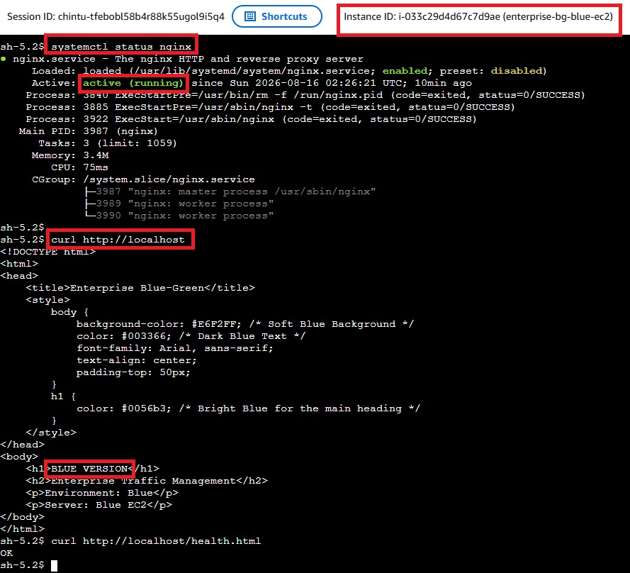

---
## 13. Connect Green EC2 session manager

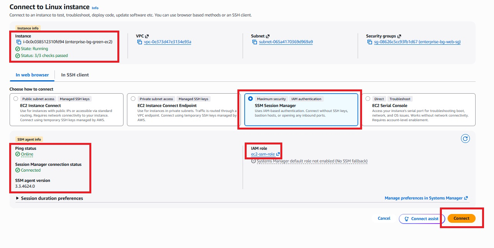

---
## 14. Check Nginx Status For Green EC2 seerver

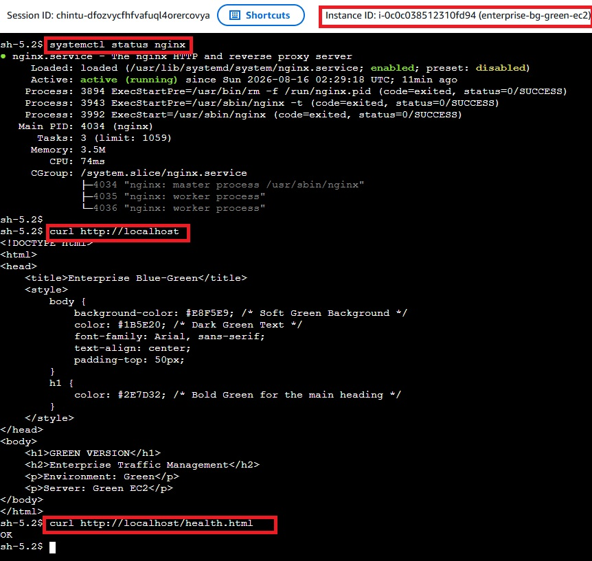

---
## 15. Create Blue Target Group

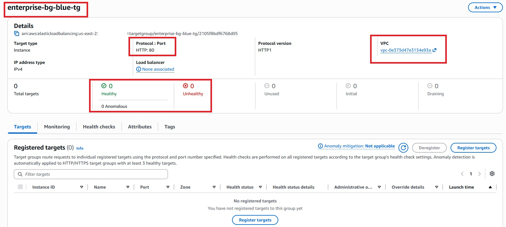

---
## 16. Create Green Target Group

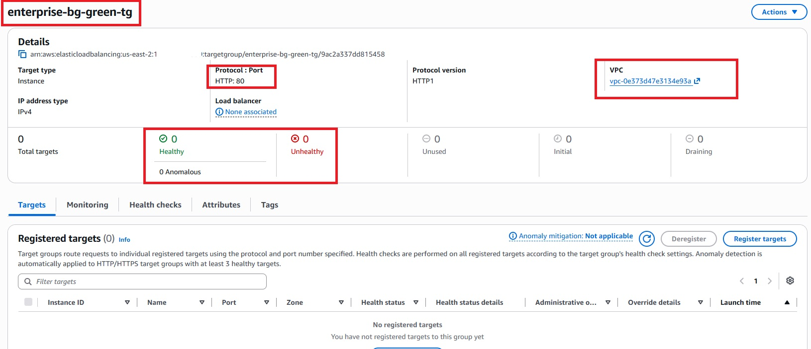

---
## 17. Create Application Load Balancer

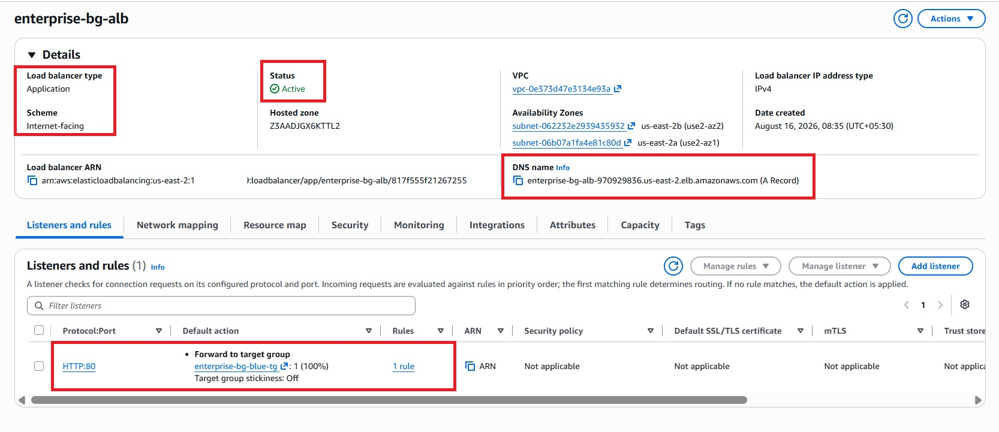

---
## 18. Validate Blue Environment

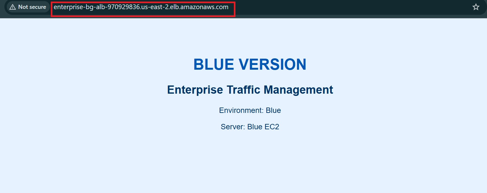

---
## 19. Validate Green Environment

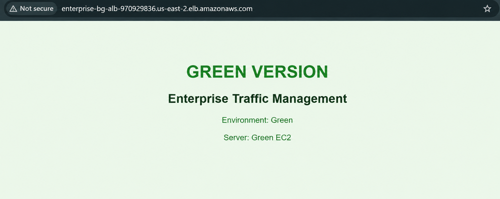

---
## 🎯 Key DevOps Concepts Demonstrated

This project demonstrates practical understanding of:

- AWS VPC architecture
- Public vs Private Subnets
- Multi-AZ architecture
- Application Load Balancing
- Target Groups
- Blue-Green Deployment
- Target Tracking
- Health Checks
- High Availability
- Fault Tolerance
- Zero/Minimal Downtime Deployment
  
---
## 👨‍💻 Author

Hardik Darji

DevOps Engineer

---

## ⭐ Support

If this project helped you understand AWS Blue-Green deployment and enterprise traffic management, consider giving the repository a ⭐.

Built for hands-on DevOps learning and real-world cloud architecture practice.
        
