# Day 11 — Private, Versioned, and Protected Amazon S3

> **AWS Learning Journey — Day 11**
> A hands-on implementation of secure, versioned, encrypted, lifecycle-managed, and protected Amazon S3 storage using AWS S3, AWS KMS, S3 Versioning, Lifecycle Management, Presigned URLs, and S3 Object Lock.

---

## 📌 Project Overview

This project demonstrates how to build a secure and resilient Amazon S3 architecture using multiple layers of data protection.

The implementation focuses on:

*  Private S3 bucket security
*  S3 Versioning and object recovery
*  Customer-managed AWS KMS encryption
*  S3 Block Public Access
*  Presigned URL temporary access
*  Bucket-to-bucket object replication/copy
*  S3 Lifecycle Management
*  Noncurrent version cleanup
*  Intelligent-Tiering and S3 Standard storage classes
*  S3 Object Lock
*  Legal Hold protection
*  AWS CLI validation
* 🧹 Complete AWS resource cleanup

---

# 🏗️ Architecture

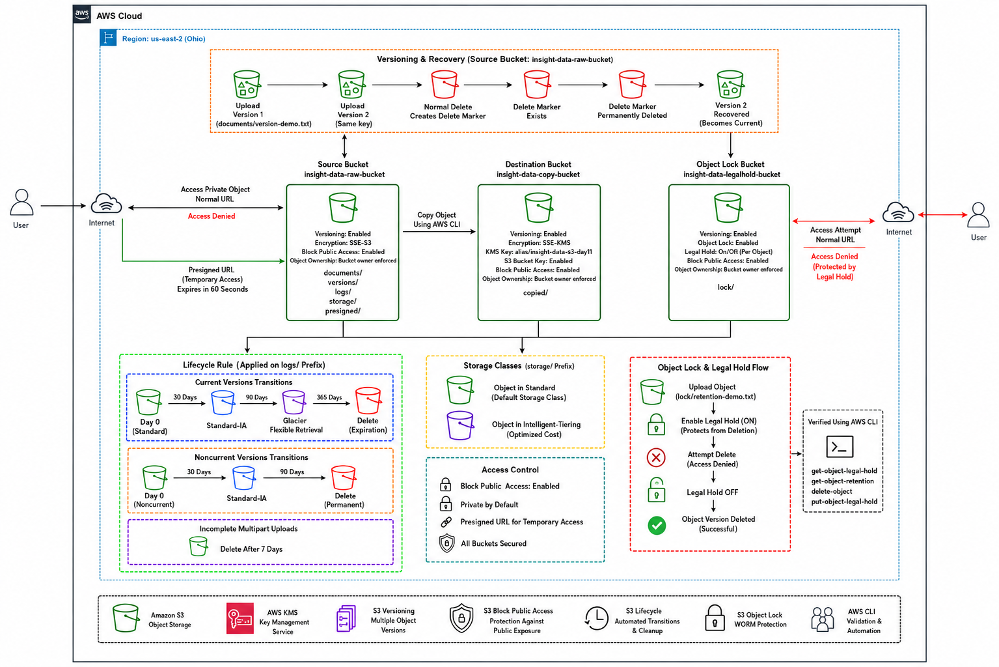
 
---

# 🎯 Objectives

The objective of this lab is to implement an enterprise-style S3 storage workflow that demonstrates:

1. Secure private buckets
2. Encryption using SSE-S3 and SSE-KMS
3. Customer-managed KMS key management
4. S3 Versioning
5. Delete-marker recovery
6. Temporary private access
7. Storage-class optimization
8. Automated lifecycle management
9. Noncurrent-version cleanup
10. Object Lock Legal Hold protection
11. AWS CLI-based validation
12. Proper AWS resource cleanup

---

# 1. Select AWS Region

Log in to the AWS Management Console.

Select:

```text
US East (Ohio)
us-east-2
```

Use the same region throughout the project.

---

# 2. Create Customer-Managed KMS Key

Navigate to:

```text
AWS Console
→ KMS
→ Customer managed keys
→ Create key
```

## Key Configuration

Select:

```text
Key type:
Symmetric
```

Key usage:

```text
Encrypt and decrypt
```

---

## Key Alias

Use:

```text
alias/insight-data-s3-day11
```

Description:

```text
Customer managed KMS key for Day 11 S3 SSE-KMS encryption
```

---

## Key Administrators

Select the IAM user that manages your AWS/KMS resources.

Example:

```text
chintu
```

Do not select unrelated AWS service-linked roles as key administrators.

---

## Key Users

Select the IAM user/role that will perform the cryptographic operations required for the S3 lab.

For a personal lab where the same IAM user manages the resources:

```text
chintu
```

can be selected.

---

## Create the Key

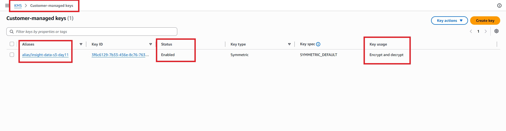

Review the configuration and create the key.

Verify:

```text
Key status: Enabled
Alias: alias/insight-data-s3-day11
```
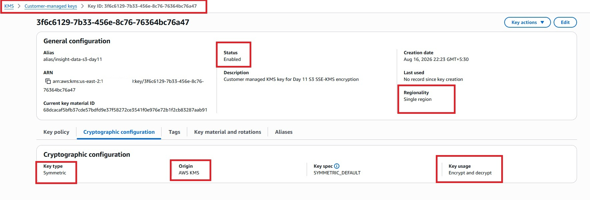

---

# 3. Create Private Source Bucket

Navigate to:

```text
S3
→ Buckets
→ Create bucket
```

Bucket name:

```text
insight-data-raw-bucket-<unique-suffix>
```

Example:

```text
insight-data-raw-bucket-8427
```

Region:

```text
us-east-2
```

---

## Object Ownership

Select:

```text
Bucket owner enforced
```

This disables ACL-based access control.

---

## Block Public Access

Keep:

```text
Block all public access
```

enabled.

All four settings should remain enabled.

---

## Enable Versioning

Select:

```text
Bucket Versioning: Enable
```

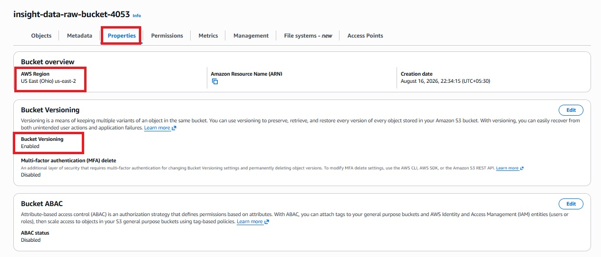

---

## Encryption

Select:

```text
Amazon S3 managed keys
SSE-S3
```
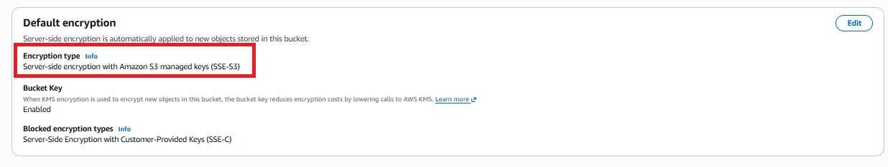

Create the bucket.

---

# 4. Validate Source Bucket

Open:

```text
insight-data-raw-bucket-<unique-suffix>
```

Navigate to:

```text
Properties
```

Verify:

```text
Region: us-east-2
Versioning: Enabled
Object Ownership: Bucket owner enforced
Default encryption: SSE-S3
```
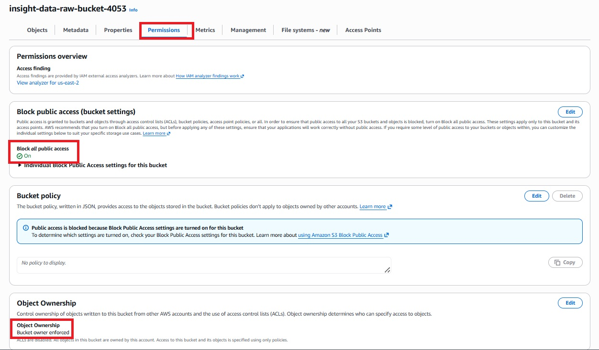

Then navigate to:

```text
Permissions
→ Block public access
```

Verify all four settings are enabled.

---

# 5. Create SSE-KMS Destination Bucket

Navigate to:

```text
S3
→ Create bucket
```

Bucket name:

```text
insight-data-copy-bucket-<unique-suffix>
```

Example:

```text
insight-data-copy-bucket-8427
```

Region:

```text
us-east-2
```

---

## Object Ownership

Select:

```text
Bucket owner enforced
```
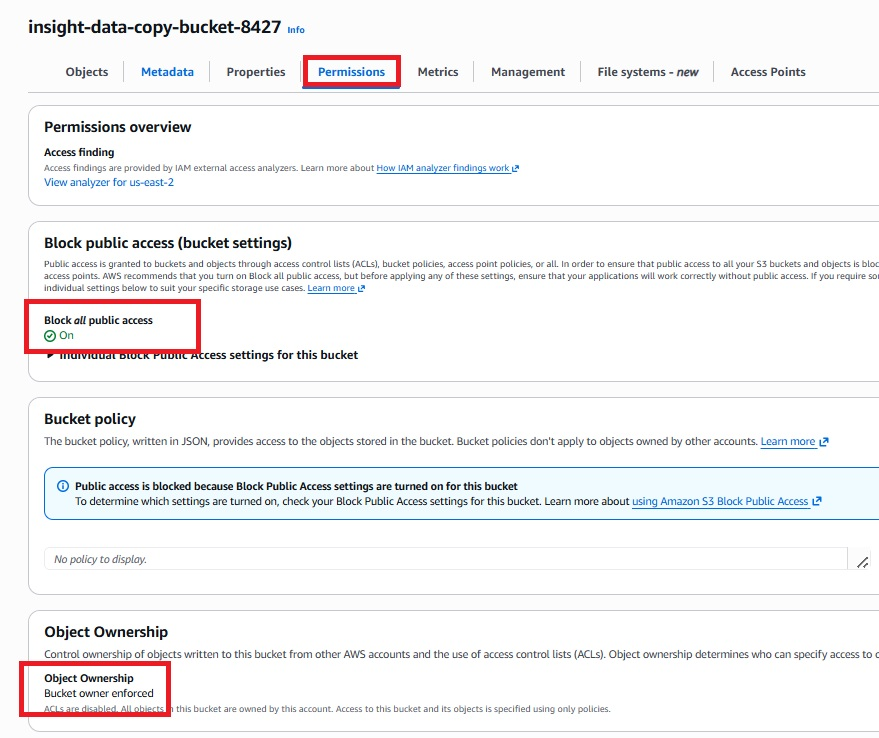

---

## Block Public Access

Keep:

```text
Block all public access
```

enabled.

---

## Versioning

Enable:

```text
Versioning
```
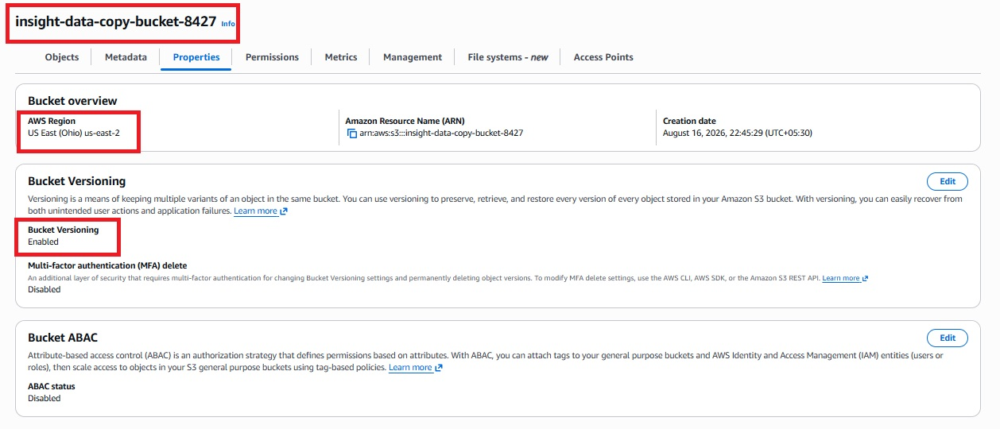

---

## Default Encryption

Select:

```text
Server-side encryption with AWS KMS keys
SSE-KMS
```
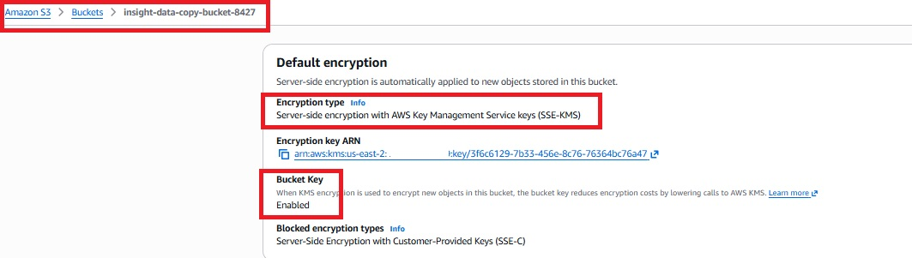

Select:

```text
alias/insight-data-s3-day11
```

Enable:

```text
S3 Bucket Key
```

Create the bucket.

---

# 6. Validate Destination Encryption

Open the destination bucket.

Navigate to:

```text
Properties
→ Default encryption
```
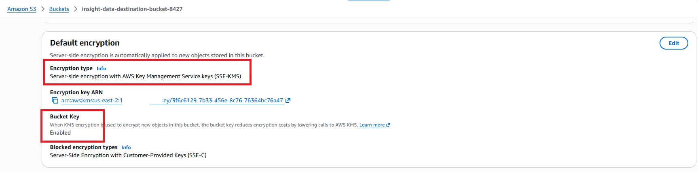

Verify:

```text
Encryption: SSE-KMS
KMS Key: insight-data-s3-day11
S3 Bucket Key: Enabled
```
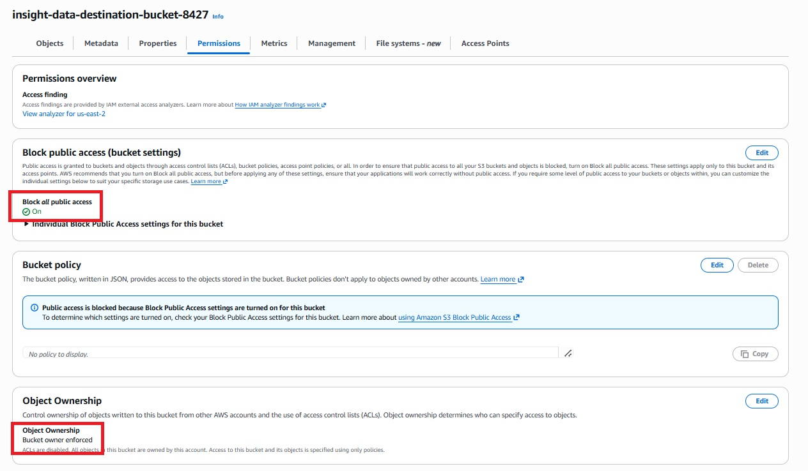

Also verify:

```text
Versioning: Enabled
Block Public Access: Enabled
Bucket owner enforced: Enabled
```

---

# 7. Create Object Lock Bucket

Navigate to:

```text
S3
→ Create bucket
```

Bucket name:

```text
insight-data-legalhold-bucket-<unique-suffix>
```

Example:

```text
insight-data-legalhold-bucket-8427
```

Region:

```text
us-east-2
```
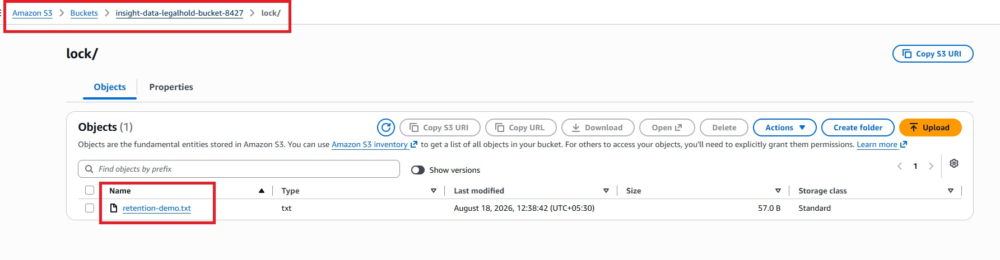

---

## Enable Object Lock

Enable:

```text
Object Lock
```
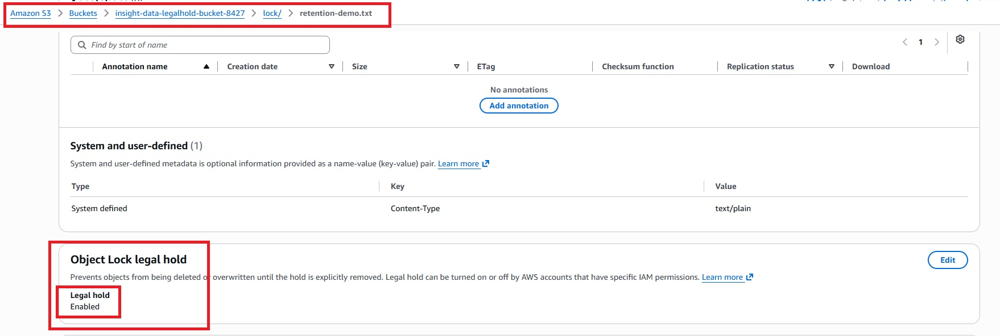

Object Lock requires Versioning.

Accept the confirmation.

---

## Important

Do not configure a default retention period.

The objective of this lab is to demonstrate:

```text
Legal Hold
```

on an individual object version.

---

## Security Configuration

Configure:

```text
Object Ownership:
Bucket owner enforced

Block Public Access:
Enabled

Encryption:
SSE-S3
```

Create the bucket.

---

# 8. Validate Object Lock

Open:

```text
insight-data-legalhold-bucket-<unique-suffix>
```

Go to:

```text
Properties
```

Verify:

```text
Versioning: Enabled
Object Lock: Enabled
Default retention: None
```

---

# 9. Create S3 Prefixes

Open the source bucket:

```text
insight-data-raw-bucket-<unique-suffix>
```
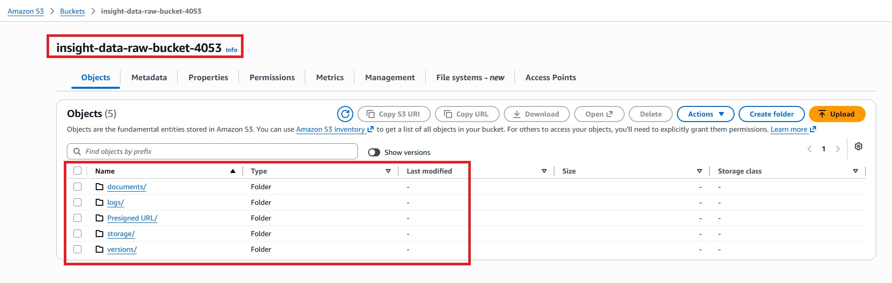

Create these folders:

```text
documents/
versions/
logs/
storage/
presigned/
```

---

# 10. Test S3 Standard Storage Class

Create a local file:

```text
standard-demo.txt
```

Example content:

```text
This object demonstrates Amazon S3 Standard storage.
```

Upload it to:

```text
storage/
```

Open the object properties.

Verify:

```text
Storage class: Standard
```
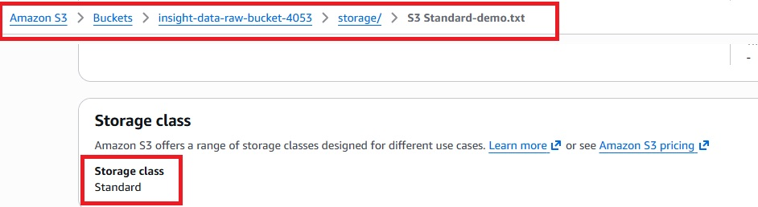

---

# 11. Test Intelligent-Tiering

Create:

```text
intelligent-tiering-demo.txt
```

Example:

```text
This object demonstrates S3 Intelligent-Tiering.
```

Upload it to:

```text
storage/
```
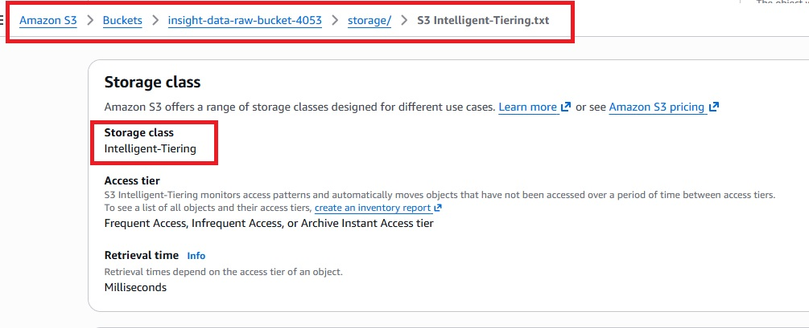

During upload, select:

```text
Storage class:
Intelligent-Tiering
```

Verify the object's storage class after upload.

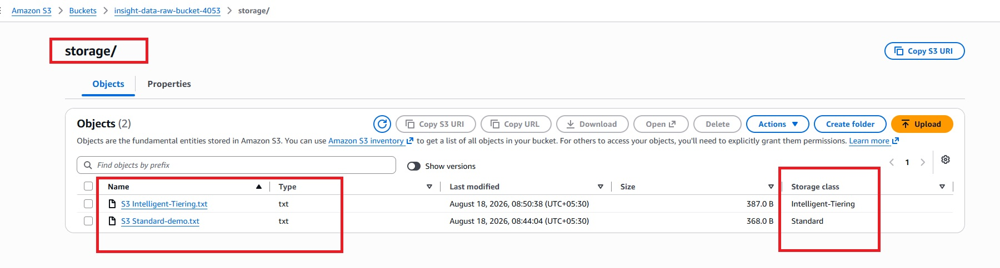

---

# 12. Test S3 Versioning — Version 1

Navigate to:

```text
versions/
```

Create:

```text
version-demo.txt
```
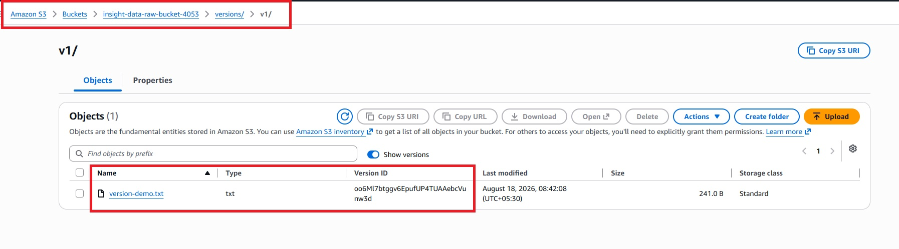


Upload the object.

Select:

```text
Show versions
```

Record the Version ID.

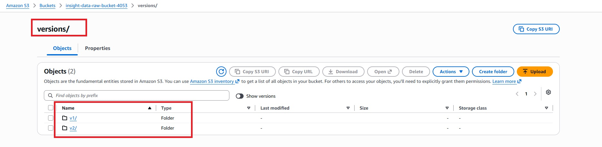

---

# 13. Upload Version 2

Modify the file:

```text
This is Version 2 of the demonstration object.
```

Upload it using the exact same key:

```text
versions/version-demo.txt
```
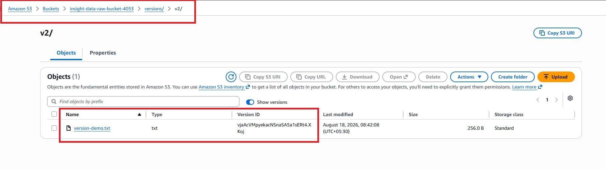

Enable:

```text
Show versions
```

You should now see: 

versions

```text
versions1
versions2
```

Each version has a different Version ID.

Version 2 should be the current version.

---

# 14. Demonstrate Delete Marker

Select:

```text
versions/version-demo.txt
```

Perform a normal delete.

Because Versioning is enabled, S3 creates a:

```text
Delete Marker
```

instead of permanently deleting the previous data version.

Enable:

```text
Show versions
```

Expected:

```text
Delete Marker
Version 2
Version 1
```
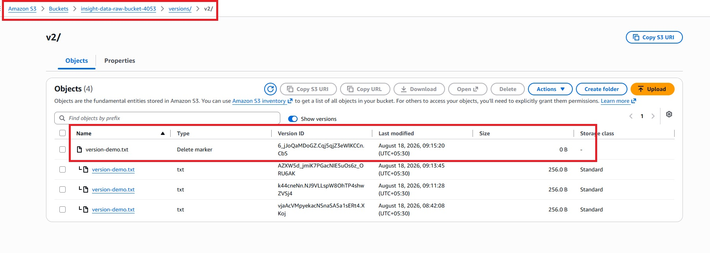

---

# 15. Recover Version 2

Select only the delete marker.

Permanently delete the delete marker.

Do not delete Version 2.

Refresh the object list.

Version 2 should become the current version again.

Verify the content:

```text
This is Version 2 of the demonstration object.
```
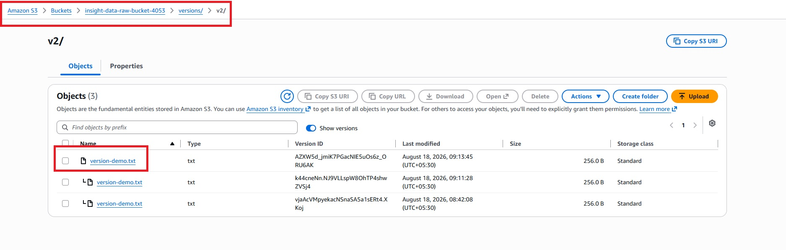

---

# 16. Upload Private Report

Create:

```text
private-report.txt
```

Example content:

```text
Confidential S3 Day 11 demonstration report.
```

Upload to:

```text
documents/private-report.txt
```
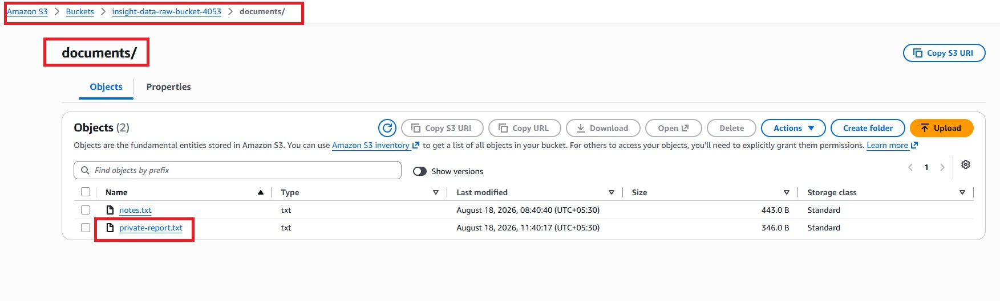

---

# 17. Copy Object Using AWS CLI

Set variables:

```bash
SOURCE_BUCKET="insight-data-raw-bucket-<unique-suffix>"
DEST_BUCKET="insight-data-copy-bucket-<unique-suffix>"
```

Copy the object:

```bash
aws s3 cp \
s3://$SOURCE_BUCKET/documents/private-report.txt \
s3://$DEST_BUCKET/copied/s3-data-reports.txt
```
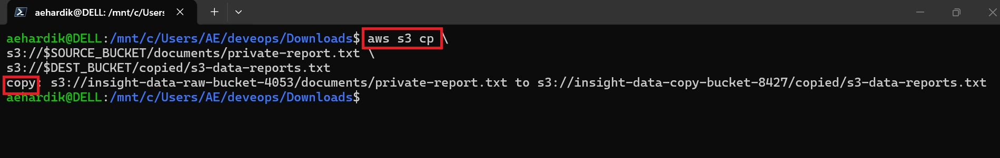

Verify:

```text
copied/s3-data-reports.txt
```

exists in the destination bucket.

---

# 18. Verify Destination Encryption

Open:

```text
copied/s3-data-reports.txt
```
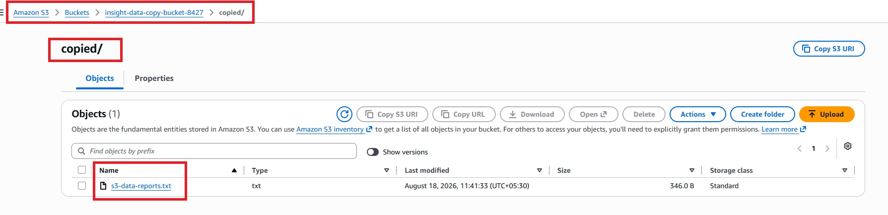

---

# 19. Test Private Object Access

Open:

```text
documents/private-report.txt
```

Copy the normal Object URL.

Open the URL using an incognito/private browser window.

Expected result:

```text
AccessDenied
```
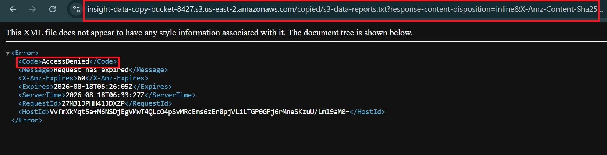

This confirms that the object is private.

---

# 20. Controlled Public Access Test

Navigate to:

```text
Bucket
→ Permissions
→ Bucket policy
```
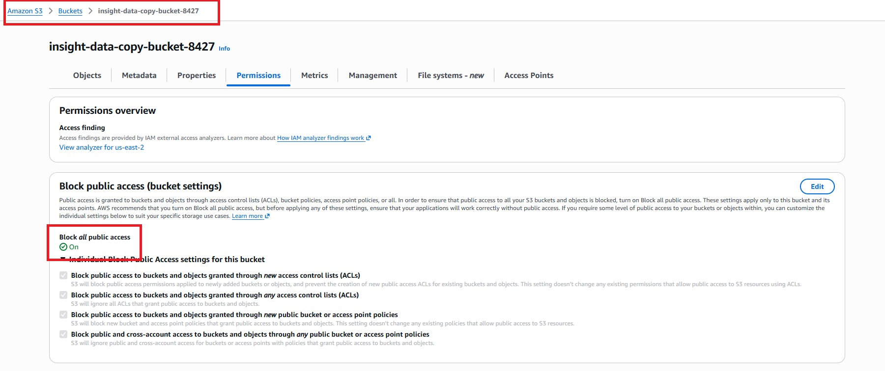

With Block Public Access enabled, a public-read policy should be blocked/rejected or prevented from providing public access.

Example test policy:

```json
{
  "Version": "2012-10-17",
  "Statement": [
    {
      "Sid": "TestPublicRead",
      "Effect": "Allow",
      "Principal": "*",
      "Action": "s3:GetObject",
      "Resource": "arn:aws:s3:::YOUR_BUCKET_NAME/*"
    }
  ]
}
```

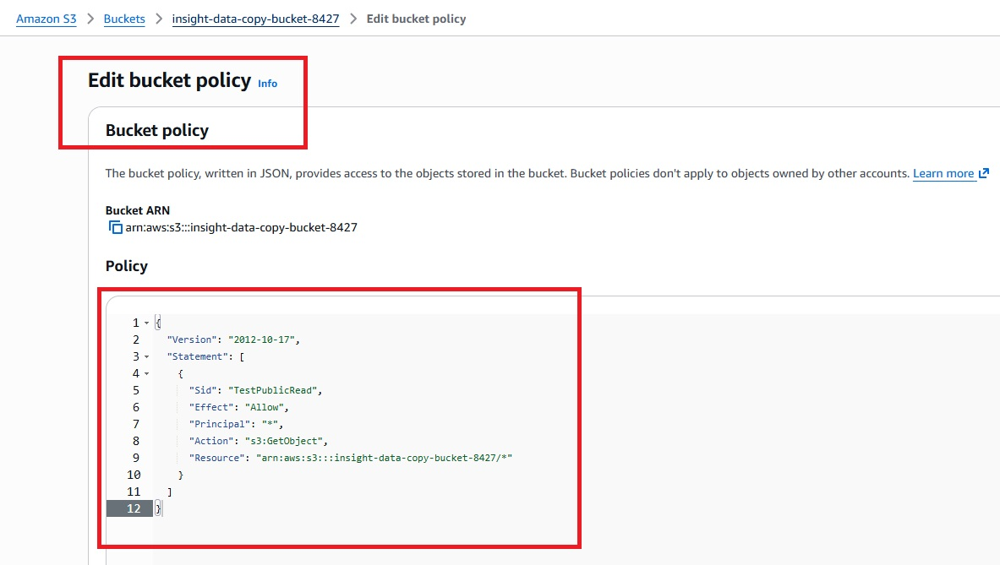

Replace:

```text
YOUR_BUCKET_NAME
```

with the actual bucket name.

After testing, ensure no public policy remains.

Final state:

```text
Block Public Access: Enabled
```

---

# 21. Generate Presigned URL

Use AWS CLI:

```bash
aws s3 presign \
s3://$SOURCE_BUCKET/documents/private-report.txt \
--expires-in 60
```
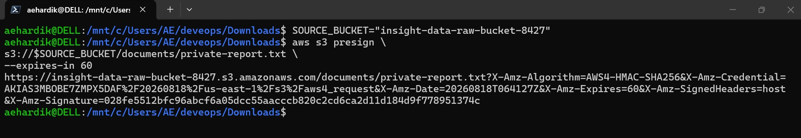

The command returns a temporary signed URL.

---

# 22. Validate Presigned URL

Open the presigned URL in an incognito/private browser.

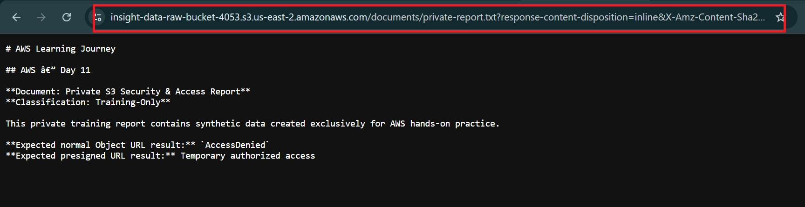

Expected:

```text
Object accessible
```

The object remains private.

After approximately 60 seconds, the URL should expire.

Refresh the URL.

Expected:

```text
Access denied / expired request
```

This demonstrates:

```text
Private Object
      |
      +-- Normal URL → AccessDenied
      |
      +-- Presigned URL → Temporary Access
```

---

# 23. Create Lifecycle Rule

Navigate to:

```text
S3
→ Source Bucket
→ Management
→ Lifecycle rules
→ Create lifecycle rule
```

Rule name:

```text
logs-transition-and-cleanup
```

---

## Lifecycle Scope

Limit the rule to the prefix:

```text
logs/
```

---

# 24. Current Version Transitions

Configure:

### After 30 days

```text
Standard-IA
```

### After 90 days

```text
Glacier Flexible Retrieval
```

### After 365 days

```text
Expiration / Delete
```

Final lifecycle flow:

```text
Object Created
      |
      | 30 days
      v
Standard-IA
      |
      | 90 days
      v
Glacier Flexible Retrieval
      |
      | 365 days
      v
Delete
```

---

# 25. Configure Noncurrent Versions

Configure:

```text
Noncurrent versions
```

After:

```text
30 days → Standard-IA
```

Then:

```text
90 days → Permanent deletion
```

This controls storage costs from old object versions.

---

# 26. Configure Multipart Upload Cleanup

Enable:

```text
Delete expired incomplete multipart uploads
```

Set:

```text
7 days
```

This automatically removes incomplete multipart uploads.

---

# 27. Final Lifecycle Configuration

The rule should contain:

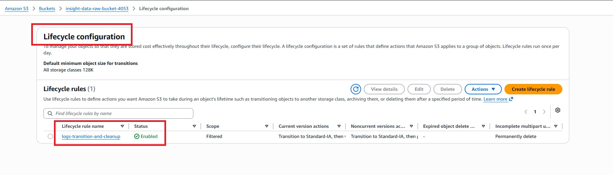

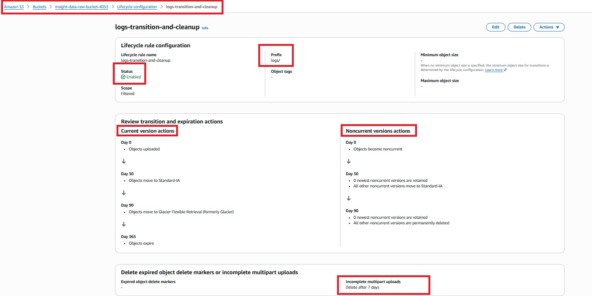

---

# 28. Create Legal Hold Demonstration Object

Open:

```text
insight-data-legalhold-bucket-<unique-suffix>
```

Create:

```text
lock/
```

Upload:

```text
retention-demo.txt
```

Example content:

```text
This object is protected using S3 Object Lock Legal Hold.
```

---

# 29. Enable Legal Hold

Open:

```text
lock/retention-demo.txt
```

Enable:

```text
Show versions
```

Select the required object version.

Go to:

```text
Properties
→ Object Lock
→ Legal Hold
```

Set:

```text
ON
```

Save the change.

---

# 30. Verify Legal Hold

Verify:

```text
Legal Hold: ON
```

The specific object version is now protected from permanent deletion.

---

# 31. Test Protected Deletion

Attempt to permanently delete the protected object version.

Expected result:

```text
AccessDenied
```

Typical error:

```text
Access Denied because object protected by Object Lock.
```

This is an expected and successful result for the Legal Hold validation.

---

# 32. Verify Legal Hold Using AWS CLI

Set variables:

```bash
LOCK_BUCKET="insight-data-legalhold-bucket-<unique-suffix>"
KEY="lock/retention-demo.txt"
VERSION_ID="YOUR_VERSION_ID"
```

Run:

```bash
aws s3api get-object-legal-hold \
--bucket "$LOCK_BUCKET" \
--key "$KEY" \
--version-id "$VERSION_ID" \
--region us-east-2
```

Expected:

```json
{
    "Status": "ON"
}
```

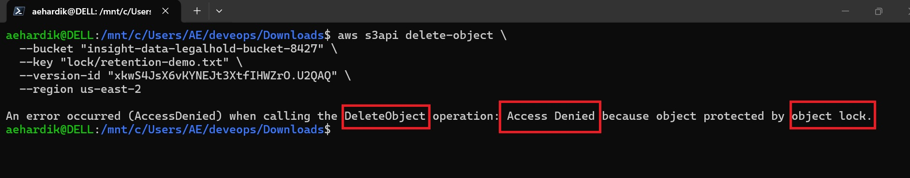

---

# 33. Check Object Retention

Run:

```bash
aws s3api get-object-retention \
--bucket "$LOCK_BUCKET" \
--key "$KEY" \
--version-id "$VERSION_ID" \
--region us-east-2
```

For this lab, no default retention should have been configured.

The protection should come from the Legal Hold.

---

# 34. Remove Legal Hold

Once the deletion test has been captured, change:

```text
Legal Hold:
ON → OFF
```
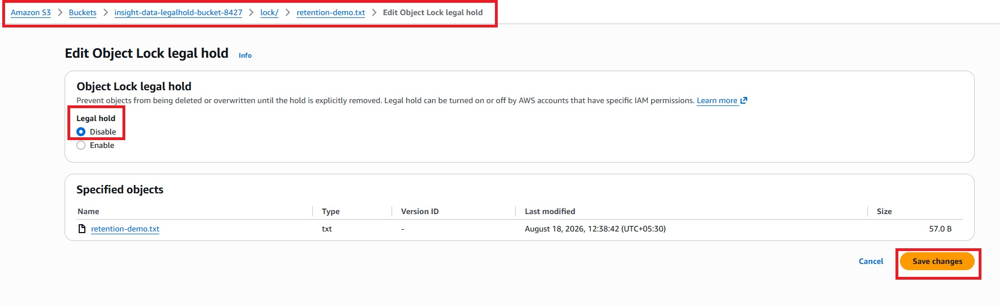

Expected:

```json
{
    "Status": "OFF"
}
```

---

# 35. Permanently Delete the Object Version

After Legal Hold has been removed:

```bash
aws s3api delete-object \
--bucket "$LOCK_BUCKET" \
--key "$KEY" \
--version-id "$VERSION_ID" \
--region us-east-2
```
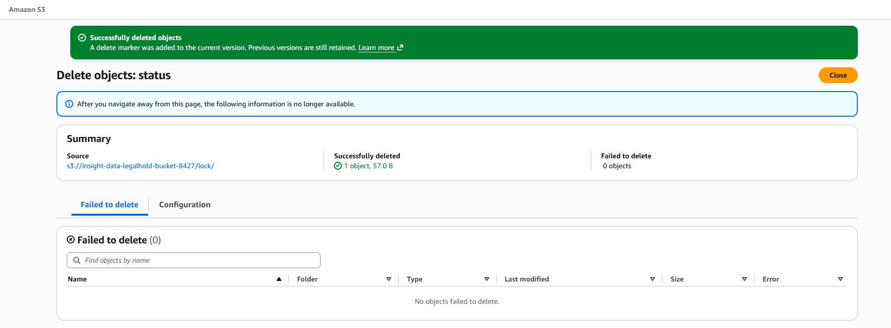

Deletion should now succeed.

---

# 🧹 Cleanup

After capturing all screenshots and completing the documentation, clean up the AWS resources.

## 1. Remove Lifecycle Rule

Delete:

```text
logs-transition-and-cleanup
```

---

## 2. Empty Source Bucket

Delete all objects.

Because Versioning is enabled, also delete:

* Current versions
* Noncurrent versions
* Delete markers

---

## 3. Empty Destination Bucket

Delete:

```text
copied/s3-data-reports.txt
```

Also remove all object versions and delete markers.

---

## 4. Clean Object Lock Bucket

Make sure:

```text
Legal Hold = OFF
```

Then delete:

```text
lock/retention-demo.txt
```

and its object version.

---

## 5. Delete Object Lock Bucket

Delete:

```text
insight-data-legalhold-bucket-<unique-suffix>
```

---

## 6. Delete Destination Bucket

Delete:

```text
insight-data-copy-bucket-<unique-suffix>
```

---

## 7. Delete Source Bucket

Delete:

```text
insight-data-raw-bucket-<unique-suffix>
```

---

## 8. KMS Key Cleanup

If this KMS key was created only for this temporary lab, schedule it for deletion after confirming that no remaining resources depend on it.

```text
alias/insight-data-s3-day11
```

> Do not schedule a KMS key for deletion if you still need it for other encrypted resources.

---

# 📊 Project Result

The Day 11 implementation successfully demonstrates a secure Amazon S3 architecture using multiple AWS security and resilience mechanisms.

### Implemented

```text
                    SECURE S3 STORAGE
                           |
       +-------------------+-------------------+
       |                   |                   |
       v                   v                   v
   PRIVATE             ENCRYPTED           PROTECTED
       |                   |                   |
       v                   v                   v
Block Public          SSE-S3 / SSE-KMS     Object Lock
Access                Customer KMS Key     Legal Hold
       |                   |                   |
       +-------------------+-------------------+
                           |
                           v
                     VERSIONING
                           |
                 +---------+---------+
                 |                   |
                 v                   v
            Recovery            Delete Marker
                 |
                 v
             Version 2
             Recovered

                           |
                           v
                    LIFECYCLE MANAGEMENT
                           |
              +------------+------------+
              |            |            |
              v            v            v
          Standard-IA   Glacier      Expiration
```

---

# 🔑 Key Takeaways

### 1. S3 Versioning

Versioning protects objects from accidental deletion and unwanted overwrites by maintaining multiple object versions.

### 2. Block Public Access

S3 Block Public Access provides an additional layer of protection against unintended public exposure.

### 3. SSE-KMS

SSE-KMS provides encryption at rest while allowing centralized control over encryption keys through AWS KMS.

### 4. S3 Bucket Key

S3 Bucket Key can reduce the frequency of KMS requests for S3 server-side encryption.

### 5. Presigned URLs

Presigned URLs provide temporary access to private objects without making the bucket or object public.

### 6. Lifecycle Management

Lifecycle rules automate storage-class transitions and object cleanup, helping optimize storage costs.

### 7. Object Lock

S3 Object Lock can protect object versions from deletion.

### 8. Legal Hold

Legal Hold prevents permanent deletion until the hold is explicitly removed.

### 9. Independent Object Versions

Copying an object to another versioned bucket creates an independent destination object and version history.

### 10. Defense in Depth

Combining:

```text
Private Access
+
Block Public Access
+
Encryption
+
Versioning
+
Lifecycle Management
+
Object Lock
+
Legal Hold
```

creates a strong foundation for secure and resilient object-storage workflows.

---
# 📌 Final Project Statement

> Successfully implemented a private, versioned, encrypted, lifecycle-managed, and protected Amazon S3 architecture using SSE-S3, SSE-KMS, customer-managed AWS KMS keys, S3 Bucket Key, Versioning, Presigned URLs, Lifecycle Management, and S3 Object Lock Legal Hold. Validated object recovery, private access controls, bucket-to-bucket copying, encryption, automated lifecycle policies, and deletion protection through both the AWS Management Console and AWS CLI.
---

# 👨‍💻 Author

**Hardik Darji**

DevOps Engineer

---
## ⭐ Support 

⭐ **If you find this repository helpful, please consider giving it a Star!**

Your support helps me stay motivated to keep learning, building, and sharing more DevOps & AWS projects. 🚀☁️

**Thanks for your support! 🙌**
