# Day 12 Lab – S3 Replication, Transfer, and Hybrid Storage

---

## 📌 Lab Overview

This lab demonstrates the practical implementation of Amazon S3 features including:

* S3 bucket creation and security
* S3 Versioning
* Same-Region Replication (SRR)
* Cross-Region Replication (CRR)
* Prefix-based replication
* S3 Transfer Acceleration
* Multipart upload lifecycle management
* S3 Object Lock
* S3 Static Website Hosting
* Amazon FSx overview
* AWS Hybrid Storage services
* Resource cleanup

---

# 🏗️ Architecture

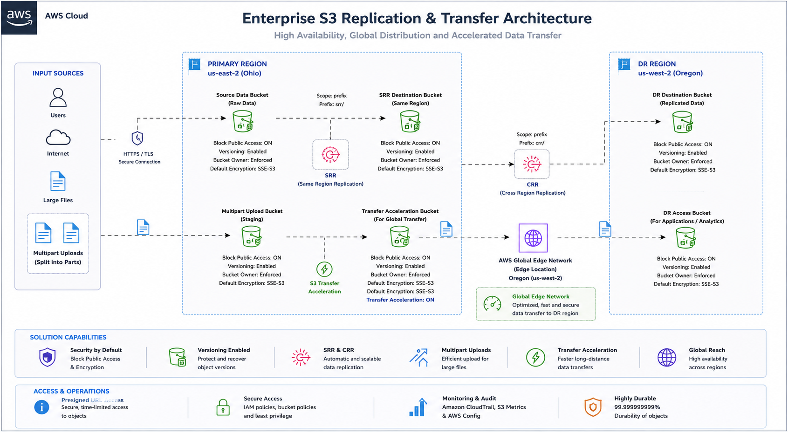


---

# ☁️ AWS Resources Used

| Resource       | Name                                 | Region                       |
| -------------- | ------------------------------------ | ---------------------------- |
| Source Bucket  | `insight-day12-source-01`            | US East (Ohio) `us-east-2`   |
| SRR Bucket     | `insight-day12-srr-ohio-01`          | US East (Ohio) `us-east-2`   |
| CRR Bucket     | `insight-day12-crr-oregon-01`        | US West (Oregon) `us-west-2` |
| Static Website | `insight-day12-static-website-01`    | US East (Ohio) `us-east-2`   |
| Object Lock    | `insight-day12-object-lock-01`       | US East (Ohio) `us-east-2`   |
| SRR Rule       | `srr-data-prefix-rule`               | —                            |
| CRR Rule       | `crr-data-prefix-rule`               | —                            |
| Lifecycle Rule | `multipart-uploads-cleanup`          | —                            |

---

# Step 1: Create the Source S3 Bucket

### 1.1 Open Amazon S3

Open the AWS Management Console and navigate to:

**AWS Console → S3 → Buckets**

### 1.2 Create the bucket

Click **Create bucket**.

### ✅ Validation

Verify that:

* Bucket exists.
* Region is `us-east-2`.
* Versioning is enabled.
* ACLs are disabled.
* Block Public Access is enabled.
* SSE-S3 encryption is enabled.

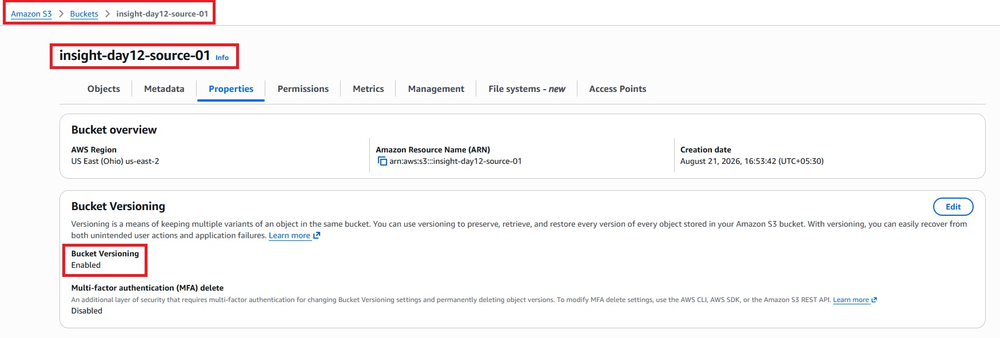

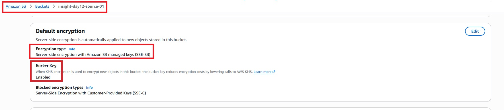

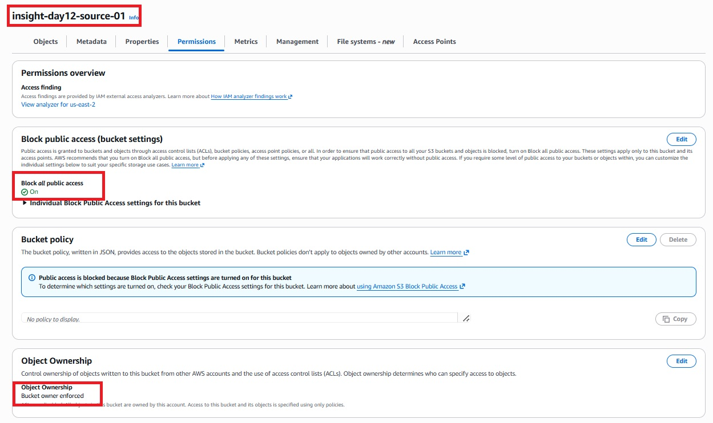

---

# Step 2: Create the SRR Destination Bucket

Create another bucket for Same-Region Replication.

```text
Bucket name:
insight-day12-srr-ohio-01

Region:
US East (Ohio) - us-east-2
```
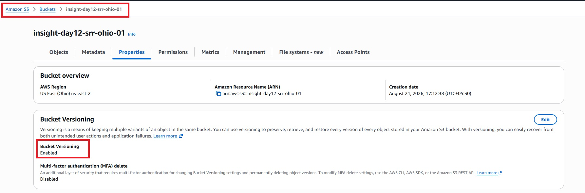

### ⚠️ Important

Versioning must be enabled on **both the source and destination buckets** for S3 replication.

Configure the same security settings:

```text
Object Ownership: Bucket owner enforced
ACLs: Disabled
Block Public Access: Enabled
Versioning: Enabled
Encryption: SSE-S3
```
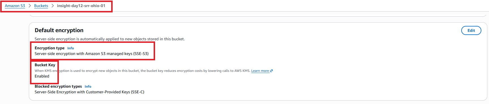


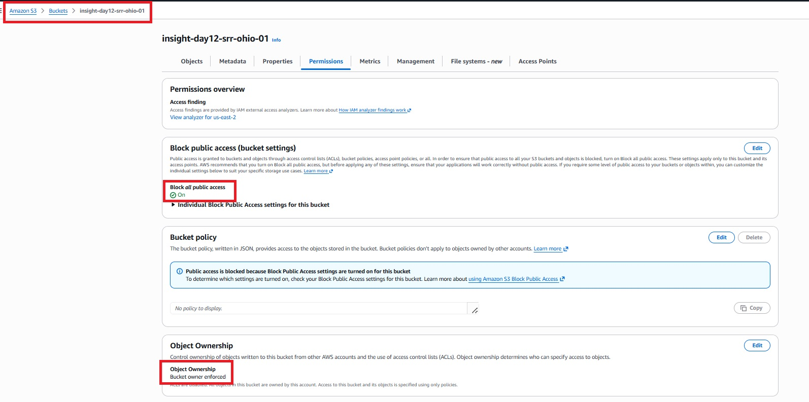

### ✅ Validation

Verify that:

```text
Destination:
insight-day12-srr-ohio-01
us-east-2
```

---

# Step 3: Create the CRR Destination Bucket

Create the Cross-Region Replication destination.

```text
Bucket name:
insight-day12-crr-oregon-01

Region:
US West (Oregon) - us-west-2
```
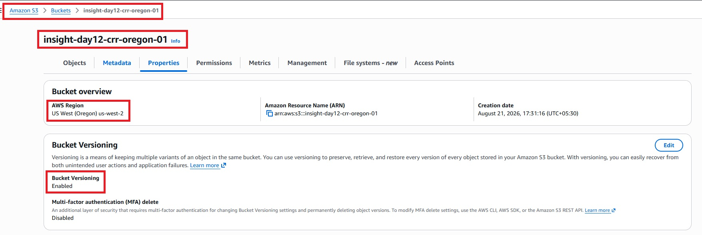

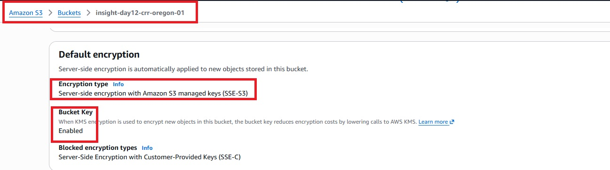

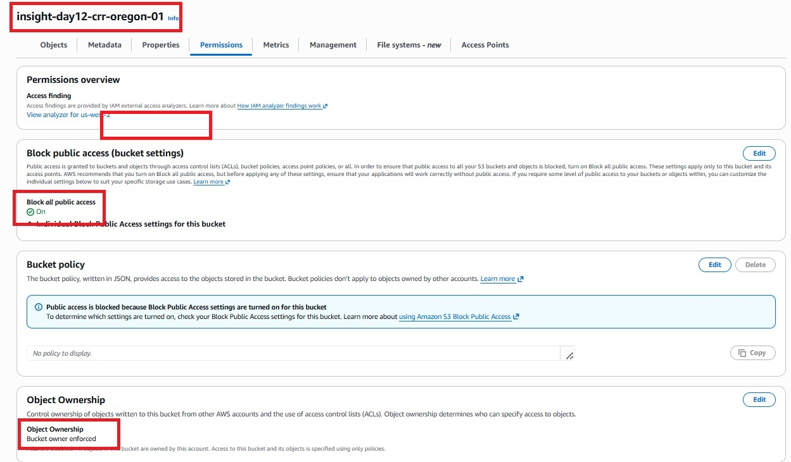

Configure:

```text
Object Ownership: Bucket owner enforced
ACLs: Disabled
Block Public Access: Enabled
Versioning: Enabled
Encryption: SSE-S3
```

### ✅ Validation

The architecture should now contain:

```text
Source
   │
   ├── SRR → Ohio
   │
   └── CRR → Oregon
```

---

# Step 4: Verify Bucket Regions

Open the S3 bucket list and verify all buckets.

| Bucket                        | Region      |
| ----------------------------- | ----------- |
| `insight-day12-source-01`     | `us-east-2` |
| `insight-day12-srr-ohio-01`   | `us-east-2` |
| `insight-day12-crr-oregon-01` | `us-west-2` |

Take a screenshot of the bucket list.

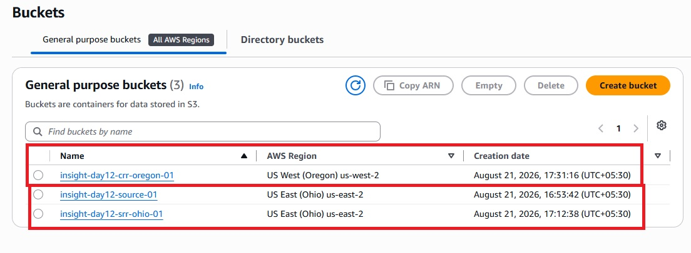

---

# Step 5: Upload Objects Before Creating Replication Rules

Open:

```text
insight-day12-source-01
```

Create the following folders/prefixes:

```text
srr/
crr/
```

Upload:

```text
srr/before-rule.txt
crr/before-rule.txt
```
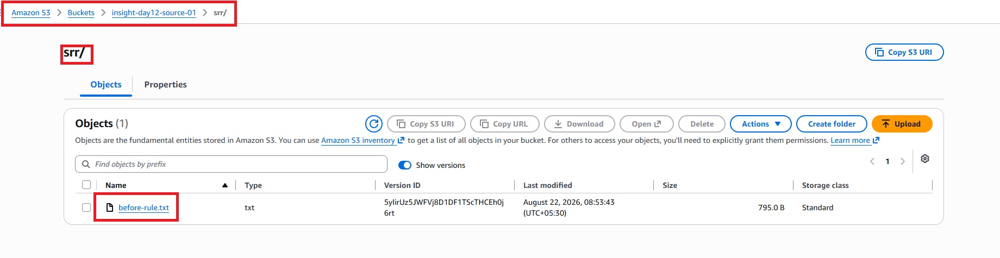

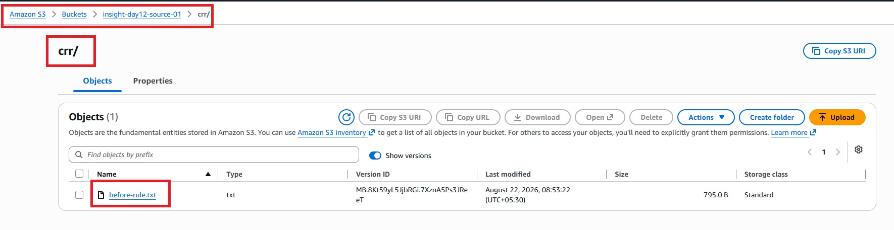


### Purpose

These objects are uploaded **before replication rules are created**.

This allows us to demonstrate that the configured live replication rules do not automatically replicate these existing objects.

---

# Step 6: Configure Same-Region Replication

Open:

```text
insight-day12-source-01
```

Go to:

**Management → Replication rules**

Click:

**Create replication rule**

### Configure the rule

```text
Rule name:
srr-data-prefix-rule

Status:
Enabled

Filter:
Prefix

Prefix:
srr/
```

### Destination

Select:

```text
Choose a bucket in this account

Destination:
insight-day12-srr-ohio-01
```

### IAM Role

Select:

```text
Create new role
```

Allow AWS to create the required IAM role.

### Existing Objects

Keep:

```text
Existing object replication: Disabled
```

### Advanced Settings

Keep the lab configuration:

```text
SSE-KMS / DSSE-KMS replication: Disabled
Replication Time Control: Disabled
Replication Metrics: Disabled
Delete Marker Replication: Disabled
Replica Modification Sync: Disabled
```

Click:

**Save**

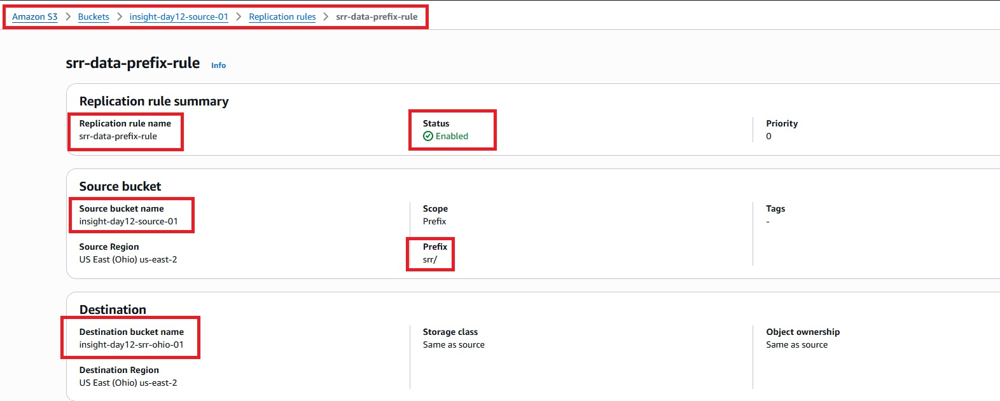


### ✅ Validation

The rule should show:

```text
srr-data-prefix-rule
Enabled
Prefix: srr/
Destination: insight-day12-srr-ohio-01
```

---

# Step 7: Configure Cross-Region Replication

Open:

```text
insight-day12-source-01
```

Go to:

**Management → Replication rules**

Click:

**Create replication rule**

Configure:

```text
Rule name:
crr-data-prefix-rule

Status:
Enabled

Prefix:
crr/
```

### Destination

Select:

```text
insight-day12-crr-oregon-01
```

### IAM Role

Create a new IAM service role.

### Existing Objects

Keep:

```text
Existing object replication: Disabled
```

### Advanced Settings

Configure:

```text
SSE-KMS / DSSE-KMS replication: Disabled
Replication Time Control: Disabled
Replication Metrics: Disabled
Delete Marker Replication: Disabled
Replica Modification Sync: Disabled
```

Save the rule.

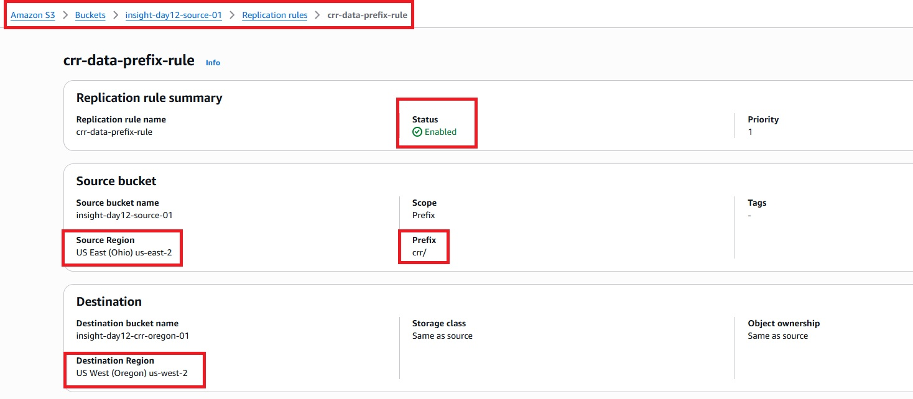

### ✅ Validation

Verify:

```text
crr-data-prefix-rule
Enabled
Prefix: crr/
Destination: insight-day12-crr-oregon-01
```

---

# Step 8: Test SRR Version 1 Replication

Open:

```text
insight-day12-source-01
```

Upload:

```text
srr/s3-srr-demo.txt
```

Open the object's properties.

Check:

```text
Replication status
```

Wait until it becomes:

```text
PENDING → COMPLETED
```

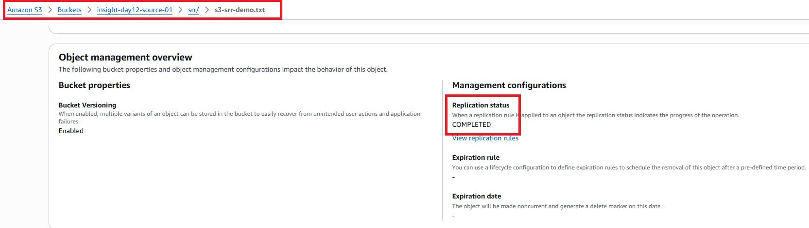

Now open:

```text
insight-day12-srr-ohio-01
```

Navigate to:

```text
srr/
```

Verify:

```text
s3-srr-demo.txt
```
is present.

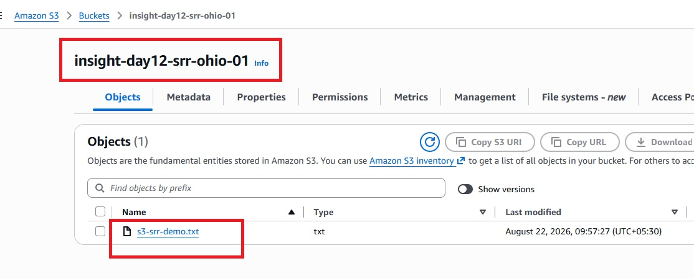


### Also verify

The old object:

```text
srr/before-rule.txt
```

should **not** exist in the destination.

---

# Step 9: Test CRR Version 1 Replication

Open:

```text
insight-day12-source-01
```

Upload:

```text
crr/s3-crr-demo.txt
```

Check the object's replication status.

Wait for:

```text
PENDING → COMPLETED
```

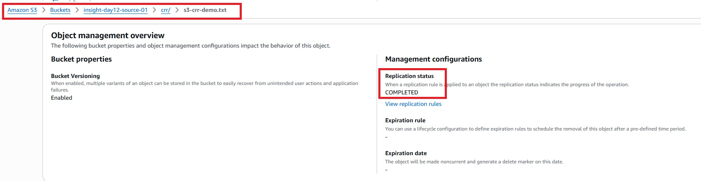

Now open:

```text
insight-day12-crr-oregon-01
```

Navigate to:

```text
crr/
```

Verify:

```text
s3-crr-demo.txt
```

is present.

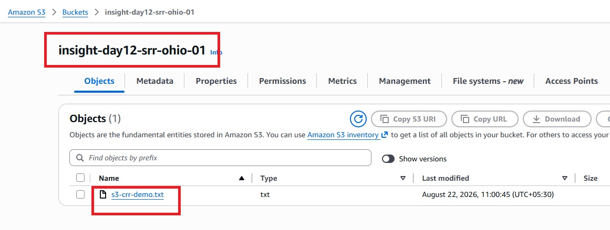

Also verify:

```text
crr/before-rule.txt
```

was not replicated.


---

# Step 10: Test SRR Versioning

Upload a new version of:

```text
srr/s3-srr-demo.txt
```

Use the same object key.

Because Versioning is enabled, S3 creates another version.

Go to:

**Show versions**

Verify:

```text
Version 1
Version 2
```

exist in the source bucket.

Then open:

```text
insight-day12-srr-ohio-01
```

Enable:

**Show versions**

Verify that both versions were replicated.

### Expected Result

```text
Source Bucket
 └── s3-srr-demo.txt
      ├── Version 1
      └── Version 2

SRR Destination
 └── s3-srr-demo.txt
      ├── Version 1
      └── Version 2
```

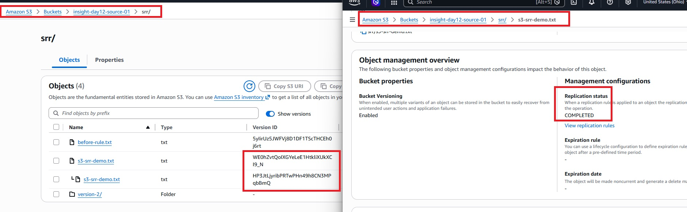

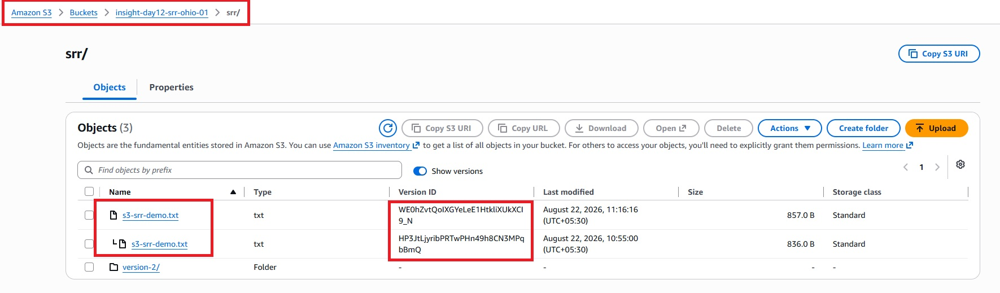

---

# Step 11: Test CRR Versioning

Upload another version of:

```text
crr/cloudadhar-crr-demo.txt
```

Use the same object key.

Enable:

**Show versions**

in both buckets.

Verify:

```text
Source:
Version 1
Version 2

CRR Destination:
Version 1
Version 2
```

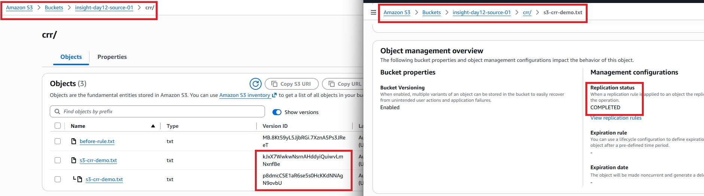

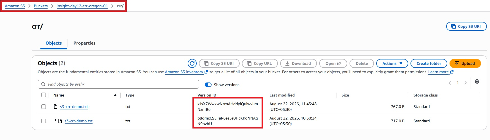

---

# Step 12: Validate Prefix Filtering

Create another prefix:

```text
other/
```

Upload:

```text
other/no-replication-demo.txt
```

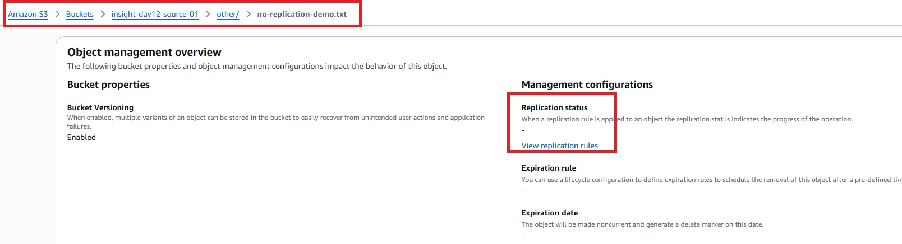

This object does not match:

```text
srr/
```

or:

```text
crr/
```

Therefore it should not be replicated.

### Expected Result

| Location        | Object        |
| --------------- | ------------- |
| Source          | ✅ Present     |
| SRR Destination | ❌ Not Present |
| CRR Destination | ❌ Not Present |

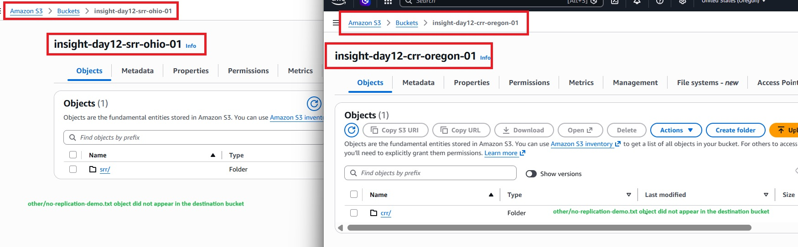

---

# Step 13: Enable S3 Transfer Acceleration

Open:

```text
insight-day12-source-01
```

Go to:

**Properties → Transfer acceleration**

Enable:

```text
Transfer Acceleration
```

AWS provides an accelerated endpoint similar to:

```text
insight-day12-source-01.s3-accelerate.amazonaws.com
```

### Validation

Verify that:

* Transfer Acceleration is enabled.
* Accelerated endpoint is displayed.
* Bucket name is compatible with Transfer Acceleration.

No performance benchmark is required for this lab.

---

# Step 14: Create Multipart Upload Lifecycle Rule

Open:

```text
insight-day12-source-01
```

Go to:

**Management → Lifecycle rules**

Click:

**Create lifecycle rule**

Configure:

```text
Rule name:
abort-incomplete-multipart-uploads

Scope:
All objects
```

Select:

```text
Delete expired delete markers
```

only if required by the lab configuration.

For this lab, configure the main action:

```text
Abort incomplete multipart uploads
```

Set:

```text
Days after initiation:
7
```

Do not configure object transitions or completed-object expiration.

### ✅ Validation

Verify the lifecycle rule is active.

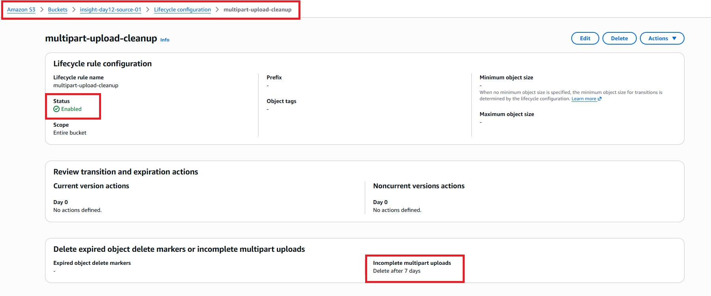

---

# Step 15: Create Object Lock Bucket

Create a new bucket:

```text
insight-day12-object-lock-01
```

Region:

```text
US East (Ohio)
us-east-2
```

Enable:

```text
Object Lock
```

Also configure:

```text
Bucket owner enforced
ACLs disabled
Block Public Access enabled
Versioning enabled
SSE-S3 encryption
```
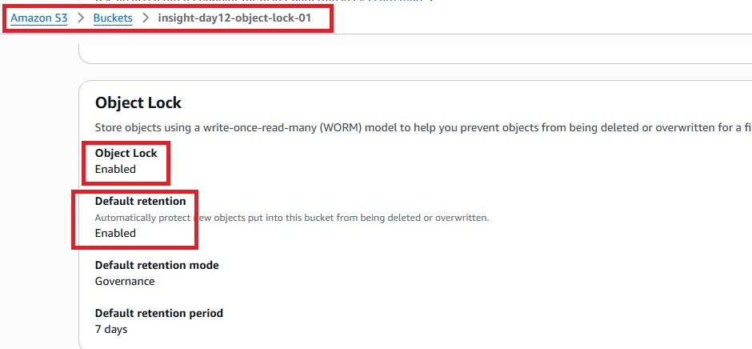

### ⚠️ Important

Object Lock requires Versioning to be enabled.

---

# Step 16: Test Object Lock Compliance

Upload:

```text
retention-demo.txt
```

Open the object and record its:

```text
Version ID
```
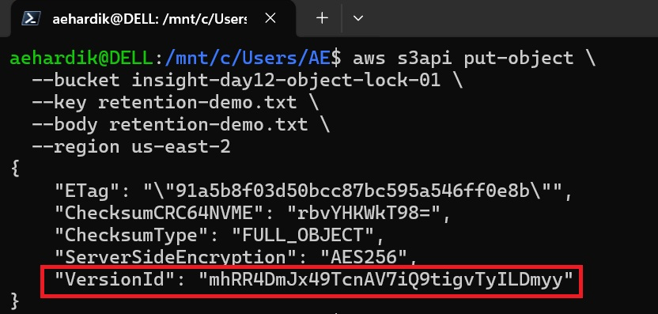

Apply a short Compliance retention period.

Example:

```text
Retention mode:
Compliance

Retention period:
Short instructor-approved period
```
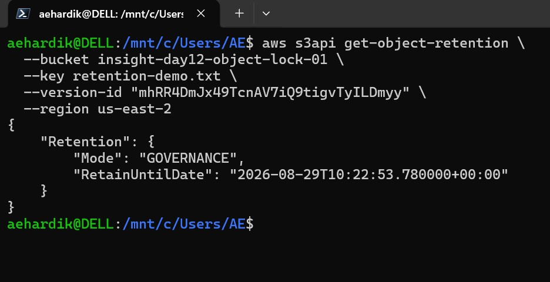

Attempt to permanently delete the protected object version.

### Expected Result

The deletion should fail with:

```text
AccessDenied
```
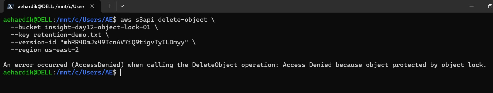

This demonstrates that Compliance mode prevents permanent deletion before the retention period expires.

---

# Step 17: Create Static Website Bucket

Create:

```text
insight-day12-static-website-01
```

Region:

```text
US East (Ohio)
us-east-2
```

Upload:

```text
main.html
error.html
```
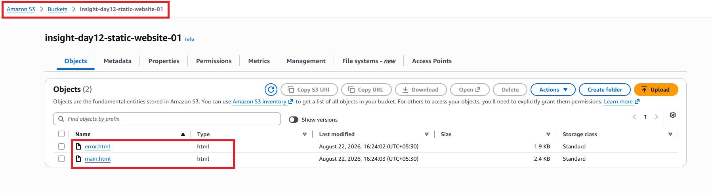

---

# Step 18: Configure Static Website Hosting

Open:

```text
insight-day12-static-website-01
```

Go to:

**Properties → Static website hosting**

Enable:

```text
Static website hosting
```

Configure:

```text
Index document:
index.html

Error document:
error.html
```

Save the configuration.

---

# Step 19: Configure Temporary Public Access

For the demonstration only, configure temporary public read access:

```text
s3:GetObject
```
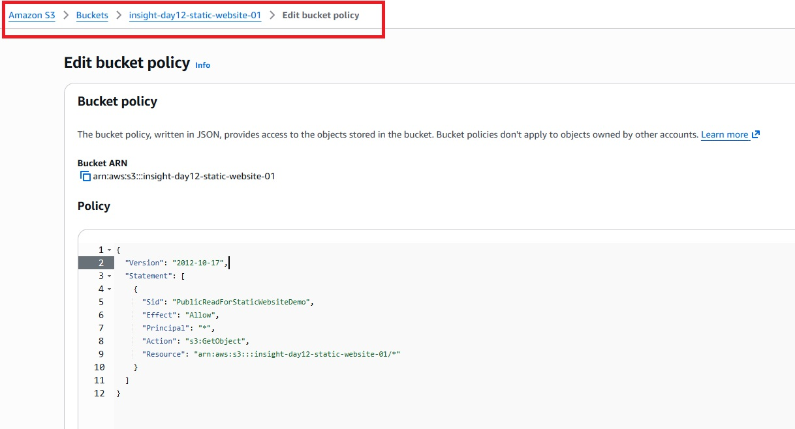

for the website objects.

Temporarily adjust Block Public Access if required for the demonstration.

Open the generated S3 website endpoint.

### Verify

The website should display:

```text
index.html
```
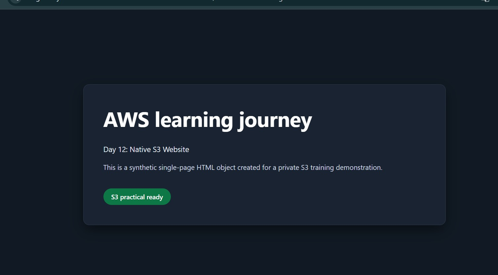

is displayed.

---

# Step 20: Restore Website Security

After the website demonstration:

1. Remove the temporary public bucket policy.
2. Restore Block Public Access.
3. Disable Static Website Hosting.
4. Remove the website demonstration objects if no longer required.

This prevents leaving the bucket publicly accessible.

---

# Step 21: Review Amazon FSx

Open:

**AWS Console → FSx**

Review the four major FSx options.

### FSx for Windows File Server

Used for:

* Windows workloads
* SMB file shares
* Active Directory integration

### FSx for Lustre

Used for:

* HPC
* Machine Learning
* High-performance workloads
* Parallel processing

### FSx for NetApp ONTAP

Used for:

* Enterprise NAS
* NetApp-compatible workloads
* Advanced storage features

### FSx for OpenZFS

Used for:

* Linux workloads
* ZFS-based storage
* High-performance file systems

No filesystem was created.

---

# Step 22: Review AWS Hybrid Storage

Review the following AWS storage services.

### S3 File Gateway

Provides:

```text
NFS / SMB → S3
```

Useful when on-premises applications need file-based access to S3.

### Volume Gateway

Provides:

```text
iSCSI → Cloud-backed storage
```

### Tape Gateway

Provides:

```text
Virtual tape → AWS
```

Useful for backup and archival workloads.

### AWS DataSync

Used for:

* Automated data transfer
* Online migration
* File synchronization

### AWS Snow Family

Used for:

* Offline data migration
* Large-scale data transfer
* Edge computing

### AWS Transfer Family

Supports managed:

```text
SFTP
FTPS
FTP
AS2
```

for transferring data into AWS storage services.

---

# Step 23: Verify All Replication Results

At the end of the lab, verify the following.

### SRR

```text
srr/s3-srr-demo.txt
```

should exist in:

```text
insight-day12-source-01
insight-day12-srr-ohio-01
```

with the expected versions.

### CRR

```text
crr/s3-crr-demo.txt
```

should exist in:

```text
insight-day12-source-01
insight-day12-crr-oregon-01
```

with the expected versions.

### Pre-rule Objects

```text
srr/before-rule.txt
crr/before-rule.txt
```

should remain source-only.

### Unmatched Object

```text
other/no-replication-demo.txt
```

should remain source-only.

---

# Step 24: Cleanup AWS Resources

After completing the lab, clean up temporary resources.

## Source Bucket

```text
insight-day12-source-01
```

Remove:

```text
srr/
crr/
other/
```

objects and all object versions.

Remove:

```text
srr-data-prefix-rule
crr-data-prefix-rule
multipart-uploads-cleanup
```

Disable Transfer Acceleration.

---

## SRR Destination

Remove all replicated objects and versions from:

```text
insight-day12-srr-ohio-01
```

Then delete the bucket.

---

## CRR Destination

Remove all replicated objects and versions from:

```text
insight-day12-crr-oregon-01
```

Then delete the bucket.

---

## Static Website Bucket

For:

```text
insight-day12-static-website-01
```

perform:

1. Delete `index.html`.
2. Delete `error.html`.
3. Remove public bucket policy.
4. Restore Block Public Access.
5. Disable Static Website Hosting.
6. Delete the bucket.

---

## Object Lock Bucket

For:

```text
insight-day12-object-lock-01
```

wait until the Compliance retention period expires.

Then:

1. Delete `retention-demo.txt`.
2. Delete all object versions.
3. Delete the Object Lock bucket.

---

# Step 25: Final Verification

Before completing the lab, verify that no unnecessary resources remain.

### Final Checklist

* [ ] Source S3 bucket cleaned up
* [ ] SRR destination cleaned up
* [ ] CRR destination cleaned up
* [ ] Replication rules removed
* [ ] Lifecycle rule removed
* [ ] Transfer Acceleration disabled
* [ ] Static website hosting disabled
* [ ] Public bucket policy removed
* [ ] Block Public Access restored
* [ ] Static website bucket deleted
* [ ] Object Lock retention completed
* [ ] Object Lock bucket deleted
* [ ] No additional paid storage resources deployed

---

# 🎯 Final Result

The Day 12 S3 lab was successfully completed and validated.

The implementation provided hands-on experience with:

* S3 bucket security
* Versioning
* Same-Region Replication
* Cross-Region Replication
* Prefix-based replication
* Object version replication
* Transfer Acceleration
* Lifecycle management
* Object Lock Compliance
* Static website hosting
* Amazon FSx
* AWS hybrid storage

The lab demonstrated how Amazon S3 can be used to build **secure, replicated, versioned, and highly available storage architectures**.

---

# 🧠 Key Takeaways

1. **Versioning** protects different versions of S3 objects.
2. **SRR** replicates objects between buckets in the same AWS Region.
3. **CRR** replicates objects between different AWS Regions.
4. **Prefix filters** allow selective object replication.
5. Objects uploaded before a replication rule are not automatically replicated when existing-object replication is disabled.
6. **Object Lock Compliance** protects objects from permanent deletion during the retention period.
7. **Lifecycle rules** can automatically abort incomplete multipart uploads.
8. **Transfer Acceleration** provides an accelerated S3 transfer endpoint.
9. **S3 Static Website Hosting** can serve static content directly from S3.
10. **FSx and AWS hybrid storage services** provide specialized storage solutions for different workloads.

---

## 🏁 Lab Status

- **Day 12 — Completed Successfully ✅**

- **AWS Service:** Amazon S3
- **Primary Region:** US East (Ohio) — `us-east-2`
- **CRR Region:** US West (Oregon) — `us-west-2`
- **Focus:** Replication, Versioning, Storage Protection, Transfer, and Hybrid Storage

---
## 👨‍💻 Author

**Hardik Darji**

---
## ⭐ Support

If you found this project useful or helpful, please consider giving this repository a ⭐ Star.

Your support and feedback are greatly appreciated and encourage me to continue learning, building, and sharing AWS and DevOps projects.

Thank you for your support! 🙌

---

Made with ❤️ by Hardik Darji
