# 🚀 AWS Day 13 — RDS, Aurora Serverless v2, Recovery & RDS Proxy

> **Production-style AWS database infrastructure, high availability, recovery, security and backup automation project.**

---

## 📌 Project Overview

This project demonstrates how to build a secure and highly available AWS database environment using **Amazon RDS for MySQL, Amazon Aurora Serverless v2, RDS Read Replica, Amazon RDS Proxy, AWS Secrets Manager, Amazon S3, AWS Systems Manager, and a multi-AZ VPC architecture**.

The infrastructure is designed with separate **public, private application, and private database tiers** across two Availability Zones.

### 🎯 Main Objectives

* Build a secure multi-AZ VPC.
* Deploy Amazon RDS MySQL in private subnets.
* Configure database security using Security Groups.
* Access private EC2 through Systems Manager Session Manager.
* Create and test RDS snapshots.
* Perform Point-in-Time Recovery.
* Configure an RDS Read Replica.
* Deploy Aurora Serverless v2.
* Configure Aurora Writer and Reader instances.
* Perform Aurora failover.
* Deploy Amazon RDS Proxy with TLS.
* Store database credentials in Secrets Manager.
* Create automated logical database backups.
* Compress backups using `gzip`.
* Store backups securely in Amazon S3.
* Automate backups using SSM and State Manager.
* Restore and validate database backups.

---

# 🏗️ Architecture

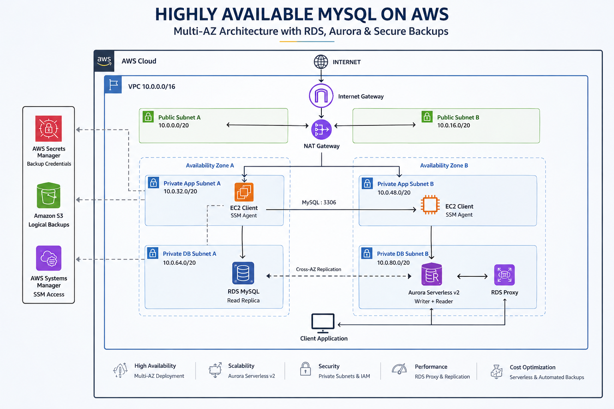


The reference architecture separates public, private application, and private database tiers across two Availability Zones.

---

# ☁️ AWS Region

Use the following AWS region throughout the project:

```text
Region Name : US East (Ohio)
Region Code : us-east-2
```

Select the region from the AWS Console region selector before creating resources.

---

#  Step 1 — Resource Naming Convention

Use the following naming standard:

```text
apexdb-day13-<resource>
```

### Resource Names

| Resource                | Name                              |
| ----------------------- | --------------------------------- |
| VPC                     | `apexdb-day13-vpc`                |
| Public Subnet A         | `apexdb-day13-public-a`           |
| Public Subnet B         | `apexdb-day13-public-b`           |
| Private App Subnet A    | `apexdb-day13-app-private-a`      |
| Private App Subnet B    | `apexdb-day13-app-private-b`      |
| Private DB Subnet A     | `apexdb-day13-db-private-a`       |
| Private DB Subnet B     | `apexdb-day13-db-private-b`       |
| Internet Gateway        | `apexdb-day13-igw`                |
| Public Route Table      | `apexdb-day13-public-rt`          |
| Private App Route Table | `apexdb-day13-private-app-rt`     |
| Private DB Route Table  | `apexdb-day13-private-db-rt`      |
| NAT Gateway             | `apexdb-day13-nat-a`              |
| EC2 Client              | `apexdb-day13-rds-client`         |
| EC2 IAM Role            | `apexdb-day13-ec2-ssm-role`       |
| EC2 Security Group      | `apexdb-day13-ec2-rds-sg`         |
| RDS MySQL               | `apexdb-day13-mysql`              |
| RDS Security Group      | `apexdb-day13-rds-sg`             |
| RDS Snapshot            | `apexdb-day13-mysql-snapshot`     |
| PITR Database           | `apexdb-day13-mysql-pitr`         |
| Read Replica            | `apexdb-day13-mysql-replica`      |
| Aurora Cluster          | `apexdb-day13-aurora`             |
| Aurora Reader           | `apexdb-day13-aurora-reader`      |
| Aurora Security Group   | `apexdb-day13-aurora-sg`          |
| RDS Proxy               | `apexdb-day13-rds-proxy`          |
| Proxy Security Group    | `apexdb-day13-proxy-sg`           |
| Backup Secret           | `apexdb-day13-backup-secret`      |
| SSM Document            | `ApexDB-Day13-MySQL-Backup-To-S3` |
| State Manager           | `apexdb-day13-daily-backup`       |

These names are based on the resource structure in the lab, with the project standardized around the `apexdb-day13` naming convention.

---

#  Step 2 — Create the VPC

Go to:

```text
AWS Console
→ VPC
→ Your VPCs
→ Create VPC
```

Select:

```text
Resources to create:
VPC only
```

Enter:

```text
Name:
apexdb-day13-vpc

IPv4 CIDR:
10.0.0.0/16
```

Click:

```text
Create VPC
```
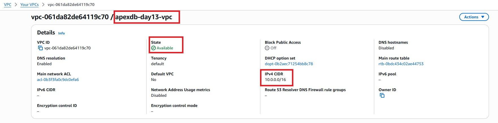


---

#  Step 3 — Create Six Subnets

Create six subnets across two Availability Zones:

```text
us-east-2a
us-east-2b
```

## Public Subnet A

```text
Name:
apexdb-day13-public-a

Availability Zone:
us-east-2a

CIDR:
10.0.0.0/20
```

## Public Subnet B

```text
Name:
apexdb-day13-public-b

Availability Zone:
us-east-2b

CIDR:
10.0.16.0/20
```

## Private Application Subnet A

```text
Name:
apexdb-day13-app-private-a

Availability Zone:
us-east-2a

CIDR:
10.0.32.0/20
```

## Private Application Subnet B

```text
Name:
apexdb-day13-app-private-b

Availability Zone:
us-east-2b

CIDR:
10.0.48.0/20
```

## Private Database Subnet A

```text
Name:
apexdb-day13-db-private-a

Availability Zone:
us-east-2a

CIDR:
10.0.64.0/20
```

## Private Database Subnet B

```text
Name:
apexdb-day13-db-private-b

Availability Zone:
us-east-2b

CIDR:
10.0.80.0/20
```
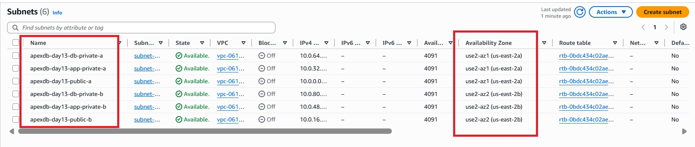

The six-subnet layout follows the project architecture provided in the lab.

---

#  Step 4 — Create Internet Gateway

Go to:

```text
VPC
→ Internet Gateways
→ Create Internet Gateway
```

Name:

```text
apexdb-day13-igw
```

Create the Internet Gateway.

Then:

```text
Actions
→ Attach to VPC
```

Select:

```text
apexdb-day13-vpc
```
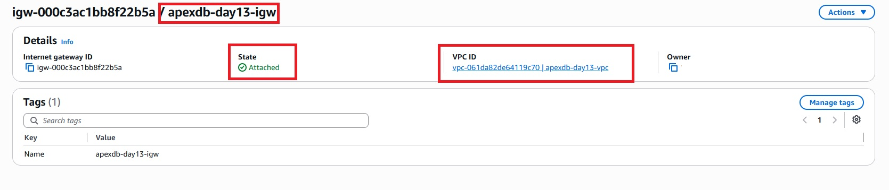

---

#  Step 5 — Create Public Route Table

Go to:

```text
VPC
→ Route Tables
→ Create route table
```

Name:

```text
apexdb-day13-public-rt
```

VPC:

```text
apexdb-day13-vpc
```

Add route:

```text
Destination:
0.0.0.0/0

Target:
Internet Gateway

apexdb-day13-igw
```

Associate:

```text
apexdb-day13-public-a
apexdb-day13-public-b
```
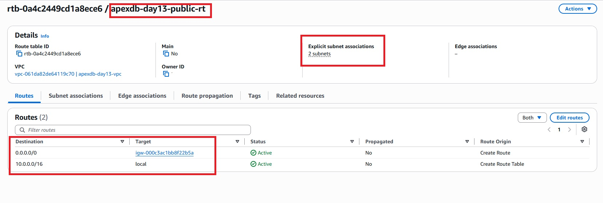

---

# Step 6 — Create NAT Gateway

Go to:

```text
VPC
→ NAT Gateways
→ Create NAT Gateway
```

Select:

```text
Subnet:
apexdb-day13-public-a

Connectivity:
Public
```

Allocate a new Elastic IP.

Name:

```text
apexdb-day13-nat-a
```

Wait until:

```text
Status: Available
```
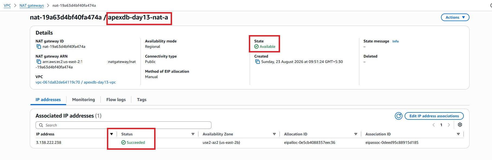

---

#  Step 7 — Create Private Application Route Table

Create:

```text
apexdb-day13-private-app-rt
```

VPC:

```text
apexdb-day13-vpc
```

Add:

```text
Destination:
0.0.0.0/0

Target:
NAT Gateway

apexdb-day13-nat-a
```

Associate:

```text
apexdb-day13-app-private-a
apexdb-day13-app-private-b
```
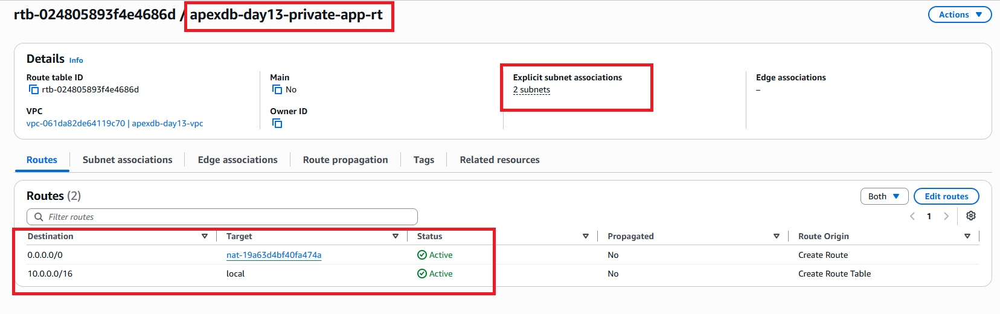

This allows private application resources to access the internet through the NAT Gateway without receiving public IP addresses.

---

# Step 8 — Create Private Database Route Table

Create:

```text
apexdb-day13-private-db-rt
```

Associate:

```text
apexdb-day13-db-private-a
apexdb-day13-db-private-b
```

### Important

Do **not** add:

```text
0.0.0.0/0
```
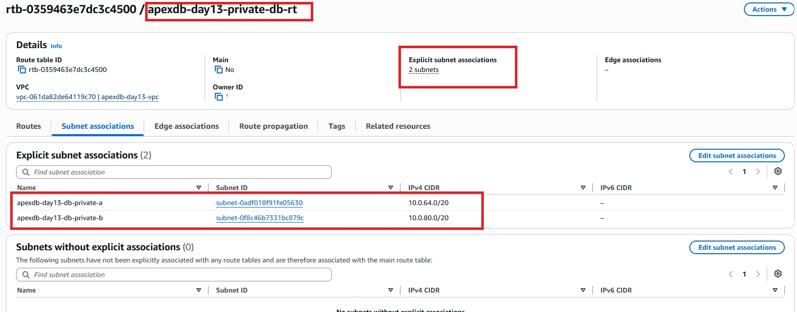

The database tier should not have a default internet route.

---

#  Step 9 — Create EC2 Security Group

Go to:

```text
EC2
→ Security Groups
→ Create Security Group
```

Name:

```text
apexdb-day13-ec2-rds-sg
```

Description:

```text
Security group for private database client
```

VPC:

```text
apexdb-day13-vpc
```

Outbound:

```text
All traffic
0.0.0.0/0
```
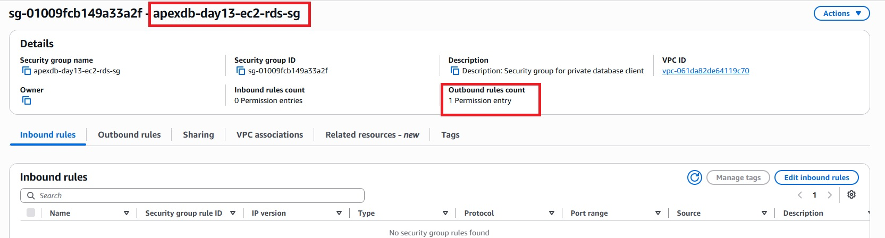

No SSH inbound rule is required because the instance will use Systems Manager Session Manager.

---

#  Step 10 — Create RDS Security Group

Create:

```text
apexdb-day13-rds-sg
```

Inbound:

```text
Type:
MySQL/Aurora

Port:
3306

Source:
apexdb-day13-ec2-rds-sg
```

### Security Rule

Do **not** use:

```text
0.0.0.0/0
```
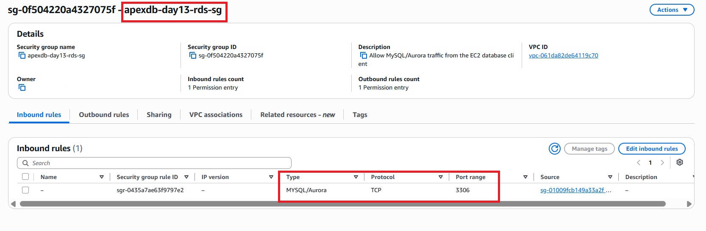

Only the approved EC2 security group should be able to access the database on port `3306`.

---

#  Step 11 — Create IAM Role for EC2

Go to:

```text
IAM
→ Roles
→ Create role
```

Trusted entity:

```text
AWS service
```

Use case:

```text
EC2
```

Attach:

```text
AmazonSSMManagedInstanceCore
```

Role name:

```text
apexdb-day13-ec2-ssm-role
```
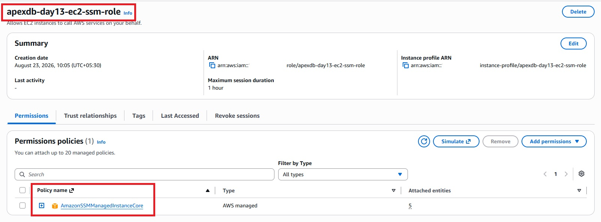

Later, add only the required:

```text
S3 permissions
Secrets Manager permissions
```

Do not use AdministratorAccess.

---

#  Step 12 — Launch EC2 Database Client

Go to:

```text
EC2
→ Instances
→ Launch Instance
```

Name:

```text
apexdb-day13-rds-client
```

AMI:

```text
Amazon Linux 2023
```

Instance type:

```text
t3.micro
```

Network:

```text
VPC:
apexdb-day13-vpc

Subnet:
apexdb-day13-app-private-a

Auto-assign Public IP:
Disabled
```

Security Group:

```text
apexdb-day13-ec2-rds-sg
```

IAM Role:

```text
apexdb-day13-ec2-ssm-role
```
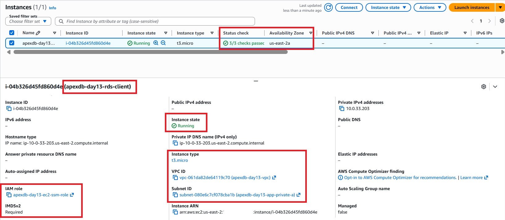

Launch the instance.

---

#  Step 13 — Connect Using Session Manager

Go to:

```text
EC2
→ Instances
→ apexdb-day13-rds-client
→ Connect
→ Session Manager
→ Connect
```
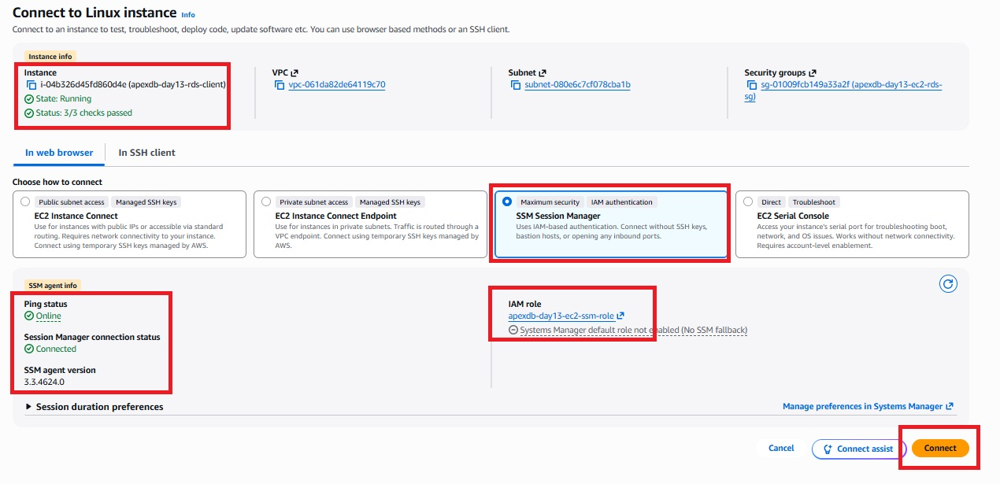

Test AWS access:

```bash
aws sts get-caller-identity
```

Then:

```bash
aws s3 ls
```

The EC2 instance should be accessible without SSH keys or permanent AWS access keys.

---
#  Step 14 — Create Amazon RDS MySQL

Go to:

```text
RDS
→ Databases
→ Create database
```

Choose:

```text
Creation method:
Standard create

Engine:
MySQL
```

Use an appropriate current MySQL version available in your AWS Console.

DB identifier:

```text
apexdb-day13-mysql
```

Master username:

```text
admin
```

Use a strong password.

### Connectivity

```text
VPC:
apexdb-day13-vpc

Public access:
No

Port:
3306

Security Group:
apexdb-day13-rds-sg
```

Use a DB subnet group containing:

```text
apexdb-day13-db-private-a
apexdb-day13-db-private-b
```

Enable:

```text
Automated backups
Encryption
```
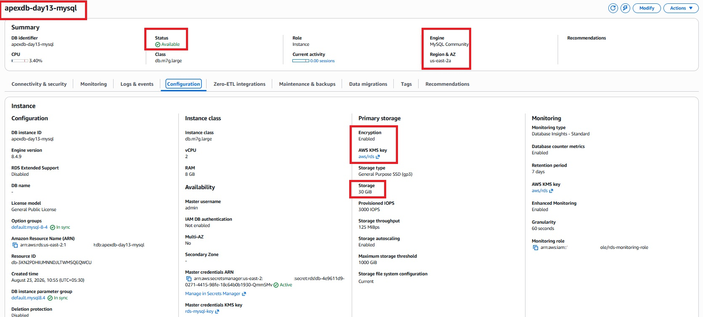

Create the database.
---

#  Step 14 —  Install Database Client

On EC2:

```bash
sudo dnf update -y
```

Install the available MariaDB/MySQL-compatible client package.

Verify:

```bash
mysql --version
```
---

---

#  Step 16 — Connect to RDS

Wait until:

```text
Status:
Available
```

Copy the RDS endpoint.

From EC2:

```bash
mysql -h YOUR_RDS_ENDPOINT -P 3306 -u admin -p
```
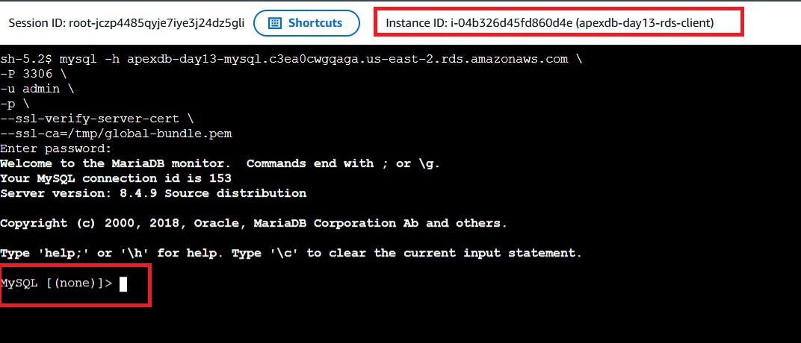

Enter your password.

---

#  Step 17 — Create Database

Run:

```sql
CREATE DATABASE aws_rds_lab;
```

Select it:

```sql
USE aws_rds_lab;
```
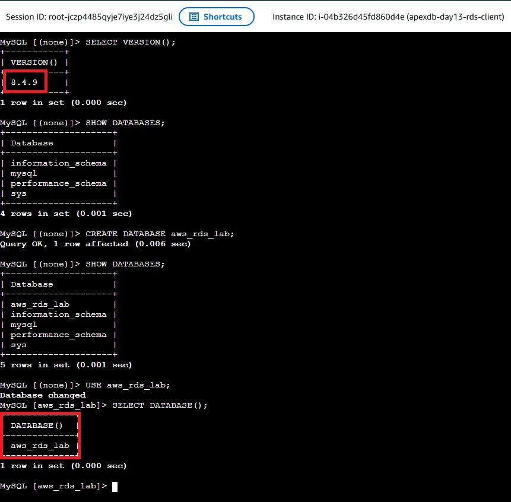

Create the `orders` table:

```sql
CREATE TABLE orders (
    order_id INT PRIMARY KEY AUTO_INCREMENT,
    customer_name VARCHAR(100),
    product_name VARCHAR(100),
    amount DECIMAL(10,2),
    order_status VARCHAR(30),
    created_at TIMESTAMP DEFAULT CURRENT_TIMESTAMP
);
```

---

#  Step 18 — Insert Test Data

Example:

```sql
INSERT INTO orders
(customer_name, product_name, amount, order_status)
VALUES
('Rahul Mehta', 'Laptop', 75000, 'COMPLETED'),
('Priya Shah', 'Monitor', 18000, 'PROCESSING'),
('Arjun Patel', 'Keyboard', 3500, 'COMPLETED');
```

Validate:

```sql
SELECT * FROM orders;
```
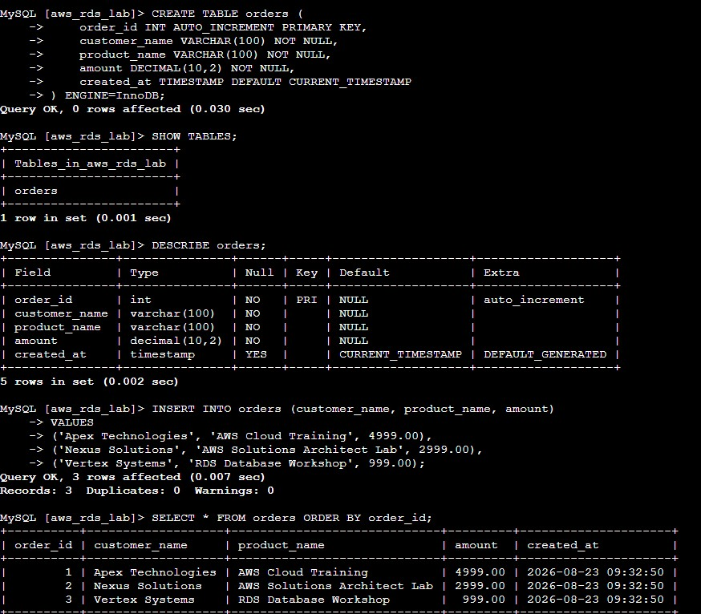

---

#  Step 19 — Create Manual RDS Snapshot

Go to:

```text
RDS
→ Databases
→ apexdb-day13-mysql
→ Actions
→ Take snapshot
```

Snapshot name:

```text
apexdb-day13-mysql-snapshot
```

Wait until:

```text
Available
```
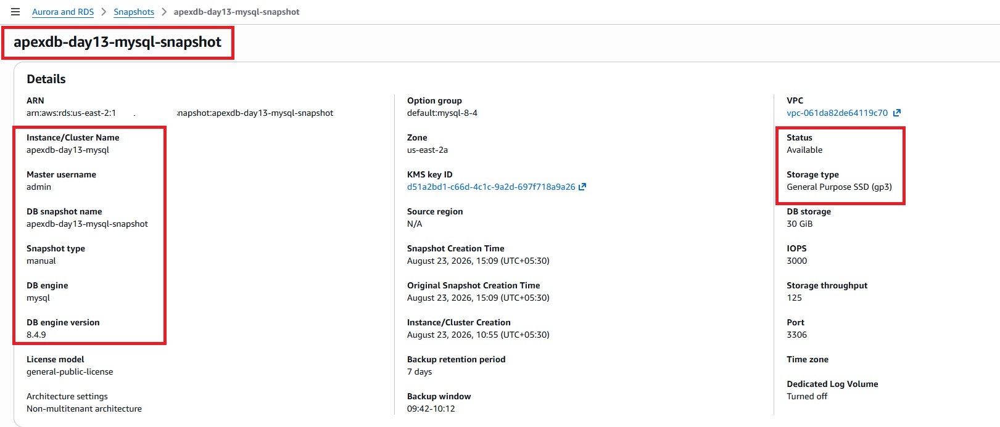

---

# Step 20 — Restore RDS From Snapshot

Go to:

```text
RDS
→ Snapshots
→ apexdb-day13-mysql-snapshot
→ Actions
→ Restore snapshot
```
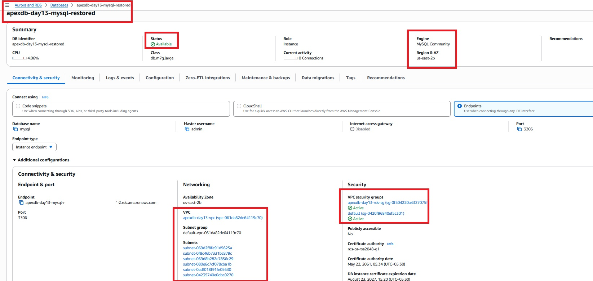

New DB identifier:

```text
apexdb-day13-mysql-restored
```

Ensure:

```text
VPC:
apexdb-day13-vpc

Public access:
No

Security Group:
apexdb-day13-rds-sg
```

Restore.

Test:

```bash
mysql -h RESTORED_ENDPOINT -u admin -p
```
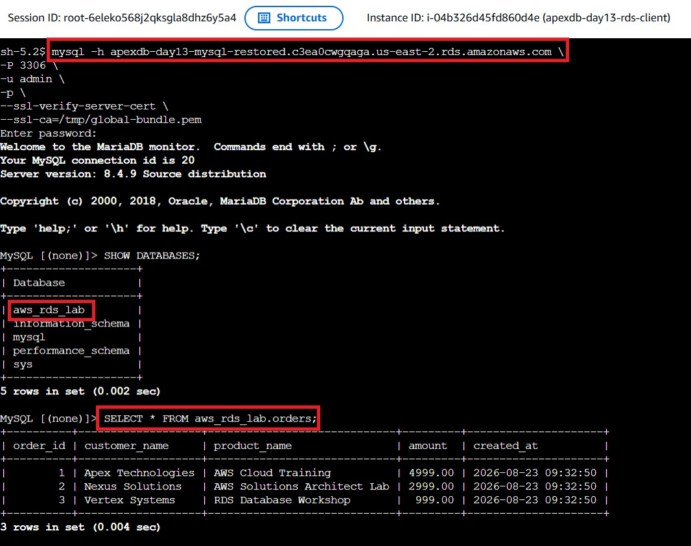

Then:

```sql
SHOW DATABASES;

USE apexdb;

SELECT * FROM orders;
```

---

#  Step 21 — Perform Point-in-Time Recovery

Insert a recovery marker:

```sql
INSERT INTO orders
(customer_name, product_name, amount, order_status)
VALUES
('PITR Test', 'Recovery Item', 9999, 'RECOVERY_MARKER');
```
Verify:

```sql
SELECT * FROM orders;
```
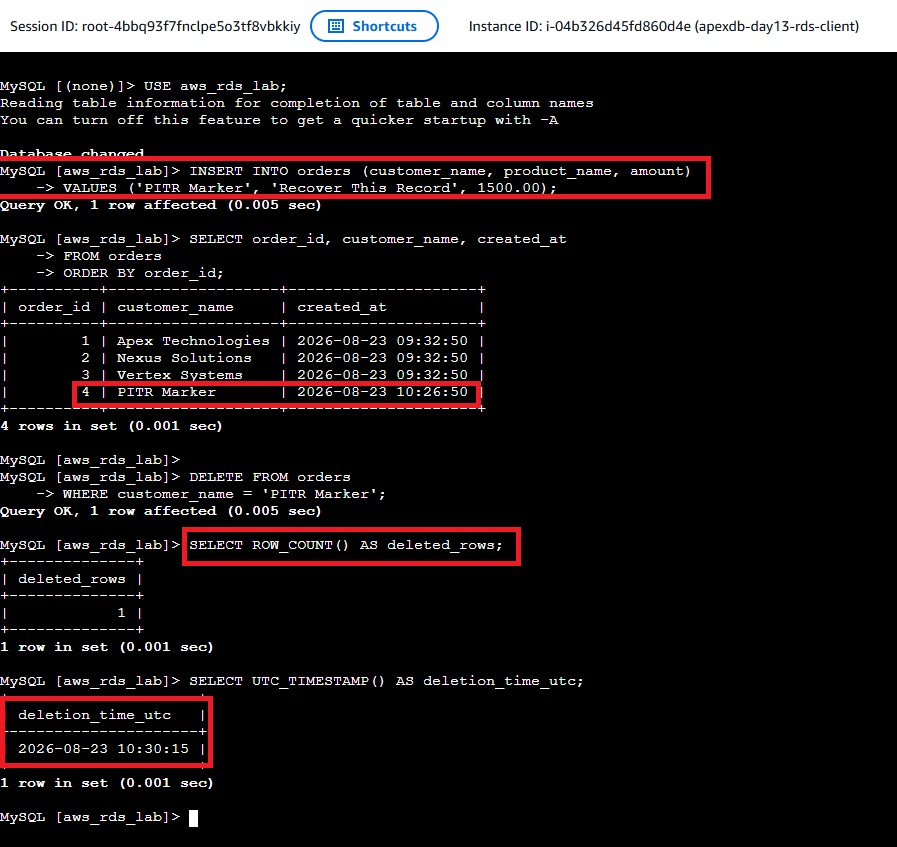

Record the timestamp.

Delete the marker:

```sql
DELETE FROM orders
WHERE customer_name = 'PITR Test';
```

Go to:

```text
RDS
→ Automated backups
→ Restore to point in time
```

Create:

```text
apexdb-day13-mysql-pitr
```
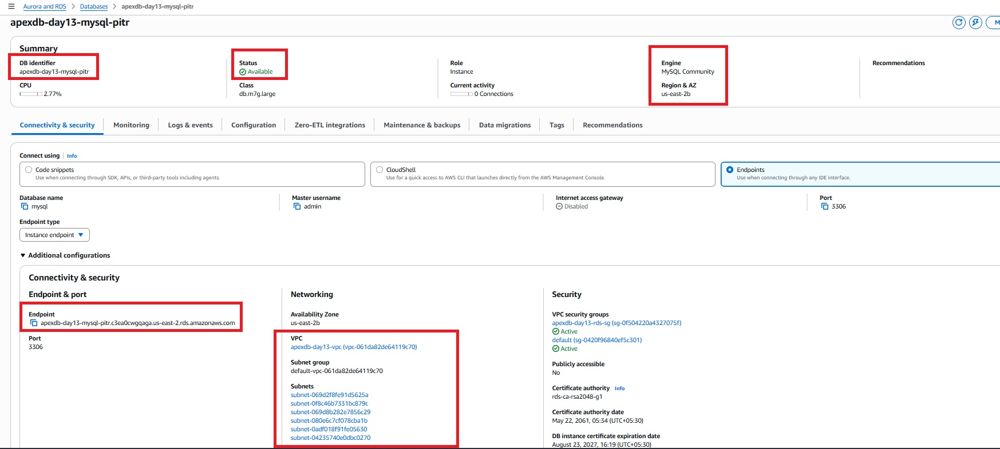

Choose a recovery timestamp:

```text
After the marker was inserted
BUT
Before the marker was deleted
```

After restoration:

```sql
SELECT * FROM apexdb.orders;
```

The `RECOVERY_MARKER` record should be present.

---

#  Step 22 — Create RDS Read Replica

Go to:

```text
RDS
→ Databases
→ apexdb-day13-mysql
→ Actions
→ Create read replica
```

Identifier:

```text
apexdb-day13-mysql-replica
```

Region:

```text
us-east-2
```

Public access:

```text
No
```

Use the private DB subnet group.

Create.

Wait until:

```text
Replication status:
Replicating
```
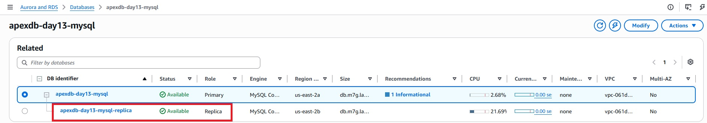

---

# Step 23 — Test & Read Replica


Connect to the replica:

```bash
mysql -h REPLICA_ENDPOINT -u admin -p
```

Insert data into the primary:

```sql
INSERT INTO orders
(customer_name, product_name, amount, order_status)
VALUES
('Replica Test', 'DevOps Course', 5000, 'COMPLETED');
```

Run:

```sql
SELECT * FROM orders;
```
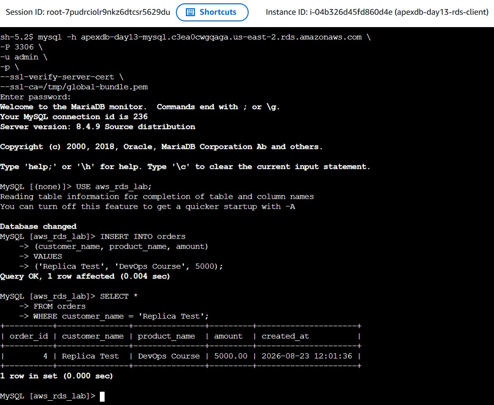

The new record should eventually appear.

Test a write:

```sql
INSERT INTO orders
(customer_name, product_name, amount, order_status)
VALUES
('Replica Write', 'Test', 100, 'FAILED');
```
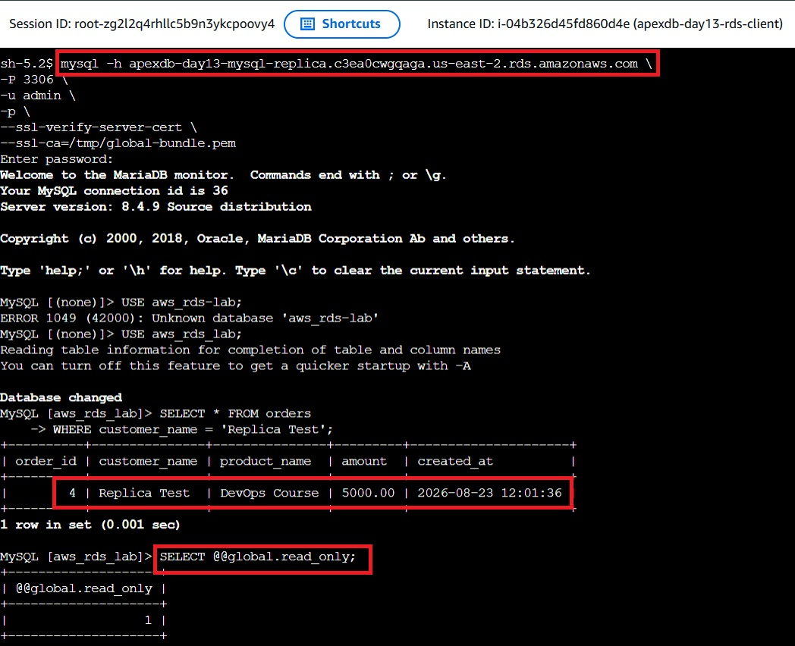

The write should fail because the replica is read-only.

---

# ⚡ Step 24 — Create Aurora DB Subnet Group

Go to:

```text
RDS
→ Subnet Groups
→ Create DB subnet group
```

Name:

```text
apexdb-day13-aurora-subnet-group
```

VPC:

```text
apexdb-day13-vpc
```

Subnets:

```text
apexdb-day13-db-private-a
apexdb-day13-db-private-b
```

Create.

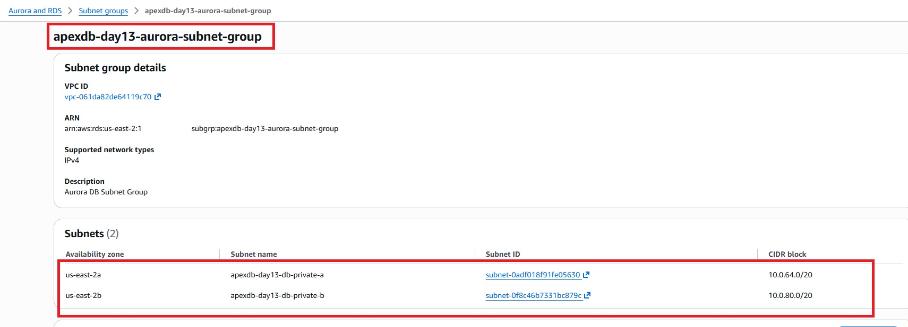

---

#  Step 25 — Create Aurora Security Group

Create:

```text
apexdb-day13-aurora-sg
```

Inbound:

```text
Type:
MySQL/Aurora

Port:
3306

Source:
apexdb-day13-ec2-rds-sg
```

Do not use:

```text
0.0.0.0/0
```
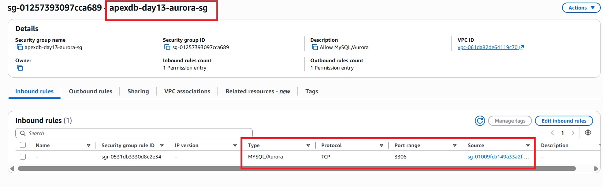

---

#  Step 26 — Create Aurora Serverless v2

Go to:

```text
RDS
→ Databases
→ Create database
```

Select:

```text
Amazon Aurora
```

Engine compatibility:

```text
MySQL
```

Capacity type:

```text
Serverless v2
```

Cluster identifier:

```text
apexdb-day13-aurora
```

Database:

```text
apexdb
```

Master username:

```text
admin
```

Connectivity:

```text
VPC:
apexdb-day13-vpc

DB subnet group:
apexdb-day13-aurora-subnet-group

Public access:
No

Security group:
apexdb-day13-aurora-sg
```

Choose the appropriate Serverless v2 capacity settings available in your AWS account.

Create the cluster.

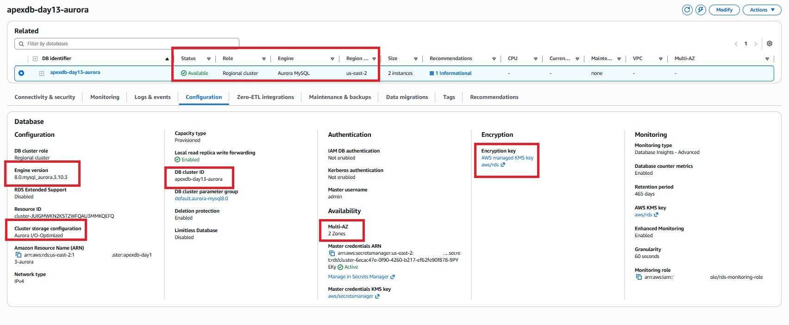

---

#  Step 27 — Create Aurora Reader

After the cluster is available:

```text
RDS
→ Databases
→ apexdb-day13-aurora
→ Actions
→ Add reader
```

Instance identifier:

```text
apexdb-day13-aurora-reader
```

Use the appropriate Serverless v2 capacity configuration.

Final architecture:

```text
Aurora Cluster
      |
      +------ Writer
      |
      +------ Reader
```
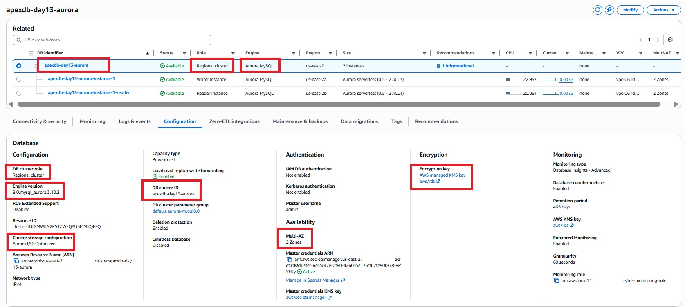

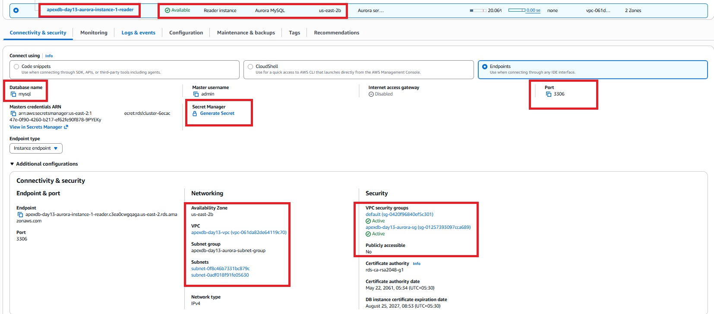

---

#  Step 28 — Test Aurora Writer

Connect:

```bash
mysql -h AURORA_WRITER_ENDPOINT -P 3306 -u admin -p
```
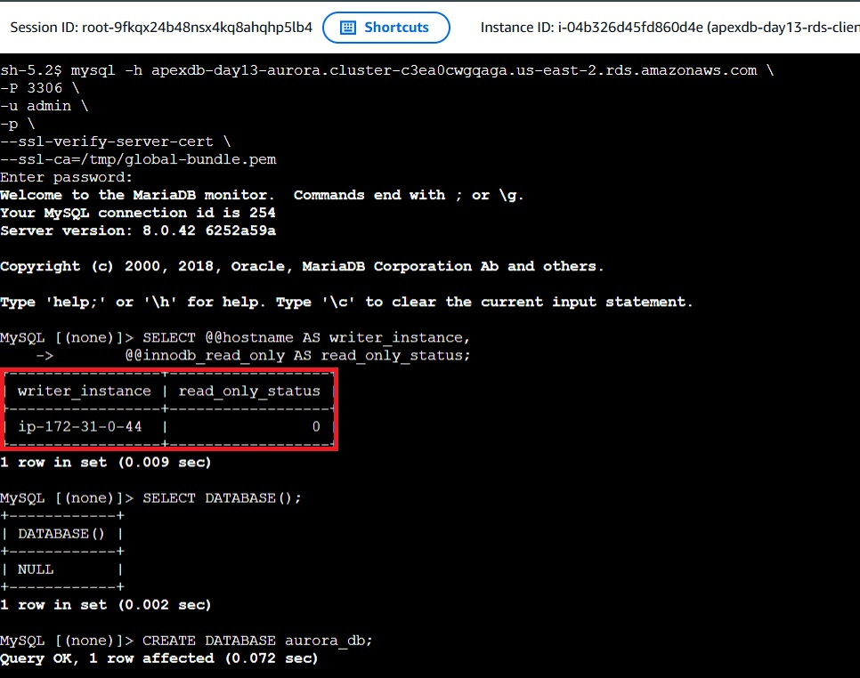

Create database:

```sql
CREATE DATABASE aurora_db;
```
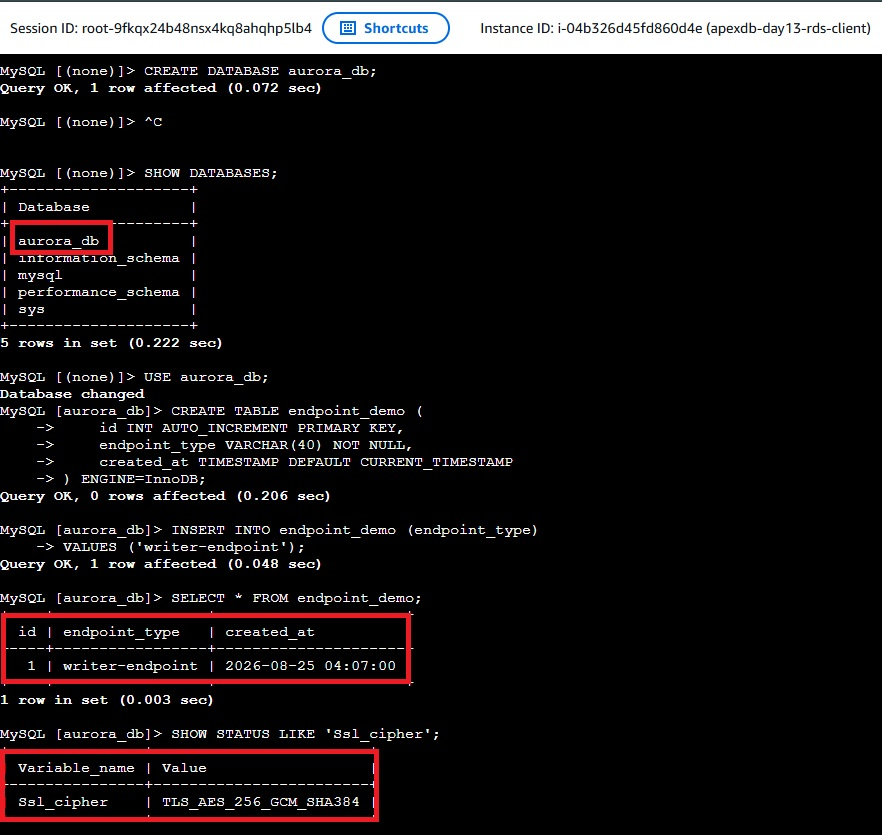

---

#  Step 29 — Test Aurora Reader

Connect:

```bash
mysql -h AURORA_READER_ENDPOINT -P 3306 -u admin -p
```

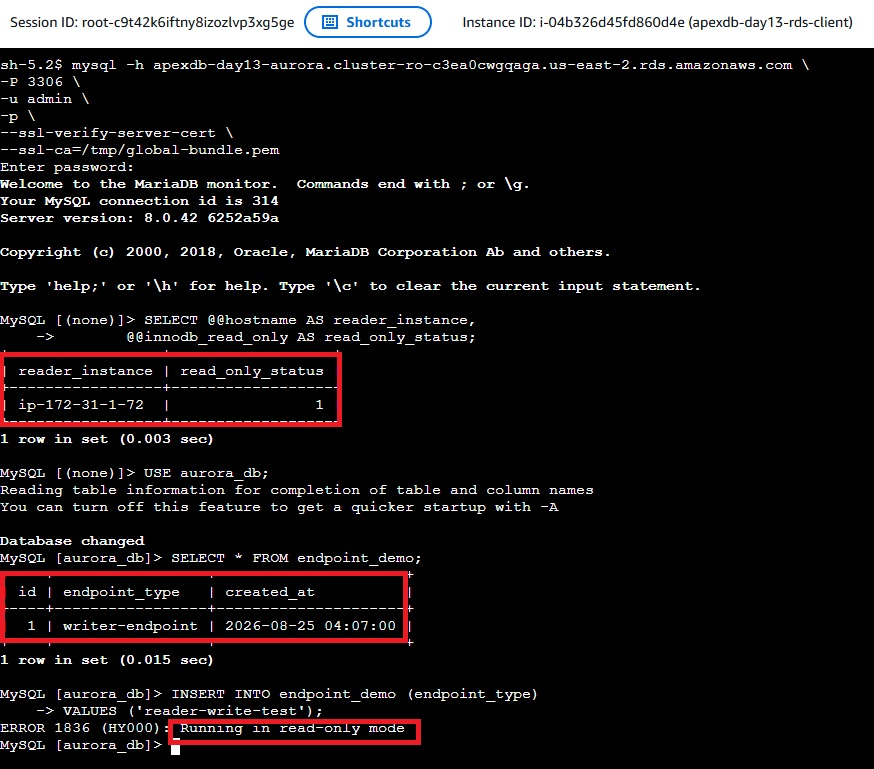

The reader should reject the write.

---

#  Step 30 — Perform Aurora Failover

Before failover:

```sql
SELECT @@hostname;

SELECT @@innodb_read_only;
```

Expected:

```text
@@innodb_read_only
0
```
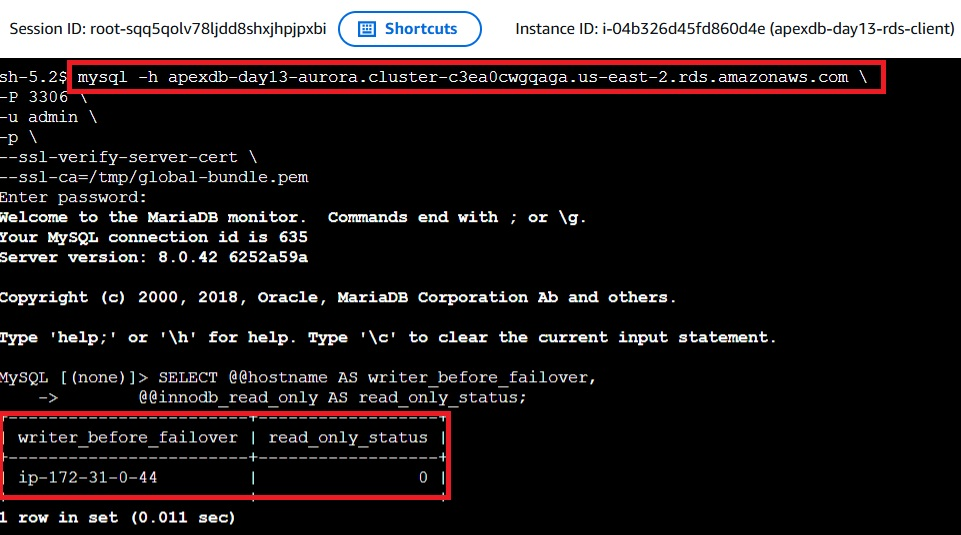

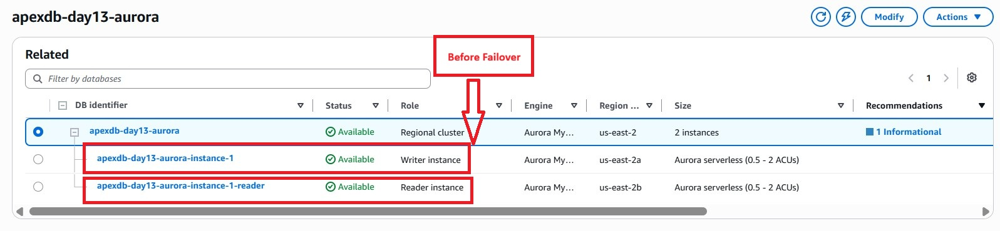

Go to:

```text
RDS
→ Databases
→ apexdb-day13-aurora
→ Actions
→ Failover
```
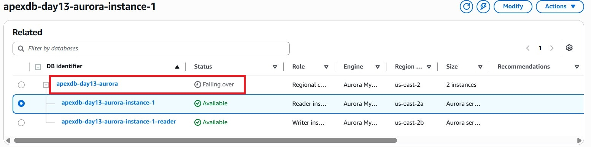

Confirm.

Wait for the failover to complete.

Reconnect using the same Aurora cluster endpoint:

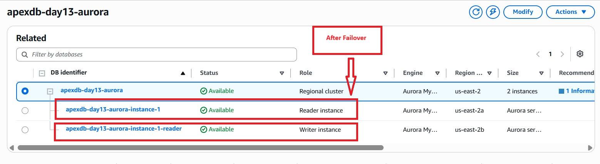

```bash
mysql -h AURORA_CLUSTER_ENDPOINT -P 3306 -u admin -p
```

Run:

```sql
SELECT @@hostname;

SELECT @@innodb_read_only;

```
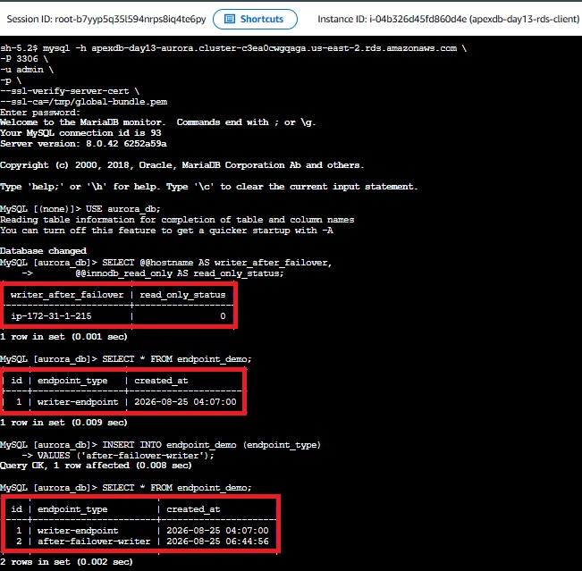

The writer hostname should now be different while the cluster endpoint continues to provide the current writer.

---

#  Step 31 — Create RDS Proxy Security Group

Create:

```text
apexdb-day13-proxy-sg
```

Inbound:

```text
Type:
MySQL/Aurora

Port:
3306

Source:
apexdb-day13-ec2-rds-sg
```
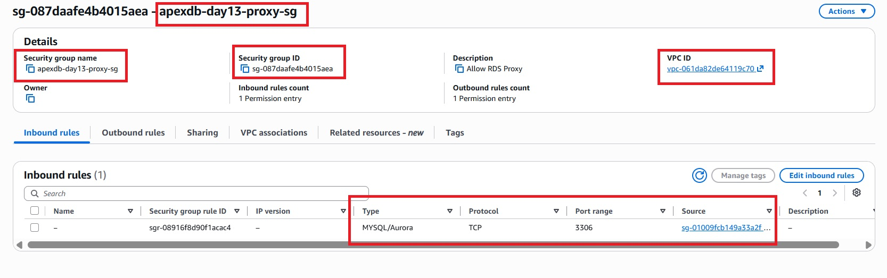

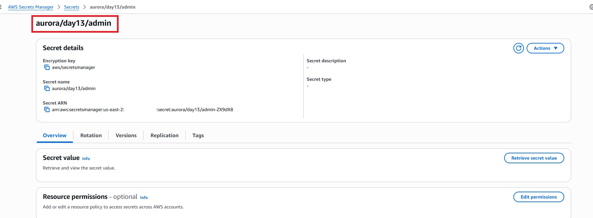

---

#  Step 32 — Create RDS Proxy

Go to:

```text
RDS
→ Proxies
→ Create proxy
```

Proxy identifier:

```text
apexdb-day13-rds-proxy
```

Engine:

```text
MySQL
```

Target:

```text
apexdb-day13-aurora
```

Authentication:

```text
AWS Secrets Manager
```

Require TLS:

```text
Enabled
```

VPC:

```text
apexdb-day13-vpc
```

Subnets:

```text
apexdb-day13-db-private-a
apexdb-day13-db-private-b
```

Security group:

```text
apexdb-day13-proxy-sg
```

Create the proxy.

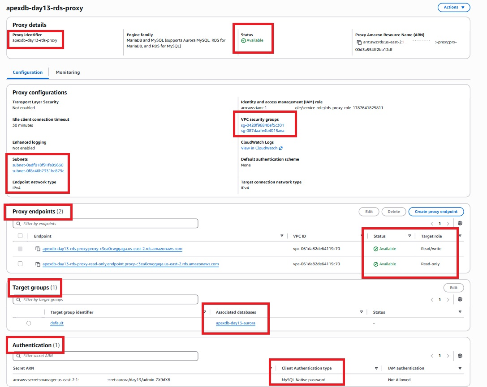

---

#  Step 33 — Validate RDS Proxy

Wait until:

```text
Status:
Available
```

Check:

```text
Target Health:
Available
```
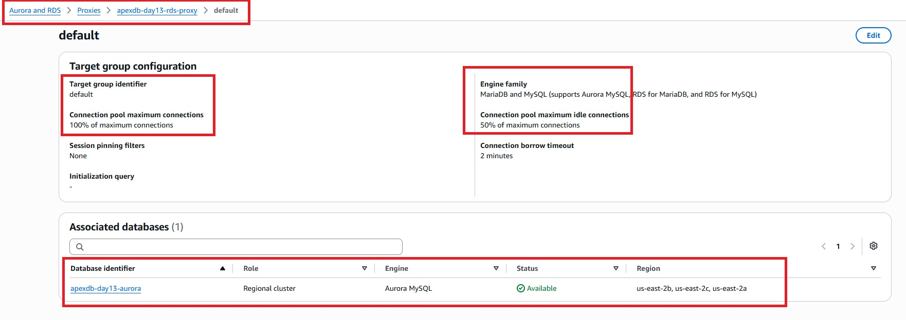

Connect:

```bash
mysql -h PROXY_ENDPOINT -P 3306 -u admin -p
```

Test:

```sql
SELECT @@hostname;

SELECT @@read_only;

SELECT * FROM apexdb.orders;
```
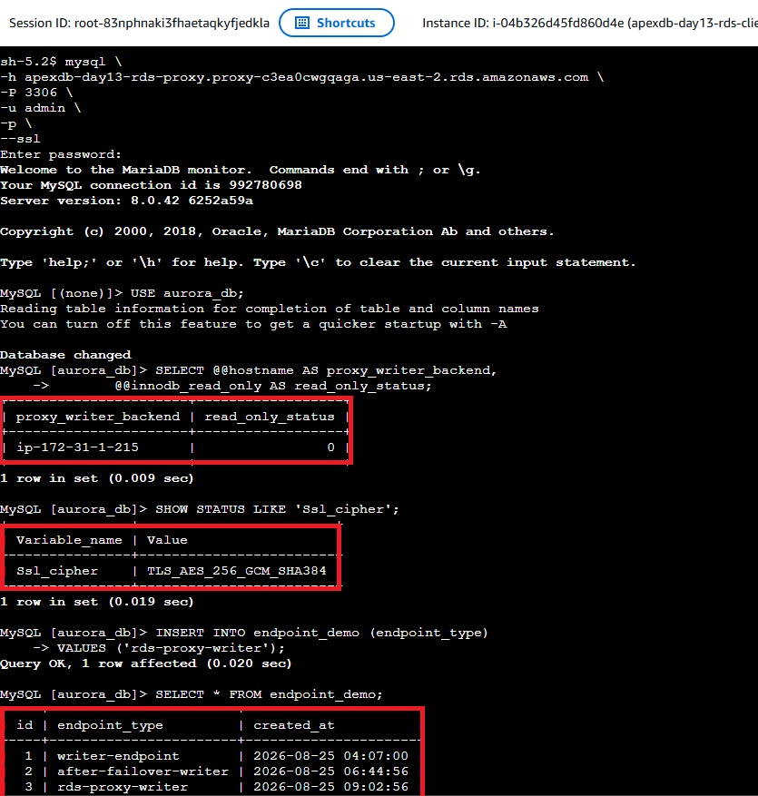

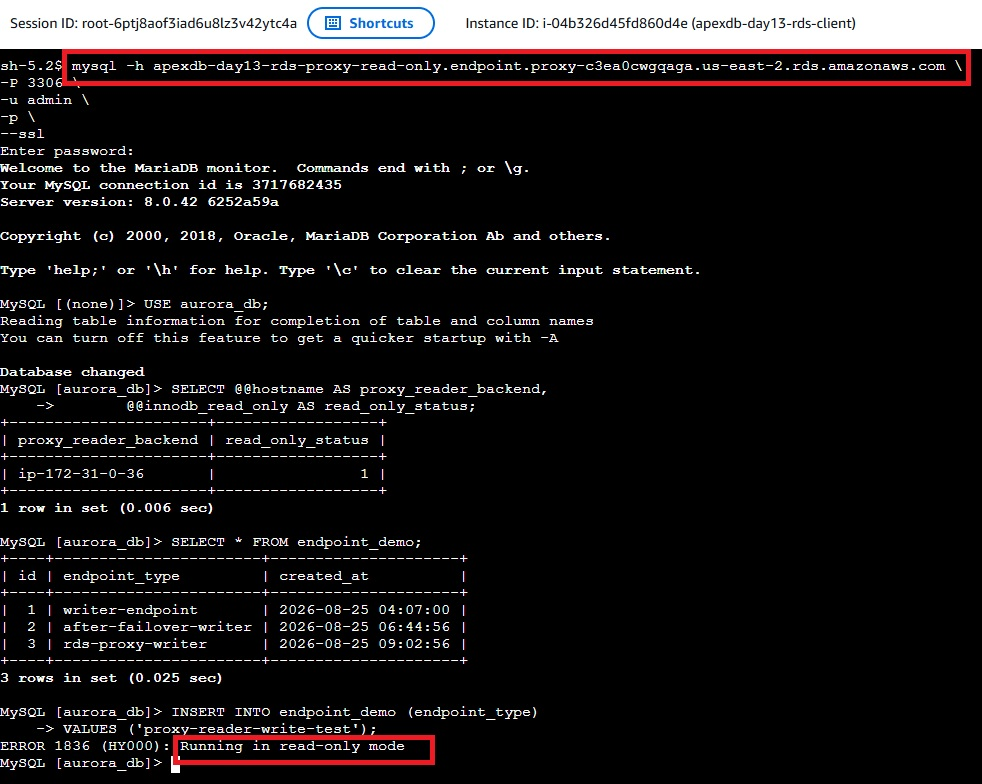

Perform a test write through the appropriate endpoint.

---

#  Step 34 — Create S3 Backup Bucket

Go to:

```text
S3
→ Create bucket
```

Bucket:

```text
apexdb-day13-db-backups-YOUR-ACCOUNT-ID-us-east-2
```

Example:

```text
apexdb-day13-db-backups-123456789012-us-east-2
```

Region:

```text
us-east-2
```

Enable:

```text
Block Public Access
Versioning
SSE-S3 Encryption
```
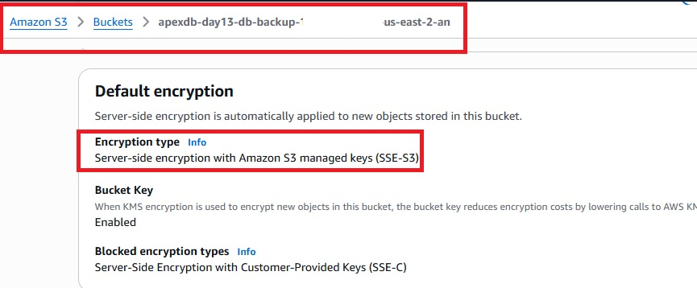

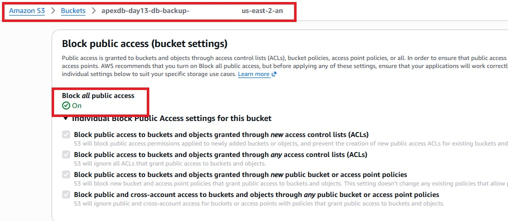

Create the bucket.

Create/use prefix:

```text
day13/mysql-table-backups/
```
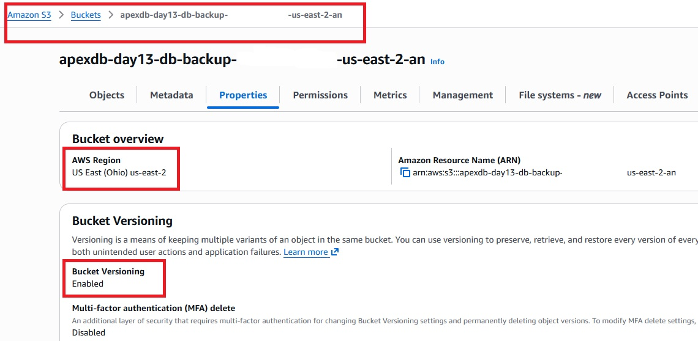

---

#  Step 35 — Create Secrets Manager Secret

Go to:

```text
Secrets Manager
→ Store a new secret
```

Select:

```text
Credentials for Amazon RDS database
```

Username:

```text
backupuser
```

Password:

```text
YOUR_STRONG_PASSWORD
```

Secret name:

```text
apexdb-day13-backup-secret
```
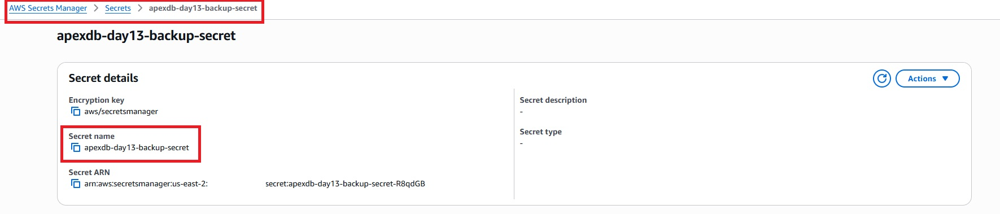

> ⚠️ Never commit the password or secret value to GitHub.

---

#  Step 36 — Create Dedicated Backup User

Connect to RDS as administrator:

```bash
mysql -h RDS_ENDPOINT -u admin -p
```

Create user:

```sql
CREATE USER 'backupuser'@'%'
IDENTIFIED BY 'YOUR_PASSWORD';
```

Grant only the required permission:

```sql
GRANT SELECT ON apexdb.orders
TO 'backupuser'@'%';
```

Apply:

```sql
FLUSH PRIVILEGES;
```

Verify:

```sql
SHOW GRANTS FOR 'backupuser'@'%';
```
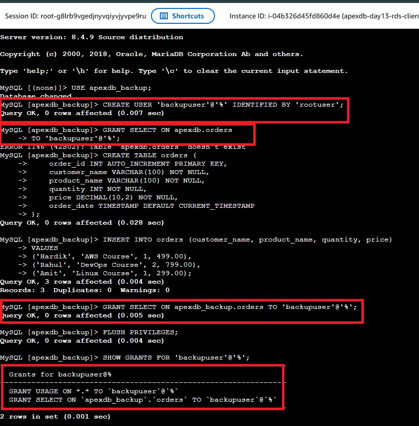

This implements least-privilege access for the logical backup process.

---

#  Step 37 — Configure IAM Permissions

IAM Role:

```text
apexdb-day13-ec2-ssm-role
```

The role should have:

### Systems Manager

```text
AmazonSSMManagedInstanceCore
```

### Secrets Manager

```text
secretsmanager:GetSecretValue
```

Restricted to:

```text
apexdb-day13-backup-secret
```

### S3

Required permissions:

```text
s3:PutObject
s3:GetObject
```

Restricted to:

```text
day13/mysql-table-backups/*
```

> ❌ Do not attach `AdministratorAccess`.


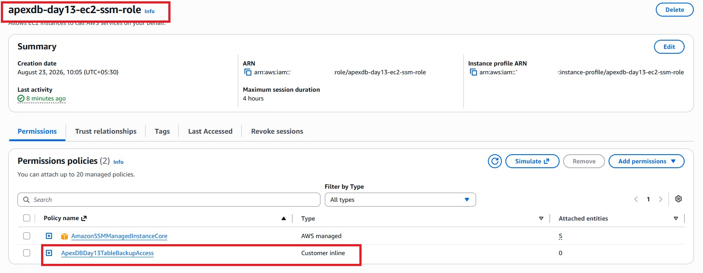

---

#  Step 38 — Test S3 Access

From EC2:

```bash
aws s3 ls
```

Then:

```bash
aws s3 ls s3://YOUR_BUCKET_NAME/
```
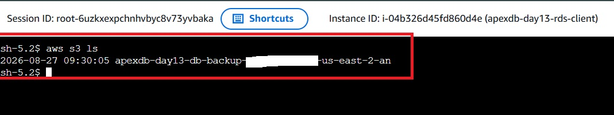

Verify that the IAM role can access the required bucket.

---

#  Step 39 — Test Secrets Manager

Run:

```bash
aws secretsmanager get-secret-value \
  --secret-id apexdb-day13-backup-secret
```

Verify the IAM permission.

> ⚠️ Do not capture or publish the secret output.

---

#  Step 40 — Install Backup Tools

On EC2:

```bash
sudo dnf install -y jq gzip
```

Verify:

```bash
jq --version
gzip --version
aws --version
mysql --version
```
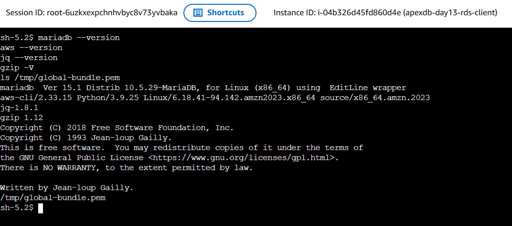

The backup workflow requires the database client, `jq`, `gzip`, AWS CLI and related database connectivity components.

---

#  Step 41 — Create SSM Command Document

Go to:

```text
Systems Manager
→ Documents
→ Create document
```

Select:

```text
Command
```

Name:

```text
ApexDB-Day13-MySQL-Backup-To-S3
```
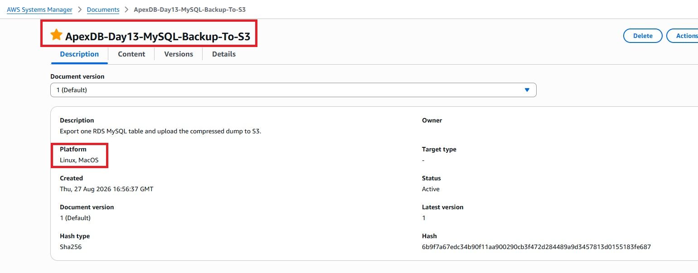

Purpose:

```text
Backup orders table from private RDS MySQL to S3
```

The document should perform:

```text
1. Retrieve credentials from Secrets Manager
2. Connect to private RDS
3. Export the orders table
4. Compress the SQL dump
5. Upload the .sql.gz file to S3
6. Generate a timestamped backup filename
```

Backup workflow:

```text
RDS
 |
 | mysqldump
 ↓
orders.sql
 |
 | gzip
 ↓
orders.sql.gz
 |
 | AWS CLI
 ↓
Amazon S3
```

---

#  Step 42 — Execute Manual Backup

Run the SSM document against:

```text
apexdb-day13-rds-client
```
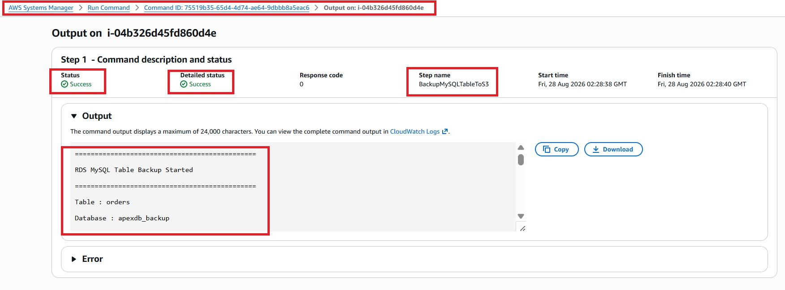

After successful execution, check:

```text
S3
→ YOUR BUCKET
→ day13/mysql-table-backups/
```
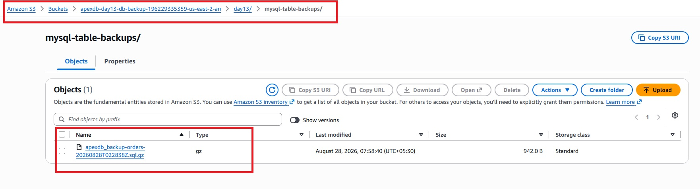

Expected file format:

```text
orders-YYYY-MM-DD-HHMMSS.sql.gz
```

Validate:

```bash
aws s3 ls \
s3://YOUR_BUCKET/day13/mysql-table-backups/
```

---

#  Step 43 — Create State Manager Association

Go to:

```text
Systems Manager
→ State Manager
→ Create association
```

Name:

```text
apexdb-day13-daily-backup
```

Document:

```text
ApexDB-Day13-MySQL-Backup-To-S3
```

Target:

```text
apexdb-day13-rds-client
```

Schedule:

```text
Every 24 Hours
```
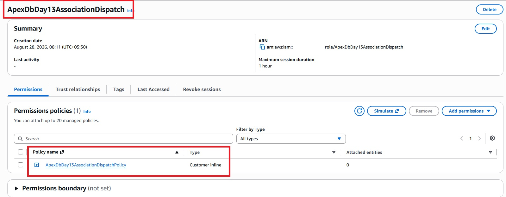

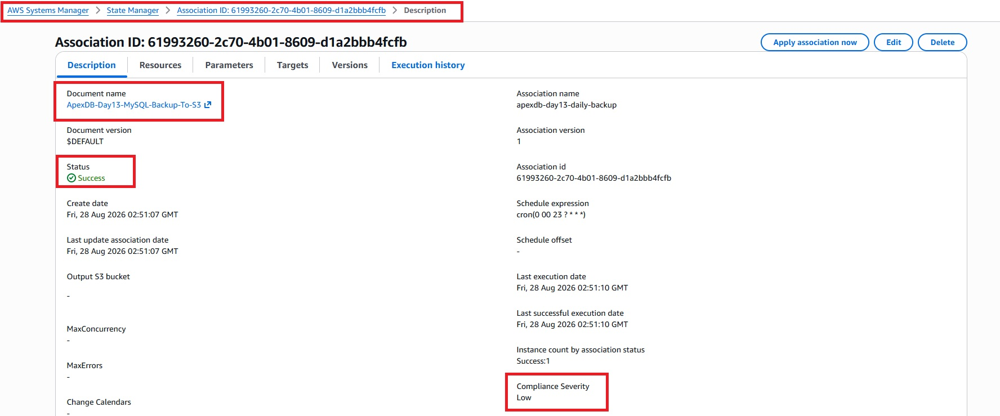

This creates an automated backup schedule.

---

# Step 44 — Validate Automated Backup

Go to:

```text
Systems Manager
→ State Manager
```

Verify:

```text
Association Status:
Success
```
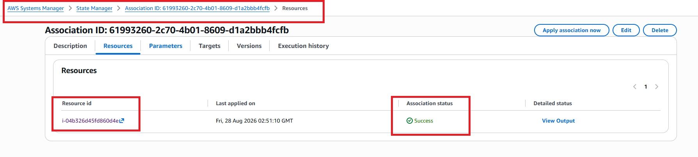

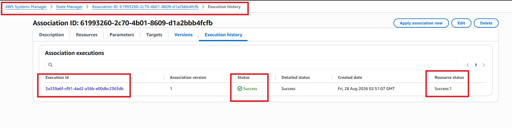

Then check S3:

```text
day13/mysql-table-backups/
```
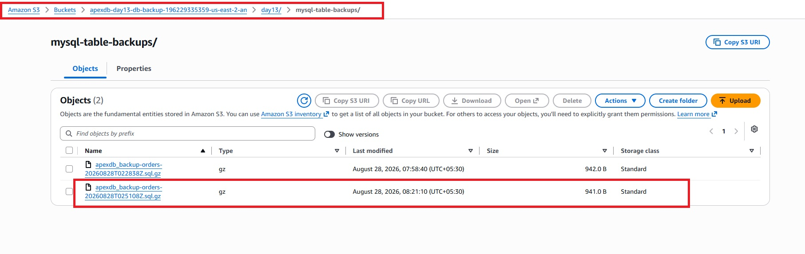

Download the backup:

```bash
aws s3 cp \
s3://YOUR_BUCKET/day13/mysql-table-backups/BACKUP_FILE.sql.gz \
/tmp/backup.sql.gz
```
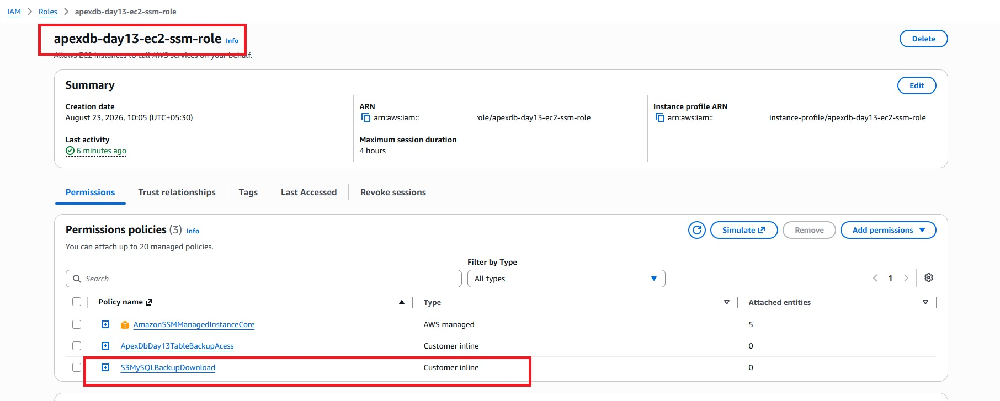

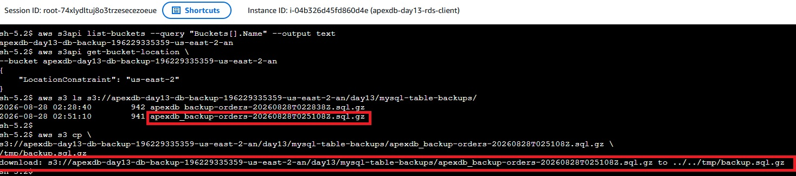

---

# Step 45 — Validate Backup File

Check gzip integrity:

```bash
gzip -t /tmp/backup.sql.gz
```

Inspect the SQL:

```bash
gunzip -c /tmp/backup.sql.gz | head
```
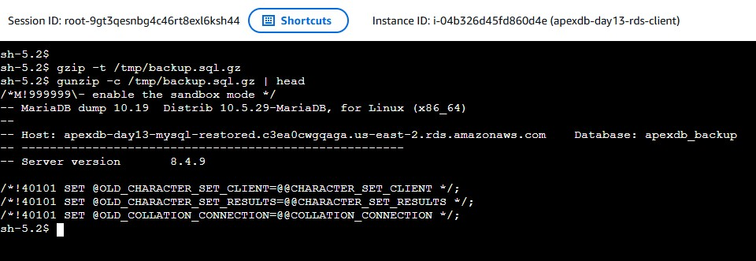

If `gzip -t` produces no error, the compressed backup is valid.

---

# Step 46 — Restore Logical Backup

Restore:

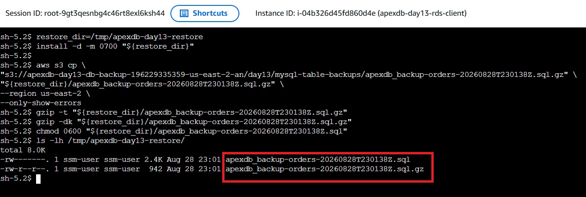

Create a temporary database:

```sql
CREATE DATABASE apexdb_restore_test;
```
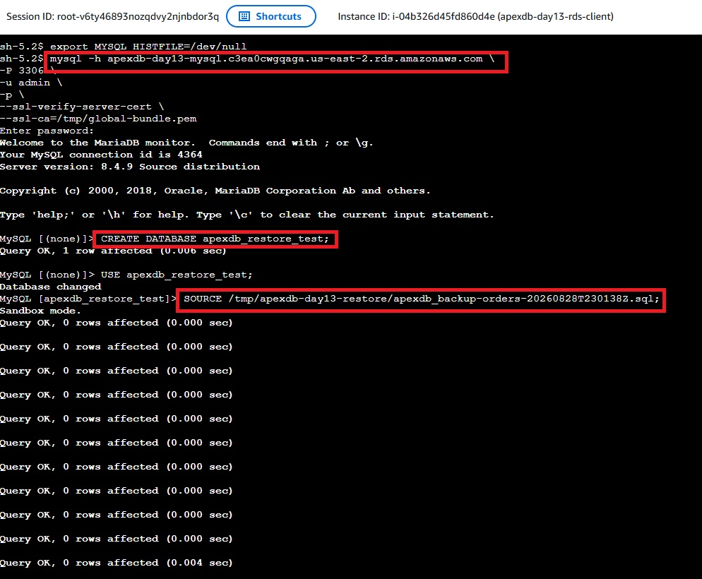

Validate:

```sql
USE apexdb_restore_test;

SHOW TABLES;

SELECT COUNT(*) FROM orders;

SELECT * FROM orders;
```
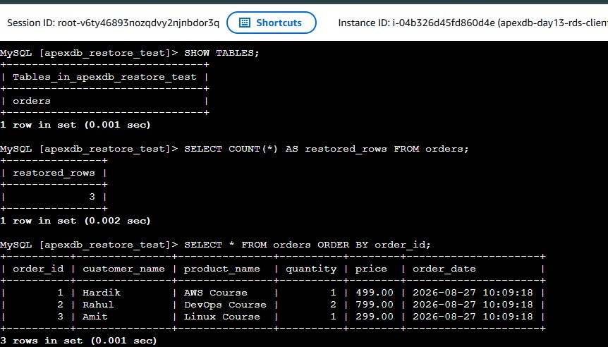

This confirms that the logical S3 backup can be restored successfully.

---

# 🧹 Step 47 — Remove Temporary Restore Database

After successful validation:

```sql
DROP DATABASE apexdb_restore_test;
```

Do not delete the original:

```text
apexdb
```

---

#  Step 49 — Security Checklist

Before publishing the project:

* [ ] RDS Public Access = `No`
* [ ] Aurora Public Access = `No`
* [ ] Database security group does not allow `0.0.0.0/0`
* [ ] RDS Proxy uses TLS
* [ ] Credentials stored in Secrets Manager
* [ ] EC2 uses IAM Role
* [ ] No AWS access keys stored on EC2
* [ ] S3 Block Public Access enabled
* [ ] S3 encryption enabled
* [ ] Least-privilege IAM permissions configured
* [ ] Backup user has only required database permissions
* [ ] No passwords in GitHub
* [ ] No secret values in screenshots
* [ ] Sensitive endpoints removed/cropped if necessary

---
#  Step 50 — Project Validation

At the end of the project, verify:

```text
☑ VPC created
☑ Six subnets created
☑ Multi-AZ architecture configured
☑ Internet Gateway attached
☑ NAT Gateway available
☑ Private database tier has no default internet route
☑ EC2 deployed privately
☑ Session Manager connectivity working
☑ RDS MySQL available
☑ RDS connectivity working
☑ Orders table created
☑ RDS snapshot completed
☑ Snapshot restore completed
☑ PITR successfully tested
☑ Read Replica replicating
☑ Replica writes rejected
☑ Aurora Serverless v2 available
☑ Aurora Writer available
☑ Aurora Reader available
☑ Aurora failover completed
☑ RDS Proxy available
☑ Proxy target healthy
☑ TLS enabled
☑ Secrets Manager configured
☑ S3 backup bucket secured
☑ SSM backup document created
☑ Manual backup successful
☑ Backup uploaded to S3
☑ State Manager configured
☑ Scheduled backup successful
☑ Backup downloaded
☑ Backup integrity verified
☑ Backup restored successfully
☑ Temporary restore database removed
```
---

# 🧹 Step 51 — AWS Resource Cleanup

> ⚠️ **Important:** RDS, Aurora, NAT Gateway, EC2 and other AWS resources may incur charges.

Only perform cleanup after collecting all required screenshots.

Recommended cleanup order:

```text
1. Delete State Manager association
2. Delete SSM automation resources
3. Delete SSM Command Document
4. Delete S3 backup objects
5. Delete S3 backup bucket
6. Delete Secrets Manager secret
7. Delete RDS Proxy
8. Delete Aurora reader
9. Delete Aurora cluster
10. Delete RDS Read Replica
11. Delete PITR restored database
12. Delete snapshot-restored database
13. Delete manual RDS snapshot
14. Delete original RDS database
15. Terminate EC2
16. Delete security groups
17. Delete NAT Gateway
18. Release Elastic IP
19. Delete route tables
20. Delete six subnets
21. Detach and delete Internet Gateway
22. Delete VPC
```

The cleanup sequence follows the lab's recommended approach and should be performed only after evidence collection.

---

# 🎯 Skills Demonstrated

This project demonstrates practical experience in:

### ☁️ AWS Cloud

* Amazon VPC
* Amazon EC2
* Amazon RDS
* Amazon Aurora
* Amazon S3
* AWS IAM
* AWS Secrets Manager
* AWS Systems Manager

### 🌐 Networking

* VPC design
* Multi-AZ architecture
* Public/private subnet segmentation
* Route tables
* Internet Gateway
* NAT Gateway
* Security Groups

### 🗄️ Database 

* MySQL
* RDS
* Read Replicas
* Aurora Serverless v2
* Writer/Reader architecture
* Database snapshots
* Point-in-Time Recovery
* Database failover
* RDS Proxy

### 🔐 Security

* IAM least privilege
* Private database architecture
* Security Group controls
* Secrets Manager
* TLS
* S3 Block Public Access
* Encryption

### ⚙️ DevOps Automation

* AWS Systems Manager
* Session Manager
* SSM Documents
* State Manager
* AWS CLI
* `mysqldump`
* `gzip`
* Automated S3 backups
* Backup restoration testing

---

# 💼 Real-World Use Case

The architecture represents a common production-style database pattern:

```text
Application
     |
     ▼
Private Application Layer
     |
     ▼
RDS Proxy
     |
     ▼
Aurora / RDS
     |
     ├── Writer
     ├── Reader
     └── Read Replica
     
Backup Layer
     |
     ▼
Secrets Manager
     |
     ▼
SSM Automation
     |
     ▼
Compressed Backup
     |
     ▼
Amazon S3
```

The design provides:

```text
Security
   +
High Availability
   +
Read Scalability
   +
Database Recovery
   +
Connection Management
   +
Automated Backup
   +
Operational Automation
```

---

# 📈 Key Learning Outcomes

After completing this project, you should understand how to:

1. Design a multi-AZ AWS VPC.
2. Separate public, application and database tiers.
3. Deploy private RDS databases.
4. Secure MySQL using Security Groups.
5. Access private EC2 instances without SSH.
6. Create and restore RDS snapshots.
7. Perform Point-in-Time Recovery.
8. Configure RDS Read Replicas.
9. Deploy Aurora Serverless v2.
10. Understand Aurora writer/reader architecture.
11. Perform Aurora failover.
12. Configure RDS Proxy.
13. Secure database credentials with Secrets Manager.
14. Create compressed logical database backups.
15. Store backups in S3.
16. Automate database backups with SSM.
17. Schedule automation using State Manager.
18. Validate and restore database backups.

---

# 👨‍💻 Author

## Hardik Darji
DevOps Engineer

---

# ⭐ Support

If this project helped you learn AWS, DevOps or cloud database architecture:

**⭐ Star this repository**

Feel free to fork, explore and improve the project.

---

## 🚀 Project Status

```text
AWS Day 13
RDS + Aurora + RDS Proxy + Recovery + Backup Automation

Status: Completed ✅
Region: us-east-2
```
