## Day 15 Lab – Route 53, CloudFront, ACM, WAF, and Multi-Region Failover

---
##  📌 Project Overview

This project implements a secure, highly available AWS web architecture using Route 53, CloudFront, S3, ACM, WAF, and EC2.

The project demonstrates global CDN delivery, private S3 access, edge security, signed URLs, DNS routing, health checks, and multi-region active-passive failover.

---
## 🏗️ Architecture Flow
---
## AWS Global CDN Edge Protection Private S3

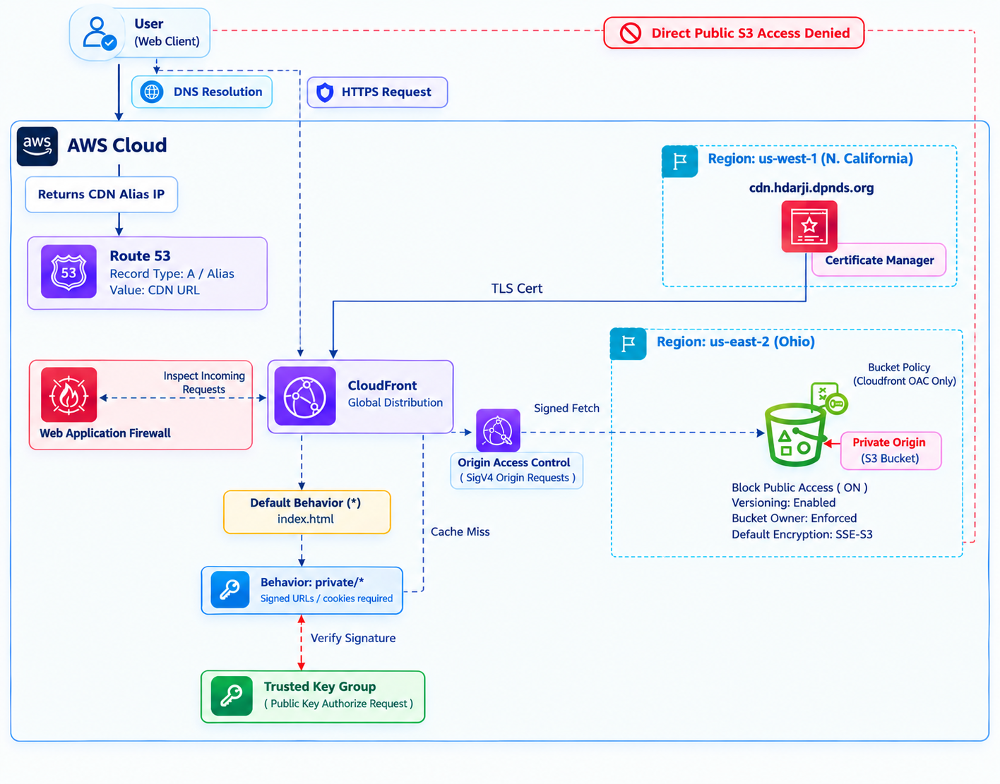

---
## 🎯 Project Objectives

The main objectives of this project are:

* Configure Route 53 hosted zones and DNS records
* Implement multi-region DNS routing
* Configure Simple, Weighted, and Failover routing policies
* Deploy EC2 web servers across multiple AWS regions
* Configure Nginx web servers for application testing
* Create Route 53 health checks
* Implement multi-region active-passive failover
* Build a private S3 bucket for secure content storage
* Configure CloudFront with Origin Access Control (OAC)
* Deliver private S3 content through CloudFront
* Configure AWS WAF for edge security
* Implement CloudFront signed URLs
* Create and configure CloudFront Trusted Key Groups
* Configure AWS Certificate Manager (ACM) for HTTPS
* Connect a custom domain to CloudFront
* Configure HTTP-to-HTTPS redirection
* Test CloudFront caching and cache invalidation
* Validate automatic DNS failover during regional failure
* Test secure access to private S3 objects
* Monitor and validate the complete global edge architecture
---
## AWS Multi Region Active Passive Failover

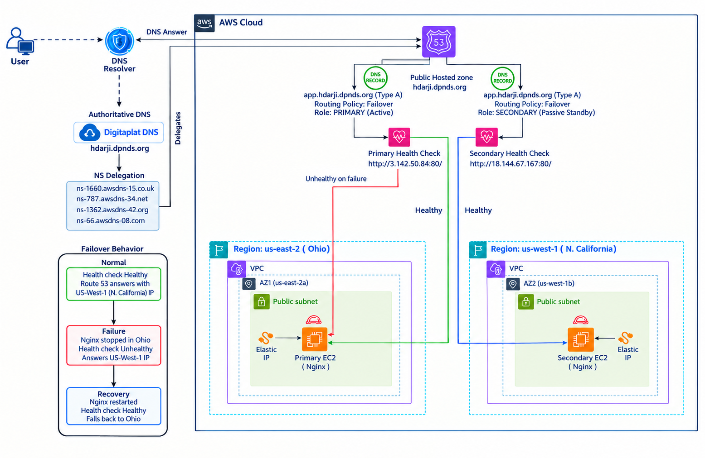

---
## 1. Route 53 Public Hosted Zone

* Created the public hosted zone `hdarji.dpnds.org` in Amazon Route 53.
* Copied the four Route 53 authoritative name servers and configured the domain registrar to use the Route 53 nameservers.
* Verified the authoritative name servers using `dig NS`.

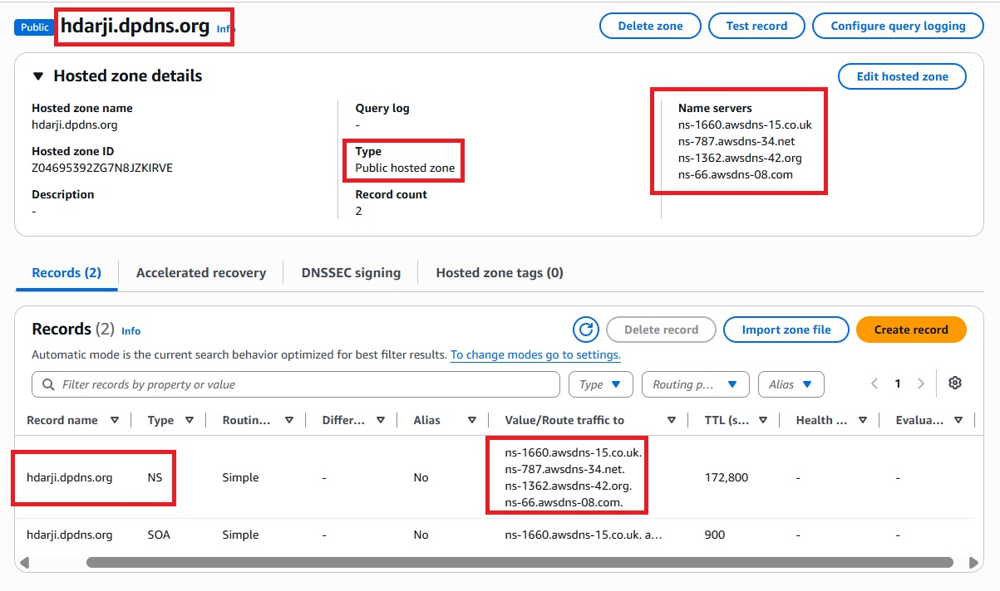

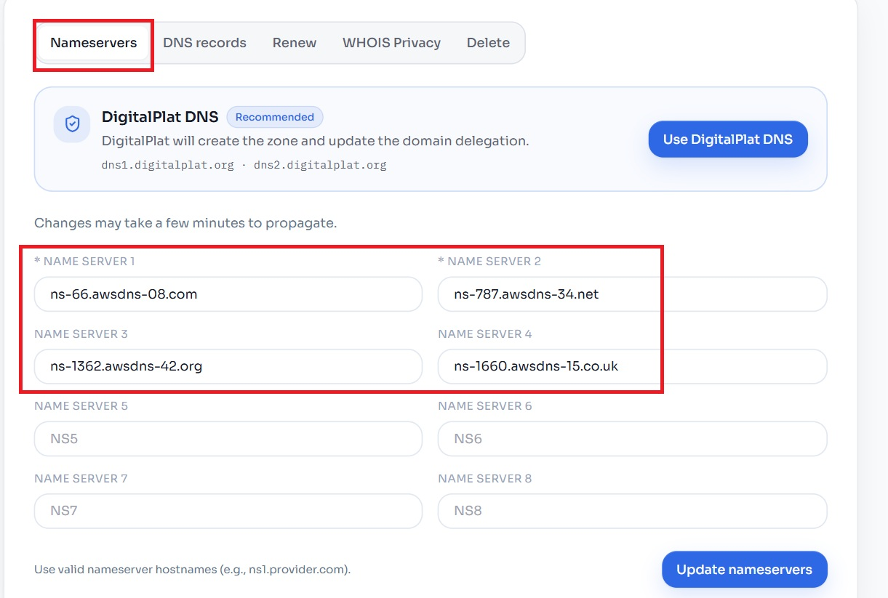

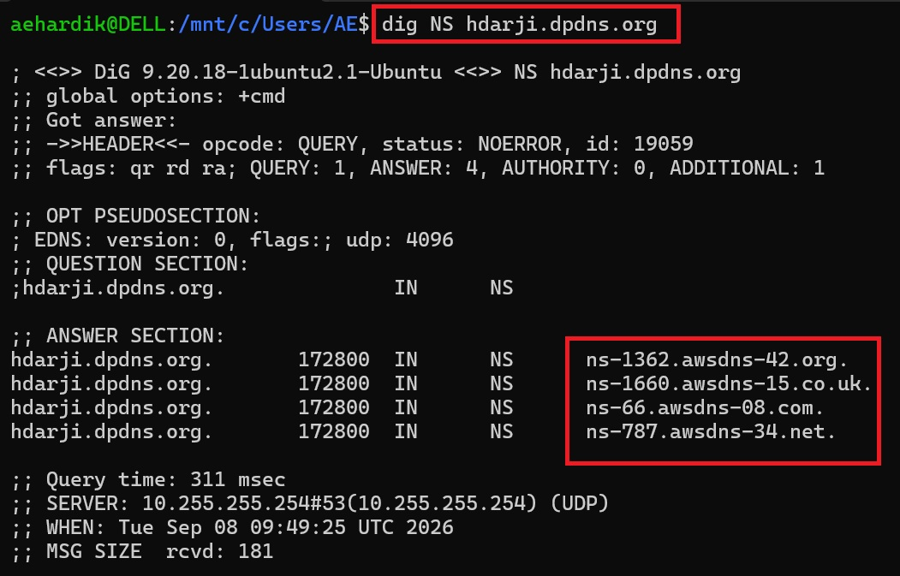

---
## 2. ACM Certificate and DNS Validation

* Requested a public ACM certificate in **`us-east-2`** for `cdn.hdarji.dpnds.org`.
* Selected DNS validation with **RSA 2048**, created the ACM validation CNAME in Route 53, and verified the certificate status changed to **Issued** for CloudFront use.

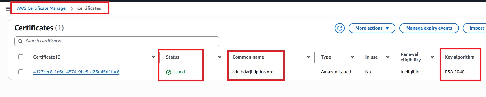

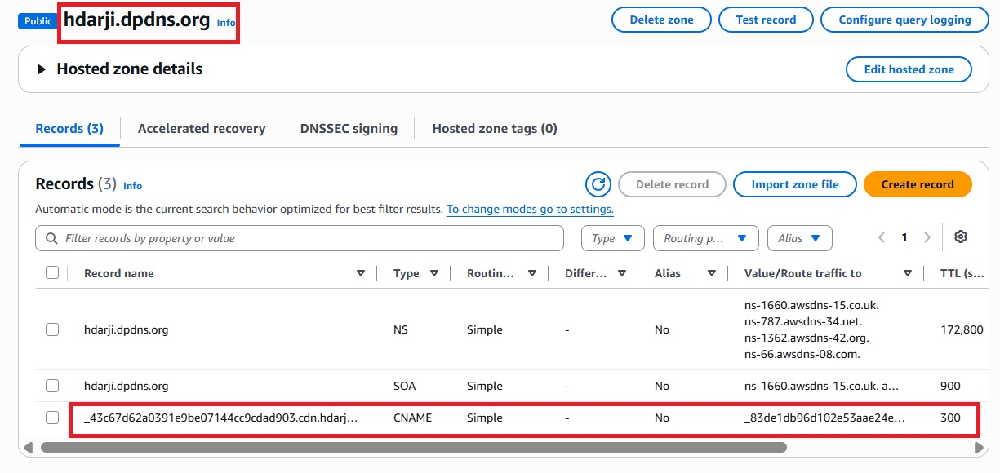

---
## 3. Primary Ohio EC2 Endpoint

* Deployed the **primary web server** in **Ohio (`us-east-2`)** using Amazon Linux 2023 and Nginx.
* Configured the EC2 instance to serve HTTP traffic as the primary regional endpoint.

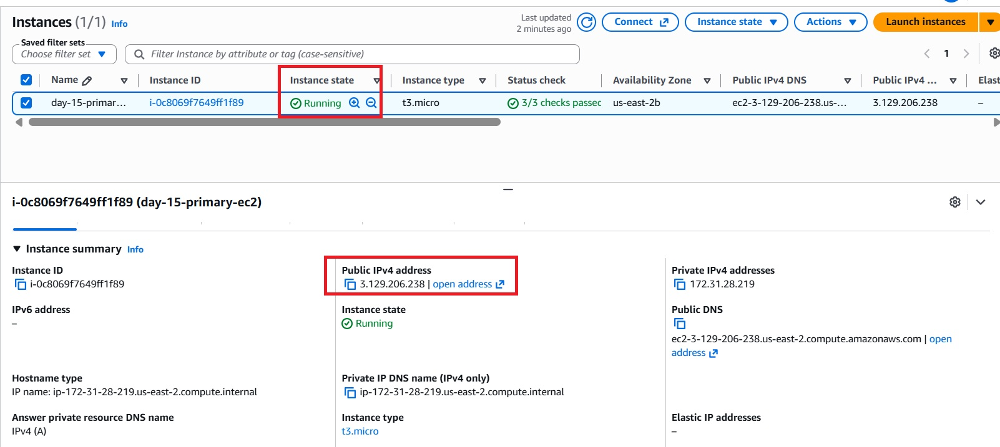

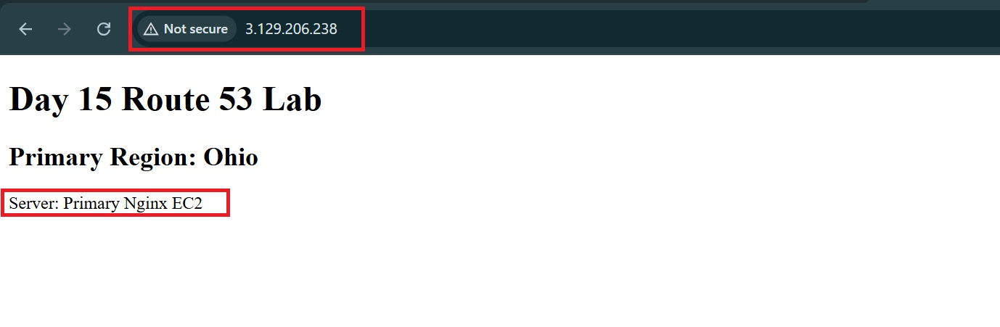

---
## 4. Secondary N. California EC2 Endpoint

* Deployed the **secondary web server** in **N. California (`us-west-1`)** using Amazon Linux 2023 and Nginx.
* Configured the instance as the **backup regional endpoint** for multi-region failover testing.

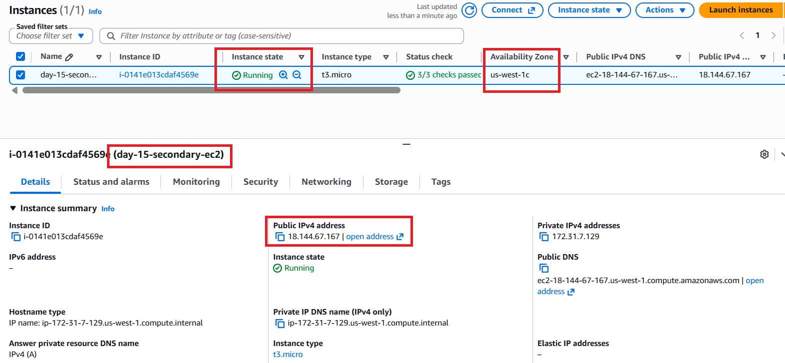

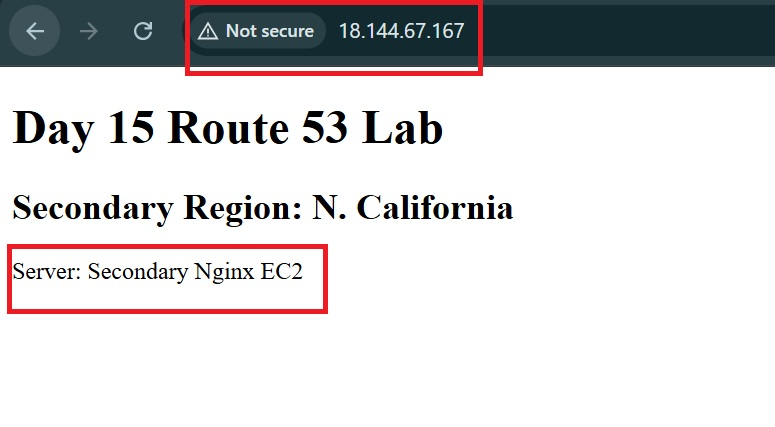

---
## 5. Route 53 Health Checks

* Configured public Route 53 health checks for both regional web endpoints.
* Set the checks to monitor **HTTP port 80** using the `/` path with a **30-second interval** and **failure threshold of 3**.
* Confirmed that the Ohio and N. CAlifornia endpoints reported a **Healthy** status.

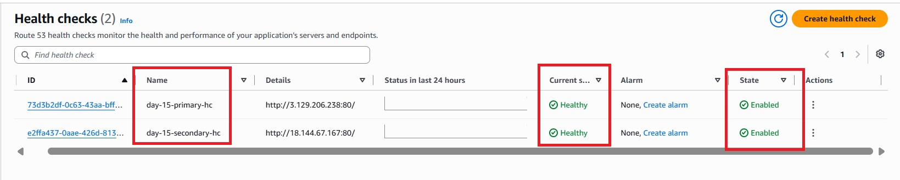

---
### 6. Simple Routing

* Configured two Route 53 **Simple A records** to directly resolve the regional web endpoints.
* Created the following DNS records:

```text
primary.hdarji.dpnds.org
secondary.hdarji.dpnds.org
```

| Endpoint  | Region                    | Record Type | TTL |
| --------- | ------------------------- | ----------- | --: |
| Primary   | Ohio (`us-east-2`)     | A           |  30 |
| Secondary | N. California (`us-west-1`) | A           |  30 |

* Tested DNS resolution using `dig` and validated HTTP connectivity to both endpoints using `curl`.

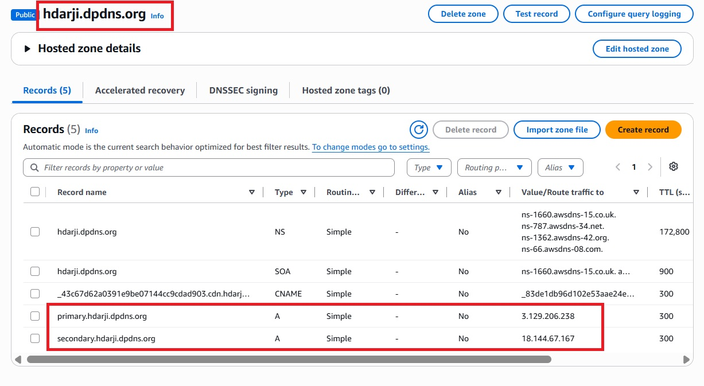

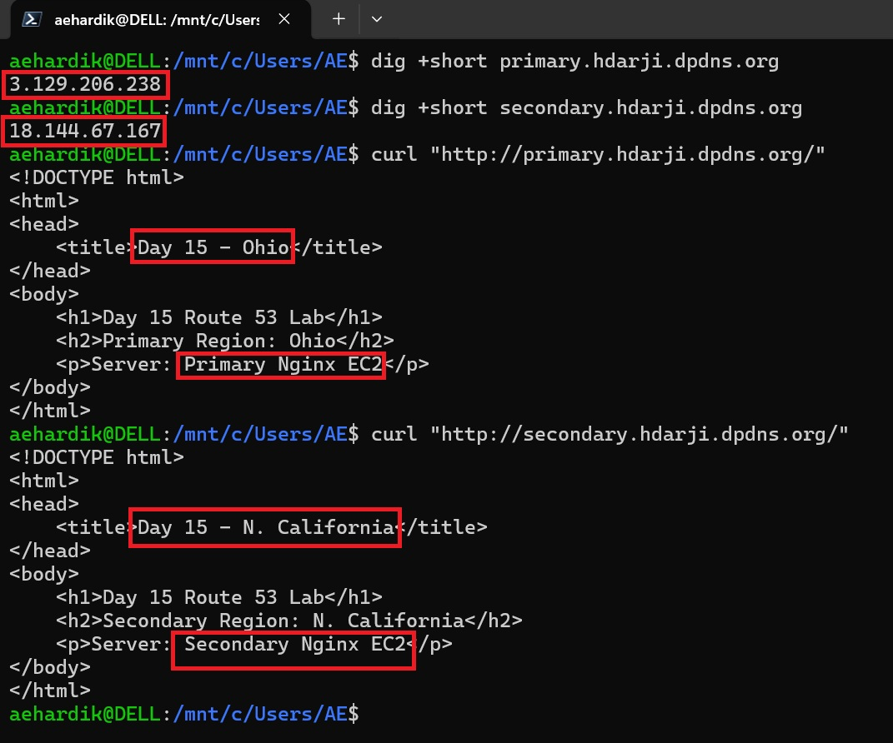

---
### 7. Weighted Routing

* Configured Route 53 **Weighted A records** to distribute DNS traffic between the two regional endpoints.
* Created the DNS record:

```text
weighted.hdarji.dpnds.org
```

| Endpoint  | Region                    | Weight |
| --------- | ------------------------- | -----: |
| Primary   | Ohio (`us-east-2`)     |     80 |
| Secondary | N. California (`us-west-1`) |     20 |

* Tested the DNS responses multiple times and confirmed that both regional endpoints could be returned.
* Updated the routing weights to **50/50** and repeated the DNS resolution tests.
* Observed that weighted routing controls the relative distribution of DNS responses, while DNS caching can affect the observed request distribution.

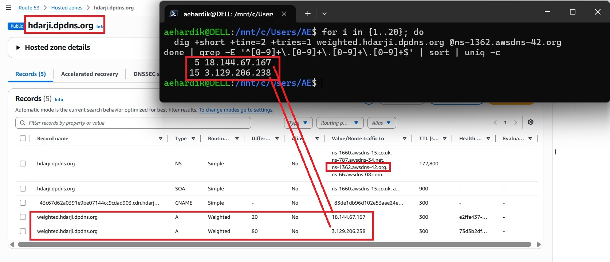

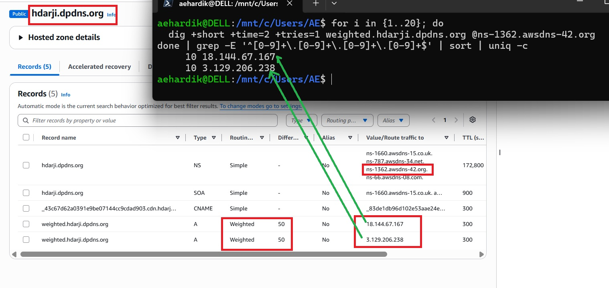

---
### 8. Route 53 Failover Baseline

* Configured **Route 53 Failover routing** to provide automatic DNS switching between the two regional web servers.
* Created the DNS record:

```text
app.hdarji.dpnds.org
```

* Set **Ohio (`us-east-2`)** as the Primary endpoint and **N. California (`us-west-1`)** as the Secondary endpoint.
* Associated the corresponding **Route 53 health checks** with both failover records and configured a **30-second TTL**.
* Confirmed the healthy baseline resolved traffic to the **Ohio primary endpoint**.

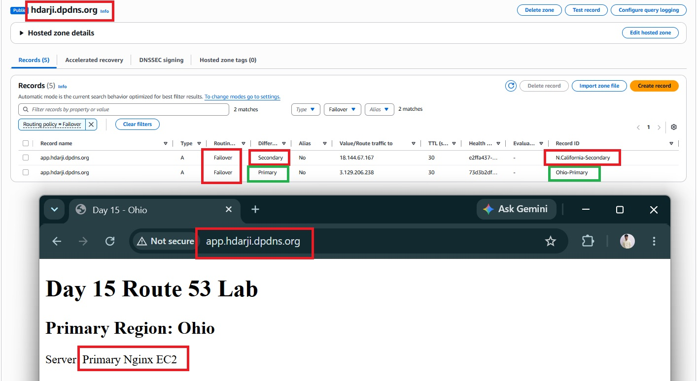

---
## 9. Route 53 Application Failover

* Simulated a regional application failure by stopping the **Nginx service** on the Ohio primary EC2 instance.
* The associated Route 53 health check detected the endpoint as **Unhealthy**.
* Route 53 automatically redirected DNS resolution to the **N. California secondary endpoint**.
* Verified successful failover by accessing `app.hdarji.dpnds.org` and confirming the N. California web page was served.

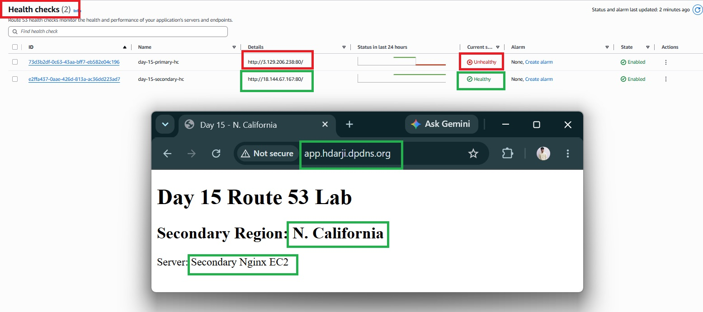

---
### 10. Route 53 Failback

* Restored the **Nginx service** on the Ohio primary EC2 instance.
* Monitored the Route 53 health check until the primary endpoint became **Healthy** again.
* Route 53 automatically restored DNS traffic to the **Ohio Primary** endpoint.
* Confirmed the application was successfully serving the **Ohio endpoint** after recovery.

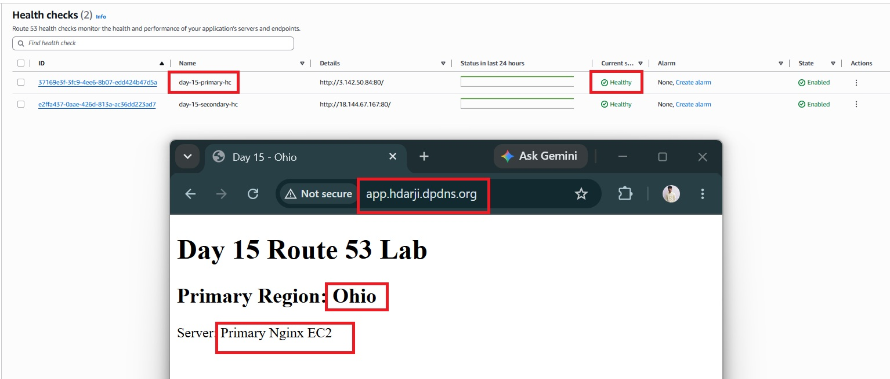

---
### 11. Private S3 Origin Bucket

* Provisioned a **private S3 bucket** in **Ohio (`us-east-2`)** to store the CloudFront origin content.
* Uploaded the required objects to the bucket and applied secure storage configurations.
* Enabled **Block Public Access** and **Bucket Owner Enforced** object ownership.
* Enabled **S3 Versioning** and **default server-side encryption** for stored objects.
* Kept **S3 Static Website Hosting disabled** to ensure content is accessed through the protected CloudFront distribution.

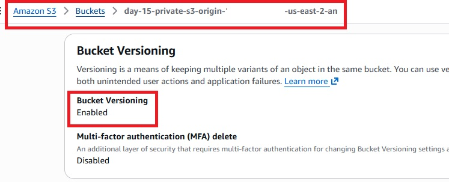
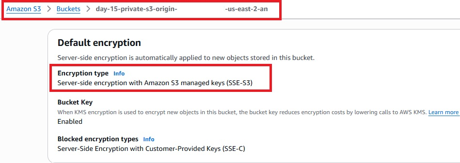
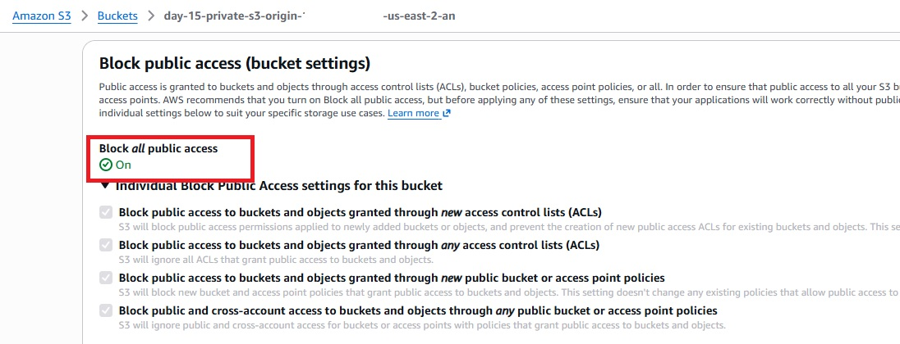
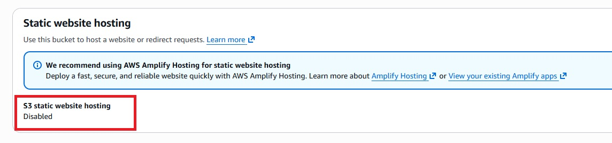
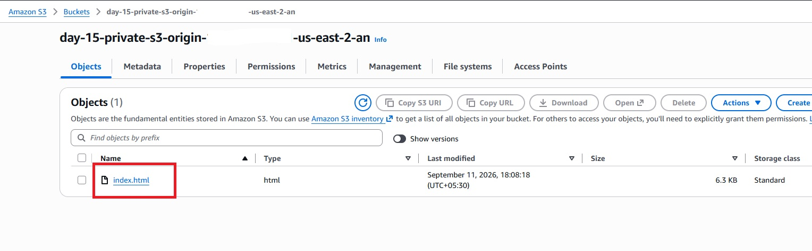
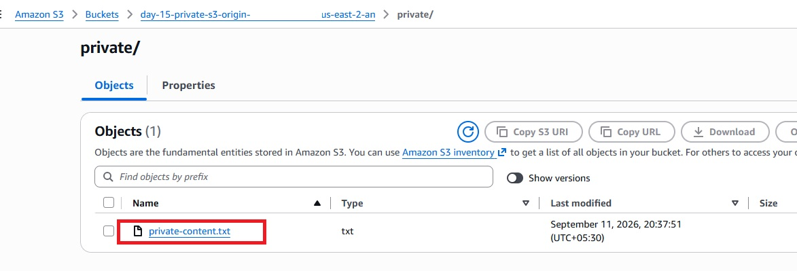

---
### 12. Direct S3 Access Denied

* Added the `private/private-content.txt` object to the private S3 bucket.
* Tested the object's direct S3 URL without CloudFront access.
* Confirmed the request was rejected with **`AccessDenied`**, validating that the S3 bucket does not allow direct public access.

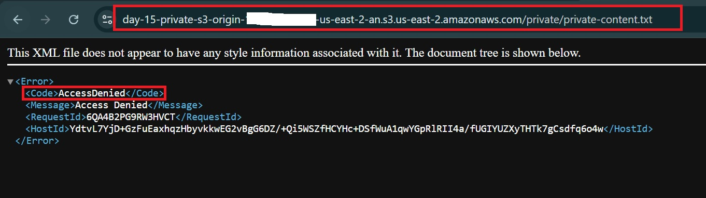

---
### 13. CloudFront Distribution and OAC

* Deployed a **CloudFront distribution** to securely deliver content from the private S3 origin.
* Configured the S3 REST endpoint as the CloudFront origin and enabled **Origin Access Control (OAC)**.
* Applied the following distribution settings:

  * Redirected **HTTP requests to HTTPS**
  * Allowed **GET and HEAD** methods
  * Enabled the managed **`CachingOptimized`** cache policy
  * Enabled **content compression**
  * Set **`index.html`** as the default root object

---

### 14. CloudFront Default Domain Validation

* Accessed the generated **CloudFront distribution domain** and verified successful delivery of content from the private S3 origin.
* Tested the following CloudFront URLs:

```text
https://<DISTRIBUTION-DOMAIN>/
https://<DISTRIBUTION-DOMAIN>/index.html
```

* Confirmed that both requests returned the expected **`Page Version: 1`** content.

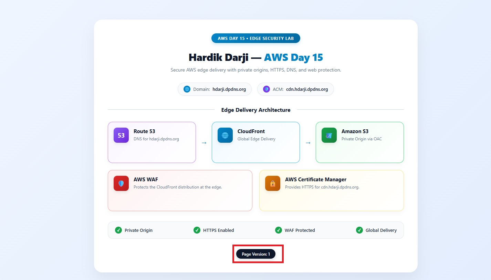

---
### 15. CloudFront Cache Behavior

* Accessed the same CloudFront object repeatedly to observe caching behavior at the edge.
* Inspected the HTTP response headers to verify CloudFront cache activity.
* Checked the following headers:

```text
X-Cache
Age
Via
X-Amz-Cf-Pop
```

* Used the header values to validate **cache hits, object age, CloudFront routing, and the serving edge location**.
  
---
### 16. CloudFront Invalidation

* Updated the S3 origin content from:

```text
Page Version: 1
```

to:

```text
Page Version: 2
```

* Uploaded the updated `index.html` using the same S3 object key.
* Verified that the previous content continued to be served from the CloudFront cache.
* Created a CloudFront invalidation for **`/index.html`** to remove the cached version.
* Confirmed that CloudFront subsequently served the updated **Page Version: 2** content.

- Created a CloudFront invalidation for:
/index.html
- Waited for the invalidation to complete and verified that CloudFront served Page Version: 2.
---
### 17. CloudFront Public Key and Key Group

* Generated an RSA signing key pair using **AWS CloudShell** for CloudFront signed URL testing.
* Added the public key to **CloudFront** and created a dedicated key group.
* Configured the key group to support **signed URL authentication** for protected content.
* Kept the private key securely within CloudShell and did not upload, expose, or commit it to any public location.

---
### 18. Unsigned Private Path Denied

* Created a dedicated CloudFront behavior for the protected path **`private/*`**.
* Configured the behavior with:

  * Redirect HTTP requests to HTTPS
  * Allow **GET and HEAD** methods
  * Use the **`CachingOptimized`** cache policy
  * Enable **Restrict Viewer Access**
  * Associate the **CloudFront Trusted Key Group**
* Verified that requests to the private path without a valid signed URL were denied.


- Attempted to access: https://<DISTRIBUTION-DOMAIN>/private/private-content.txt without a signed URL.

- Verified that the request was denied.
  
---
### 19. Signed URL Validation

* Generated a **time-limited CloudFront signed URL** using the configured public key and private signing key.
* Set the signed URL validity period to **15 minutes**.
* Accessed the protected object through the complete signed URL and confirmed a successful **HTTP 200** response.
* Tested the same URL after expiration and verified that CloudFront rejected the request, confirming **time-based access control**.

---

### 20. Custom HTTPS Domain

* Associated the **ACM certificate from `us-east-2`** with the CloudFront distribution.
* Added **`cdn.hdarji.dpnds.org`** as the CloudFront alternate domain name.
* Created a Route 53 **A/ALIAS record** directing the custom domain to the CloudFront distribution.
* Verified that `https://cdn.hdarji.dpnds.org/` successfully delivered the CloudFront content over **HTTPS**.
* Confirmed that the custom domain used a valid **SSL/TLS certificate**.


---
### 21. AWS WAF Count Testing

* Created a **CloudFront-scope WAF IP set** containing the public IPv4 address as a `/32` entry.
* Added the **`Block-IP`** rule to the Web ACL.
* Initially configured the rule action as **Count** for testing.
* Sent multiple requests to the CloudFront root page and confirmed the content remained accessible while WAF recorded the matching requests.

---
### 22. AWS WAF Block Testing

* Updated the **`Block-IP`** WAF rule action from **Count** to **Block**.
* Sent a new request to the CloudFront root URL and confirmed that access was denied with **HTTP `403`**.
* Changed the rule back to **Count** and verified that normal CloudFront access was restored.
* Removed the temporary WAF IP set after completing the security validation.

---
## 💡 Key Takeaways

* Learned how to configure **Route 53 DNS routing and health checks**.
* Understood **multi-region active-passive failover and automatic failback**.
* Learned how **CloudFront** securely delivers content from a private S3 origin.
* Implemented **Origin Access Control (OAC)** to restrict direct S3 access.
* Practiced **CloudFront caching and cache invalidation**.
* Implemented **signed URLs and Trusted Key Groups** for protected content.
* Configured **ACM certificates and HTTPS** for a custom CloudFront domain.
* Learned how **AWS WAF** can monitor and block unwanted traffic.
* Gained practical experience designing **secure, highly available, and globally distributed AWS architectures**.

---
## 🧹 Cleanup

**Day 15 cleanup should be performed only after all required evidence has been captured.**

1. Remove the temporary **AWS WAF IP set** and delete the Day 15 WAF Web ACL/rules.
2. Remove the Route 53 `cdn.hdarji.dpnds.org` A/ALIAS record pointing to CloudFront.
3. Remove `cdn.hdarji.dpnds.org` as the CloudFront alternate domain and detach the ACM certificate.
4. Disable and delete the **CloudFront distribution**.
5. Delete the CloudFront **Trusted Key Group** and public key used for signed URL testing.
6. Remove the **CloudFront Origin Access Control (OAC)** associated with the distribution.
7. Delete all objects from the private S3 bucket, then delete the Day 15 S3 bucket.
8. Delete the Route 53 failover record for `app.hdarji.dpnds.org`.
9. Delete the Route 53 weighted record for `weighted.hdarji.dpnds.org`.
10. Delete the Route 53 simple records for `primary.hdarji.dpnds.org` and `secondary.hdarji.dpnds.org`.
11. Delete the Route 53 health checks for the Mumbai and N. Virginia endpoints.
12. Terminate the secondary **N. California EC2** instance.
13. Terminate the primary **Ohio EC2** instance.
14. Delete the ACM certificate for `cdn.hdarji.dpnds.org` from **`us-east-2`**.
15. Remove the ACM DNS validation CNAME record from Route 53, if no longer required.
16. Verify that no Day 15 **CloudFront, WAF, S3, EC2, Route 53, ACM, or CloudFront signing resources** remain.

---
👨‍💻 Author
Hardik Darji

Role: DevOps Engineer

---

⭐ Support This Project
If you found this project helpful or useful, please consider giving it a ⭐ Star on GitHub.

Your support motivates me to keep learning, building, and sharing more DevOps and AWS projects.

⭐ Star this repository and feel free to share it with others!


