# Day 16 Lab – Cross-Region EC2 Backup and Disaster Recovery

---

## 📌 Project Overview

This hands-on AWS project demonstrates how to design and validate a **cross-region EC2 backup and disaster recovery (DR) solution** using:

* Amazon EC2
* Amazon EBS
* AWS Backup
* AWS KMS
* Amazon VPC
* Security Groups
* Nginx
* IMDSv2
* Cross-Region Backup Copy
* EC2 Restore
* RTO / RPO measurement

The architecture uses:

| Environment       | AWS Region                     |
| ----------------- | ------------------------------ |
| Primary           | `us-east-2` – US East (Ohio)   |
| Disaster Recovery | `us-west-2` – US West (Oregon) |

The objective is to create an encrypted EC2 backup in the primary region, copy the recovery point to a separate DR region, restore the EC2 instance there, and validate that the application and data are recoverable. This follows the reference lab's DR approach of using cross-region backups and a restore-based recovery workflow.

---

# 🏗️ Architecture

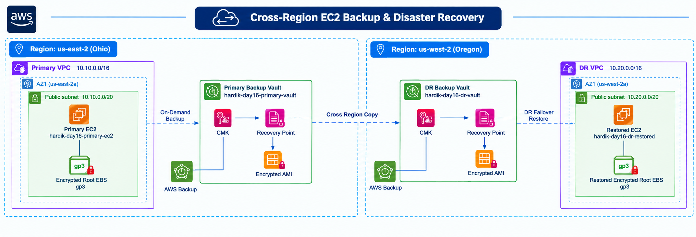


The reference architecture similarly separates the primary and DR environments and copies the recovery point across regions before restoration.

---

# 🎯 Objectives

By completing this lab, you will:

* Create a primary VPC.
* Launch an encrypted EC2 instance.
* Install and configure Nginx.
* Create a `/health` endpoint.
* Validate the EC2 application.
* Use AWS Backup for EC2 protection.
* Create a customer-managed KMS key in the DR region.
* Create a DR Backup Vault.
* Create an encrypted EC2 recovery point.
* Copy the recovery point across regions.
* Restore EC2 in the DR region.
* Validate EBS encryption.
* Validate Nginx.
* Validate IMDSv2.
* Measure actual RTO.
* Measure actual RPO.
* Clean up AWS resources.

---

# 📋 Resource Naming

## Primary Region – `us-east-2`

| Resource         | Name                          |
| ---------------- | ----------------------------- |
| VPC              | `hardik-day16-primary-vpc`    |
| Subnet           | `hardik-day16-primary-subnet` |
| Route Table      | `hardik-day16-primary-rt`     |
| Internet Gateway | `hardik-day16-primary-igw`    |
| Security Group   | `hardik-day16-primary-sg`     |
| EC2              | `hardik-day16-primary-ec2`    |
| Backup Vault     | `hardik-day16-primary-vault`  |

## DR Region – `us-west-2`

| Resource         | Name                               |
| ---------------- | ---------------------------------- |
| VPC              | `hardik-day16-dr-vpc`              |
| Subnet           | `hardik-day16-dr-subnet`           |
| Route Table      | `hardik-day16-dr-rt`               |
| Internet Gateway | `hardik-day16-dr-igw`              |
| Security Group   | `hardik-day16-dr-sg`               |
| Backup Vault     | `hardik-day16-dr-vault`            |
| KMS Alias        | `alias/hardik-day16-dr-backup-key` |
| Restored EC2     | `hardik-day16-dr-restored`         |

---

# 🔹 Step 1 – Select Primary Region

Open AWS Console.

Select:

```text
US East (Ohio)
us-east-2
```

All primary-region resources will be created here.

---

# 🔹 Step 2 – Create Primary VPC

Go to:

**VPC → Your VPCs → Create VPC**

Select:

```text
Resources to create:
VPC only
```

Enter:

```text
Name tag:
hardik-day16-primary-vpc

IPv4 CIDR:
10.10.0.0/16
```

Click:

**Create VPC**

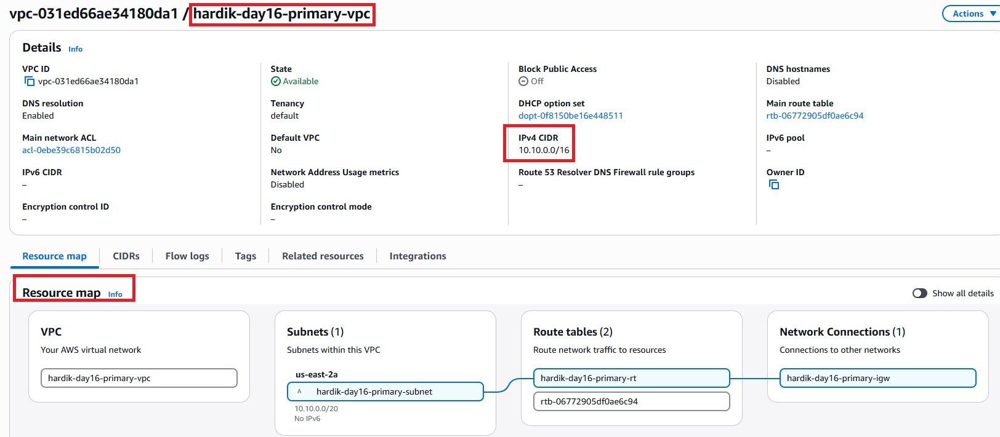

---

# 🔹 Step 3 – Create Primary Subnet

Go to:

**VPC → Subnets → Create subnet**

Select:

```text
VPC:
hardik-day16-primary-vpc
```

Enter:

```text
Subnet name:
hardik-day16-primary-subnet

Availability Zone:
us-east-2a

IPv4 subnet CIDR:
10.10.0.0/20
```

Click:

**Create subnet**

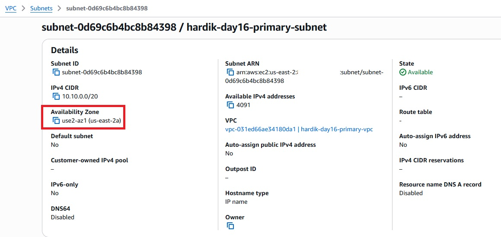

---

# 🔹 Step 4 – Create Internet Gateway

Go to:

**VPC → Internet Gateways → Create internet gateway**

Enter:

```text
Name:
hardik-day16-primary-igw
```

Create it.

Then:

**Actions → Attach to VPC**

Select:

```text
hardik-day16-primary-vpc
```
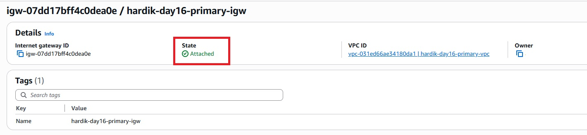

---

# 🔹 Step 5 – Create Primary Route Table

Go to:

**VPC → Route Tables → Create route table**

Enter:

```text
Name:
hardik-day16-primary-rt

VPC:
hardik-day16-primary-vpc
```

Create it.

---

# 🔹 Step 6 – Add Internet Route

Open:

```text
hardik-day16-primary-rt
```

Go to:

**Routes → Edit routes → Add route**

Enter:

```text
Destination:
0.0.0.0/0

Target:
Internet Gateway

hardik-day16-primary-igw
```

Save.

---

# 🔹 Step 7 – Associate Primary Subnet

Inside the route table:

**Subnet associations → Edit subnet associations**

Select:

```text
hardik-day16-primary-subnet
```

Save.

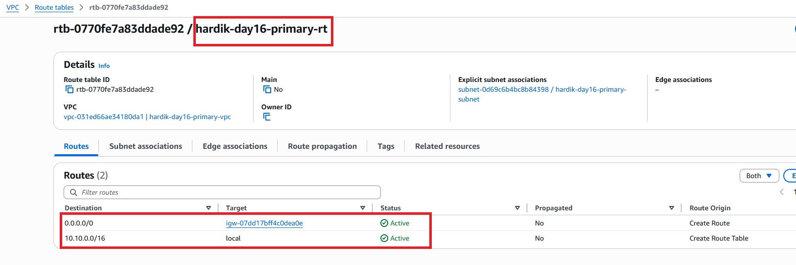

---

# 🔹 Step 8 – Enable Public IPv4

Go to:

**VPC → Subnets**

Select:

```text
hardik-day16-primary-subnet
```

Choose:

**Actions → Edit subnet settings**

Enable:

```text
Enable auto-assign public IPv4 address
```

Save.

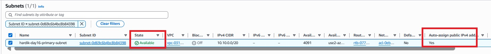

---

# 🔹 Step 9 – Create Primary Security Group

Go to:

**EC2 → Security Groups → Create security group**

Enter:

```text
Security group name:
hardik-day16-primary-sg

Description:
Security group for Day 16 primary EC2

VPC:
hardik-day16-primary-vpc
```

Inbound rules:

```text
HTTP
Port: 80
Source: My IP
```

Create security group.
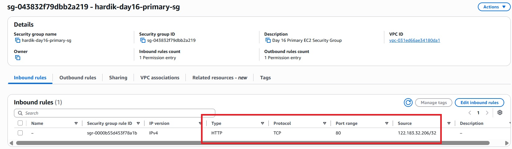

---

# 🔹 Step 10 – Launch Primary EC2

Go to:

**EC2 → Instances → Launch instance**

Configure:

```text
Name:
hardik-day16-primary-ec2
```

AMI:

```text
Amazon Linux 2023
```

Instance type:

```text
t3.micro
```
---

# 🔹 Step 11 – Configure Network

Set:

```text
VPC:
hardik-day16-primary-vpc

Subnet:
hardik-day16-primary-subnet

Auto-assign Public IP:
Enable

Security Group:
hardik-day16-primary-sg
```

Launch the instance.

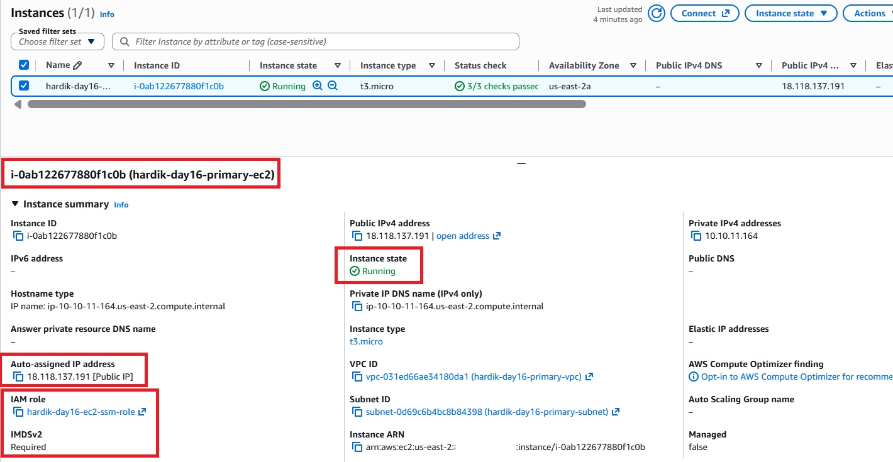

---

# 🔹 Step 12 – Configure EBS

Root volume:

```text
Volume type:
gp3

Size:
8 GiB

Encryption:
Enable
```
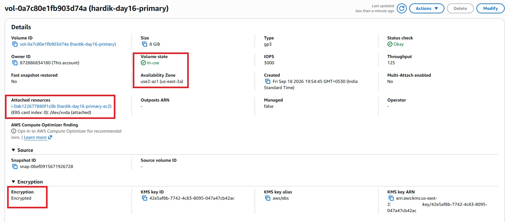

The reference lab specifically uses an encrypted 8 GiB gp3 EBS volume.

---

# 🔹 Step 13 – Add EC2 Tags

Add:

```text
Key: Backup
Value: Day16
```

And:

```text
Key: Project
Value: Hardik-Day16-DR
```

These tags can also be used to identify resources for backup and validation.

---

# 🔹 Step 14 – Connect to EC2

Connect using:

**EC2 → Instances → Connect → SSM MANAGER**

Check:

```bash
sudo systemctl status nginx --no-pager
sudo ss -ltnp | grep ':80'
curl -I http://localhost
curl http://localhost/health
curl http://localhost | grep 'Synthetic recovery marker: DAY16'
curl http://localhost | grep -E 'Ohio|us-east-2|Instance ID'
```
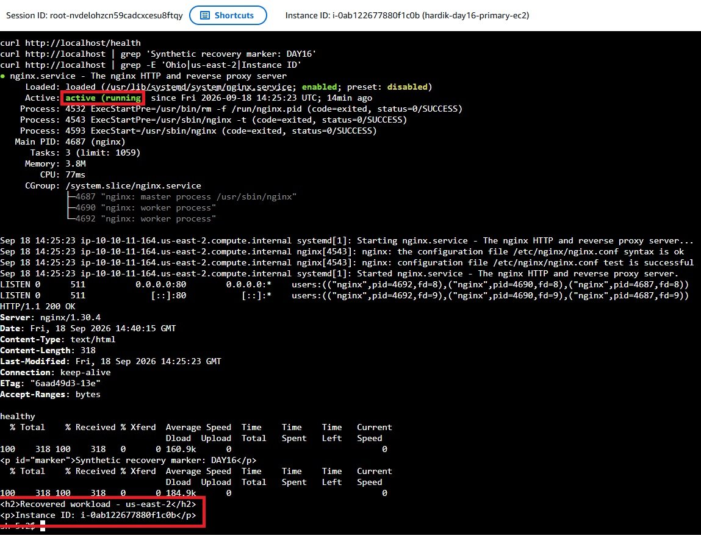

---

# 🔹 Step 15 – Validate Primary Application

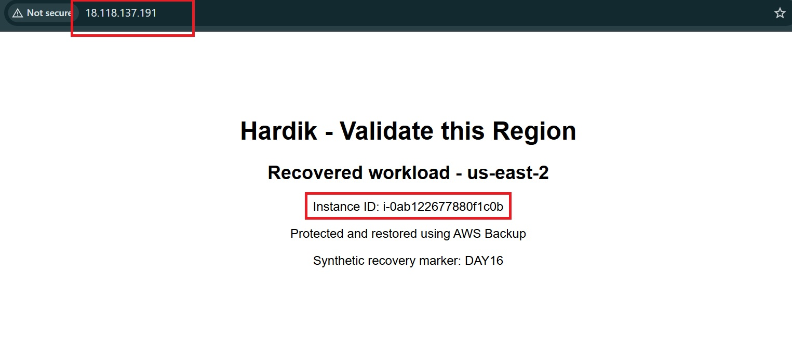


---

# 🔹 Step 16 – Switch to DR Region

Change AWS Console region to:

```text
US West (Oregon)
us-west-2
```

---

# 🔹 Step 17 – Create DR VPC

Go to:

**VPC → Your VPCs → Create VPC**

Enter:

```text
Name:
hardik-day16-dr-vpc

IPv4 CIDR:
10.20.0.0/16
```

Create.
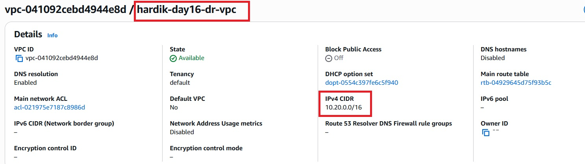

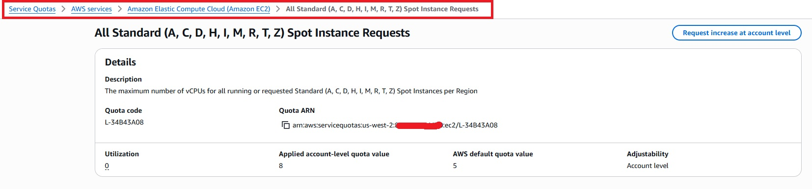

---

# 🔹 Step 18 – Create DR Subnet

Go to:

**VPC → Subnets → Create subnet**

Select:

```text
VPC:
hardik-day16-dr-vpc

Subnet name:
hardik-day16-dr-subnet

Availability Zone:
us-west-2a

IPv4 CIDR:
10.20.0.0/20
```

Create.
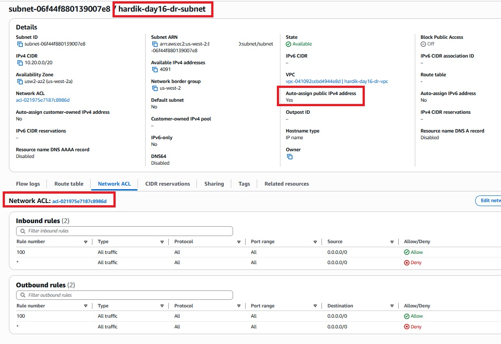

---

# 🔹 Step 19 – Create DR Internet Gateway

Go to:

**VPC → Internet Gateways → Create**

Enter:

```text
hardik-day16-dr-igw
```

Attach it to:

```text
hardik-day16-dr-vpc
```
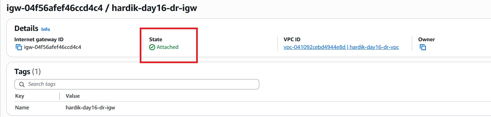

---

# 🔹 Step 20 – Create DR Route Table

Go to:

**VPC → Route Tables → Create route table**

Enter:

```text
Name:
hardik-day16-dr-rt

VPC:
hardik-day16-dr-vpc
```

Create.

Add route:

```text
Destination:
0.0.0.0/0

Target:
hardik-day16-dr-igw
```

Associate:

```text
hardik-day16-dr-subnet
```

Enable public IPv4 assignment on the subnet.
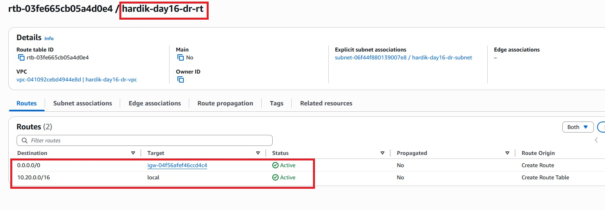

---

# 🔹 Step 21 – Create DR Security Group

Go to:

**EC2 → Security Groups → Create security group**

Enter:

```text
Name:
hardik-day16-dr-sg

Description:
Security group for Day 16 DR EC2

VPC:
hardik-day16-dr-vpc
```

Inbound:

```text
HTTP 80 → My IP
```

Create.
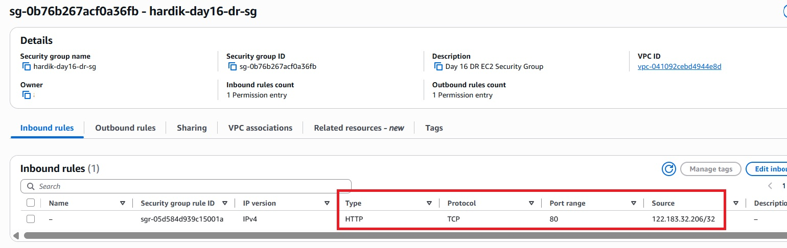

---

# 🔹 Step 22 – Create DR KMS Key

Stay in:

```text
us-west-2
```

Go to:

**KMS → Customer managed keys**

Click:

**Create key**

Select:

```text
Key type:
Symmetric

Key usage:
Encrypt and decrypt
```

Continue.

Alias:

```text
alias/hardik-day16-dr-backup-key
```

Finish key creation.

The DR recovery point should use the customer-managed KMS key created in the destination region.

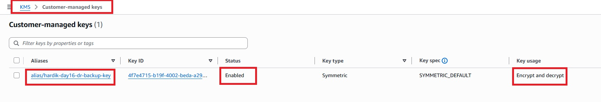

---

# 🔹 Step 23 – Create DR Backup Vault

Go to:

**AWS Backup → Backup vaults**

Click:

**Create backup vault**

Enter:

```text
Backup vault name:
hardik-day16-dr-vault
```

For encryption:

```text
Encryption key:
alias/hardik-day16-dr-backup-key
```

Create the vault.
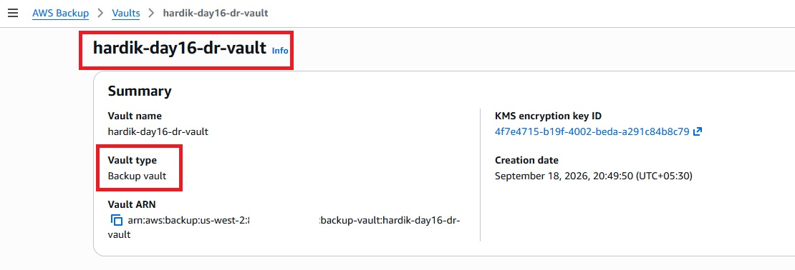

---

# 🔹 Step 24 – Create Primary Backup Vault

Switch back to:

```text
us-east-2
```

Go to:

**AWS Backup → Backup vaults**

Create:

```text
hardik-day16-primary-vault
```

Use the available AWS Backup encryption configuration appropriate for the source vault.

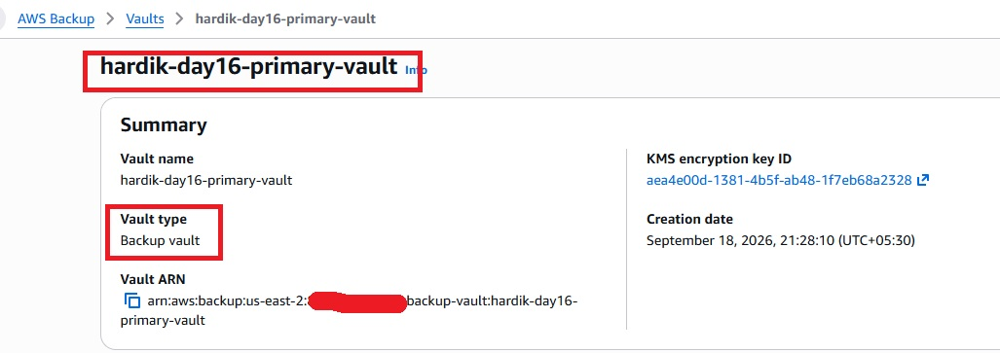

---

# 🔹 Step 25 – On-Demand EC2 Backup Job

Go to:

**AWS Backup → Protected resources / Backup**

Create an on-demand backup for:

```text
hardik-day16-primary-ec2
```

Select:

```text
Backup vault:
hardik-day16-primary-vault
```

Start backup.

The reference workflow creates the source recovery point before initiating the cross-region copy.

---

# 🔹 Step 26 – Wait for Backup Completion

Go to:

**AWS Backup → Jobs → Backup jobs**

Wait until:

```text
Status:
Completed
```

Do not continue until the backup is completed.

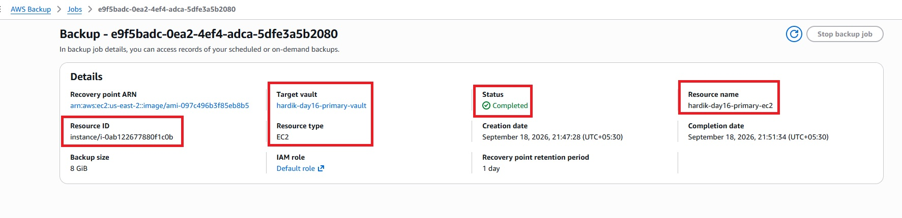

---

# 🔹 Step 27 – Verify Source Recovery Point

Go to:

**AWS Backup → Backup vaults → hardik-day16-primary-vault**

Verify that a recovery point exists.

Record:

```text
Backup Job ID: e9f5badc-0ea2-4ef4-adca-5dfe3a5b2080
Recovery Point: arn:aws:ec2:us-east-2::image/ami-097c496b3f85eb8b5
Source Instance ID: i-0ab122677880f1c0b
Source Vault: hardik-day16-primary-vault
Completion Time: Completion Time: 2026-09-18T16:17:28Z
Expiry: 2026-09-19T16:17:28Z
________________________
```
This timestamp will be useful when calculating RPO.

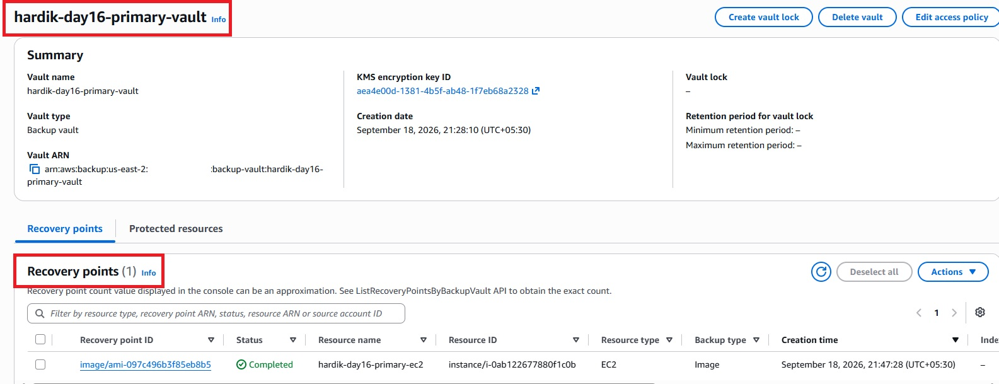

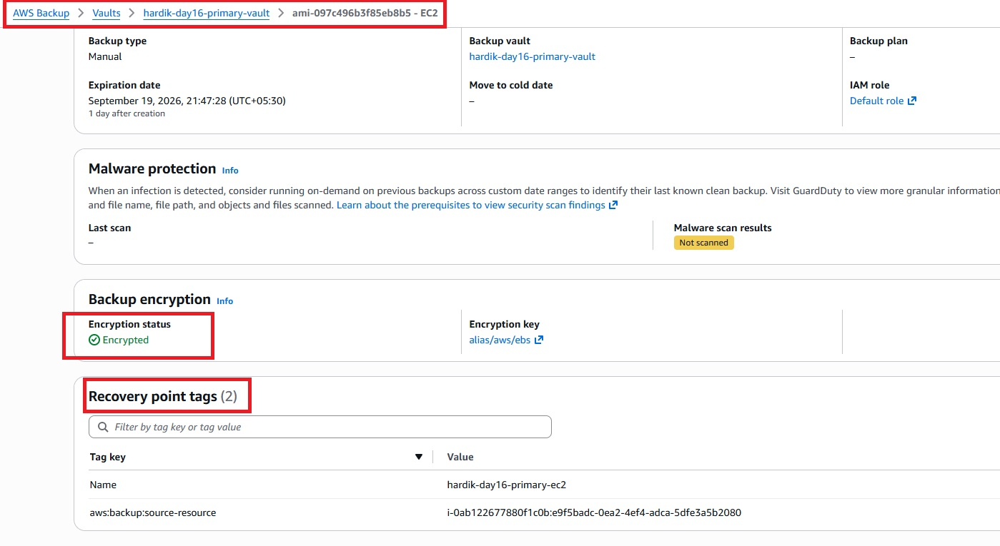

---

# 🔹 Step 28 – Copy Recovery Point to DR

Open the source recovery point.

Choose:

**Copy**

Configure:

```text
Destination Region:
us-west-2

Destination Backup Vault:
hardik-day16-dr-vault
```

For encryption:

```text
Destination KMS key:
alias/hardik-day16-dr-backup-key
```
Start copy.

The reference lab's cross-region copy step uses the DR vault and destination encryption key before restoration.

---

# 🔹 Step 29 – Wait for Copy Completion

Switch to:

```text
us-west-2
```

Go to:

**AWS Backup → Jobs → Copy jobs**

Wait for:

```text
Status:
Completed
```
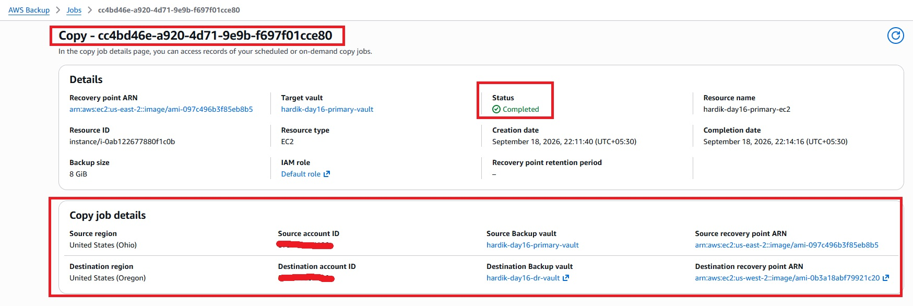

---

# 🔹 Step 30 – Verify DR Recovery Point

Go to:

**AWS Backup → Backup vaults**

Open:

```text
hardik-day16-dr-vault
```

Verify the recovery point exists.

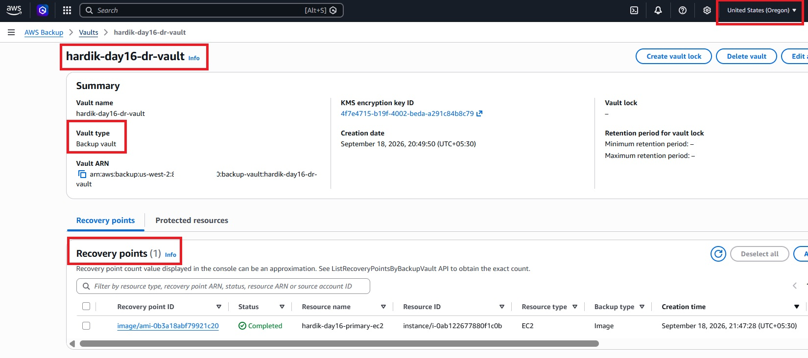
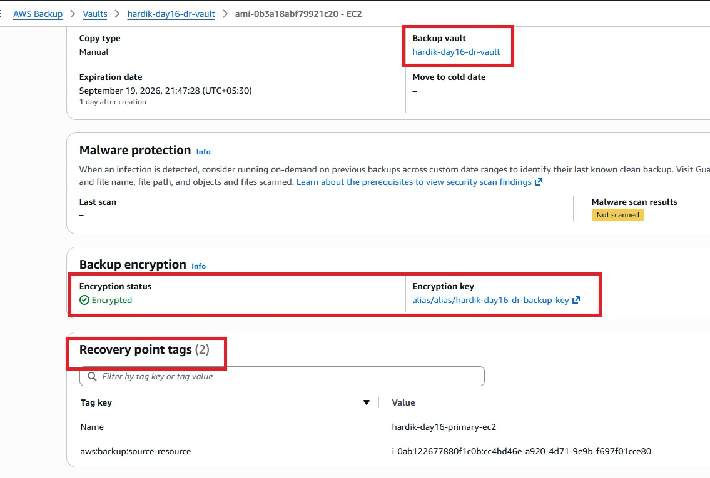

---

# 🔹 Step 31 – Simulate Application Failure

Return to:

```text
us-east-2
```

Connect to:

```text
hardik-day16-primary-ec2
```
Record :
```text
Incident Time:               2026-09-18T17:03:49Z
Detection Time:              2026-09-18T17:04:35Z
Recovery Declaration Time:   2026-09-18T17:05:26Z
________________________
```
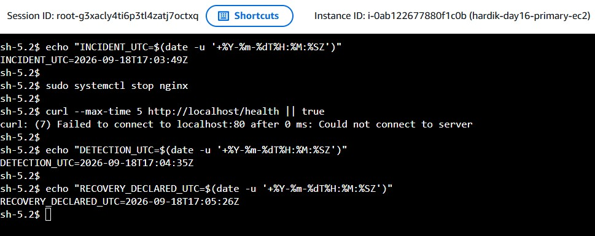

The application should no longer respond normally.

This simulates an application failure without unnecessarily destroying the primary infrastructure. The reference lab uses the same type of failure simulation.

---
# 🔹 Step 32 -  Recovery Point Restore Configuration & Restore Job Completed

* Selected the completed cross-Region recovery point from the **us-west-2 DR backup vault**.
* Started an **EC2 restore operation** from the copied recovery point.
* Explicitly selected the target DR environment instead of relying on source-region defaults.

### Restore Configuration

```text
Region:         us-west-2
Instance Type:  t3.micro
VPC:            hardik-day16-dr-vpc
Subnet:         hardik-day16-dr-subnet
Security Group: hardik-day16-dr-sg
IAM Profile:    Approved profile or none
Restore Role:   Default AWS Backup role / approved equivalent
```

### Restore Job Completed

* Started the EC2 restore operation once.
* Monitored **AWS Backup → Restore jobs**.
* Waited until the restore job status changed to **Completed**.

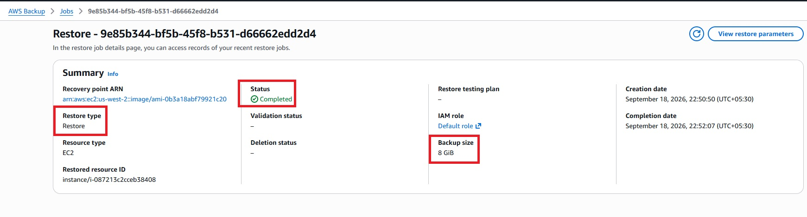
  
* Confirmed that AWS Backup created a **new restored EC2 instance** in the DR region rather than modifying the original primary EC2 instance.
* Restored instance name:

```text
hardik-day16-dr-restored
```
---
# 🔹 Step 33 -  Restored Oregon EC2 Instance

* Located the new EC2 instance created by the AWS Backup restore operation.
* Tagged the recovered instance:

```text
Name=hardik-day16-dr-restored
```

* Confirmed that the restored instance was running in **US West (Oregon) (`us-west-2`)**.
* Verified that the restored instance ID was different from the original **US East (Ohio) (`us-east-2`)** primary instance ID.
* Confirmed that the restored instance was created as a new EC2 resource from the cross-Region recovery point.

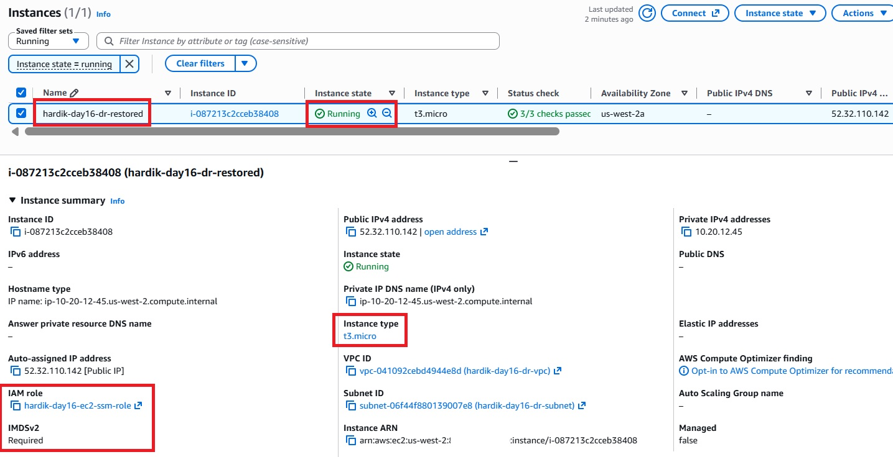

---

# 🔹 Step 34 – Validate Restored EBS

Open:

**EC2 → Volumes**

Verify:

```text
Volume type:
gp3

Size:
8 GiB

Encryption:
Encrypted
```

The reference validation checks that the restored EC2 and its EBS storage retain the expected recovery characteristics.

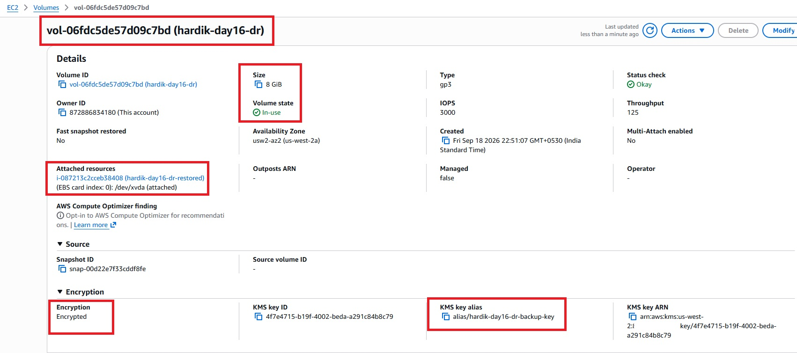

---

# 🔹 Step 35 – Restored Validate Application

* Connected to the restored **US West (Oregon) (`us-west-2`)** EC2 instance through the approved management path.
* Verified the restored systemd service and Nginx configuration.
* Confirmed that the application successfully started after recovery.

### Validation Commands

```bash
sudo systemctl status render-day16-page.service --no-pager
sudo systemctl status nginx --no-pager
curl -I http://localhost
curl http://localhost/health
```

### Validation Results

* Confirmed HTTP response status: `200 OK`.
* Confirmed the `/health` endpoint returned:

```text
OK - DAY16
```

* Confirmed that the restored application was successfully running in the DR region.
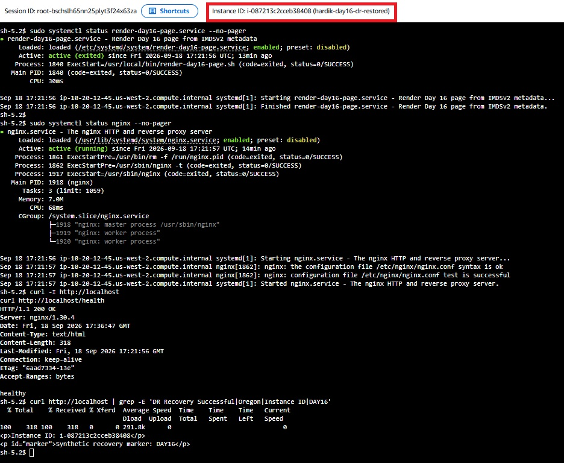

---

# 🔹 Step 36 – Browser Validation

Find the restored EC2 public IPv4 address.

Open:

```text
http://RESTORED_PUBLIC_IP
```

Verify:

```text
Day 16 - Cross Region Disaster Recovery
Instance ID
DR Region: us-west-2
Marker: DAY16
```
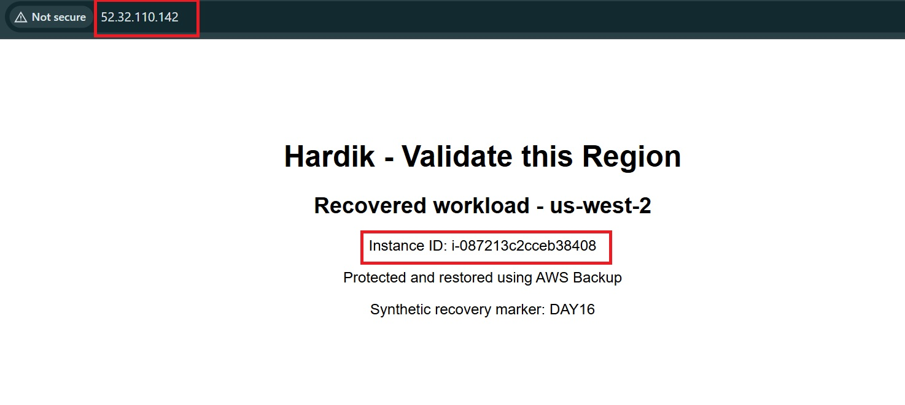

---
## 🔹 Step 37 - Restored IMDSv2 Validation

* Used **IMDSv2** on the restored EC2 instance to independently verify the recovery environment.
* Confirmed that the restored workload was running in the intended **US West (Oregon) (`us-west-2`)** DR region.

### Validation Commands

```bash
TOKEN=$(curl -fsS -X PUT \
  -H 'X-aws-ec2-metadata-token-ttl-seconds: 21600' \
  http://169.254.169.254/latest/api/token)

curl -fsS \
  -H "X-aws-ec2-metadata-token: ${TOKEN}" \
  http://169.254.169.254/latest/meta-data/placement/region

curl -fsS \
  -H "X-aws-ec2-metadata-token: ${TOKEN}" \
  http://169.254.169.254/latest/meta-data/instance-id
```

### Validation Results

Confirmed the metadata reported:

```text
Region: us-west-2
Restored Instance ID: i-xxxxxxxxxxxxxxxxx
```

* Confirmed that the reported region was **`us-west-2`**.
* Confirmed that the reported instance ID matched the newly restored EC2 instance.
* This independently verified that the recovered workload was running in the intended **DR region**.

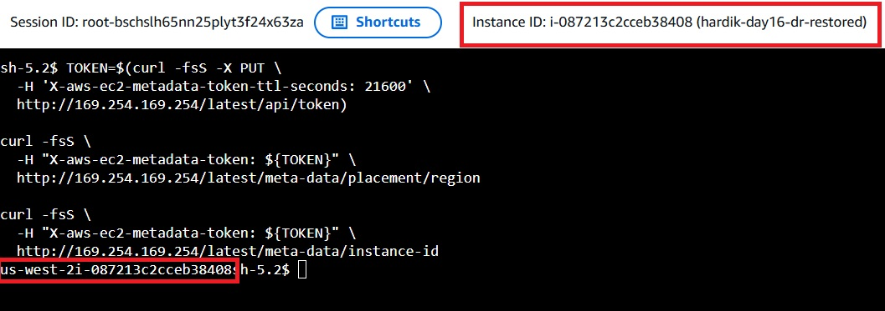

---

# 🔹 Step 38 – Compare Primary and DR

## Primary

```text
Region:
us-east-2

Instance:
hardik-day16-primary-ec2
```

## DR

```text
Region:
us-west-2

Instance:
hardik-day16-dr-restored
```

Validate:

| Validation   | Primary   | DR        |
| ------------ | --------- | --------- |
| EC2          | ✅         | ✅         |
| Nginx        | ✅         | ✅         |
| `/health`    | ✅         | ✅         |
| DAY16 marker | ✅         | ✅         |
| EBS          | Encrypted | Encrypted |
| Region       | us-east-2 | us-west-2 |
| IMDSv2       | ✅         | ✅         |

---

# ⏱️ Step 39 –  Calculate Achieved RTO

The **Recovery Time Objective (RTO)** is the maximum acceptable time within which the workload should be recovered after an incident.

### RTO Calculation Method

For this lab, the **Achieved RTO** is the measured duration from the simulated incident until the recovered application successfully passes validation.

```text
Achieved RTO = Detection
             + Recovery Declaration
             + Orchestration
             + Restore
             + Configuration
             + Validation
```

Each recovery phase duration is calculated from the recorded **UTC timestamps** for the corresponding recovery milestones.

---

### Recorded Timestamps

All RTO calculations are performed using **UTC** to avoid time-zone confusion.

```text
INCIDENT_UTC:               2026-09-18T17:03:49Z

DETECTION_UTC:              2026-09-18T17:04:35Z

RECOVERY_DECLARED_UTC:      2026-09-18T17:05:26Z

ORCHESTRATION_START_UTC:    2026-09-18T17:05:40Z

RESTORE_COMPLETE_UTC:       2026-09-18T17:07:15Z

CONFIGURATION_COMPLETE_UTC: 2026-09-18T17:08:30Z

VALIDATION_COMPLETE_UTC:    2026-09-18T17:09:45Z
```
---
### RTO Phase Calculation

| **Recovery Phase**     | **Calculation**       | **Duration** |
| ---------------------- | --------------------- | -----------: |
| Detection              | `17:04:35 - 17:03:49` |   `00:00:46` |
| Recovery Declaration   | `17:05:26 - 17:04:35` |   `00:00:51` |
| Orchestration          | `17:05:40 - 17:05:26` |   `00:00:14` |
| Restore                | `17:07:15 - 17:05:40` |   `00:01:35` |
| Configuration          | `17:08:30 - 17:07:15` |   `00:01:15` |
| Application Validation | `17:09:45 - 17:08:30` |   `00:01:15` |

### Phase-by-Phase Explanation

**1. Detection**

The simulated incident occurred at `17:03:49` and the failure was detected at `17:04:35`.

```text
17:04:35 - 17:03:49 = 00:00:46
```

**Detection duration = 46 seconds**

---

**2. Recovery Declaration**

The failure was detected at `17:04:35` and recovery was formally declared at `17:05:26`.

```text
17:05:26 - 17:04:35 = 00:00:51
```

**Recovery declaration duration = 51 seconds**

---

**3. Orchestration**

Recovery was declared at `17:05:26` and restore orchestration started at `17:05:40`.

```text
17:05:40 - 17:05:26 = 00:00:14
```

**Orchestration duration = 14 seconds**

---

**4. Restore**

Restore orchestration started at `17:05:40` and the restore completed at `17:07:15`.

```text
17:07:15 - 17:05:40 = 00:01:35
```

**Restore duration = 1 minute 35 seconds**

---

**5. Configuration**

The restore completed at `17:07:15` and configuration completed at `17:08:30`.

```text
17:08:30 - 17:07:15 = 00:01:15
```

**Configuration duration = 1 minute 15 seconds**

---

**6. Application Validation**

Configuration completed at `17:08:30` and application validation completed at `17:09:45`.

```text
17:09:45 - 17:08:30 = 00:01:15
```

**Application validation duration = 1 minute 15 seconds**

---

### Total RTO Calculation

```text
Detection                00:00:46
Recovery Declaration     00:00:51
Orchestration            00:00:14
Restore                  00:01:35
Configuration            00:01:15
Application Validation   00:01:15
                         ----------
Total                    00:05:56
```

Therefore:

```text
Achieved RTO = 5 minutes 56 seconds
```

### Measured RTO

**Measured RTO: 5 minutes 56 seconds**

> **Note:** The timestamps above represent the recovery timeline documented for this Day 16 disaster recovery exercise. The calculated RTO is based on the recorded incident, detection, recovery declaration, orchestration, restore, configuration, and application validation milestones.

---
# ⏱️ Step 40 -  RPO Calculation

The **Recovery Point Objective (RPO)** represents the maximum acceptable amount of data loss, measured in time.

For this DR test, the achieved RPO is calculated using the time difference between the simulated incident and the **latest usable copied recovery point available in the destination Region**.

```text
Achieved RPO = Incident time - Latest usable copied recovery-point time
```

### Recorded Timestamps

All RPO calculations are performed using **UTC** to avoid time-zone confusion.

```text
Incident Time:
2026-08-29T15:17:15Z

Latest Usable Copied Recovery-Point Time:
2026-08-29T15:04:41Z
```

### RPO Calculation

```text
15:17:15 UTC
-15:04:41 UTC
----------------
00:12:34
```

**Measured RPO for this specific DR test: 12 minutes 34 seconds**

---

### RPO Measurement Note

* The **12 minutes 34 seconds** represents the measured recovery-point gap for this specific DR test.
* The timestamp used for the calculation is **15:04:41 UTC**, which is the recorded **latest usable copied recovery-point time** in the destination **Oregon (`us-west-2`) Backup vault**.
* The cross-Region copy completion time was **15:04:41 UTC**.
* The simulated incident occurred at **15:17:15 UTC**.
* These timestamps are used in UTC to maintain consistency and avoid time-zone confusion.
* This measured RPO is **not a guaranteed ongoing RPO** because the recovery point was created and copied on demand rather than through a continuously running backup schedule.

---

## RTO/RPO Objective Result

| **Objective** | **Target** |          **Achieved** | **Result** |
| ------------- | ---------: | --------------------: | ---------- |
| RTO           | 30 minutes |  5 minutes 56 seconds | **PASS**   |
| RPO           |    4 hours | 12 minutes 34 seconds | **PASS**   |

---

## Important RTO/RPO Measurement Note

**Detection is not recovery.**

A completed restore is not application validation.

Application validation is not traffic cutover.

Each milestone was recorded separately so that the measured RTO represents the **complete recovery workflow used in this lab**.

The achieved RTO of **5 minutes 56 seconds** is the result of this specific recovery test. It is **not a guaranteed SLA** for all future recoveries.

The achieved RPO of **12 minutes 34 seconds** is the measured data-loss window for this specific DR test. It is **not a guaranteed ongoing RPO** because the recovery point was created and copied on demand rather than through a continuously running backup schedule.

### Final DR Configuration

```text
Primary Region : us-east-2
DR Region      : us-west-2

RTO Target     : 30 minutes
Achieved RTO   : 5 minutes 56 seconds

RPO Target     : 4 hours
Achieved RPO   : 12 minutes 34 seconds
```
---
# Part D – DR Design Decisions

# 🔹 Step 41 -  DR Strategy Decision

Selected:

```text
DR Strategy: Backup and Restore
```

### Reason

* Appropriate for a disposable workload where cost optimization is important.
* The secondary environment does not need to remain continuously running.
* AWS Backup provides encrypted recovery points that can be copied across Regions.
* The target EC2 environment is created only when recovery is required.
* Cross-Region recovery is performed from the primary **us-east-2** Region to the DR **us-west-2** Region.

### Trade-off

* Recovery takes longer than Pilot Light, Warm Standby, or Active-Active because infrastructure and application readiness must be restored and validated during the recovery event.

---

# 🔹 Step 42 -  Hybrid Connectivity Decision Notes

Documented the following connectivity decisions without creating billable connectivity resources.

| **Scenario**                            | **Decision**                        |
| --------------------------------------- | ----------------------------------- |
| Rapid encrypted hybrid connection       | Site-to-Site VPN                    |
| Predictable high bandwidth              | Direct Connect                      |
| Many VPC and VPN attachments            | Transit Gateway                     |
| On-premises resolves AWS private names  | Route 53 Resolver inbound endpoint  |
| VPC forwards domains to on-premises DNS | Route 53 Resolver outbound endpoint |
| Private S3 access                       | Gateway endpoint                    |
| Private AWS API access                  | Interface endpoint / PrivateLink    |

* Site-to-Site VPN was selected when rapid encrypted connectivity is required.
* Direct Connect was identified for predictable private high-bandwidth connectivity.
* Transit Gateway was identified for centralized connectivity across many VPCs and VPN/DX attachments.
* Route 53 Resolver inbound/outbound endpoints were documented for hybrid DNS flows.
* Gateway endpoints were identified as the preferred private-routing option for supported services such as S3.
* No billable hybrid connectivity resources were created for this lab.

---

# 🔹 Step 43 -  DR Strategy Comparison

| **Strategy**       | **Description**                                                 |
| ------------------ | --------------------------------------------------------------- |
| Backup and Restore | Lowest-cost relaxed DR; infrastructure restored during recovery |
| Pilot Light        | Core services remain running while the rest is recovered        |
| Warm Standby       | Reduced but operational environment is continuously available   |
| Active-Active      | Both Regions continuously serve production traffic              |

For this lab, **Backup and Restore** was selected because the workload is disposable and the objective is to demonstrate encrypted cross-Region recovery without maintaining an always-on secondary environment.

The primary workload is located in **us-east-2**, while the DR recovery environment is created in **us-west-2** only when recovery is required.

---

# 🔹 Step 44 - Service Quota Readiness

Recorded a sanitized readiness assessment for both Regions.

| **Dependency**                     | **us-east-2 Primary** | **us-west-2 DR** | **Remediation** |
| ---------------------------------- | --------------------- | ---------------- | --------------- |
| EC2 On-Demand vCPUs                | Checked               | Checked          | As required     |
| EBS capacity / IOPS / throughput   | Checked               | Checked          | As required     |
| VPC / subnet / routes / SGs        | Checked               | Checked          | As required     |
| ENIs / subnet IP availability      | Checked               | Checked          | As required     |
| Public IPv4 / EIP requirement      | Checked               | Checked          | As required     |
| AWS Backup copy / restore capacity | Checked               | Checked          | As required     |
| KMS key and permissions            | Checked               | Checked          | As required     |
| TGW / VPN / DX quotas              | Design-only           | Design-only      | Not created     |
| Resolver endpoints / rules         | Design-only           | Design-only      | Not created     |

### Region Configuration

```text
Primary Region:
us-east-2
US East (Ohio)

DR Region:
us-west-2
US West (Oregon)
```

The quota readiness assessment confirms that the required EC2, EBS, networking, AWS Backup, and KMS dependencies were considered for both the primary and DR Regions. Hybrid connectivity services such as Transit Gateway, VPN, Direct Connect, and Route 53 Resolver endpoints remained **design-only** and were not provisioned for this lab.


---

# 🧹 Cleanup

After completing all validation, remove resources to avoid unnecessary AWS charges.

## Primary Region – `us-east-2`

Terminate:

```text
hardik-day16-primary-ec2
```

Delete:

```text
hardik-day16-primary-vault
hardik-day16-primary-sg
hardik-day16-primary-subnet
hardik-day16-primary-rt
hardik-day16-primary-igw
hardik-day16-primary-vpc
```

Delete unnecessary recovery points after confirming that you no longer need them.

---

## DR Region – `us-west-2`

Terminate:

```text
hardik-day16-dr-restored
```

Delete:

```text
hardik-day16-dr-vault
hardik-day16-dr-sg
hardik-day16-dr-subnet
hardik-day16-dr-rt
hardik-day16-dr-igw
hardik-day16-dr-vpc
```

Remove the DR KMS key according to your AWS KMS deletion process if it is no longer required.

Also verify:

```text
AWS Backup Jobs
Recovery Points
EC2 Instances
EBS Volumes
KMS Keys
Elastic IPs
NAT Gateways
```

The reference lab also emphasizes cleaning up resources in both regions after the exercise.

---

# 🧠 Key AWS Concepts Learned

## 1. Cross-Region Disaster Recovery

AWS Backup can be used to create recovery points in one region and copy them to another region for disaster recovery.

## 2. AWS Backup

AWS Backup provides centralized backup management for AWS resources.

## 3. Customer-Managed KMS

A customer-managed KMS key can be used to control encryption for the DR backup vault.

## 4. EBS Encryption

The EC2 root volume is encrypted to protect stored data.

## 5. EC2 Restore

An EC2 instance can be reconstructed from an AWS Backup recovery point in another region.

## 6. IMDSv2

IMDSv2 provides token-based access to EC2 instance metadata.

## 7. RTO

Recovery Time Objective measures how long recovery takes from incident to usable application.

## 8. RPO

Recovery Point Objective measures how much data/time could be lost based on the latest usable recovery point.

---

# 👨‍💻 Author

**Hardik Darji**

**Devops Engineer**

---
# ⭐ Support

If this project helped you learn something new, consider giving the repository a ⭐ **Star**.

Your support motivates continued learning and sharing of practical AWS and DevOps projects.
